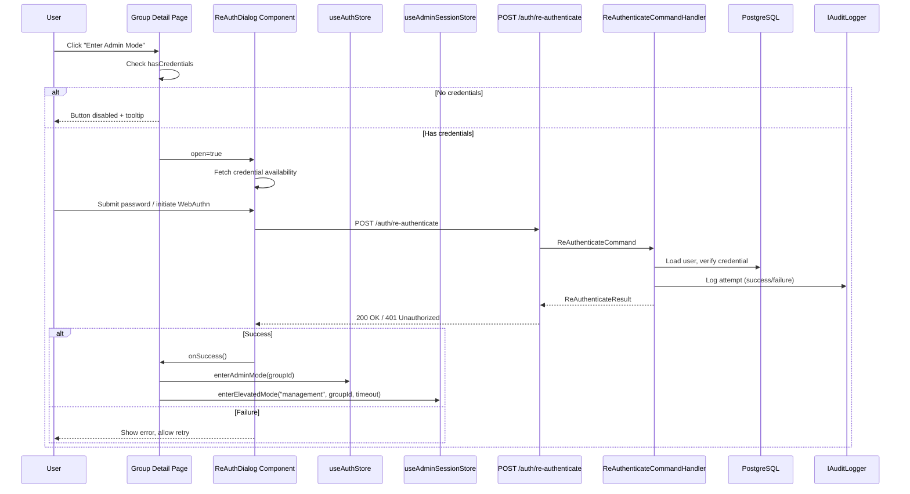
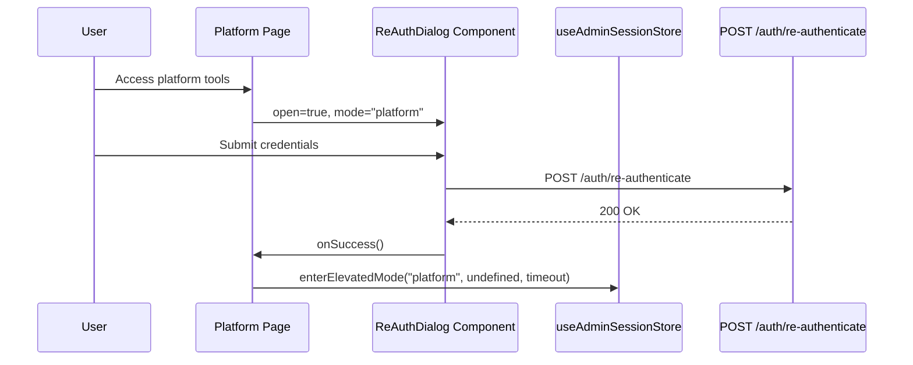

# Design Document: Admin Re-Authentication Gate

## Overview

The Admin Re-Authentication Gate is a security feature that intercepts privilege escalation actions (`enterAdminMode(groupId)` for group management and Super Admin Mode for platform tools) and requires the user to confirm their identity before elevation proceeds. This prevents unauthorized use of unattended sessions.

The feature builds on existing infrastructure:
- **Backend**: The `POST /auth/re-authenticate` endpoint and `ReAuthenticateCommand` handler already exist, performing BCrypt password verification and WebAuthn assertion validation with audit logging.
- **Frontend**: The `ReAuthDialog` component already exists at `apps/web/components/admin/ReAuthDialog.tsx`, implementing the modal with password and WebAuthn flows, focus trapping, and localization.
- **Stores**: `useAuthStore` manages `adminGroupId` and `enterAdminMode(groupId)`, while `useAdminSessionStore` manages elevated session timers via `enterElevatedMode()`.

The design focuses on how these existing components integrate to form the complete re-authentication gate, ensuring all acceptance criteria are met.

## Architecture



### Platform Admin Flow



## Components and Interfaces

### Frontend Components

#### ReAuthDialog (`apps/web/components/admin/ReAuthDialog.tsx`)

Existing component that renders the re-authentication modal. Key interface:

```typescript
interface ReAuthDialogProps {
  open: boolean;
  onSuccess: () => void;
  onCancel: () => void;
  mode: "management" | "platform";
  spaceId?: string;
}
```

**Responsibilities:**
- Renders modal overlay preventing background interaction
- Fetches credential availability (password always true for registered users; WebAuthn checked via `listCredentials()`)
- Handles password submission with Enter key support
- Handles WebAuthn flow (get options → navigator.credentials.get → verify assertion)
- Manages loading/error states with appropriate ARIA attributes
- Traps focus within modal, supports Escape to cancel
- Displays localized text via `useTranslations("reAuth")`

#### Group Detail Page Integration (`apps/web/app/groups/[groupId]/page.tsx`)

The page that triggers re-auth for management mode:

```typescript
// State
const [showReAuthDialog, setShowReAuthDialog] = useState(false);
const [hasCredentials, setHasCredentials] = useState<boolean | null>(null);

// On admin toggle click
if (hasCredentials === false) return; // disabled
setShowReAuthDialog(true);

// On success
enterAdminMode(groupId);
enterElevatedMode("management", groupId, timeoutMinutes);
```

#### Platform Page Integration (`apps/web/app/platform/page.tsx`)

The page that triggers re-auth for platform admin mode:

```typescript
// On access
setShowReAuth(true);

// On success
enterElevatedMode("platform", undefined, platformTimeoutMinutes);
```

### Backend Components

#### AuthController (`apps/api/Jobuler.Api/Controllers/AuthController.cs`)

Existing endpoint:

```csharp
[HttpPost("re-authenticate")]
[Authorize]
[EnableRateLimiting("auth")]
public async Task<IActionResult> ReAuthenticate([FromBody] ReAuthenticateRequest req, CancellationToken ct)
```

Request DTO:
```csharp
record ReAuthenticateRequest(
    string? Password,
    string? WebAuthnChallengeId,
    string? WebAuthnAssertionJson,
    Guid? SpaceId
);
```

#### ReAuthenticateCommand (`apps/api/Jobuler.Application/Auth/Commands/ReAuthenticateCommand.cs`)

Existing MediatR command and handler:

```csharp
record ReAuthenticateCommand(
    Guid UserId,
    string? Password,
    string? WebAuthnChallengeId,
    string? WebAuthnAssertionJson,
    Guid? SpaceId,
    string? IpAddress
) : IRequest<ReAuthenticateResult>;

record ReAuthenticateResult(bool Success);
```

**Handler logic:**
1. Reject passwords > 128 characters without hashing
2. Load active user from DB
3. If password provided: `BCrypt.Net.BCrypt.Verify(password, user.PasswordHash)`
4. If WebAuthn provided: extract credential ID → load credential → verify assertion → update sign count
5. Log attempt via `IAuditLogger` (actor_user_id, space_id, method, success)
6. Return `ReAuthenticateResult(verified)`

#### ReAuthenticateCommandValidator

```csharp
// Validates:
// - UserId is not empty
// - Either password OR (WebAuthnChallengeId + WebAuthnAssertionJson) must be provided
```

### Shared Utilities

#### WebAuthn Client Utilities (`apps/web/lib/webauthn.ts`)

- `isWebAuthnSupported()`: Checks browser WebAuthn API availability
- `listCredentials()`: Fetches user's registered WebAuthn credentials from `GET /auth/webauthn/credentials`

#### API Client (`apps/web/lib/api/client.ts`)

- `apiClient.post()`: Axios instance with JWT bearer token injection

## Data Models

### Existing Entities (no schema changes required)

#### User (Domain)
```
- Id: Guid
- PasswordHash: string (BCrypt, work factor ≥ 12)
- IsActive: bool
- IsPlatformAdmin: bool
- PreferredLocale: string ("he" | "en" | "ru")
```

#### WebAuthnCredential (Domain)
```
- Id: Guid
- UserId: Guid
- CredentialId: byte[]
- PublicKey: byte[]
- SignCount: uint
- IsDisabled: bool
- Nickname: string?
```

#### AuditLog (Infrastructure)
```
- Id: Guid
- SpaceId: Guid?
- ActorUserId: Guid?
- Action: string ("re_authenticate")
- EntityType: string ("user")
- EntityId: Guid?
- AfterJson: string ({"method": "password"|"webauthn", "success": true|false})
- IpAddress: string?
- Timestamp: DateTime
```

### Frontend State

#### AuthStore (Zustand, persisted)
```typescript
{
  adminGroupId: string | null;  // NOT persisted — resets on page load
  isPlatformAdmin: boolean;
  preferredLocale: string;
}
```

#### AdminSessionStore (Zustand, not persisted)
```typescript
{
  isElevated: boolean;
  elevatedMode: "management" | "platform" | null;
  elevatedGroupId: string | undefined;
  timeoutDuration: number;
  remainingMs: number;
}
```


## Correctness Properties

*A property is a characteristic or behavior that should hold true across all valid executions of a system — essentially, a formal statement about what the system should do. Properties serve as the bridge between human-readable specifications and machine-verifiable correctness guarantees.*

### Property 1: Elevation only on successful verification

*For any* re-authentication attempt (password or WebAuthn), the `adminGroupId` in the auth store SHALL only transition from `null` to a group ID value when the `POST /auth/re-authenticate` endpoint returns `{ success: true }`. If the endpoint returns failure (401) or any error, `adminGroupId` SHALL remain `null`.

**Validates: Requirements 1.3, 3.2, 4.3**

### Property 2: Credential verification correctness

*For any* user with a stored BCrypt password hash and *for any* submitted password string, the re-authenticate endpoint SHALL return success if and only if `BCrypt.Verify(submittedPassword, storedHash)` returns true. Similarly, *for any* WebAuthn assertion, the endpoint SHALL return success if and only if the assertion's credential ID matches a registered, non-disabled credential for that user and the cryptographic signature is valid.

**Validates: Requirements 3.1, 4.2**

### Property 3: Generic error response (no information leakage)

*For any* failed re-authentication attempt — whether caused by an incorrect password, a non-existent credential, a disabled WebAuthn key, an inactive user, or any other failure reason — the API response SHALL be structurally identical: HTTP 401 with body `{ "error": "Authentication failed." }`. No additional fields or varying messages SHALL be returned.

**Validates: Requirements 3.3, 4.4, 8.2**

### Property 4: Password length boundary rejection

*For any* password string with length greater than 128 characters, the re-authenticate handler SHALL return failure without invoking `BCrypt.Verify`. *For any* password string with length ≤ 128 characters, the handler SHALL proceed with BCrypt verification.

**Validates: Requirements 3.5**

### Property 5: No duplicate submissions during loading

*For any* sequence of submit actions (password form submission or WebAuthn button clicks) while `isSubmitting` is `true`, the component SHALL dispatch exactly zero additional API requests until the current request completes.

**Validates: Requirements 5.2**

### Property 6: Focus trap containment

*For any* sequence of Tab and Shift+Tab key presses while the ReAuthDialog is open, the currently focused element SHALL always be a descendant of the dialog's DOM container. Focus SHALL never escape to elements outside the modal.

**Validates: Requirements 6.1, 6.5**

### Property 7: Locale-correct text rendering

*For any* supported locale (he, en, ru) set in the auth store's `preferredLocale`, all visible text elements in the ReAuthDialog (title, description, labels, buttons, error messages) SHALL render content from the corresponding locale's translation file with no missing translation keys.

**Validates: Requirements 7.1, 7.2**

### Property 8: No client-side password persistence

*For any* password value submitted through the ReAuthDialog, after the submission lifecycle completes (success or failure), the password value SHALL NOT exist in `localStorage`, `sessionStorage`, cookies, or any component state other than the transient `password` state variable (which is cleared on success/close).

**Validates: Requirements 8.3**

### Property 9: Audit log completeness

*For any* re-authentication attempt (successful or failed, password or WebAuthn), the system SHALL create exactly one audit log entry containing: `actor_user_id` (the authenticated user's ID), `space_id` (if provided), `action` = "re_authenticate", `method` ("password" or "webauthn"), and `success` (boolean).

**Validates: Requirements 8.5**

## Error Handling

### Backend Error Handling

| Scenario | HTTP Status | Response Body | Behavior |
|----------|-------------|---------------|----------|
| Valid credentials, verification succeeds | 200 | `{ "success": true }` | Normal success path |
| Invalid credentials (wrong password, bad assertion) | 401 | `{ "error": "Authentication failed." }` | Generic error, no leakage |
| User not found or inactive | 401 | `{ "error": "Authentication failed." }` | Same generic error |
| Password > 128 characters | 401 | `{ "error": "Authentication failed." }` | Early rejection, no BCrypt |
| Missing required fields (no password and no WebAuthn) | 400 | Validation error | FluentValidation rejects |
| Rate limit exceeded | 429 | Rate limit response | Existing "auth" policy |
| Unhandled exception | 500 | Generic server error | ExceptionHandlingMiddleware |

### Frontend Error Handling

| Scenario | User-Facing Behavior |
|----------|---------------------|
| API returns 401 | Show `t("authFailed")` — "Authentication failed. Please try again." |
| API returns 429 | Show `t("rateLimited")` — "Too many attempts. Please try again later." |
| Network error / timeout | Show `t("networkError")` — "Connection error. Please try again." |
| WebAuthn user cancellation (NotAllowedError) | Show `t("webAuthnCancelled")` — "Verification cancelled. Please try again." |
| WebAuthn not supported by browser | WebAuthn button not rendered (credential check returns false) |
| No credentials configured | Button disabled with tooltip; dialog shows warning if somehow opened |

### Error Recovery

- After any error, the password input is cleared and re-focused
- The dialog remains open for retry (never auto-closes on failure)
- `isSubmitting` is reset to `false`, re-enabling all inputs
- The user can always cancel via the Cancel button or Escape key

## Testing Strategy

### Unit Tests (Example-Based)

Focus on specific interactions and edge cases:

1. **Dialog rendering**: Verify correct elements render based on credential state (password only, WebAuthn only, both, neither)
2. **ARIA attributes**: Verify `role="dialog"`, `aria-modal="true"`, `aria-labelledby`, `aria-describedby`
3. **Initial focus**: Verify focus lands on password input or WebAuthn button
4. **Escape key**: Verify calls `onCancel`
5. **Cancel button**: Verify calls `onCancel`
6. **Success flow**: Mock API success → verify `onSuccess` called, dialog closes
7. **Failure flow**: Mock API 401 → verify error message, input cleared, dialog stays open
8. **RTL layout**: Verify `direction: "rtl"` when locale is Hebrew
9. **Keyboard submission**: Verify Enter key triggers form submit
10. **No credentials state**: Verify warning message and disabled button

### Property-Based Tests

**Library**: fast-check (already available in the project's test infrastructure)
**Minimum iterations**: 100 per property

Each property test references its design document property:

```
// Feature: admin-reauth-gate, Property 2: Credential verification correctness
// Feature: admin-reauth-gate, Property 3: Generic error response
// Feature: admin-reauth-gate, Property 4: Password length boundary rejection
// Feature: admin-reauth-gate, Property 9: Audit log completeness
```

**Backend property tests** (C# with FsCheck or custom generators):
- Property 2: Generate random passwords, verify BCrypt comparison logic
- Property 3: Generate various failure scenarios, verify response shape is identical
- Property 4: Generate strings of varying lengths around the 128-char boundary
- Property 9: Generate random re-auth attempts, verify audit log entries

**Frontend property tests** (TypeScript with fast-check):
- Property 5: Generate rapid submission sequences, verify single API call
- Property 6: Generate Tab key sequences, verify focus containment
- Property 7: Generate locale selections, verify no missing translation keys
- Property 8: Generate password strings, verify no client-side persistence after lifecycle

### Integration Tests

1. **Full password re-auth flow**: Submit correct password → verify 200 response
2. **Full WebAuthn re-auth flow**: Complete assertion → verify 200 response
3. **Rate limiting**: Send 5+ failed attempts → verify 429 response
4. **Audit trail**: Perform re-auth → verify audit log entry in database

### E2E Tests

1. **Management mode entry**: Login → navigate to group → click admin toggle → complete re-auth → verify admin UI appears
2. **Platform mode entry**: Login as platform admin → access platform → complete re-auth → verify platform tools appear
3. **Cancellation**: Open re-auth dialog → cancel → verify standard view remains
