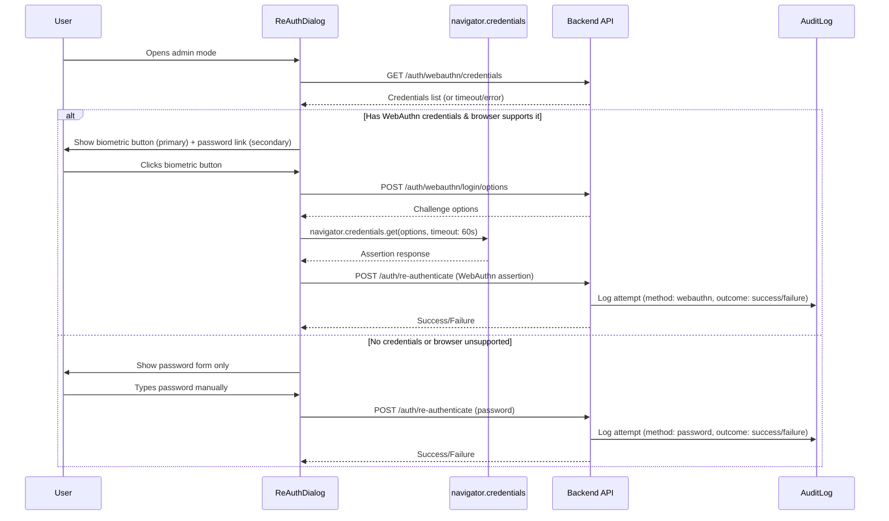

# Design Document: Admin Re-Auth Security

## Overview

This feature hardens the existing admin re-authentication dialog (`ReAuthDialog.tsx`) by:

1. **Preventing password manager autofill** — Using a combination of HTML attributes and a readonly-on-mount trick to stop browsers from auto-populating the password field during re-auth.
2. **Prioritizing WebAuthn/biometric authentication** — Making fingerprint/Face ID/Windows Hello the default re-auth method when the user has registered credentials.
3. **Providing manual password entry as fallback** — When biometrics are unavailable or the user prefers typing.
4. **Detecting credential availability** — Calling the existing `GET /auth/webauthn/credentials` endpoint to determine which UI to show.
5. **Enforcing scope limitation** — Ensuring the initial login form (`/auth/login`) remains unchanged and continues to support password managers.
6. **Security and audit logging** — Adding lockout logic (5 failures / 15 minutes) and ensuring all re-auth attempts are fully audited.

The backend already supports both password and WebAuthn re-authentication via `POST /auth/re-authenticate`. The primary work is on the frontend (ReAuthDialog refactor) with targeted backend additions for lockout logic and enhanced audit logging.

## Architecture



### Layer Responsibilities

| Layer | Responsibility |
|-------|---------------|
| **Frontend (ReAuthDialog)** | Credential detection, autofill prevention, WebAuthn ceremony orchestration, password form with validation, error display, loading states |
| **API Controller** | Route handling, IP extraction, rate limiting via `[EnableRateLimiting("auth")]` |
| **Application (ReAuthenticateCommandHandler)** | Lockout check, password verification, WebAuthn assertion verification, audit logging |
| **Infrastructure** | `IWebAuthnService` implementation (Fido2), `IAuditLogger` implementation, database access |

## Components and Interfaces

### Frontend Components

#### `ReAuthDialog.tsx` (Refactored)

**New state:**
```typescript
interface ReAuthDialogState {
  // Credential detection
  credentialCheckLoading: boolean;
  hasWebAuthnCredentials: boolean;
  webAuthnSupported: boolean;

  // Active view
  activeMethod: "webauthn" | "password";

  // WebAuthn state
  webAuthnLoading: boolean;
  webAuthnError: string | null;

  // Password state
  password: string;
  passwordError: string | null;
  isSubmitting: boolean;
  isReadonly: boolean; // For autofill prevention trick

  // Rate limiting
  isLockedOut: boolean;
  lockoutRemainingSeconds: number;
}
```

**Key behaviors:**
- On open: calls `GET /auth/webauthn/credentials` with 5-second AbortController timeout
- Renders password input with: `autocomplete="new-password"`, `name="reauth-verify"`, `readonly` (removed on focus)
- Renders form with: `autocomplete="off"`
- When `open=false`: returns `null` (no DOM)
- WebAuthn button uses `navigator.credentials.get()` with `timeout: 60000`

#### Autofill Prevention Attributes

| Element | Attribute | Value | Purpose |
|---------|-----------|-------|---------|
| `<form>` | `autocomplete` | `"off"` | Prevent save-password prompt |
| `<input>` | `autocomplete` | `"new-password"` | Signal "don't autofill saved credentials" |
| `<input>` | `name` | `"reauth-verify"` | Defeat heuristic-based autofill |
| `<input>` | `readonly` | `true` (initial) | Prevent autofill on page load; removed on focus |
| `<input>` | `value` | `""` (on open) | Always start empty |

### Backend Changes

#### `ReAuthenticateCommandHandler` (Enhanced)

**New lockout logic:**
```csharp
// Before verifying credentials:
// 1. Check if user is locked out (5 failures in 15 min window)
// 2. If locked out, reject immediately and log lockout event
// 3. After failed attempt, increment failure counter
// 4. After successful attempt, reset failure counter
```

**Lockout storage:** Use an in-memory or Redis-based sliding window counter keyed by `userId`. For MVP, use a database table `ReAuthAttempts` with columns:
- `UserId` (Guid)
- `AttemptedAt` (DateTime)
- `Success` (bool)

Query: count failures in last 15 minutes for the user. If >= 5, reject.

#### `IAuditLogger` Usage (Existing)

The existing `LogAttempt` method in `ReAuthenticateCommandHandler` already logs with the correct structure. Enhancement needed:
- Add failure reason to the `afterJson` for WebAuthn failures (cancelled, timeout, credential not recognized)
- Add lockout events as a separate audit action

### API Contracts

**No new endpoints required.** All existing endpoints are sufficient:

| Endpoint | Method | Purpose |
|----------|--------|---------|
| `GET /auth/webauthn/credentials` | GET | Check if user has registered WebAuthn credentials |
| `POST /auth/webauthn/login/options` | POST | Get WebAuthn assertion options (reused for re-auth) |
| `POST /auth/re-authenticate` | POST | Verify password or WebAuthn assertion |

**Enhanced response for rate-limit (429):**
```json
{
  "error": "Too many attempts",
  "retryAfterSeconds": 900
}
```

## Data Models

### New: `ReAuthAttempt` Entity (Domain)

```csharp
public class ReAuthAttempt
{
    public Guid Id { get; private set; }
    public Guid UserId { get; private set; }
    public DateTime AttemptedAt { get; private set; }
    public bool Success { get; private set; }
    public string Method { get; private set; } // "password" | "webauthn"

    public static ReAuthAttempt Create(Guid userId, bool success, string method)
        => new()
        {
            Id = Guid.NewGuid(),
            UserId = userId,
            AttemptedAt = DateTime.UtcNow,
            Success = success,
            Method = method
        };
}
```

### Database Table: `reauth_attempts`

| Column | Type | Constraints |
|--------|------|-------------|
| `id` | uuid | PK |
| `user_id` | uuid | FK → users.id, indexed |
| `attempted_at` | timestamptz | NOT NULL, indexed |
| `success` | boolean | NOT NULL |
| `method` | varchar(20) | NOT NULL |

**Index:** `IX_reauth_attempts_user_id_attempted_at` on `(user_id, attempted_at DESC)` for efficient lockout queries.

### Existing Models (Unchanged)

- `User` — already has `PasswordHash`, `IsActive`
- `WebAuthnCredential` — already has `UserId`, `CredentialId`, `PublicKey`, `SignCount`, `IsDisabled`
- `AuditLog` — already has all required fields per security rules

## Correctness Properties

*A property is a characteristic or behavior that should hold true across all valid executions of a system — essentially, a formal statement about what the system should do. Properties serve as the bridge between human-readable specifications and machine-verifiable correctness guarantees.*

### Property 1: Dialog state reset on open

*For any* previous password value held in component state, when the ReAuth_Dialog transitions from closed to open, the password field value SHALL be an empty string.

**Validates: Requirements 1.3**

### Property 2: Whitespace password rejection

*For any* string composed entirely of whitespace characters (spaces, tabs, newlines, etc.), attempting to submit the re-auth password form SHALL be prevented, the form SHALL NOT call the Re_Auth_Endpoint, and a validation error SHALL be displayed.

**Validates: Requirements 3.4**

### Property 3: No DOM rendering when closed

*For any* combination of ReAuthDialog props where `open` is `false`, the component SHALL render no DOM elements (returns null).

**Validates: Requirements 5.3**

### Property 4: Audit log method and outcome correctness

*For any* re-authentication attempt (password or WebAuthn, success or failure), the resulting audit log entry SHALL correctly record the authentication method used ("password" or "webauthn") and the outcome (success or failure) matching the actual verification result.

**Validates: Requirements 6.1, 6.2, 6.4**

### Property 5: Audit log entry completeness

*For any* re-authentication attempt, the resulting audit log entry SHALL contain all required fields: actor_user_id, space_id, action ("re_authenticate"), entity_type ("user"), entity_id, IP address, and an after-snapshot containing the authentication method and outcome.

**Validates: Requirements 6.6**

## Error Handling

### Frontend Error States

| Scenario | User-Facing Behavior | Technical Action |
|----------|---------------------|-----------------|
| Credential check timeout (>5s) | Fall back to password form | Abort request, log warning to console |
| Credential check network error | Fall back to password form | Log error to console |
| WebAuthn user cancelled | "Authentication cancelled" message, retry available | Keep WebAuthn option, show password link |
| WebAuthn timeout (60s) | "Authentication timed out" message | Same as cancelled |
| WebAuthn credential not recognized | "Credential not recognized" message | Same as cancelled |
| Browser doesn't support WebAuthn | Password form shown as sole method | Check `navigator.credentials?.get` existence |
| Password incorrect (401) | "Invalid credentials" error, field cleared, refocused | Clear password, re-enable submit |
| Network error on submit | "Connection problem" error, password retained | Re-enable submit for retry |
| Rate limited (429) | "Too many attempts" error, submit disabled | Disable for `retryAfterSeconds` from response |
| Lockout (429 with lockout) | "Account temporarily locked" error | Disable all auth actions for duration |

### Backend Error Handling

| Scenario | HTTP Status | Behavior |
|----------|-------------|----------|
| Invalid/empty credentials | 401 | Log failure, increment counter |
| User not found or inactive | 401 | Log failure (prevent user enumeration) |
| WebAuthn assertion verification failure | 401 | Log with failure reason |
| Rate limited (global auth limiter) | 429 | Standard rate limit response |
| Lockout (5 failures in 15 min) | 429 | Include `retryAfterSeconds`, log lockout event |
| Password > 128 chars | 401 | Reject without hashing (DoS prevention) |

All errors bubble up through `ExceptionHandlingMiddleware`. The handler returns `ReAuthenticateResult(false)` for auth failures — the controller maps this to 401.

## Testing Strategy

### Property-Based Tests (fast-check)

The project uses a Next.js frontend with TypeScript. Property-based tests will use **fast-check** for the frontend logic and **FsCheck** (or equivalent) for .NET backend logic.

**Frontend (fast-check):**
- Property 1: Generate random strings, set as password state, simulate dialog open, assert password is empty
- Property 2: Generate arbitrary whitespace strings, attempt submit, assert form is not submitted
- Property 3: Generate arbitrary prop combinations with `open=false`, render, assert null output

**Backend (xUnit + custom generators):**
- Property 4: Generate random (userId, method, success) tuples, execute handler, assert audit log entry matches
- Property 5: Generate random re-auth attempts, assert all required fields present in audit log

**Configuration:**
- Minimum 100 iterations per property test
- Each test tagged with: `Feature: admin-reauth-security, Property {N}: {description}`

### Unit Tests (Example-Based)

**Frontend (Jest/React Testing Library):**
- Autofill prevention attributes are correctly set (Req 1.1, 1.2, 1.4, 1.5)
- Credential check triggers on open (Req 2.1, 4.1)
- WebAuthn primary display when credentials exist (Req 2.2)
- Password-only display when no credentials (Req 3.1)
- Fallback link visibility (Req 3.2)
- Submit flow: disable button, loading, API call, onSuccess (Req 3.3)
- Error states: 401, network error, 429 (Req 3.5, 3.6, 3.7)
- Loading state during credential check (Req 4.2)
- Timeout handling at 5 seconds (Req 4.3)
- Login form retains `autocomplete="current-password"` (Req 5.1)

**Backend (xUnit):**
- Lockout after 5 failures in 15 minutes (Req 6.5)
- Lockout resets after successful auth
- Rate limiter attribute applied to endpoint (Req 6.3)
- WebAuthn failure reasons logged correctly (Req 6.2)

### Integration Tests

- Full re-auth flow: password success/failure end-to-end
- Full re-auth flow: WebAuthn success/failure end-to-end
- Lockout scenario: 5 failures → rejection → wait → retry succeeds
- Credential check endpoint returns correct data for users with/without WebAuthn
