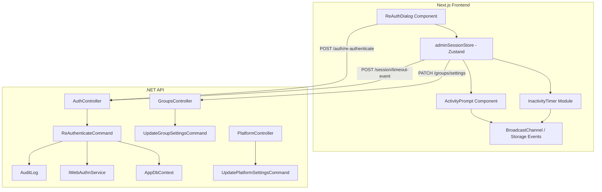

# Design Document: Admin Session Timeout

## Overview

This feature introduces session timeout and re-authentication controls for elevated privilege modes (Management Mode and Super Platform Mode). The system enforces re-authentication before entering elevated modes, tracks inactivity client-side, prompts users before timeout, and cleanly exits elevated state when inactivity is detected.

The design follows the existing Clean Architecture patterns: a new `ReAuthenticateCommand` in the Application layer handles credential verification, the Group entity gains a `ManagementTimeoutMinutes` property, and a new Zustand-based `adminSessionStore` on the frontend manages inactivity tracking, activity prompts, and multi-tab synchronization.

**Key Design Decisions:**
- Re-authentication uses the existing `POST /auth/re-authenticate` endpoint (shared by both Management Mode and Super Platform Mode) to avoid duplication
- Inactivity tracking is entirely client-side (no server heartbeats) to minimize load; the server relies on JWT expiry as the ultimate session boundary
- Multi-tab coordination uses `BroadcastChannel` with `localStorage` fallback for broad browser support
- The activity prompt is a modal with focus trap, following existing dialog patterns in the codebase

## Architecture



### Layer Responsibilities

| Layer | Responsibility |
|-------|---------------|
| **Api** | `AuthController` exposes `POST /auth/re-authenticate` and `POST /auth/session-timeout-event`. `GroupsController` extends settings PATCH. `PlatformController` adds platform timeout PATCH. |
| **Application** | `ReAuthenticateCommand/Handler` verifies credentials. `RecordSessionTimeoutCommand/Handler` creates audit log. Validators enforce range constraints. |
| **Domain** | `Group` entity gains `ManagementTimeoutMinutes` property. `PlatformSettings` entity stores system-level timeout. |
| **Infrastructure** | EF Core configuration for new columns. Migration for schema changes. |
| **Frontend** | `adminSessionStore` (Zustand) manages elevated mode state, timer, and multi-tab sync. `ReAuthDialog` component handles credential input. `ActivityPromptModal` handles timeout warning. |

## Components and Interfaces

### Backend Components

#### 1. ReAuthenticateCommand

```csharp
// Application/Auth/Commands/ReAuthenticateCommand.cs
public record ReAuthenticateCommand(
    Guid UserId,
    string? Password,
    string? WebAuthnChallengeId,
    string? WebAuthnAssertionJson,
    Guid? SpaceId,
    string? IpAddress
) : IRequest<ReAuthenticateResult>;

public record ReAuthenticateResult(bool Success);
```

**Handler logic:**
1. Reject if password exceeds 128 characters (without hashing)
2. Load user from DB
3. If password provided: `BCrypt.Verify(password, user.PasswordHash)`
4. If WebAuthn provided: call `IWebAuthnService.CompleteAuthenticationAsync`
5. Create `AuditLog` entry (success or failure)
6. Return generic error on failure (no cause distinction)

#### 2. RecordSessionTimeoutCommand

```csharp
// Application/Auth/Commands/RecordSessionTimeoutCommand.cs
public record RecordSessionTimeoutCommand(
    Guid UserId,
    Guid? SpaceId,
    string Mode // "management" | "platform"
) : IRequest;
```

Creates an audit log entry recording the timeout event.

#### 3. UpdateGroupSettingsCommand (Extended)

The existing `UpdateGroupSettingsCommand` gains an optional `ManagementTimeoutMinutes` parameter:

```csharp
public record UpdateGroupSettingsCommand(
    Guid SpaceId, Guid GroupId,
    int SolverHorizonDays,
    DateTime? SolverStartDateTime,
    bool? AutoPublish,
    int? MinRestBetweenShiftsHours,
    bool? AllowMembersViewHistory,
    bool? AllowMembersViewStats,
    int? ManagementTimeoutMinutes  // NEW
) : IRequest;
```

#### 4. PlatformSettings Entity

```csharp
// Domain/Platform/PlatformSettings.cs
public class PlatformSettings : Entity
{
    public string Key { get; private set; } = default!;
    public string Value { get; private set; } = default!;

    public static PlatformSettings Create(string key, string value) =>
        new() { Key = key, Value = value };

    public void UpdateValue(string value) { Value = value; }
}
```

Platform timeout stored as key `"platform_timeout_minutes"` with default `"15"`.

#### 5. Validators

```csharp
// Application/Auth/Validators/ReAuthenticateCommandValidator.cs
public class ReAuthenticateCommandValidator : AbstractValidator<ReAuthenticateCommand>
{
    public ReAuthenticateCommandValidator()
    {
        RuleFor(x => x.UserId).NotEmpty();
        RuleFor(x => x)
            .Must(x => !string.IsNullOrEmpty(x.Password) || 
                       (!string.IsNullOrEmpty(x.WebAuthnChallengeId) && 
                        !string.IsNullOrEmpty(x.WebAuthnAssertionJson)))
            .WithMessage("Either password or WebAuthn assertion must be provided.");
    }
}

// Application/Groups/Validators/TimeoutDurationValidator.cs
// Reusable validation: integer in [5, 120]
```

### Frontend Components

#### 1. adminSessionStore (Zustand)

```typescript
interface AdminSessionState {
  // State
  isElevated: boolean;
  elevatedMode: 'management' | 'platform' | null;
  elevatedGroupId: string | null;
  timeoutDuration: number; // minutes, captured at session start
  remainingMs: number;
  isPromptVisible: boolean;
  promptCountdownMs: number;

  // Actions
  enterElevatedMode: (mode: 'management' | 'platform', groupId?: string, timeoutMinutes?: number) => void;
  exitElevatedMode: (reason: 'manual' | 'timeout' | 'prompt_no' | 'sync') => void;
  resetTimer: () => void;
  showPrompt: () => void;
  dismissPrompt: (response: 'yes' | 'no') => void;
}
```

This store is NOT persisted (elevated mode resets on page load, matching existing `authStore` behavior where `adminGroupId` is not persisted).

#### 2. InactivityTimer Module

```typescript
// lib/session/inactivityTimer.ts
class InactivityTimer {
  private timeoutMs: number;
  private remainingMs: number;
  private lastActivityTimestamp: number;
  private intervalId: number | null;
  private onTimeout: () => void;
  private onTick: (remainingMs: number) => void;

  start(timeoutMs: number): void;
  reset(): void;
  stop(): void;
  reconcileAfterVisibilityChange(): void;
}
```

Uses `setInterval` (1-second ticks) for countdown display. On `visibilitychange`, calculates actual elapsed time using `Date.now() - lastActivityTimestamp` to reconcile drift.

#### 3. MultiTabSync Module

```typescript
// lib/session/multiTabSync.ts
interface SyncMessage {
  type: 'activity_reset' | 'session_exit' | 'prompt_shown' | 'prompt_dismissed';
  timestamp: number;
  groupId?: string;
  mode?: 'management' | 'platform';
}

class MultiTabSync {
  private channel: BroadcastChannel | null;
  
  broadcast(message: SyncMessage): void;
  subscribe(handler: (message: SyncMessage) => void): void;
  destroy(): void;
}
```

Falls back to `localStorage` + `storage` event listener if `BroadcastChannel` is unavailable.

#### 4. ReAuthDialog Component

```typescript
// components/admin/ReAuthDialog.tsx
interface ReAuthDialogProps {
  open: boolean;
  onSuccess: () => void;
  onCancel: () => void;
  mode: 'management' | 'platform';
  spaceId?: string;
}
```

- Fetches user credential availability (`hasPassword`, `hasWebAuthn`) from `/auth/me` response
- Renders password input with `autocomplete="current-password"` and ARIA labels
- Renders WebAuthn button when credentials are registered
- Shows loading state during verification
- Displays generic error on failure, clears password field
- Focus trap with `"Yes"` / submit button receiving initial focus
- Keyboard submission via Enter key

#### 5. ActivityPromptModal Component

```typescript
// components/admin/ActivityPromptModal.tsx
interface ActivityPromptModalProps {
  open: boolean;
  countdownSeconds: number;
  onYes: () => void;
  onNo: () => void;
}
```

- Modal overlay preventing background interaction
- "Are you still active?" message
- "Yes" and "No" buttons with "Yes" receiving initial focus
- Visible countdown timer (60 seconds)
- Focus trap within modal
- Keyboard navigable (Tab cycles between buttons, Enter activates focused button)

## Data Models

### Database Schema Changes

#### Group Table Extension

```sql
ALTER TABLE groups
ADD COLUMN management_timeout_minutes integer NOT NULL DEFAULT 15;

ALTER TABLE groups
ADD CONSTRAINT chk_management_timeout_range
CHECK (management_timeout_minutes >= 5 AND management_timeout_minutes <= 120);
```

#### Platform Settings Table

```sql
CREATE TABLE platform_settings (
    id uuid PRIMARY KEY DEFAULT gen_random_uuid(),
    key varchar(100) NOT NULL UNIQUE,
    value text NOT NULL,
    created_at timestamptz NOT NULL DEFAULT now(),
    updated_at timestamptz NOT NULL DEFAULT now()
);

INSERT INTO platform_settings (key, value)
VALUES ('platform_timeout_minutes', '15');
```

### Domain Model Changes

#### Group Entity Extension

```csharp
// Added to Group.cs
public int ManagementTimeoutMinutes { get; private set; } = 15;

public void SetManagementTimeout(int minutes)
{
    if (minutes < 5 || minutes > 120)
        throw new InvalidOperationException(
            "Management timeout must be between 5 and 120 minutes.");
    ManagementTimeoutMinutes = minutes;
    Touch();
}
```

### API Request/Response Models

#### Re-Authenticate Request

```json
POST /auth/re-authenticate
{
  "password": "string | null",
  "webAuthnChallengeId": "string | null",
  "webAuthnAssertionJson": "string | null",
  "spaceId": "guid | null"
}
```

#### Re-Authenticate Response

```json
// Success
{ "success": true }

// Failure (always generic)
HTTP 401
{ "error": "Authentication failed." }
```

#### Group Settings (Extended)

```json
PATCH /spaces/{spaceId}/groups/{groupId}/settings
{
  "solverHorizonDays": 7,
  "managementTimeoutMinutes": 30  // NEW, optional
}
```

#### Platform Settings

```json
PATCH /platform/settings
{
  "platformTimeoutMinutes": 20
}

GET /platform/settings
{
  "platformTimeoutMinutes": 15
}
```

#### Session Timeout Event

```json
POST /auth/session-timeout-event
{
  "spaceId": "guid | null",
  "mode": "management | platform"
}
```

## Correctness Properties

*A property is a characteristic or behavior that should hold true across all valid executions of a system — essentially, a formal statement about what the system should do. Properties serve as the bridge between human-readable specifications and machine-verifiable correctness guarantees.*

### Property 1: Password Verification Round-Trip

*For any* valid password string (1–128 characters), hashing it with BCrypt and then verifying the original password against that hash via the re-authentication handler SHALL return success.

**Validates: Requirements 1.2, 2.2**

### Property 2: Non-Leaking Error Response

*For any* failed re-authentication attempt — whether due to wrong password, non-existent user, disabled account, or invalid WebAuthn assertion — the error response SHALL be identical (same HTTP status, same error message body) and SHALL NOT reveal the specific cause of failure.

**Validates: Requirements 1.5, 2.5, 9.2**

### Property 3: Audit Log Completeness

*For any* re-authentication attempt (success or failure) and *for any* session timeout event, the system SHALL create exactly one audit log entry containing actor_user_id, timestamp, and the action type. For re-authentication, the entry SHALL also include method (password/webauthn) and success/failure status.

**Validates: Requirements 1.7, 2.7, 7.5, 9.5**

### Property 4: Credential Method Display Correctness

*For any* combination of user credential state (hasPassword: boolean, hasWebAuthn: boolean), the re-authentication dialog SHALL display exactly the methods that are available — password input if and only if hasPassword is true, WebAuthn button if and only if hasWebAuthn is true, and no dialog entry point if both are false.

**Validates: Requirements 1.9, 10.2, 10.7, 1.8**

### Property 5: Timeout Duration Range Validation

*For any* integer value submitted as a timeout duration (for either group or platform settings), the system SHALL accept it if and only if it is a whole integer in the range [5, 120]. Values outside this range or non-integer values SHALL be rejected with a validation error.

**Validates: Requirements 3.2, 3.3, 3.4, 3.5, 4.4, 8.4, 8.5**

### Property 6: Timer Initialization and Reset

*For any* valid timeout duration and *for any* meaningful user interaction event (click, keypress, scroll, API call), the inactivity timer SHALL reset to the full configured timeout duration. The timer value immediately after entering elevated mode or after any activity event SHALL equal the configured timeout duration.

**Validates: Requirements 5.1, 5.3**

### Property 7: Tab Visibility Time Reconciliation

*For any* duration of tab invisibility (where the tab was hidden for T milliseconds), when the tab regains visibility, the remaining timer value SHALL equal max(0, previousRemaining - T). If the result is ≤ 0, the timeout flow SHALL trigger immediately.

**Validates: Requirements 5.6**

### Property 8: Timeout State Cleanup

*For any* elevated mode state (management or platform), when a timeout occurs, the resulting store state SHALL have `isElevated = false`, `elevatedMode = null`, `elevatedGroupId = null`, and the inactivity timer SHALL be stopped.

**Validates: Requirements 7.1**

### Property 9: Multi-Tab State Synchronization

*For any* state-changing event (activity reset, session exit, prompt display) broadcast from one tab, all other tabs listening on the same channel SHALL apply the corresponding state change within one event loop tick of receiving the message.

**Validates: Requirements 11.1, 11.2, 11.3**

### Property 10: Progressive Delay Enforcement

*For any* sequence of N consecutive failed re-authentication attempts from the same user within a 5-minute window where N ≥ 5, the system SHALL apply progressive delays consistent with the existing auth rate limiting policy.

**Validates: Requirements 9.6**

## Error Handling

| Scenario | Backend Response | Frontend Behavior |
|----------|-----------------|-------------------|
| Wrong password | 401 `{ "error": "Authentication failed." }` | Show generic error, clear password field, keep dialog open |
| WebAuthn assertion invalid | 401 `{ "error": "Authentication failed." }` | Show generic error, keep dialog open |
| User cancelled WebAuthn prompt | N/A (client-side) | Show "Verification cancelled" message, keep dialog open |
| Password > 128 chars | 401 `{ "error": "Authentication failed." }` | Rejected before BCrypt (fast fail) |
| Rate limited | 429 `{ "error": "Too many attempts. Try again later." }` | Show rate limit message with retry-after hint |
| No credentials configured | N/A (client-side) | Management mode button disabled with tooltip |
| Timeout duration out of range | 400 `{ "error": "Timeout must be between 5 and 120 minutes." }` | Show validation error in settings form |
| Network error during re-auth | N/A | Show "Connection error. Please try again." |
| BroadcastChannel unavailable | N/A | Fallback to localStorage events (degraded multi-tab sync) |

### Error Flow Principles

1. **Never reveal cause**: All credential failures return the same 401 response
2. **Fail-safe on timeout**: If the timer encounters an error (e.g., `Date.now()` inconsistency), default to triggering the activity prompt rather than silently extending the session
3. **Graceful degradation**: If BroadcastChannel is unavailable, fall back to storage events; if storage events fail, each tab operates independently
4. **Audit everything**: Both success and failure paths create audit log entries

## Testing Strategy

### Unit Tests (Example-Based)

| Test | Validates |
|------|-----------|
| ReAuthDialog renders password input when user has password | Req 1.9, 10.2 |
| ReAuthDialog renders WebAuthn button when user has credentials | Req 1.9, 10.2 |
| ReAuthDialog shows loading state during submission | Req 10.3 |
| ActivityPromptModal starts 60-second countdown | Req 6.2 |
| ActivityPromptModal "Yes" resets timer | Req 6.3 |
| ActivityPromptModal "No" exits elevated mode | Req 6.4 |
| ActivityPromptModal auto-exits on countdown expiry | Req 6.5 |
| Timeout redirects to group page for management mode | Req 7.2 |
| Timeout redirects to home for platform mode | Req 7.3 |
| Timeout shows toast notification | Req 7.4 |
| Focus trap works in ReAuthDialog | Req 6.7, 10.6 |
| Enter key submits password form | Req 10.6 |
| Dialog dismissal cancels mode entry | Req 10.5 |

### Property-Based Tests

**Library:** `fast-check` (TypeScript, frontend) / `FsCheck` (C#, backend)

**Configuration:** Minimum 100 iterations per property test.

| Property Test | Tag |
|--------------|-----|
| Password verification round-trip | Feature: admin-session-timeout, Property 1: Password verification round-trip |
| Non-leaking error response | Feature: admin-session-timeout, Property 2: Non-leaking error response |
| Audit log completeness | Feature: admin-session-timeout, Property 3: Audit log completeness |
| Credential method display | Feature: admin-session-timeout, Property 4: Credential method display correctness |
| Timeout duration range validation | Feature: admin-session-timeout, Property 5: Timeout duration range validation |
| Timer initialization and reset | Feature: admin-session-timeout, Property 6: Timer initialization and reset |
| Tab visibility reconciliation | Feature: admin-session-timeout, Property 7: Tab visibility time reconciliation |
| Timeout state cleanup | Feature: admin-session-timeout, Property 8: Timeout state cleanup |
| Multi-tab state sync | Feature: admin-session-timeout, Property 9: Multi-tab state synchronization |
| Progressive delay enforcement | Feature: admin-session-timeout, Property 10: Progressive delay enforcement |

### Integration Tests

| Test | Validates |
|------|-----------|
| POST /auth/re-authenticate with valid password returns success | Req 1.4, 2.4 |
| POST /auth/re-authenticate with invalid password returns 401 | Req 1.5, 2.5 |
| POST /auth/re-authenticate requires authorization | Req 8.3 |
| PATCH group settings with valid timeout persists value | Req 8.1 |
| PATCH group settings requires admin permission | Req 8.6 |
| PATCH platform/settings requires platform admin | Req 4.3 |
| Rate limiting applies to re-authenticate endpoint | Req 1.6, 2.6 |

### Smoke Tests

| Test | Validates |
|------|-----------|
| Migration creates management_timeout_minutes column with default 15 | Req 12.1, 12.3 |
| CHECK constraint rejects values outside [5, 120] | Req 12.2 |
| Platform settings table exists with platform_timeout_minutes key | Req 4.6 |
| Re-authenticate endpoint has rate limiting attribute | Req 1.6 |
