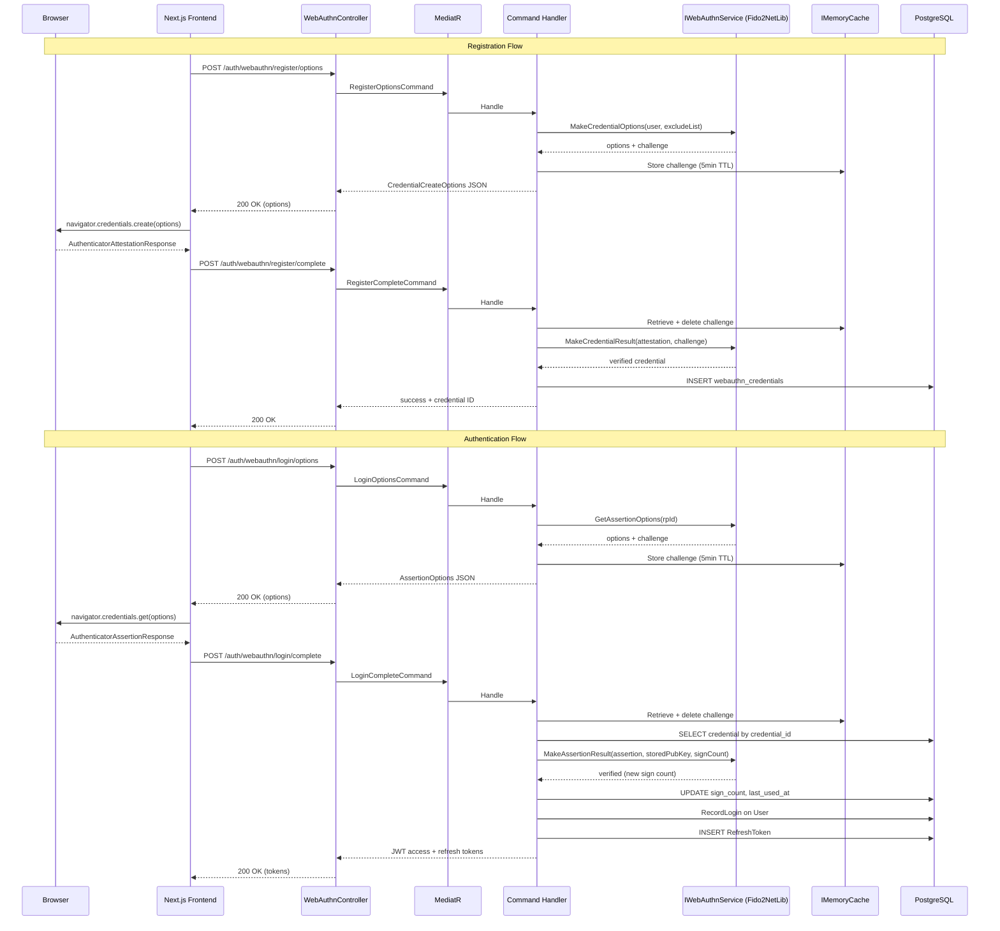

# Design Document: Biometric Login (WebAuthn / Passkeys)

## Overview

This design adds passwordless biometric authentication using the WebAuthn (FIDO2) standard. Users register their device's platform authenticator (Touch ID, Face ID, Windows Hello, Android biometric) after an initial email+password login, then use it for subsequent passwordless logins.

The architecture follows the existing Clean Architecture layering:
- **Domain**: `WebAuthnCredential` entity (no external dependencies)
- **Application**: MediatR commands/queries + `IWebAuthnService` interface
- **Infrastructure**: `Fido2NetLib`-based implementation of `IWebAuthnService`, challenge caching via `IMemoryCache`
- **Api**: `WebAuthnController` dispatching commands via MediatR

The frontend uses the native Web Authentication API (`navigator.credentials`) with no additional libraries.

## Architecture



### Layer Responsibilities

| Layer | Responsibility |
|-------|---------------|
| **Domain** | `WebAuthnCredential` entity with factory method, sign count validation logic |
| **Application** | Commands: `RegisterOptions`, `RegisterComplete`, `LoginOptions`, `LoginComplete`, `DeleteCredential`, `UpdateCredentialNickname`. Queries: `ListCredentials`. Interface: `IWebAuthnService` |
| **Infrastructure** | `Fido2Service : IWebAuthnService` wrapping `Fido2NetLib`. EF Core configuration for `WebAuthnCredential`. Challenge cache management |
| **Api** | `WebAuthnController` — thin controller dispatching to MediatR. Rate-limited under existing `"auth"` policy |

## Components and Interfaces

### IWebAuthnService (Application Layer)

```csharp
namespace Jobuler.Application.Auth;

public interface IWebAuthnService
{
    /// Generate options for navigator.credentials.create()
    Task<CredentialCreateOptionsResult> GenerateRegistrationOptionsAsync(
        Guid userId, string userEmail, string userDisplayName,
        IEnumerable<byte[]> existingCredentialIds, CancellationToken ct);

    /// Verify the attestation response and return the credential data
    Task<RegisteredCredentialResult> CompleteRegistrationAsync(
        string challengeId, string attestationResponseJson, CancellationToken ct);

    /// Generate options for navigator.credentials.get()
    Task<AssertionOptionsResult> GenerateAuthenticationOptionsAsync(CancellationToken ct);

    /// Verify the assertion response against stored credential
    Task<AssertionVerificationResult> CompleteAuthenticationAsync(
        string challengeId, string assertionResponseJson,
        byte[] storedPublicKey, uint storedSignCount, CancellationToken ct);
}
```

### WebAuthnController Endpoints

| Method | Route | Auth | Purpose |
|--------|-------|------|---------|
| POST | `/auth/webauthn/register/options` | `[Authorize]` | Get registration challenge + options |
| POST | `/auth/webauthn/register/complete` | `[Authorize]` | Submit attestation, store credential |
| POST | `/auth/webauthn/login/options` | `[AllowAnonymous]` | Get authentication challenge + options |
| POST | `/auth/webauthn/login/complete` | `[AllowAnonymous]` | Submit assertion, receive JWT tokens |
| GET | `/auth/webauthn/credentials` | `[Authorize]` | List user's credentials |
| DELETE | `/auth/webauthn/credentials/{id}` | `[Authorize]` | Remove a credential |
| PATCH | `/auth/webauthn/credentials/{id}` | `[Authorize]` | Update credential nickname |

### Challenge Storage

Challenges are stored in `IMemoryCache` with a composite key `webauthn:challenge:{challengeId}` where `challengeId` is a new GUID generated per ceremony. TTL is 5 minutes. On verification, the challenge is retrieved and immediately removed (single-use).

```csharp
// Storage structure
public record StoredChallenge(byte[] Challenge, Guid? UserId, DateTime CreatedAt);
```

### Frontend Module

The `Frontend_Auth_Module` is a Next.js client utility (`lib/webauthn.ts`) that:
1. Feature-detects WebAuthn: `window.PublicKeyCredential !== undefined`
2. Converts between `ArrayBuffer` ↔ base64url for API transport
3. Calls `navigator.credentials.create()` / `.get()` with server-provided options
4. Handles user cancellation (`NotAllowedError`) gracefully

## Data Models

### WebAuthnCredential Entity (Domain)

```csharp
namespace Jobuler.Domain.Identity;

public class WebAuthnCredential : Entity
{
    public Guid UserId { get; private set; }
    public User User { get; private set; } = default!;
    public byte[] CredentialId { get; private set; } = default!;
    public byte[] PublicKey { get; private set; } = default!;
    public uint SignCount { get; private set; }
    public string[] Transports { get; private set; } = Array.Empty<string>();
    public string? Nickname { get; private set; }
    public DateTime CreatedAt { get; private set; }
    public DateTime? LastUsedAt { get; private set; }
    public bool IsDisabled { get; private set; }

    private WebAuthnCredential() { }

    public static WebAuthnCredential Create(
        Guid userId, byte[] credentialId, byte[] publicKey,
        uint signCount, string[] transports, string? nickname)
    {
        ArgumentNullException.ThrowIfNull(credentialId);
        ArgumentNullException.ThrowIfNull(publicKey);
        if (credentialId.Length == 0) throw new ArgumentException("Credential ID cannot be empty.");
        if (publicKey.Length == 0) throw new ArgumentException("Public key cannot be empty.");

        return new WebAuthnCredential
        {
            UserId = userId,
            CredentialId = credentialId,
            PublicKey = publicKey,
            SignCount = signCount,
            Transports = transports,
            Nickname = nickname?.Length > 100 ? nickname[..100] : nickname,
            CreatedAt = DateTime.UtcNow,
            IsDisabled = false
        };
    }

    public void UpdateSignCount(uint newSignCount)
    {
        if (newSignCount <= SignCount)
            throw new InvalidOperationException("Sign count regression detected — credential may be cloned.");
        SignCount = newSignCount;
        LastUsedAt = DateTime.UtcNow;
    }

    public void UpdateNickname(string? nickname)
    {
        if (nickname?.Length > 100)
            throw new ArgumentException("Nickname must be 100 characters or fewer.");
        Nickname = nickname;
    }

    public void Disable() => IsDisabled = true;
}
```

### Database Schema (EF Core Configuration)

```csharp
// Table: webauthn_credentials
builder.ToTable("webauthn_credentials");
builder.HasKey(e => e.Id);
builder.Property(e => e.CredentialId).HasColumnType("bytea").IsRequired();
builder.Property(e => e.PublicKey).HasColumnType("bytea").IsRequired();
builder.Property(e => e.SignCount).IsRequired();
builder.Property(e => e.Transports).HasColumnType("text[]");
builder.Property(e => e.Nickname).HasMaxLength(100);
builder.Property(e => e.CreatedAt).IsRequired();
builder.Property(e => e.IsDisabled).HasDefaultValue(false);

builder.HasIndex(e => e.CredentialId).IsUnique();
builder.HasIndex(e => e.UserId);
builder.HasOne(e => e.User)
    .WithMany()
    .HasForeignKey(e => e.UserId)
    .OnDelete(DeleteBehavior.Cascade);
```

### Migration SQL (equivalent)

```sql
CREATE TABLE webauthn_credentials (
    id              UUID PRIMARY KEY DEFAULT gen_random_uuid(),
    user_id         UUID NOT NULL REFERENCES users(id) ON DELETE CASCADE,
    credential_id   BYTEA NOT NULL,
    public_key      BYTEA NOT NULL,
    sign_count      INTEGER NOT NULL DEFAULT 0,
    transports      TEXT[] DEFAULT '{}',
    nickname        VARCHAR(100),
    created_at      TIMESTAMPTZ NOT NULL DEFAULT NOW(),
    last_used_at    TIMESTAMPTZ,
    is_disabled     BOOLEAN NOT NULL DEFAULT FALSE
);

CREATE UNIQUE INDEX ix_webauthn_credentials_credential_id ON webauthn_credentials(credential_id);
CREATE INDEX ix_webauthn_credentials_user_id ON webauthn_credentials(user_id);
```

### Configuration (appsettings.json additions)

```json
{
  "WebAuthn": {
    "RelyingPartyId": "shifter.ofeklabs.com",
    "RelyingPartyName": "Shifter",
    "Origin": "https://shifter.ofeklabs.com",
    "ChallengeTimeoutMinutes": 5
  }
}
```

## Correctness Properties

*A property is a characteristic or behavior that should hold true across all valid executions of a system — essentially, a formal statement about what the system should do. Properties serve as the bridge between human-readable specifications and machine-verifiable correctness guarantees.*

### Property 1: Challenge minimum length

*For any* registration or authentication ceremony initiation, the generated challenge SHALL be at least 16 bytes in length.

**Validates: Requirements 1.1, 3.1**

### Property 2: Registration options contain user identity

*For any* valid user (with any ID, email, and display name), the generated registration options SHALL include a user entity whose ID, email (as name), and display name match the input values exactly.

**Validates: Requirements 1.2**

### Property 3: Exclude list completeness

*For any* user with N existing credentials (where N >= 0), the generated registration options SHALL contain an exclude list with exactly N entries, each matching one of the user's existing credential IDs.

**Validates: Requirements 1.4**

### Property 4: Sign count monotonic invariant

*For any* credential with stored sign count N and a reported sign count M: if M > N, the update SHALL succeed and the stored sign count SHALL become M; if M <= N, the update SHALL fail and the credential SHALL be marked as disabled.

**Validates: Requirements 4.3, 4.6, 9.6**

### Property 5: Token issuance parity

*For any* valid user who authenticates via WebAuthn, the issued JWT access token SHALL contain the same claims (userId, email, displayName) and the same expiry duration (15 minutes) as a token issued via the email+password login flow for the same user.

**Validates: Requirements 4.2**

### Property 6: Credential listing completeness

*For any* user with N registered credentials, querying the credential list SHALL return exactly N items, each containing the credential ID, nickname, creation timestamp, and last-used timestamp of a credential belonging to that user.

**Validates: Requirements 5.1**

### Property 7: Credential deletion ownership enforcement

*For any* two distinct users A and B, where B owns a credential C: user A attempting to delete credential C SHALL be rejected with a forbidden error, and credential C SHALL remain in the store unchanged.

**Validates: Requirements 5.2, 5.3**

### Property 8: Nickname length validation

*For any* string S: if `length(S) <= 100`, setting it as a credential nickname SHALL succeed and the stored nickname SHALL equal S; if `length(S) > 100`, the operation SHALL be rejected with a validation error and the nickname SHALL remain unchanged.

**Validates: Requirements 6.1, 6.2, 6.3**

### Property 9: Challenge single-use guarantee

*For any* challenge that has been used in a verification attempt (regardless of whether verification succeeded or failed), a subsequent verification attempt using the same challenge ID SHALL be rejected with an expiration/not-found error.

**Validates: Requirements 9.5**

## Error Handling

Error handling follows the existing `ExceptionHandlingMiddleware` pattern. Domain exceptions bubble up and are mapped to HTTP status codes:

| Exception | HTTP Status | Scenario |
|-----------|-------------|----------|
| `UnauthorizedAccessException` | 403 | Cross-user credential deletion attempt |
| `KeyNotFoundException` | 404 | Credential not found, challenge not found/expired |
| `InvalidOperationException` | 400 | Sign count regression, invalid attestation/assertion, expired challenge |
| `ArgumentException` | 400 | Nickname too long, empty credential ID |
| `Fido2VerificationException` (custom) | 400 | Fido2NetLib verification failure (origin mismatch, UV not set, bad signature) |

### Error Response Format

Consistent with existing API error responses:

```json
{
  "error": "WEBAUTHN_SIGN_COUNT_REGRESSION",
  "message": "Credential sign count regression detected. The credential has been disabled for security."
}
```

### Error Codes

| Code | Meaning |
|------|---------|
| `WEBAUTHN_CHALLENGE_EXPIRED` | Challenge not found or TTL exceeded |
| `WEBAUTHN_ATTESTATION_FAILED` | Attestation response verification failed |
| `WEBAUTHN_ASSERTION_FAILED` | Assertion response signature invalid |
| `WEBAUTHN_CREDENTIAL_NOT_FOUND` | Credential ID not in database |
| `WEBAUTHN_SIGN_COUNT_REGRESSION` | Sign count <= stored value (possible clone) |
| `WEBAUTHN_CREDENTIAL_DISABLED` | Credential was disabled due to security concern |
| `WEBAUTHN_ORIGIN_MISMATCH` | Response origin doesn't match configured origin |
| `WEBAUTHN_NICKNAME_TOO_LONG` | Nickname exceeds 100 characters |

### Graceful Degradation

- If WebAuthn verification fails, the user can always fall back to email+password login
- If the challenge cache is unavailable (memory pressure), new ceremonies can still be initiated — only in-flight ceremonies are affected
- Disabled credentials are soft-disabled (flag), not deleted, preserving audit trail

## Testing Strategy

### Unit Tests (Example-Based)

Unit tests cover specific scenarios, edge cases, and configuration checks:

- **WebAuthnCredential.Create()**: Valid inputs produce correct entity state
- **WebAuthnCredential.UpdateSignCount()**: Specific sign count values (0→1, 100→101)
- **WebAuthnCredential.UpdateNickname()**: Null, empty, exactly 100 chars, emoji strings
- **Registration options**: Static fields (RP ID, RP name, authenticator selection, UV)
- **Authentication options**: Static fields (RP ID, UV, resident key preference)
- **Error cases**: Expired challenge, missing credential, disabled credential
- **Frontend components**: Feature detection, button visibility, error messages

### Property-Based Tests

Property tests verify universal correctness properties using `FsCheck` (for .NET) with minimum 100 iterations per property:

| Property | Test Description | Library |
|----------|-----------------|---------|
| Property 1 | Generate N challenges, all >= 16 bytes | FsCheck |
| Property 2 | Random user data → options contain matching user entity | FsCheck |
| Property 3 | Random credential sets → exclude list matches | FsCheck |
| Property 4 | Random (signCount, newCount) pairs → correct accept/reject | FsCheck |
| Property 5 | Random valid users → token claims match password-login tokens | FsCheck |
| Property 6 | Random credential counts → list returns exact count with fields | FsCheck |
| Property 7 | Random user pairs → cross-user delete always rejected | FsCheck |
| Property 8 | Random strings → accept iff length <= 100 | FsCheck |
| Property 9 | Random challenges → second use always rejected | FsCheck |

**Configuration:**
- Library: `FsCheck.Xunit` (integrates with existing xUnit test runner)
- Iterations: 100 minimum per property
- Tag format: `// Feature: biometric-login, Property {N}: {title}`

### Integration Tests

Integration tests verify the full request/response cycle and database behavior:

- **Registration ceremony**: End-to-end with mocked Fido2 library responses
- **Authentication ceremony**: End-to-end with mocked Fido2 library responses
- **Cascade delete**: Delete user → verify credentials removed
- **Rate limiting**: Verify auth rate limiter applies to WebAuthn endpoints
- **Concurrent registration**: Two devices registering simultaneously for same user

### Frontend Tests

- **Component tests** (React Testing Library): Button visibility, feature detection, error states
- **Integration tests** (mocked `navigator.credentials`): Full registration and login flows
- **Accessibility**: Biometric button has proper ARIA labels, error messages are announced

