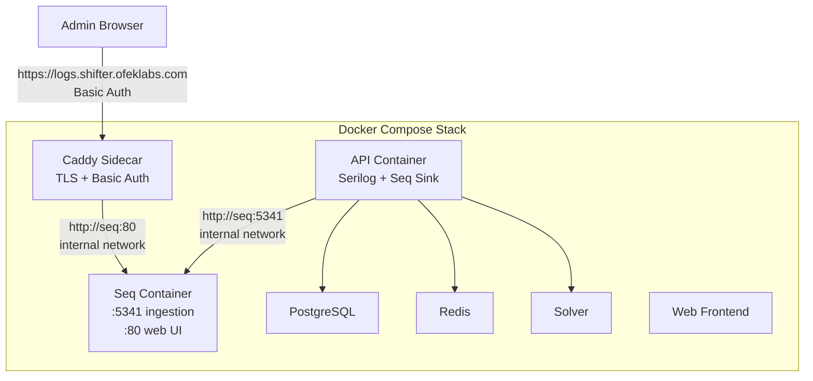
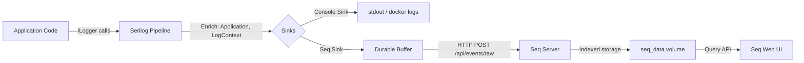

# Design Document: Centralized Logging

## Overview

This design adds centralized structured logging to the Shifter platform by introducing a Seq log server container to the Docker Compose stack and configuring the existing Serilog pipeline to ship structured events to it. The Seq web UI is secured behind a Caddy reverse-proxy sidecar with HTTP Basic Authentication, while internal Docker network access remains open for the health check monitor. The deployment integrates into the existing GitHub Actions workflow with zero additional secrets in the CI pipeline.

### Design Goals

- **Minimal disruption**: The API already uses Serilog with `ReadFrom.Configuration` and `Enrich.FromLogContext`. The Seq sink is added purely via configuration — no code changes to the logging pipeline.
- **Resilience**: Durable file-based buffering ensures log events survive Seq outages without impacting API availability.
- **Security**: The Seq web UI is never exposed directly; all external access goes through an authenticated TLS-terminating proxy.
- **Extensibility**: Configuration-driven sinks, API key support, and `LogContext` enrichment provide hooks for future correlation IDs, additional enrichers, and multi-service ingestion.

## Architecture



### Key Architectural Decisions

| Decision | Rationale |
|----------|-----------|
| Caddy as reverse proxy sidecar | Automatic TLS via Let's Encrypt, simple Caddyfile config, minimal resource footprint. Avoids adding Nginx complexity. |
| Durable file buffer (not in-memory) | Survives API container restarts; handles extended Seq outages without event loss. |
| Configuration-only Seq sink (no code changes) | `ReadFrom.Configuration` already exists in Program.cs; adding the sink via `appsettings.json` keeps the pipeline declarative and extensible. |
| Seq ingestion open internally, auth only on web UI | The health check monitor and API communicate over the trusted Docker network. External access to the query UI requires authentication. |
| Single `docker compose up` for deployment | No separate orchestration step; Seq starts alongside other services. Non-critical service — other services don't `depends_on` Seq. |

## Components and Interfaces

### 1. Seq Service (Docker Compose)

**Image**: `datalust/seq:latest`

**Ports (internal only)**:
- `5341` — Ingestion endpoint (HTTP API for log events)
- `80` — Web UI

**Environment Variables**:
- `ACCEPT_EULA=Y` — Required by Seq license
- `SEQ_FIRSTRUN_ADMINPASSWORD=${SEQ_ADMIN_PASSWORD}` — Sets initial admin password for the Seq UI

**Volume**: `seq_data:/data` — Persists log data and Seq configuration

**Health Check**: `curl -f http://localhost:5341/health || exit 1`

### 2. Caddy Reverse Proxy Sidecar (Docker Compose)

**Image**: `caddy:2-alpine`

**Purpose**: Terminates TLS for `logs.shifter.ofeklabs.com` and enforces HTTP Basic Authentication before proxying to Seq's web UI.

**Ports (host-mapped)**:
- `443` (or shared with existing proxy) — HTTPS ingress for Seq UI

**Configuration** (`infra/compose/caddy/Caddyfile`):
```
logs.shifter.ofeklabs.com {
    basicauth * {
        {$SEQ_UI_USERNAME} {$SEQ_UI_PASSWORD_HASH}
    }
    reverse_proxy seq:80
}
```

**Environment Variables**:
- `SEQ_UI_USERNAME` — Basic auth username (from `.env`)
- `SEQ_UI_PASSWORD_HASH` — Bcrypt-hashed password (generated via `caddy hash-password`)

### 3. Serilog Seq Sink Configuration

**NuGet Package**: `Serilog.Sinks.Seq` (added to `Jobuler.Api.csproj`)

**Configuration in `appsettings.json`**:
```json
{
  "Serilog": {
    "Using": ["Serilog.Sinks.Seq"],
    "MinimumLevel": {
      "Default": "Information",
      "Override": {
        "Microsoft": "Warning",
        "Microsoft.EntityFrameworkCore": "Warning"
      }
    },
    "WriteTo": [
      {
        "Name": "Seq",
        "Args": {
          "serverUrl": "http://seq:5341",
          "bufferBaseFilename": "/app/logs/seq-buffer",
          "retainedInvalidPayloadsLimitBytes": 5242880
        }
      }
    ],
    "Enrich": ["FromLogContext"],
    "Properties": {
      "Application": "Shifter.Api"
    }
  }
}
```

**Environment Variable Override**: The `serverUrl` is overridden in docker-compose.yml via:
```
Seq__ServerUrl=http://seq:5341
```

This allows local development to point to a different Seq instance or disable the sink entirely by omitting the variable.

**Program.cs Changes**: None required for the Seq sink itself. The existing `ReadFrom.Configuration` call already picks up `WriteTo` entries from configuration. However, the hardcoded `.WriteTo.Console(...)` call should be moved into `appsettings.json` to satisfy Requirement 7.5 (no hardcoded WriteTo calls).

**Revised Program.cs Serilog block**:
```csharp
Log.Logger = new LoggerConfiguration()
    .ReadFrom.Configuration(builder.Configuration)
    .CreateLogger();
```

The console sink moves to `appsettings.json`:
```json
"WriteTo": [
  {
    "Name": "Console",
    "Args": {
      "formatter": "Serilog.Formatting.Json.JsonFormatter, Serilog"
    }
  },
  {
    "Name": "Seq",
    "Args": {
      "serverUrl": "http://seq:5341",
      "bufferBaseFilename": "/app/logs/seq-buffer",
      "retainedInvalidPayloadsLimitBytes": 5242880
    }
  }
]
```

### 4. Durable Buffering

The `bufferBaseFilename` argument enables Serilog.Sinks.Seq's durable mode. When Seq is unreachable:
1. Events are written to rolling buffer files at `/app/logs/seq-buffer-*.json`
2. A background thread retries delivery with exponential backoff
3. Once Seq is reachable, buffered events are shipped in order
4. The API never blocks or crashes due to Seq unavailability

The `/app/logs` directory is created in the Dockerfile and optionally backed by a volume for persistence across container restarts.

### 5. Deployment Integration

The `deploy-vps.yml` workflow requires minimal changes:
- The `docker compose up -d --build` command already starts all services defined in docker-compose.yml
- Seq is added without `depends_on` from other services, so a Seq health check failure doesn't block API/web/solver startup
- The `.env` file on the VPS gains Seq-related variables (no new GitHub secrets needed)

### 6. Health Check Monitor Compatibility

The `HealthCheckMonitorService` runs inside the API container. Since the API container and Seq container share the default Docker Compose network, the monitor can reach `http://seq:5341` directly without authentication or external network access. No changes to the health check monitor code are required.

## Data Models

This feature introduces no new database entities or domain models. The data flow is:



### Configuration Data (`.env` additions)

| Variable | Purpose | Example |
|----------|---------|---------|
| `SEQ_ADMIN_PASSWORD` | Initial Seq admin password | `Ch@ng3m3!` |
| `SEQ_UI_USERNAME` | Caddy basic auth username | `admin` |
| `SEQ_UI_PASSWORD_HASH` | Caddy bcrypt hash of password | `$2a$14$...` |

## Error Handling

| Failure Scenario | Behavior | Recovery |
|-----------------|----------|----------|
| Seq container not started | API starts normally; durable buffer accumulates events on disk | Events delivered once Seq becomes available |
| Seq container crashes | Durable buffer activates; no API impact | Seq restarts via `unless-stopped` policy; buffer drains |
| Durable buffer disk full | `retainedInvalidPayloadsLimitBytes` caps buffer at 5 MB; oldest events dropped | Seq recovery drains buffer; consider increasing limit or adding alerting |
| Caddy TLS certificate failure | Seq UI inaccessible externally; internal ingestion unaffected | Caddy auto-retries ACME; manual DNS check if persistent |
| Invalid Seq admin password | Seq UI login fails | Reset via `SEQ_FIRSTRUN_ADMINPASSWORD` env var on fresh volume |
| Reverse proxy down | Seq UI inaccessible; log ingestion continues internally | Caddy restarts via `unless-stopped` policy |

## Testing Strategy

### Why Property-Based Testing Does Not Apply

This feature is primarily infrastructure configuration (Docker Compose services, reverse proxy setup, deployment scripts) and Serilog pipeline wiring. There are no pure functions, parsers, serializers, or business logic with meaningful input variation. The acceptance criteria are configuration checks (SMOKE), integration verifications (INTEGRATION), or specific example validations (EXAMPLE). Property-based testing is not appropriate here.

### Testing Approach

**Smoke Tests** (configuration validation):
- Verify `docker-compose.yml` contains the `seq` service with correct image, ports, volume, healthcheck, and restart policy
- Verify `Jobuler.Api.csproj` references `Serilog.Sinks.Seq`
- Verify `appsettings.json` contains the Seq sink configuration with `bufferBaseFilename`
- Verify no host port mapping exposes Seq directly
- Verify Caddy configuration references environment variables for credentials (not hardcoded)
- Verify deploy workflow doesn't introduce new GitHub secrets

**Integration Tests** (require running stack):
- Start the Docker Compose stack; verify API logs appear in Seq within 5 seconds
- Start the API without Seq running; verify API doesn't crash and buffer files are created
- Start Seq after buffering; verify buffered events are delivered
- Make unauthenticated request to `logs.shifter.ofeklabs.com`; verify HTTP 401
- Make authenticated request; verify Seq UI is accessible
- Verify health check monitor continues sending Pushover alerts after Seq is added

**Example-Based Unit Tests**:
- Verify Serilog configuration resolves `Seq__ServerUrl` from environment variables
- Verify log events contain `Application: "Shifter.Api"` property
- Verify `ReadFrom.Configuration` is used (no hardcoded `WriteTo.Seq()` in Program.cs)
- Verify `Enrich.FromLogContext` is present in configuration

### Test Execution

Integration tests should be run manually during deployment verification or as part of a dedicated infrastructure test suite. Smoke tests can be implemented as simple assertion scripts that parse the configuration files.
