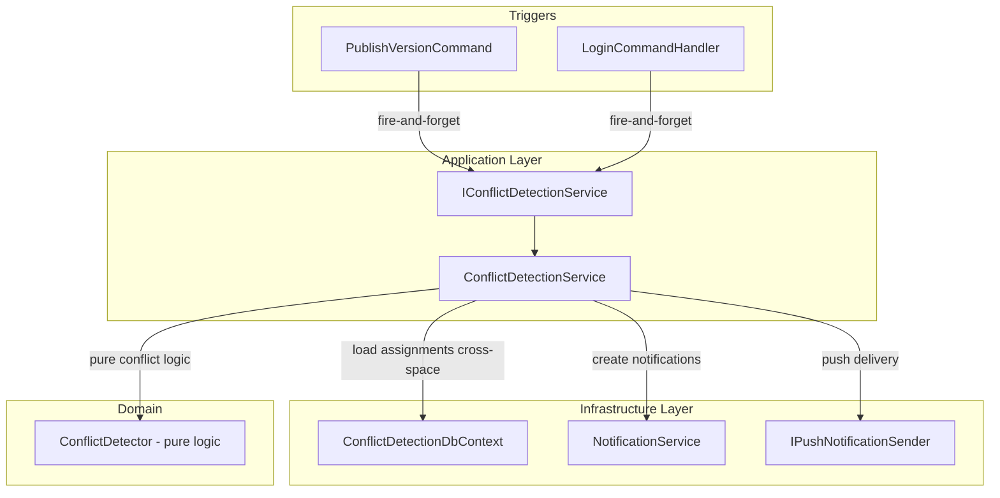

# Design Document: Cross-Group Conflict Detection

## Overview

This feature detects scheduling conflicts (overlapping assignments and insufficient rest gaps) for users who belong to multiple groups — within the same space or across spaces via `LinkedUserId`. It runs post-facto after schedule publication and on user login, creating personal notifications visible only to the affected user.

The system operates as a read-only observer: it never modifies assignments, solver inputs, or RLS policies. It hooks into two existing flows (publish and login) and produces notifications through the existing `Notification` + `PushSubscription` infrastructure.

### Key Design Decisions

| Decision | Choice | Rationale |
|----------|--------|-----------|
| Publish trigger hook | Fire-and-forget `Task.Run` inside `PublishVersionCommandHandler` (same pattern as external notifications) | Avoids new domain events infrastructure; proven pattern already in codebase; keeps publish response fast |
| Cross-space query (bypassing RLS) | Dedicated `ConflictDetectionDbContext` registered without RLS interceptor, using direct connection string | No RLS policy changes; explicit opt-in; auditable; scoped to conflict detection only |
| Async login trigger | `Task.Run` with new DI scope fired after token generation in `LoginCommandHandler` | Adds <1ms to login response; same fire-and-forget pattern used in publish |
| Deduplication fingerprint | New `deduplication_hash` column on existing `notifications` table | Avoids new table; fingerprint is notification-specific; simple migration |
| Conflict detection algorithm | Sort-then-sweep (O(n log n)) on merged assignment list per person | Optimal for the expected cardinality (tens of assignments per person); simpler than pairwise O(n²) |

## Architecture



The conflict detection service lives in the **Application layer** (interface) with implementation in **Infrastructure** (DB access). The pure conflict detection algorithm lives in the **Domain layer** as a static utility with no dependencies.

## Components and Interfaces

### 1. `IConflictDetectionService` (Application Layer)

```csharp
namespace Jobuler.Application.Conflicts;

public interface IConflictDetectionService
{
    /// <summary>
    /// Detects conflicts for all persons with assignments in the given published version.
    /// Called after a ScheduleVersion is published.
    /// </summary>
    Task DetectOnPublishAsync(Guid spaceId, Guid versionId, CancellationToken ct = default);

    /// <summary>
    /// Detects conflicts for a specific user across all their linked person records.
    /// Called after successful login.
    /// </summary>
    Task DetectOnLoginAsync(Guid userId, CancellationToken ct = default);
}
```

### 2. `ConflictDetector` (Domain Layer — Pure Logic)

```csharp
namespace Jobuler.Domain.Conflicts;

public static class ConflictDetector
{
    /// <summary>
    /// Given a list of assignments (with time ranges and group info) for a single person,
    /// returns all overlap conflicts and rest violations.
    /// Assignments must be from different groups. Same-group pairs are ignored.
    /// </summary>
    public static ConflictResult Detect(
        IReadOnlyList<FlatAssignment> assignments,
        Func<Guid, Guid, int> getMinRestHours);
}

public record FlatAssignment(
    Guid AssignmentId,
    Guid GroupId,
    string GroupName,
    Guid TaskSlotId,
    DateTime StartsAt,
    DateTime EndsAt);

public record ConflictPair(
    FlatAssignment A,
    FlatAssignment B,
    ConflictType Type);

public enum ConflictType { Overlap, RestViolation }

public record ConflictResult(IReadOnlyList<ConflictPair> Conflicts);
```

### 3. `ConflictDetectionService` (Infrastructure Layer)

Implements `IConflictDetectionService`. Responsibilities:
- Query assignments across spaces using `ConflictDetectionDbContext` (no RLS)
- Filter to published versions only, future assignments only (for login trigger)
- Resolve `Person.LinkedUserId` → all person records across spaces
- Call `ConflictDetector.Detect()` for each person
- Compute deduplication fingerprint
- Check existing unread notifications for duplicate suppression
- Create notifications with localized text
- Send push notifications (best-effort, no retry)

### 4. `ConflictDetectionDbContext` (Infrastructure Layer)

A minimal `DbContext` registered with a direct connection string (no RLS session variable interceptor). It exposes read-only access to:
- `assignments` (join with `task_slots` for time ranges)
- `people` (for `LinkedUserId` resolution)
- `group_memberships` (for group membership lookup)
- `groups` (for `MinRestBetweenShiftsHours` and `Name`)
- `schedule_versions` (for status = Published filter)
- `notifications` (for deduplication check)
- `spaces` (for locale)
- `push_subscriptions` (for push delivery check)
- `task_slots` (for StartsAt/EndsAt)
- `tasks` (GroupTask — for GroupId linkage to task slots)

This context is **read-only for cross-space queries** and **write-only for notifications** (always scoped to the user's own space).

### 5. Trigger Integration Points

**PublishVersionCommandHandler** — add at the end, after audit log:
```csharp
// Fire-and-forget: cross-group conflict detection
_ = Task.Run(async () =>
{
    using var scope = _scopeFactory.CreateScope();
    var conflictService = scope.ServiceProvider.GetRequiredService<IConflictDetectionService>();
    await conflictService.DetectOnPublishAsync(req.SpaceId, req.VersionId, CancellationToken.None);
});
```

**LoginCommandHandler** — add after `SaveChangesAsync`:
```csharp
// Fire-and-forget: cross-group conflict detection
_ = Task.Run(async () =>
{
    using var scope = _scopeFactory.CreateScope();
    var conflictService = scope.ServiceProvider.GetRequiredService<IConflictDetectionService>();
    await conflictService.DetectOnLoginAsync(user.Id, CancellationToken.None);
});
```

## Data Models

### Notification Table Extension

Add a nullable `deduplication_hash` column to the existing `notifications` table:

```sql
ALTER TABLE notifications
ADD COLUMN deduplication_hash VARCHAR(64) NULL;

CREATE INDEX ix_notifications_dedup
ON notifications (user_id, space_id, event_type, deduplication_hash)
WHERE is_read = FALSE;
```

The hash is a SHA-256 hex string computed from the sorted list of conflicting assignment pair IDs.

### Notification Domain Entity Extension

```csharp
// Add to Notification entity:
public string? DeduplicationHash { get; private set; }

public static Notification CreateWithDedup(
    Guid spaceId, Guid userId, string eventType,
    string title, string body, string? metadataJson,
    string? deduplicationHash) =>
    new()
    {
        SpaceId = spaceId,
        UserId = userId,
        EventType = eventType,
        Title = title,
        Body = body,
        MetadataJson = metadataJson,
        DeduplicationHash = deduplicationHash
    };
```

### Conflict Notification Metadata Schema

```json
{
  "conflicts": [
    {
      "type": "overlap",
      "slotA": { "id": "uuid", "groupName": "Group A", "startsAt": "ISO8601", "endsAt": "ISO8601" },
      "slotB": { "id": "uuid", "groupName": "Group B", "startsAt": "ISO8601", "endsAt": "ISO8601" }
    }
  ]
}
```

For cross-space notifications (Requirement 6.5): each space's notification only includes group names visible within that space. The "other" side shows only the time range without the group name from the foreign space.

### Deduplication Fingerprint Algorithm

```
1. Collect all conflict pairs [(assignmentIdA, assignmentIdB), ...]
2. For each pair, order IDs: min(A,B), max(A,B)
3. Sort pairs lexicographically
4. Concatenate as string: "id1:id2|id3:id4|..."
5. SHA-256 hash → hex string (64 chars)
```

### Sweep-Line Conflict Detection Algorithm

```
Input: List<FlatAssignment> for one person (from all groups, published versions only)
Output: List<ConflictPair>

1. Sort assignments by StartsAt ascending
2. For each pair of consecutive/overlapping assignments from DIFFERENT groups:
   a. If A.StartsAt < B.EndsAt AND B.StartsAt < A.EndsAt → Overlap
   b. Else compute gap = B.StartsAt - A.EndsAt
      - minRest = max(groupA.MinRestBetweenShiftsHours, groupB.MinRestBetweenShiftsHours)
      - If gap < minRest hours AND minRest > 0 → RestViolation
3. Use a sliding window: maintain active assignments (not yet ended).
   For each new assignment, compare against all active assignments from different groups.
4. Remove from active set when current.StartsAt >= active.EndsAt + maxPossibleRest
```

This is O(n log n) for the sort + O(n × k) for the sweep where k is the average number of concurrent active assignments (typically 1-3).

## Correctness Properties

*A property is a characteristic or behavior that should hold true across all valid executions of a system — essentially, a formal statement about what the system should do. Properties serve as the bridge between human-readable specifications and machine-verifiable correctness guarantees.*

### Property 1: Overlap detection is symmetric and complete

*For any* two assignments A and B belonging to the same person but different groups, the `ConflictDetector` SHALL classify them as an Overlap_Conflict if and only if `A.StartsAt < B.EndsAt AND B.StartsAt < A.EndsAt`.

**Validates: Requirements 1.2, 3.1**

### Property 2: Rest violation uses the stricter threshold

*For any* two non-overlapping assignments A and B belonging to the same person from different groups with `MinRestBetweenShiftsHours` values R_a and R_b, the `ConflictDetector` SHALL classify them as a Rest_Violation if and only if the gap between them is less than `max(R_a, R_b)` hours AND `max(R_a, R_b) > 0`.

**Validates: Requirements 4.1, 4.2, 4.4**

### Property 3: Overlap and rest violation are mutually exclusive

*For any* pair of assignments belonging to the same person from different groups, the `ConflictDetector` SHALL never classify the same pair as both an Overlap_Conflict and a Rest_Violation. If a pair qualifies as an overlap, it is excluded from rest violation checks.

**Validates: Requirements 4.3**

### Property 4: Same-group assignments never produce conflicts

*For any* set of assignments where all assignments belong to the same group, the `ConflictDetector` SHALL return zero conflicts regardless of time overlaps or gaps.

**Validates: Requirements 3.2**

### Property 5: Deduplication fingerprint is order-independent

*For any* set of conflict pairs, computing the deduplication fingerprint with the pairs presented in any permutation SHALL produce the same hash value.

**Validates: Requirements 8.1**

### Property 6: Idempotent notification — duplicate suppression

*For any* user with an existing unread notification carrying deduplication fingerprint F and event type "schedule.cross_group_conflict", running conflict detection that produces the same fingerprint F SHALL not create a new notification.

**Validates: Requirements 8.2**

### Property 7: Read notifications do not suppress new detections

*For any* user who has marked a conflict notification (with fingerprint F) as read, running conflict detection that produces the same fingerprint F SHALL create a new notification.

**Validates: Requirements 8.3**

### Property 8: Notification metadata contains exactly the specified fields

*For any* set of detected conflicts, the notification metadata JSON SHALL contain for each conflict pair: both TaskSlot IDs, both group names (only from the notification's own space), and the StartsAt/EndsAt timestamps — and SHALL NOT contain person names, assignment counts, or schedule structure.

**Validates: Requirements 5.6, 6.2, 6.5**

## Error Handling

| Scenario | Behavior |
|----------|----------|
| Conflict detection throws during publish | Logged as error; publish already completed successfully; no user impact |
| Conflict detection throws during login | Logged as error; login already returned tokens; no user impact |
| Push notification delivery fails | In-app notification retained; push failure logged; no retry (Req 5.8) |
| No LinkedUserId on person | Person skipped entirely (Req 1.5) |
| No person records found for user on login | Detection completes immediately, no notification (Req 2.2) |
| Database timeout during cross-space query | Logged; detection aborted for this trigger; will retry on next trigger |
| ConflictDetectionDbContext connection failure | Logged; fire-and-forget task ends; no user-facing error |

All errors bubble to the fire-and-forget task's try/catch and are logged via `ILogger`. The main request (publish/login) is never affected.

## Testing Strategy

### Property-Based Tests (using FsCheck via xUnit)

The pure `ConflictDetector` domain logic is ideal for property-based testing:
- Generate random sets of `FlatAssignment` with varying time ranges, group IDs, and rest settings
- Verify all 8 correctness properties hold across 100+ generated inputs per property
- Tag format: `Feature: cross-group-conflict-detection, Property {N}: {description}`

**Library**: FsCheck (already compatible with xUnit in .NET ecosystem)
**Minimum iterations**: 100 per property

### Unit Tests (example-based)

- Localization: verify exact strings for he/en/ru and fallback to "en" for unknown locales
- Deduplication hash: verify specific known inputs produce expected hash
- Metadata JSON structure: verify schema matches specification
- Cross-space privacy: verify notification in Space A does not contain Space B group names
- Edge cases: zero-duration assignments, assignments at exact boundary, MinRest = 0

### Integration Tests

- `DetectOnPublishAsync`: publish a version with known conflicts, verify notification created
- `DetectOnLoginAsync`: login with user having cross-group conflicts, verify notification created
- Deduplication: run detection twice with same conflicts, verify only one notification exists
- Push delivery: mock `IPushNotificationSender`, verify called with correct payload
- Cross-space: create person records in two spaces with same LinkedUserId, verify detection spans both
- Performance: verify detection completes within 30 seconds for 50 persons × 20 assignments each
