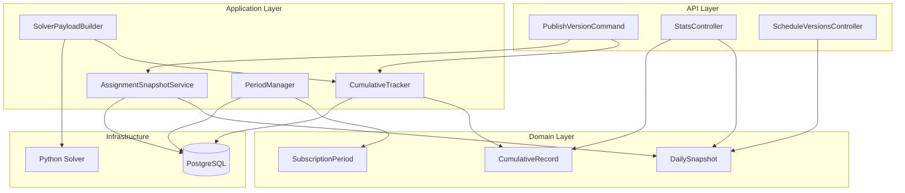
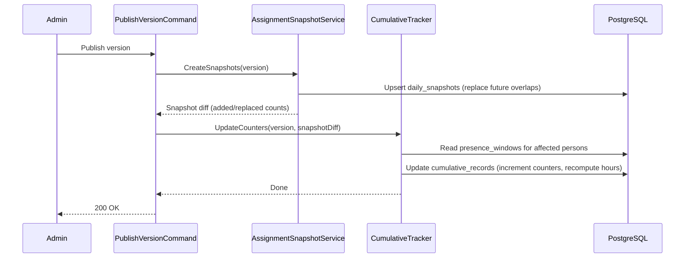
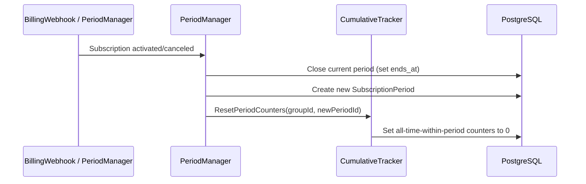

# Design Document: Cumulative Tracking and Periods

## Overview

This design adds cross-run memory to the Shifter scheduling system. Currently, the CP-SAT solver operates statelessly within a single planning horizon (1–7 days), which means home-leave eligibility only works when the horizon is long enough, fairness is only balanced within the current run, and historical assignment data is lost when new schedules are published.

The solution introduces three interconnected subsystems:

1. **Cumulative Tracking** — Maintains per-person counters (consecutive hours at base, assignment counts, last-leave timestamps) that persist across solver runs and feed into the solver payload.
2. **Daily Snapshots** — Immutable per-person-per-day records of assignments that enable historical viewing and incremental statistics computation.
3. **Subscription Periods** — Logical time segments tied to billing lifecycle that partition cumulative data and allow clean resets when groups restart after billing lapses.

### Key Design Decisions

- **Incremental over recomputation**: Counters are updated incrementally on publish, with full recomputation only on rollback or presence-window edits. This keeps publish fast (O(persons × days)) while maintaining correctness.
- **Snapshots as source of truth for history**: Rather than querying `assignments` + `schedule_versions` for past data, we denormalize into `daily_snapshots` at publish time. This decouples historical viewing from the mutable scheduling tables.
- **Period-scoped counters**: All "all-time" counters are scoped to the current subscription period, preventing unfair accumulation across billing gaps.
- **Solver remains stateless**: The solver receives cumulative data as input — it never queries the database. This preserves the clean API ↔ Solver contract.

## Architecture



### Event Flow: Schedule Publish



### Event Flow: Subscription Period Transition



## Components and Interfaces

### 1. CumulativeTracker (Application Service)

**Responsibility**: Maintains per-person cumulative counters. Triggered on schedule publish, rollback, and presence-window edits.

```csharp
public interface ICumulativeTracker
{
    /// <summary>
    /// Updates cumulative records after a schedule version is published.
    /// Increments assignment counters and recomputes consecutive_hours_at_base.
    /// </summary>
    Task UpdateOnPublishAsync(Guid spaceId, Guid versionId, CancellationToken ct);

    /// <summary>
    /// Full recomputation from presence_windows. Used on rollback or presence edits.
    /// </summary>
    Task RecomputeForPersonAsync(Guid spaceId, Guid personId, CancellationToken ct);

    /// <summary>
    /// Resets all-time-within-period counters for all persons in a group.
    /// Called when a new subscription period starts.
    /// </summary>
    Task ResetPeriodCountersAsync(Guid spaceId, Guid groupId, Guid newPeriodId, CancellationToken ct);

    /// <summary>
    /// Returns cumulative tracking data for the solver payload.
    /// </summary>
    Task<List<CumulativeTrackingDto>> GetForSolverPayloadAsync(
        Guid spaceId, Guid groupId, CancellationToken ct);
}
```

### 2. AssignmentSnapshotService (Application Service)

**Responsibility**: Creates and manages daily snapshots from published schedule versions.

```csharp
public interface IAssignmentSnapshotService
{
    /// <summary>
    /// Creates daily_snapshot rows for all persons/days in the published version.
    /// Replaces future-dated overlapping snapshots; preserves past-dated ones.
    /// Returns the diff (added, replaced, preserved counts).
    /// </summary>
    Task<SnapshotDiff> CreateSnapshotsAsync(Guid spaceId, Guid versionId, CancellationToken ct);

    /// <summary>
    /// Retrieves historical assignments for a date range (for schedule viewing).
    /// </summary>
    Task<List<DailySnapshotDto>> GetHistoricalAsync(
        Guid spaceId, Guid groupId, DateOnly startDate, DateOnly endDate, CancellationToken ct);
}
```

### 3. PeriodManager (Application Service)

**Responsibility**: Manages subscription period lifecycle — creation, closure, and querying.

```csharp
public interface IPeriodManager
{
    /// <summary>
    /// Creates a new subscription period when a subscription becomes active/trialing.
    /// </summary>
    Task<Guid> OpenPeriodAsync(Guid spaceId, Guid groupId, CancellationToken ct);

    /// <summary>
    /// Closes the current period after the 14-day grace period elapses.
    /// </summary>
    Task ClosePeriodAsync(Guid spaceId, Guid groupId, CancellationToken ct);

    /// <summary>
    /// Returns the current active period for a group, or null if none.
    /// </summary>
    Task<SubscriptionPeriod?> GetCurrentPeriodAsync(Guid spaceId, Guid groupId, CancellationToken ct);
}
```

### 4. SolverPayloadBuilder Extension

The existing `SolverPayloadNormalizer` will be extended to include a `cumulative_tracking` section in the payload:

```csharp
// New DTO added to SolverInputDto
public record CumulativeTrackingDto(
    [property: JsonPropertyName("person_id")] string PersonId,
    [property: JsonPropertyName("consecutive_hours_at_base")] double ConsecutiveHoursAtBase,
    [property: JsonPropertyName("last_home_leave_end")] string? LastHomeLeaveEnd,
    [property: JsonPropertyName("total_assignments_in_period")] int TotalAssignmentsInPeriod,
    [property: JsonPropertyName("hard_tasks_in_period")] int HardTasksInPeriod,
    [property: JsonPropertyName("days_since_last_leave")] int DaysSinceLastLeave);
```

### 5. Python Solver Extension

New Pydantic model added to `solver_input.py`:

```python
class CumulativeTracking(BaseModel):
    person_id: str
    consecutive_hours_at_base: float = 0.0
    last_home_leave_end: Optional[datetime] = None
    total_assignments_in_period: int = 0
    hard_tasks_in_period: int = 0
    days_since_last_leave: int = 0
```

The `SolverInput` model gains:
```python
cumulative_tracking: list[CumulativeTracking] = []
```

### 6. Stats API Endpoints

New endpoints on `StatsController`:

| Method | Path | Description |
|--------|------|-------------|
| GET | `/spaces/{spaceId}/stats/cumulative` | Per-person cumulative stats with time-range and period filters |
| GET | `/spaces/{spaceId}/stats/timeseries` | Daily time-series data for charting |
| GET | `/spaces/{spaceId}/schedule/history` | Historical assignments from snapshots |

### 7. Frontend Changes

- **Schedule tab**: When navigating to past dates, fetch from `/schedule/history` instead of the live schedule endpoint.
- **Stats page**: New time-range selector (7d, 14d, 30d, 90d, all-time) using cumulative stats endpoint.
- **Visual indicator**: Past-date schedule views show a banner indicating historical data.

## Data Models

### New Tables

#### `subscription_periods`

```sql
CREATE TABLE subscription_periods (
    id          UUID PRIMARY KEY DEFAULT uuid_generate_v4(),
    space_id    UUID NOT NULL REFERENCES spaces(id) ON DELETE CASCADE,
    group_id    UUID NOT NULL REFERENCES groups(id) ON DELETE CASCADE,
    status      TEXT NOT NULL DEFAULT 'active',  -- active | closed
    starts_at   TIMESTAMPTZ NOT NULL,
    ends_at     TIMESTAMPTZ,
    created_at  TIMESTAMPTZ NOT NULL DEFAULT NOW()
);

CREATE INDEX idx_subscription_periods_group ON subscription_periods (space_id, group_id);
CREATE INDEX idx_subscription_periods_active ON subscription_periods (group_id, status)
    WHERE status = 'active';

ALTER TABLE subscription_periods ENABLE ROW LEVEL SECURITY;
CREATE POLICY subscription_periods_isolation ON subscription_periods
    USING (space_id = current_setting('app.current_space_id', TRUE)::UUID);
```

#### `cumulative_records`

```sql
CREATE TABLE cumulative_records (
    id                              UUID PRIMARY KEY DEFAULT uuid_generate_v4(),
    space_id                        UUID NOT NULL REFERENCES spaces(id) ON DELETE CASCADE,
    group_id                        UUID NOT NULL REFERENCES groups(id) ON DELETE CASCADE,
    person_id                       UUID NOT NULL REFERENCES people(id) ON DELETE CASCADE,
    period_id                       UUID NOT NULL REFERENCES subscription_periods(id),

    -- Consecutive hours tracking (for home-leave eligibility)
    consecutive_hours_at_base       NUMERIC(10,2) NOT NULL DEFAULT 0,
    last_home_leave_end             TIMESTAMPTZ,

    -- Assignment counters: 7d, 14d, 30d, 90d, all-time-within-period
    total_assignments_7d            INT NOT NULL DEFAULT 0,
    total_assignments_14d           INT NOT NULL DEFAULT 0,
    total_assignments_30d           INT NOT NULL DEFAULT 0,
    total_assignments_90d           INT NOT NULL DEFAULT 0,
    total_assignments_period        INT NOT NULL DEFAULT 0,

    hard_tasks_7d                   INT NOT NULL DEFAULT 0,
    hard_tasks_14d                  INT NOT NULL DEFAULT 0,
    hard_tasks_30d                  INT NOT NULL DEFAULT 0,
    hard_tasks_90d                  INT NOT NULL DEFAULT 0,
    hard_tasks_period               INT NOT NULL DEFAULT 0,

    disliked_hated_score_7d         INT NOT NULL DEFAULT 0,
    disliked_hated_score_14d        INT NOT NULL DEFAULT 0,
    disliked_hated_score_30d        INT NOT NULL DEFAULT 0,
    disliked_hated_score_90d        INT NOT NULL DEFAULT 0,
    disliked_hated_score_period     INT NOT NULL DEFAULT 0,

    kitchen_count_7d                INT NOT NULL DEFAULT 0,
    kitchen_count_14d               INT NOT NULL DEFAULT 0,
    kitchen_count_30d               INT NOT NULL DEFAULT 0,
    kitchen_count_90d               INT NOT NULL DEFAULT 0,
    kitchen_count_period            INT NOT NULL DEFAULT 0,

    night_missions_7d               INT NOT NULL DEFAULT 0,
    night_missions_14d              INT NOT NULL DEFAULT 0,
    night_missions_30d              INT NOT NULL DEFAULT 0,
    night_missions_90d              INT NOT NULL DEFAULT 0,
    night_missions_period           INT NOT NULL DEFAULT 0,

    total_hours_assigned_period     NUMERIC(10,2) NOT NULL DEFAULT 0,

    updated_at                      TIMESTAMPTZ NOT NULL DEFAULT NOW(),

    UNIQUE (space_id, group_id, person_id, period_id)
);

CREATE INDEX idx_cumulative_records_lookup ON cumulative_records (space_id, group_id, period_id);
CREATE INDEX idx_cumulative_records_person ON cumulative_records (person_id, period_id);

ALTER TABLE cumulative_records ENABLE ROW LEVEL SECURITY;
CREATE POLICY cumulative_records_isolation ON cumulative_records
    USING (space_id = current_setting('app.current_space_id', TRUE)::UUID);
```

#### `daily_snapshots`

```sql
CREATE TABLE daily_snapshots (
    id              UUID PRIMARY KEY DEFAULT uuid_generate_v4(),
    space_id        UUID NOT NULL REFERENCES spaces(id) ON DELETE CASCADE,
    group_id        UUID NOT NULL REFERENCES groups(id) ON DELETE CASCADE,
    person_id       UUID NOT NULL REFERENCES people(id) ON DELETE CASCADE,
    period_id       UUID NOT NULL REFERENCES subscription_periods(id),
    snapshot_date   DATE NOT NULL,
    task_type_id    UUID REFERENCES task_types(id),
    slot_id         UUID,  -- references task_slots(id), nullable for rest days
    shift_start     TIMESTAMPTZ,
    shift_end       TIMESTAMPTZ,
    burden_level    TEXT,  -- hard | normal | easy | null (rest day)
    version_id      UUID NOT NULL REFERENCES schedule_versions(id),
    created_at      TIMESTAMPTZ NOT NULL DEFAULT NOW(),

    UNIQUE (space_id, group_id, person_id, snapshot_date, slot_id)
);

CREATE INDEX idx_daily_snapshots_date_range ON daily_snapshots (space_id, group_id, snapshot_date);
CREATE INDEX idx_daily_snapshots_person ON daily_snapshots (person_id, snapshot_date);
CREATE INDEX idx_daily_snapshots_period ON daily_snapshots (period_id, snapshot_date);

ALTER TABLE daily_snapshots ENABLE ROW LEVEL SECURITY;
CREATE POLICY daily_snapshots_isolation ON daily_snapshots
    USING (space_id = current_setting('app.current_space_id', TRUE)::UUID);
```

#### `group_settings` extension

Add a column to the existing `groups` table (or a separate settings table):

```sql
ALTER TABLE groups ADD COLUMN schedule_history_retention_days INT DEFAULT NULL;
-- NULL = unlimited retention
```

### Domain Entities

#### SubscriptionPeriod

```csharp
public class SubscriptionPeriod : Entity, ITenantScoped
{
    public Guid SpaceId { get; private set; }
    public Guid GroupId { get; private set; }
    public string Status { get; private set; } = "active"; // active | closed
    public DateTime StartsAt { get; private set; }
    public DateTime? EndsAt { get; private set; }

    public static SubscriptionPeriod Create(Guid spaceId, Guid groupId) => new()
    {
        SpaceId = spaceId,
        GroupId = groupId,
        StartsAt = DateTime.UtcNow,
        Status = "active"
    };

    public void Close()
    {
        if (Status != "active")
            throw new InvalidOperationException("Can only close an active period.");
        Status = "closed";
        EndsAt = DateTime.UtcNow;
    }

    public bool IsActive => Status == "active";
}
```

#### CumulativeRecord

```csharp
public class CumulativeRecord : Entity, ITenantScoped
{
    public Guid SpaceId { get; private set; }
    public Guid GroupId { get; private set; }
    public Guid PersonId { get; private set; }
    public Guid PeriodId { get; private set; }

    // Consecutive hours tracking
    public decimal ConsecutiveHoursAtBase { get; private set; }
    public DateTime? LastHomeLeaveEnd { get; private set; }

    // Multi-window counters (7d, 14d, 30d, 90d, period)
    public int TotalAssignments7d { get; private set; }
    public int TotalAssignments14d { get; private set; }
    public int TotalAssignments30d { get; private set; }
    public int TotalAssignments90d { get; private set; }
    public int TotalAssignmentsPeriod { get; private set; }
    // ... (similar for hard_tasks, kitchen, night_missions, etc.)

    public decimal TotalHoursAssignedPeriod { get; private set; }
    public DateTime UpdatedAt { get; private set; }

    public void ResetPeriodCounters()
    {
        TotalAssignmentsPeriod = 0;
        // ... reset all *_period fields
        ConsecutiveHoursAtBase = 0;
        LastHomeLeaveEnd = null;
        UpdatedAt = DateTime.UtcNow;
    }

    public void UpdateConsecutiveHours(decimal hours, DateTime? lastLeaveEnd)
    {
        ConsecutiveHoursAtBase = hours;
        LastHomeLeaveEnd = lastLeaveEnd;
        UpdatedAt = DateTime.UtcNow;
    }

    public void IncrementCounters(AssignmentCountsDelta delta) { /* ... */ }
}
```

#### DailySnapshot

```csharp
public class DailySnapshot : Entity, ITenantScoped
{
    public Guid SpaceId { get; private set; }
    public Guid GroupId { get; private set; }
    public Guid PersonId { get; private set; }
    public Guid PeriodId { get; private set; }
    public DateOnly SnapshotDate { get; private set; }
    public Guid? TaskTypeId { get; private set; }
    public Guid? SlotId { get; private set; }
    public DateTime? ShiftStart { get; private set; }
    public DateTime? ShiftEnd { get; private set; }
    public string? BurdenLevel { get; private set; }
    public Guid VersionId { get; private set; }

    public bool IsPast => SnapshotDate < DateOnly.FromDateTime(DateTime.UtcNow);
}
```

### Value Objects

```csharp
/// <summary>
/// Represents the delta of assignment counts to apply to cumulative records.
/// </summary>
public record AssignmentCountsDelta(
    int TotalAssignments,
    int HardTasks,
    int DislikedHatedScore,
    int KitchenCount,
    int NightMissions,
    decimal TotalHours);

/// <summary>
/// Snapshot diff returned after creating/replacing snapshots.
/// </summary>
public record SnapshotDiff(
    int Added,
    int Replaced,
    int Preserved,
    List<AssignmentCountsDelta> ReplacedDeltas);  // deltas to subtract from counters
```

## Correctness Properties

*A property is a characteristic or behavior that should hold true across all valid executions of a system — essentially, a formal statement about what the system should do. Properties serve as the bridge between human-readable specifications and machine-verifiable correctness guarantees.*

### Property 1: Consecutive Hours Computation Correctness

*For any* person with any sequence of presence windows (FreeInBase, AtHome, OnMission) within a subscription period, the `consecutive_hours_at_base` value SHALL equal the total hours of contiguous FreeInBase time since the most recent AtHome window end or period start, whichever is later.

**Validates: Requirements 1.1, 1.6, 8.1, 8.3, 8.4**

### Property 2: Home-Leave End Resets Counter

*For any* person whose home-leave window ends (either naturally or via truncation), the `consecutive_hours_at_base` counter SHALL be zero immediately after the end timestamp, and subsequent FreeInBase time SHALL accumulate from that point.

**Validates: Requirements 1.2, 8.2**

### Property 3: Solver Payload Cumulative Completeness

*For any* group with N persons having cumulative records, the solver payload SHALL contain a `cumulative_tracking` list of exactly N entries, each containing `consecutive_hours_at_base`, `last_home_leave_end`, `total_assignments_in_period`, `hard_tasks_in_period`, and `days_since_last_leave` matching the stored cumulative record values.

**Validates: Requirements 1.3, 2.2, 6.1**

### Property 4: Eligibility Threshold with Cumulative Hours

*For any* person with `consecutive_hours_at_base` = C and FreeInBase hours within the current horizon = H, the solver SHALL treat that person as eligible for home-leave if and only if (C + H) >= `eligibility_threshold_hours`.

**Validates: Requirements 1.4, 6.2**

### Property 5: Cumulative Counter Increment Correctness

*For any* published schedule version with a set of assignments, the cumulative assignment counters for each person SHALL be incremented by exactly the count of their assignments in that version, categorized by burden level.

**Validates: Requirements 2.1**

### Property 6: Period Start Resets All-Time Counters

*For any* group transitioning to a new subscription period, all `*_period` counters and `consecutive_hours_at_base` for every person in that group SHALL be zero after the reset, regardless of their previous values.

**Validates: Requirements 2.5, 5.3**

### Property 7: Snapshot Creation Completeness

*For any* published schedule version covering date range [start, end] with P persons assigned, the system SHALL create exactly one `daily_snapshot` row per person per calendar day per assignment slot, with all required fields (person_id, date, group_id, space_id, task_type_id, slot_id, shift_start, shift_end, burden_level, period_id) correctly populated.

**Validates: Requirements 3.1, 3.2**

### Property 8: Snapshot Replacement Preserves Non-Overlapping Data

*For any* two published schedule versions V1 (covering days D1) and V2 (covering days D2) where D1 ∩ D2 ≠ ∅, after publishing V2: snapshots for dates in D2 SHALL reflect V2's data, and snapshots for dates in D1 \ D2 SHALL remain unchanged from V1.

**Validates: Requirements 3.3, 3.4**

### Property 9: Past-Dated Snapshot Immutability

*For any* daily snapshot whose `snapshot_date` is strictly before today (UTC), the snapshot SHALL NOT be replaced or modified by any subsequent schedule publish operation.

**Validates: Requirements 3.5**

### Property 10: Incremental Aggregation Equals Full Recomputation

*For any* sequence of snapshot create/replace operations, the cumulative counters computed incrementally SHALL equal the counters computed by a full aggregation over all current daily_snapshots for the same person and time window.

**Validates: Requirements 4.1**

### Property 11: Stats Query Returns Correctly Scoped Data

*For any* stats query with a time-range filter (7d, 14d, 30d, 90d, period) and optional group_id/period_id filters, the returned statistics SHALL include only data from snapshots matching all filter criteria, and SHALL never include data from a different space_id.

**Validates: Requirements 4.2, 4.5, 5.5, 5.6, 7.3, 7.5**

### Property 12: Period Lifecycle Preserves Historical Data

*For any* closed subscription period, all daily_snapshots and cumulative_records associated with that period SHALL remain queryable with their original period_id, and SHALL not be modified by operations in subsequent periods.

**Validates: Requirements 5.4**

### Property 13: Retention Limit Enforcement

*For any* group with `schedule_history_retention_days` = R (where R is not null), a historical schedule query for a date older than (today - R days) SHALL return an empty result, while dates within the retention window SHALL return snapshot data normally.

**Validates: Requirements 9.3, 9.4**

### Property 14: Fairness Penalty Incorporates Cumulative History

*For any* solver run where person A has `total_assignments_in_period` > person B's `total_assignments_in_period`, the fairness penalty for assigning an additional hard task to person A SHALL be greater than or equal to the penalty for assigning the same task to person B (all else being equal).

**Validates: Requirements 2.3, 6.3**

## Error Handling

| Scenario | Handling |
|----------|----------|
| Publish fails mid-snapshot-creation | Transaction rollback — no partial snapshots are persisted. Cumulative records remain at pre-publish state. |
| Missing cumulative record for new member | Create a new record with all zeros. Solver treats as zero history (Req 6.4). |
| Period not found for group | Auto-create a period on first publish if none exists (defensive). Log warning. |
| Presence window edit for person not in any group | Skip cumulative recomputation. Log info. |
| Rollback of a version that was already rolled back | Idempotent — recompute from current presence_windows regardless. |
| Stats query for non-existent period_id | Return 404 with descriptive message. |
| Retention limit exceeded | Return 200 with empty data array and `retention_exceeded: true` flag. |
| Concurrent publishes for same space | PostgreSQL UNIQUE constraint on `daily_snapshots` prevents duplicates. Second publish replaces via ON CONFLICT. |

## Testing Strategy

### Property-Based Tests (Hypothesis for Python, FsCheck or custom for .NET)

Property-based testing is appropriate for this feature because:
- The core logic (consecutive hours computation, counter increments, snapshot replacement) involves pure functions with clear input/output behavior.
- Universal properties hold across a wide input space (any combination of presence windows, any assignment set, any date range).
- The input space is large (arbitrary presence window sequences, varying date ranges, multiple persons).

**Library choices**:
- **.NET**: Use `FsCheck` with xUnit for domain logic properties (consecutive hours computation, counter increments, snapshot immutability).
- **Python**: Use `Hypothesis` (already in use — see `.hypothesis/` directory) for solver eligibility and fairness properties.

**Configuration**:
- Minimum 100 iterations per property test.
- Each test tagged with: `Feature: cumulative-tracking-and-periods, Property {N}: {title}`

### Unit Tests (Example-Based)

- Specific edge cases: new member with no history, person with no AtHome windows, empty schedule version.
- API response shape validation (endpoints return correct fields).
- Period lifecycle transitions (activation → cancellation → grace period → closure).
- Retention limit boundary (exactly at limit, one day over, unlimited).

### Integration Tests

- Full publish flow: create version → publish → verify snapshots + counters updated.
- Solver payload round-trip: build payload → verify Python solver can parse it.
- Stats API performance: 50 members × 90 days responds within 200ms.
- RLS isolation: verify one space cannot access another space's snapshots/records.
- Period transition: subscription cancel → 14-day grace → period closure → counter reset.

### Migration / Backfill Testing

- Backfill script produces correct snapshots from existing `assignments` + `schedule_versions`.
- Backfilled cumulative records match a fresh computation from presence_windows.
- Existing fairness_counters data is preserved (not overwritten by migration).

## Migration Strategy

### Phase 1: Schema Migration (052_cumulative_tracking.sql)

1. Create `subscription_periods` table.
2. Create `cumulative_records` table.
3. Create `daily_snapshots` table.
4. Add `schedule_history_retention_days` column to `groups`.
5. Enable RLS on all new tables.

### Phase 2: Backfill Script

Run as a one-time migration or background job:

1. **Create initial periods**: For each group with an active subscription, create a `subscription_period` with `starts_at` = subscription's `created_at` (or trial start).
2. **Backfill daily_snapshots**: For each published `schedule_version`, join with `assignments` and `task_slots` to generate snapshot rows. Only create snapshots for the most recent published version covering each date (skip rolled-back versions).
3. **Backfill cumulative_records**: For each person in each group, compute counters from the backfilled snapshots. Compute `consecutive_hours_at_base` from `presence_windows`.
4. **Verify**: Compare backfilled `cumulative_records.*_7d` values against existing `fairness_counters` to validate correctness.

### Phase 3: Wire Up Application Layer

1. Hook `CumulativeTracker.UpdateOnPublishAsync` into the existing `PublishVersionCommand` handler.
2. Hook `AssignmentSnapshotService.CreateSnapshotsAsync` into the same handler (before counter update).
3. Extend `SolverPayloadNormalizer.BuildAsync` to include `cumulative_tracking` section.
4. Hook `PeriodManager` into subscription status change handlers.
5. Hook `CumulativeTracker.RecomputeForPersonAsync` into presence-window create/update/delete commands.

### Phase 4: Solver Extension

1. Add `CumulativeTracking` model to `solver_input.py`.
2. Modify `home_leave.py` to use `consecutive_hours_at_base` from cumulative tracking when computing eligibility.
3. Modify `objectives.py` to incorporate `total_assignments_in_period` as a bias term in fairness penalties.
4. Add property tests validating the new eligibility and fairness logic.

### Phase 5: API + Frontend

1. Add new stats endpoints.
2. Add historical schedule endpoint.
3. Update frontend schedule tab to fetch from history endpoint for past dates.
4. Add time-range selector to stats page.

### Rollback Plan

- All new tables are additive — dropping them has no effect on existing functionality.
- The solver payload extension uses an optional field (`cumulative_tracking: list = []`) — the solver gracefully handles its absence.
- Feature can be disabled by not calling `CumulativeTracker` in the publish flow (feature flag on `group_settings` if needed).
