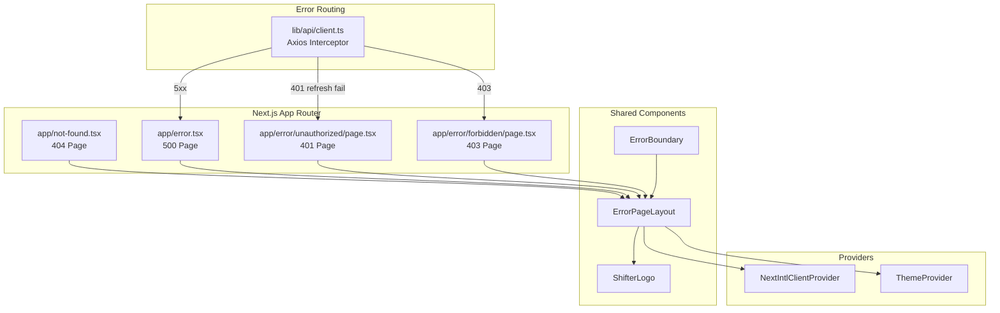

# Design Document: Custom Error Pages

## Overview

This design introduces a set of branded, user-friendly error pages (401, 403, 404, 500) and an enhanced client-side ErrorBoundary for the Shifter scheduling application. All error states share a consistent visual layout component, support i18n (en, he, ru with RTL), dark mode, responsive design, and WCAG 2.1 AA compliance. The axios interceptor is updated to centralize error routing logic, preventing duplicate redirects and ensuring proper promise rejection.

### Key Design Decisions

1. **Shared layout component** — A single `ErrorPageLayout` component encapsulates the logo, heading, message, and action slots used by all error pages. This ensures visual consistency and reduces duplication.
2. **Next.js App Router conventions** — We use `not-found.tsx` for 404 and `error.tsx` for 500 (server-side runtime errors). The 401 and 403 pages are route-based (`/error/unauthorized`, `/error/forbidden`) since they are triggered by client-side navigation from the axios interceptor.
3. **Interceptor redirect guard** — A module-level flag prevents concurrent API failures from triggering multiple redirects.
4. **ErrorBoundary enhancement** — The existing class component is upgraded with i18n support, branded layout, dev/prod mode differentiation, and console logging of component stacks.

## Architecture



### File Structure

```
apps/web/
├── app/
│   ├── not-found.tsx              # 404 page (Next.js convention)
│   ├── error.tsx                  # 500 page (Next.js convention, client component)
│   └── error/
│       ├── unauthorized/
│       │   └── page.tsx           # 401 page
│       └── forbidden/
│           └── page.tsx           # 403 page
├── components/
│   ├── ErrorBoundary.tsx          # Enhanced (replaces existing)
│   └── errors/
│       └── ErrorPageLayout.tsx    # Shared layout component
├── lib/
│   └── api/
│       └── client.ts             # Updated axios interceptor
└── messages/
    ├── en.json                    # + "errorPages" namespace
    ├── he.json                    # + "errorPages" namespace
    └── ru.json                    # + "errorPages" namespace
```

## Components and Interfaces

### ErrorPageLayout

The shared layout component used by all error pages and the ErrorBoundary fallback.

```typescript
interface ErrorPageLayoutProps {
  /** The error heading text (already translated) */
  heading: string;
  /** The descriptive message (already translated) */
  message: string;
  /** HTTP status code displayed as a large numeral, or null for client errors */
  statusCode?: number | null;
  /** Action buttons/links rendered below the message */
  children: React.ReactNode;
}
```

**Rendering behavior:**
- Centers content vertically and horizontally in the viewport (`min-h-screen`)
- Displays `<ShifterLogo size={40} />` centered above the heading
- Renders the status code (if provided) as a large, muted numeral
- Renders heading as `<h1>` with appropriate text sizing
- Renders message as `<p>` with muted text color
- Renders children (action buttons/links) below the message with gap spacing
- Applies `dark:` Tailwind variants for all colors
- Uses `text-gray-900 dark:text-gray-100` for headings, `text-gray-600 dark:text-gray-400` for messages
- Background: `bg-white dark:bg-slate-900`
- All interactive elements have `min-h-[44px] min-w-[44px]` for touch targets
- Focus-visible outlines on all interactive elements for keyboard navigation

### Error Pages

#### 401 Unauthorized Page (`app/error/unauthorized/page.tsx`)

- Client component (`"use client"`)
- On mount: clears `access_token` and `refresh_token` from localStorage
- Uses `useTranslations("errorPages")` for all text
- Renders `ErrorPageLayout` with session-expired messaging
- Primary action: Link to `/login` styled as a button (44×44px minimum)

#### 403 Forbidden Page (`app/error/forbidden/page.tsx`)

- Client component (`"use client"`)
- Reads `?from=` query parameter for "go back" functionality
- Uses `useTranslations("errorPages")` for all text
- Renders `ErrorPageLayout` with forbidden messaging
- Actions: "Go Home" link to `/` and "Go Back" button using `router.back()` or navigating to `from` path
- Never exposes internal permission details

#### 404 Not Found Page (`app/not-found.tsx`)

- Can be a server component (no client-side logic needed beyond i18n)
- Uses `useTranslations("errorPages")` for text (client component for i18n hook)
- Renders `ErrorPageLayout` with page-not-found messaging
- Action: "Go Home" link to `/`

#### 500 Error Page (`app/error.tsx`)

- Client component (Next.js requirement for `error.tsx`)
- Receives `error` and `reset` props from Next.js
- Uses `useTranslations("errorPages")` for text
- Renders `ErrorPageLayout` with server-error messaging
- Actions: "Try Again" button calling `reset()` or `window.location.reload()`, and "Go Home" link
- Never displays stack traces or error internals

### Enhanced ErrorBoundary (`components/ErrorBoundary.tsx`)

```typescript
interface ErrorBoundaryProps {
  children: React.ReactNode;
}

interface ErrorBoundaryState {
  hasError: boolean;
  error: Error | null;
}
```

**Behavior:**
- `componentDidCatch(error, errorInfo)`: logs `error` and `errorInfo.componentStack` to `console.error`
- Fallback UI uses `ErrorPageLayout` with generic "something went wrong" messaging
- In development (`process.env.NODE_ENV === "development"`): shows `error.message` in the fallback
- In production: hides all error details
- Actions: "Reload" button (`window.location.reload()`) and "Go Home" link (`/`)
- Since ErrorBoundary is a class component and cannot use hooks, translated strings are passed via a wrapper or the component reads from a context/prop

**i18n strategy for ErrorBoundary:**
The ErrorBoundary is a class component that cannot use the `useTranslations` hook. Two approaches:
1. Wrap the fallback rendering in a functional component (`ErrorFallback`) that uses hooks
2. Accept translated strings as props

We choose option 1: the class component's `render()` method delegates to a `<ErrorFallback />` functional component when `hasError` is true, which can use `useTranslations`.

### Updated Axios Interceptor (`lib/api/client.ts`)

```typescript
// Module-level redirect guard
let isRedirecting = false;

function redirectToErrorPage(path: string): void {
  if (isRedirecting) return;
  isRedirecting = true;
  const from = encodeURIComponent(window.location.pathname);
  window.location.href = `${path}?from=${from}`;
}
```

**Error handling order (critical):**
1. **401**: Attempt token refresh. On refresh failure → redirect to `/error/unauthorized`
2. **403**: Redirect to `/error/forbidden`
3. **500, 502, 503, 504**: Redirect to `/error/server-error` (handled by `error.tsx` or a dedicated route)
4. **404**: No redirect — reject promise with original error for page-level handling

**Promise rejection:** After triggering a redirect, the interceptor still rejects the promise with the original error so calling code doesn't hang.

**Concurrent redirect prevention:** The `isRedirecting` flag is set before navigation and prevents subsequent error responses from triggering additional redirects.

## Data Models

### i18n Message Namespace

New `errorPages` namespace added to all locale files:

```json
{
  "errorPages": {
    "notFound": {
      "heading": "Page Not Found",
      "message": "The page you're looking for doesn't exist or has been moved.",
      "goHome": "Go Home"
    },
    "unauthorized": {
      "heading": "Session Expired",
      "message": "Your session has expired. Please log in again to continue.",
      "login": "Log In"
    },
    "forbidden": {
      "heading": "Access Denied",
      "message": "You don't have permission to access this resource.",
      "goHome": "Go Home",
      "goBack": "Go Back"
    },
    "serverError": {
      "heading": "Something Went Wrong",
      "message": "An unexpected error occurred on the server. Please try again.",
      "tryAgain": "Try Again",
      "goHome": "Go Home"
    },
    "clientError": {
      "heading": "Something Went Wrong",
      "message": "An unexpected error occurred. Please reload the page.",
      "reload": "Reload Page",
      "goHome": "Go Home"
    }
  }
}
```

### Query Parameter Contract

| Parameter | Used By | Purpose |
|-----------|---------|---------|
| `from` | 403, 401 pages | Stores the originating pathname for "go back" navigation |

### localStorage Keys Affected

| Key | Action on 401 page |
|-----|-------------------|
| `access_token` | Removed |
| `refresh_token` | Removed |

## Correctness Properties

*A property is a characteristic or behavior that should hold true across all valid executions of a system — essentially, a formal statement about what the system should do. Properties serve as the bridge between human-readable specifications and machine-verifiable correctness guarantees.*

### Property 1: No internal details leakage in production error UIs

*For any* error object containing a random message string, stack trace, permission name, role identifier, or API response body, when rendered by any error page component (401, 403, 404, 500) or the ErrorBoundary in production mode, the rendered HTML output SHALL NOT contain any of those internal detail strings.

**Validates: Requirements 3.4, 4.5, 5.5**

### Property 2: Redirect "from" parameter preserves current pathname

*For any* valid URL pathname string (containing path segments, possibly with special characters that require encoding), when the axios interceptor triggers a redirect due to a 403 or 5xx response, the resulting redirect URL SHALL contain a `from` query parameter whose decoded value equals the original `window.location.pathname`.

**Validates: Requirements 7.4**

### Property 3: Concurrent error redirect idempotence

*For any* number N (where N ≥ 2) of concurrent API responses with redirect-triggering status codes (403, 500, 502, 503, 504), the axios interceptor SHALL trigger exactly one redirect call, regardless of the order or timing of the responses.

**Validates: Requirements 7.5**

## Error Handling

### Axios Interceptor Error Flow

| Status Code | Action | Promise |
|-------------|--------|---------|
| 401 | Attempt refresh → on failure redirect to `/error/unauthorized` | Rejected with original error |
| 403 | Redirect to `/error/forbidden?from={path}` | Rejected with original error |
| 404 | No redirect | Rejected with original error (including status + body) |
| 500, 502, 503, 504 | Redirect to `/error/server-error?from={path}` | Rejected with original error |

### Redirect Guard

A module-level `isRedirecting` boolean prevents race conditions when multiple API calls fail simultaneously. Once set to `true`, all subsequent redirect attempts are no-ops. The flag is never reset (page navigation clears it naturally).

### ErrorBoundary Recovery

- The ErrorBoundary provides a "Reload" button that performs `window.location.reload()` — a full navigation that resets all React state
- The "Go Home" link navigates to `/`, which also resets the error boundary state via full navigation
- No `reset()` method is exposed since class component error boundaries don't support the reset pattern used by `error.tsx`

### Graceful Degradation

- If `next-intl` fails to provide translations (e.g., messages not loaded), the error pages should still render with hardcoded English fallback text rather than crashing
- The 500 error page (`error.tsx`) must be a client component that does not depend on server-fetched data, ensuring it renders even when the server pipeline fails completely
- The ErrorBoundary sits inside `NextIntlClientProvider` in the component tree, so translations should be available in the fallback UI

## Testing Strategy

### Unit Tests (Example-Based)

Unit tests cover specific rendering scenarios and interactions:

| Test | Validates |
|------|-----------|
| 404 page renders with ShifterLogo, h1, and home link | 1.1, 1.2, 1.3 |
| 404 page renders in each locale (en, he, ru) without raw keys | 1.4 |
| 404 page has dir="rtl" when locale is Hebrew | 1.5 |
| 401 page clears localStorage tokens on mount | 2.4, 2.5 |
| 401 page shows session-expired message and login link | 2.2, 2.3 |
| 403 page shows forbidden message with home and back links | 3.1, 3.2, 3.3 |
| 500 page shows error message with reload and home actions | 4.1, 4.2, 4.3, 4.4 |
| 500 page renders without server data | 4.6 |
| ErrorBoundary catches errors and renders fallback | 5.1 |
| ErrorBoundary logs error and componentStack to console | 5.4 |
| ErrorBoundary shows error message in dev mode | 5.6 |
| Interceptor redirects on 403 and rejects promise | 7.1 |
| Interceptor redirects on 500/502/503/504 and rejects promise | 7.2 |
| Interceptor does NOT redirect on 404 | 7.3 |
| Interceptor evaluates 401 before 403 before 5xx | 7.6 |

### Property-Based Tests

Property-based tests verify universal properties across generated inputs. Using `fast-check` as the PBT library for TypeScript/JavaScript.

| Property Test | Iterations | Validates |
|---------------|-----------|-----------|
| No internal details leakage | 100+ | 3.4, 4.5, 5.5 |
| Redirect "from" parameter correctness | 100+ | 7.4 |
| Concurrent redirect idempotence | 100+ | 7.5 |

Each property test is tagged with:
```
// Feature: custom-error-pages, Property {N}: {property_text}
```

**PBT Library:** `fast-check` (already standard for TypeScript projects)
**Minimum iterations:** 100 per property
**Test runner:** Vitest (matching existing project setup or Jest if that's what's configured)

### Accessibility Testing

- Run `axe-core` checks on all error page renders (validates 3.5, 6.5)
- Verify keyboard navigation through all interactive elements
- Verify focus management when error pages mount

### Integration Tests

- Full flow: API returns 403 → interceptor redirects → 403 page renders
- Full flow: Token refresh fails → interceptor redirects → 401 page renders with tokens cleared
- Visual regression: error pages at 320px, 768px, 1920px viewport widths (validates 6.4)

