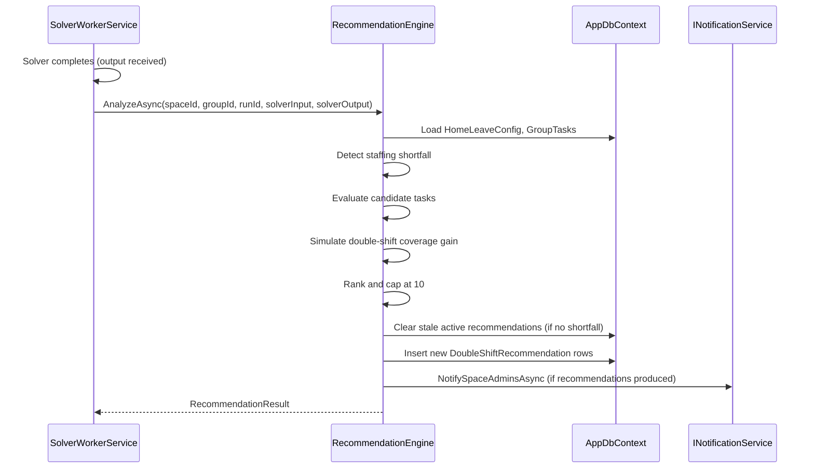

# Design Document: Double-Shift Recommendation

## Overview

This feature adds a post-solve recommendation engine that detects staffing shortfalls and suggests enabling `AllowsDoubleShift` on specific tasks to improve coverage. The engine runs as a hook in the `SolverWorkerService` after each solver run completes, analyzes uncovered slots, and produces ranked recommendations stored as a new domain entity with a lifecycle (Active → Dismissed/Resolved/Cleared).

Recommendations surface to admins via:
- In-app notifications (existing `INotificationService`)
- Inline banner on the solver results / draft schedule page
- Inline suggestion next to task double-shift toggles in group task settings

The design prioritizes:
- **Zero solver changes** — the recommendation engine operates purely on solver output + task metadata
- **Minimal coupling** — a single interface (`IRecommendationEngine`) injected into the worker
- **Tenant isolation** — all data scoped by `SpaceId` with RLS protection
- **Idempotency** — re-running the engine for the same solver run produces the same recommendations

## Architecture



The engine integrates at the end of `ProcessNextJobAsync` in `SolverWorkerService`, after the run is marked completed and before the existing notification dispatch. This ensures:
1. The solver output and version are already persisted
2. The engine can reference the `ScheduleRunId` and `ScheduleVersionId`
3. Failures in the engine don't affect the core solver flow (wrapped in try/catch)

## Components and Interfaces

### Domain Layer

**New Entity: `DoubleShiftRecommendation`** (`Domain/Scheduling/DoubleShiftRecommendation.cs`)

```csharp
public enum RecommendationStatus { Active, Dismissed, Resolved, Cleared }

public class DoubleShiftRecommendation : Entity, ITenantScoped
{
    public Guid SpaceId { get; private set; }
    public Guid GroupId { get; private set; }
    public Guid ScheduleRunId { get; private set; }
    public Guid GroupTaskId { get; private set; }
    public string TaskName { get; private set; }
    public RecommendationStatus Status { get; private set; }
    public int AdditionalSlotsCovered { get; private set; }
    public DateTime AffectedDateStart { get; private set; }
    public DateTime AffectedDateEnd { get; private set; }
    public int TotalUncoveredSlotsInRun { get; private set; }
    public DateTime? DismissedAt { get; private set; }
    public Guid? DismissedByUserId { get; private set; }
    public DateTime? ResolvedAt { get; private set; }
    public DateTime? ClearedAt { get; private set; }
}
```

### Application Layer

**Interface: `IRecommendationEngine`** (`Application/Scheduling/IRecommendationEngine.cs`)

```csharp
public interface IRecommendationEngine
{
    Task<RecommendationResult> AnalyzeAsync(
        Guid spaceId, Guid groupId, Guid runId,
        SolverInputDto input, SolverOutputDto output,
        CancellationToken ct = default);
}

public record RecommendationResult(
    bool HasShortfall,
    List<RecommendationItem> Recommendations);

public record RecommendationItem(
    Guid GroupTaskId,
    string TaskName,
    int AdditionalSlotsCovered,
    DateTime AffectedDateStart,
    DateTime AffectedDateEnd);
```

**Commands:**
- `DismissRecommendationCommand(Guid SpaceId, Guid RecommendationId, Guid UserId)` → marks as Dismissed
- `AcceptRecommendationCommand(Guid SpaceId, Guid RecommendationId, Guid UserId, bool TriggerNewRun)` → enables double shift on task, marks as Resolved, optionally enqueues new solver run

**Queries:**
- `GetActiveRecommendationsQuery(Guid SpaceId, Guid GroupId, Guid UserId)` → returns active recommendations filtered by permission and emergency freeze
- `GetRecommendationsForRunQuery(Guid SpaceId, Guid RunId, Guid UserId)` → returns recommendations for a specific solver run (for the banner)
- `GetRecommendationForTaskQuery(Guid SpaceId, Guid GroupTaskId, Guid UserId)` → returns active recommendation for a specific task (for inline suggestion)

### Infrastructure Layer

**Implementation: `RecommendationEngine`** (`Infrastructure/Scheduling/RecommendationEngine.cs`)

The engine implements `IRecommendationEngine` and contains the core analysis logic:

1. **Shortfall Detection**: Calculates available personnel per day = total group members − people on home leave (from solver output's `HomeLeaveAssignments`). Flags days where available < `MinPeopleAtBase`.

2. **Candidate Filtering**: Selects active `GroupTask` entities where `AllowsDoubleShift == false`. Skips if fewer than 2 candidates exist.

3. **Coverage Simulation**: For each candidate task, counts its uncovered slots from `SolverOutputDto.UncoveredSlotIds`. Simulates how many could be filled by allowing one person to serve consecutive shifts — effectively, for each pair of adjacent uncovered slots on the same task, one additional slot could be covered per available person.

4. **Ranking**: Sorts by `AdditionalSlotsCovered` DESC, then `TaskName` ASC. Caps at 10.

5. **Persistence**: Inserts `DoubleShiftRecommendation` rows with status `Active`.

6. **Lifecycle Management**: If no shortfall detected, transitions all existing `Active` recommendations for the group to `Cleared`.

### API Layer

**New Controller: `RecommendationsController`** (`Api/Controllers/RecommendationsController.cs`)

```
GET  /spaces/{spaceId}/groups/{groupId}/recommendations          → list active
GET  /spaces/{spaceId}/runs/{runId}/recommendations              → list for run (banner)
GET  /spaces/{spaceId}/tasks/{taskId}/recommendation             → get for task (inline)
POST /spaces/{spaceId}/recommendations/{id}/dismiss              → dismiss
POST /spaces/{spaceId}/recommendations/{id}/accept               → accept (enable double shift)
```

All endpoints require `[Authorize]`. Permission checks enforce `ViewAndEdit` or `Owner` on the group.

### Frontend Components

1. **`RecommendationBanner`** — displayed in `DraftScheduleModal` and `ScheduleTab` when recommendations exist for the current run. Shows total uncovered slots, up to 5 task names, affected date range, and a CTA button to navigate to task settings.

2. **`TaskDoubleShiftSuggestion`** — inline chip/badge next to the `AllowsDoubleShift` toggle in group task settings. Shows "Enabling could cover N additional slots (date range)" with accept/dismiss actions.

3. **API hooks** — `useRecommendations(groupId)`, `useRecommendationForTask(taskId)`, `useDismissRecommendation()`, `useAcceptRecommendation()`.

## Data Models

### Database Table: `double_shift_recommendations`

| Column | Type | Constraints |
|--------|------|-------------|
| id | uuid | PK, default gen_random_uuid() |
| space_id | uuid | NOT NULL, FK → spaces, RLS |
| group_id | uuid | NOT NULL, FK → groups |
| schedule_run_id | uuid | NOT NULL, FK → schedule_runs |
| group_task_id | uuid | NOT NULL, FK → group_tasks |
| task_name | varchar(200) | NOT NULL |
| status | varchar(20) | NOT NULL, default 'active' |
| additional_slots_covered | int | NOT NULL |
| affected_date_start | timestamptz | NOT NULL |
| affected_date_end | timestamptz | NOT NULL |
| total_uncovered_slots_in_run | int | NOT NULL |
| dismissed_at | timestamptz | NULL |
| dismissed_by_user_id | uuid | NULL |
| resolved_at | timestamptz | NULL |
| cleared_at | timestamptz | NULL |
| created_at | timestamptz | NOT NULL, default now() |

**Indexes:**
- `ix_dsr_space_group_status` on (space_id, group_id, status) — for active recommendation queries
- `ix_dsr_space_run` on (space_id, schedule_run_id) — for run-specific queries
- `ix_dsr_space_task_status` on (space_id, group_task_id, status) — for task-specific inline suggestions
- `ix_dsr_created_at` on (created_at) — for 90-day retention cleanup

**RLS Policy:**
```sql
CREATE POLICY dsr_tenant_isolation ON double_shift_recommendations
    USING (space_id = current_setting('app.current_space_id')::uuid);
```

### EF Core Configuration

```csharp
builder.ToTable("double_shift_recommendations");
builder.HasKey(e => e.Id);
builder.Property(e => e.Status).HasConversion<string>().HasMaxLength(20);
builder.HasIndex(e => new { e.SpaceId, e.GroupId, e.Status }).HasDatabaseName("ix_dsr_space_group_status");
builder.HasIndex(e => new { e.SpaceId, e.ScheduleRunId }).HasDatabaseName("ix_dsr_space_run");
builder.HasIndex(e => new { e.SpaceId, e.GroupTaskId, e.Status }).HasDatabaseName("ix_dsr_space_task_status");
```

## Correctness Properties

*A property is a characteristic or behavior that should hold true across all valid executions of a system — essentially, a formal statement about what the system should do. Properties serve as the bridge between human-readable specifications and machine-verifiable correctness guarantees.*

### Property 1: Staffing shortfall detection accuracy

*For any* group with N total members and a set of home leave assignments removing K people on a given day, the engine SHALL flag that day as having a staffing shortfall if and only if (N − K) < MinPeopleAtBase.

**Validates: Requirements 1.2**

### Property 2: Engine only evaluates eligible tasks

*For any* set of group tasks, the recommendation engine SHALL never produce a recommendation for a task where `AllowsDoubleShift` is already true OR where `IsActive` is false.

**Validates: Requirements 1.3, 6.2**

### Property 3: Engine soundness — every recommendation reduces uncovered slots

*For any* solver output with uncovered slots and any set of candidate tasks, every task appearing in the recommendation list SHALL have an `AdditionalSlotsCovered` value of at least 1 (no false positives).

**Validates: Requirements 1.1, 2.1**

### Property 4: Simulation accuracy — additional slots calculation

*For any* candidate task with uncovered slots, the engine's calculated `AdditionalSlotsCovered` SHALL equal the number of consecutive uncovered slot pairs on that task where a single person could serve both shifts (i.e., adjacent time slots with no gap exceeding the shift duration).

**Validates: Requirements 1.4**

### Property 5: Ranking correctness

*For any* recommendation list with more than one item, the list SHALL be sorted in descending order by `AdditionalSlotsCovered`, with alphabetical ascending order by `TaskName` as tiebreaker for equal values.

**Validates: Requirements 2.2**

### Property 6: Recommendation structure completeness

*For any* recommendation produced by the engine, it SHALL contain a non-empty `TaskName`, a positive `AdditionalSlotsCovered` (≥ 1), and a valid date range where `AffectedDateStart` ≤ `AffectedDateEnd`.

**Validates: Requirements 2.3**

### Property 7: Maximum 10 recommendations cap

*For any* solver output and task configuration, the recommendation list SHALL contain at most 10 items, and when more than 10 tasks are eligible, the list SHALL contain exactly the top 10 by ranking.

**Validates: Requirements 2.5**

### Property 8: Active status filter correctness

*For any* set of recommendations with mixed statuses, querying for "active" recommendations SHALL return only those with status `Active` — never those with status `Dismissed`, `Resolved`, or `Cleared`.

**Validates: Requirements 4.4, 5.5**

### Property 9: Cleared on successful run

*For any* group with active recommendations, when a new solver run completes without a staffing shortfall, all previously-active recommendations for that group SHALL transition to status `Cleared`, and recommendations with other statuses SHALL remain unchanged.

**Validates: Requirements 5.1**

### Property 10: Auto-resolved on manual enable

*For any* task with one or more active recommendations, when `AllowsDoubleShift` is set to true on that task, all active recommendations referencing that task SHALL transition to status `Resolved`, and active recommendations for other tasks SHALL remain unchanged.

**Validates: Requirements 5.2**

### Property 11: Fresh generation ignores prior dismissals

*For any* set of previously dismissed recommendations, when a new solver run produces a staffing shortfall, the engine SHALL evaluate all eligible tasks regardless of prior dismissals — a task that was previously dismissed SHALL still appear in new recommendations if it meets the criteria.

**Validates: Requirements 5.4**

### Property 12: Permission-based visibility

*For any* user querying recommendations, the system SHALL return results only if the user's group role has `PermissionLevel` of `ViewAndEdit` or `Owner`. Users with `View` permission or no role SHALL receive an empty result set.

**Validates: Requirements 6.1, 6.5**

### Property 13: Emergency freeze suppression

*For any* group where `EmergencyFreezeActive` is true on the `HomeLeaveConfig`, the engine SHALL not generate new recommendations AND queries for active recommendations SHALL return an empty result set.

**Validates: Requirements 6.3**

### Property 14: Minimum eligible tasks precondition

*For any* group with fewer than 2 active tasks where `AllowsDoubleShift` is false, the engine SHALL produce an empty recommendation list regardless of staffing shortfall conditions.

**Validates: Requirements 6.4**

## Error Handling

| Scenario | Handling |
|----------|----------|
| Recommendation engine throws during analysis | Caught in SolverWorkerService, logged as warning, solver run result unaffected |
| Task deleted between recommendation creation and accept | AcceptRecommendationCommand returns 404, recommendation marked as Cleared |
| Race condition: task already has AllowsDoubleShift=true when accepting | Return informational message, mark recommendation as Resolved (Req 4.5) |
| No admins in group when generating notifications | Skip notification silently (Req 3.4) |
| Database constraint violation on duplicate recommendation | Use upsert pattern (space_id + schedule_run_id + group_task_id unique) |
| Permission denied on dismiss/accept | Return 403 via IPermissionService.RequirePermissionAsync |
| Emergency freeze activated while recommendations are active | Recommendations remain in DB but are filtered out at query time |

All exceptions from the recommendation engine are caught at the integration point in `SolverWorkerService` to ensure the core solver flow is never disrupted. The engine is a best-effort enhancement.

## Testing Strategy

### Property-Based Tests (using FsCheck for C#)

Each correctness property maps to a property-based test with minimum 100 iterations. The recommendation engine's core logic (shortfall detection, candidate evaluation, simulation, ranking) is pure enough to test with generated inputs.

**Test structure:**
- Generate random `SolverOutputDto` with varying uncovered slot patterns
- Generate random `GroupTask` collections with mixed `AllowsDoubleShift`/`IsActive` states
- Generate random `HomeLeaveAssignment` sets and `MinPeopleAtBase` thresholds
- Feed into the engine's analysis methods and verify properties hold

**Tag format:** `Feature: double-shift-recommendation, Property {N}: {description}`

**Configuration:** 100+ iterations per property test.

### Unit Tests (example-based)

- Accept recommendation when task already has double shift enabled → informational response
- Dismiss recommendation → status changes to Dismissed
- Banner data shape with 3 recommendations, 7 recommendations (truncation to 5)
- Notification creation with valid admins
- Notification skipped when no admins exist
- Engine produces empty list when no shortfall exists
- Engine produces empty list when all tasks already have double shift

### Integration Tests

- Full post-solve flow: trigger solver → solver returns uncovered slots → recommendations created → notification sent
- Accept recommendation → task updated → optional new solver run enqueued
- Permission check: View-only user cannot see recommendations
- Emergency freeze: recommendations suppressed in query results
- Lifecycle: new successful run clears active recommendations

### Frontend Tests

- `RecommendationBanner` renders correctly with mock data
- `TaskDoubleShiftSuggestion` shows/hides based on recommendation presence
- Accept flow triggers API call and shows confirmation dialog
- Dismiss flow triggers API call and removes suggestion from UI
