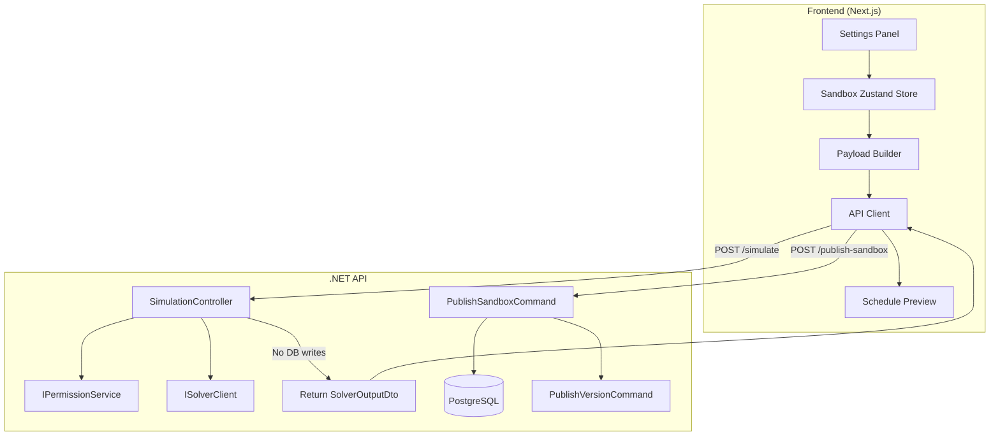
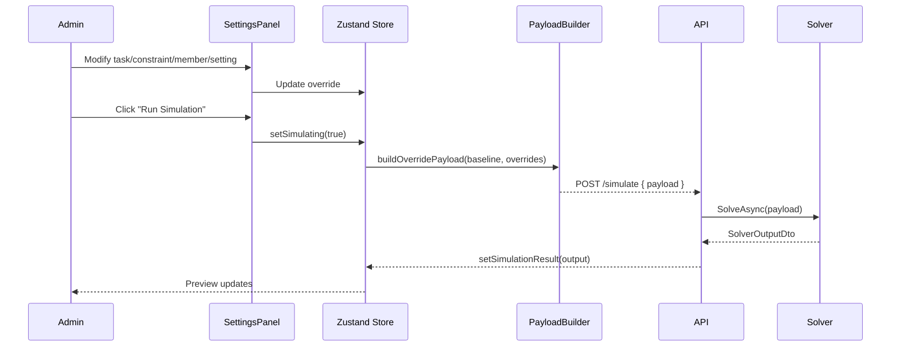
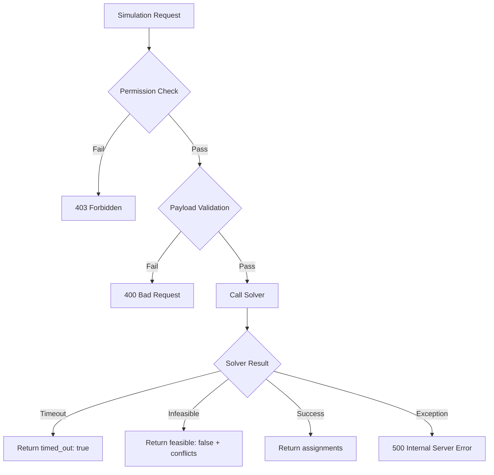

# Design Document: Draft Simulation Sandbox

## Overview

The Draft Simulation Sandbox adds a "what-if" experimentation layer to Shifter's scheduling system. After a draft schedule exists, admins can enter a sandbox mode where they temporarily override scheduling parameters (tasks, constraints, members, settings) in frontend memory and re-run the solver to preview different results — all without persisting anything to the database.

The architecture follows a **thin backend, thick frontend** pattern:
- **Frontend**: Owns all sandbox state in a Zustand store. Constructs the full `SolverInputDto` override payload by merging the original solver input with user modifications.
- **Backend**: Exposes a single stateless simulation endpoint that accepts a pre-built `SolverInputDto`, forwards it to the solver, and returns the result without creating any database records.

This design keeps the backend simple and stateless while giving the frontend full control over the sandbox experience. The existing `PublishVersionCommand` and `DiscardVersionCommand` are reused for the publish/discard flows, with a new `PublishSandboxCommand` wrapping the additional persistence of sandbox overrides.

## Architecture



### Key Design Decisions

1. **Frontend-owned state**: All sandbox modifications live in a Zustand store. This avoids backend session management, keeps the simulation endpoint stateless, and naturally discards state on tab close/navigation.

2. **Full payload construction on frontend**: The frontend fetches the group's current solver input (via a new read-only endpoint) and merges overrides locally. This means the simulation endpoint receives a complete `SolverInputDto` and simply forwards it to the solver — no partial-override merging logic on the backend.

3. **Synchronous solver call for simulation**: Unlike production runs (which go through the job queue), simulation runs call the solver synchronously from the controller. This is acceptable because:
   - Simulation is admin-only (low concurrency)
   - The solver has a built-in timeout (returns partial/infeasible)
   - Immediate feedback is critical for the sandbox UX

4. **Separate publish command**: A new `PublishSandboxCommand` persists all sandbox overrides (tasks, constraints, member exclusions, settings) in a single transaction before delegating to the existing `PublishVersionCommand`.

5. **Reactive UI via split rendering**: The settings panel and schedule preview are separate React components with independent state subscriptions. Only the preview subscribes to simulation results, preventing settings panel re-renders.

## Components and Interfaces

### Backend Components

#### 1. SimulationController

```
POST /spaces/{spaceId}/groups/{groupId}/simulate
```

- Accepts a `SimulateRequest` containing a full `SolverInputDto`
- Verifies group owner / space owner permissions
- Calls `ISolverClient.SolveAsync` directly (synchronous, no job queue)
- Returns `SolverOutputDto` in the response body
- Creates NO database records

```csharp
public record SimulateRequest(SolverInputDto Payload);
```

#### 2. GetSolverBaselineQuery

```
GET /spaces/{spaceId}/groups/{groupId}/solver-baseline
```

- Returns the current `SolverInputDto` that would be sent to the solver for this group
- Uses `ISolverPayloadNormalizer.BuildAsync` to construct the payload
- Frontend uses this as the starting point for sandbox state initialization
- Requires group owner / space owner permissions

#### 3. PublishSandboxCommand

```
POST /spaces/{spaceId}/groups/{groupId}/publish-sandbox
```

- Accepts a `PublishSandboxRequest` containing:
  - `VersionId` — the draft version to publish
  - `TaskOverrides` — new/modified/removed tasks
  - `ConstraintOverrides` — new/modified/removed constraints
  - `MemberExclusions` — list of excluded person IDs
  - `SettingsOverrides` — modified rest hours, home-leave params, min people at base
- Persists all overrides in a single transaction
- Delegates to `PublishVersionCommand` for the actual publish
- Produces an audit log entry with before/after snapshot

### Frontend Components

#### 4. Sandbox Zustand Store (`useSandboxStore`)

```typescript
interface SandboxState {
  // Session state
  isActive: boolean;
  groupId: string | null;
  draftVersionId: string | null;
  
  // Baseline (original solver input fetched from backend)
  baseline: SolverInputDto | null;
  
  // Overrides (user modifications)
  taskOverrides: TaskOverrideMap;       // Map<slotId, TaskOverride>
  constraintOverrides: ConstraintOverrideMap;
  memberExclusions: Set<string>;        // personIds excluded
  settingsOverrides: SettingsOverrides;
  
  // Simulation results
  lastSimulationResult: SolverOutputDto | null;
  isSimulating: boolean;
  simulationError: string | null;
  
  // Actions
  enterSandbox: (groupId: string, draftVersionId: string, baseline: SolverInputDto) => void;
  exitSandbox: () => void;
  
  addTask: (task: TaskSlotDto) => void;
  editTask: (slotId: string, changes: Partial<TaskSlotDto>) => void;
  removeTask: (slotId: string) => void;
  
  addConstraint: (constraint: HardConstraintDto | SoftConstraintDto) => void;
  editConstraint: (id: string, changes: Partial<ConstraintDto>) => void;
  removeConstraint: (id: string) => void;
  
  toggleMember: (personId: string) => void;
  
  updateSettings: (settings: Partial<SettingsOverrides>) => void;
  
  buildOverridePayload: () => SolverInputDto;
  
  setSimulationResult: (result: SolverOutputDto | null) => void;
  setSimulating: (v: boolean) => void;
  setSimulationError: (err: string | null) => void;
}
```

#### 5. SimulationSandboxPage

Top-level page/modal component that renders:
- `SandboxSettingsPanel` (left/top) — task, constraint, member, and settings editors
- `SandboxSchedulePreview` (right/bottom) — displays simulation results

Uses React's component boundaries to isolate re-renders.

#### 6. SandboxSettingsPanel

Renders tabs for:
- **Tasks** — add/edit/remove with visual diff indicators
- **Constraints** — add/edit/remove with type selector
- **Members** — toggle list with active count
- **Settings** — rest hours, home-leave params, min people at base

Each tab reads from and writes to the Zustand store. Does NOT subscribe to `lastSimulationResult`.

#### 7. SandboxSchedulePreview

Subscribes to `lastSimulationResult` from the store. Renders:
- Assignment table (reuses `ScheduleTaskTable`)
- Home-leave preview section (when enabled)
- Loading indicator during simulation
- Error messages on failure

#### 8. Payload Builder (pure function)

```typescript
function buildOverridePayload(baseline: SolverInputDto, overrides: SandboxOverrides): SolverInputDto
```

Merges the baseline `SolverInputDto` with all sandbox overrides:
- Applies task additions, modifications, and removals to `TaskSlots`
- Applies constraint additions, modifications, and removals to `HardConstraints` / `SoftConstraints`
- Filters `People` list by removing excluded members
- Applies settings overrides to `HomeLeaveConfig` and injects `min_rest_between_assignments` constraint

This is a **pure function** — no side effects, fully testable.

## Data Models

### Backend DTOs

```csharp
// Request to the simulation endpoint
public record SimulateRequest(SolverInputDto Payload);

// Request to publish sandbox changes
public record PublishSandboxRequest(
    Guid VersionId,
    List<TaskOverrideDto> TaskOverrides,
    List<ConstraintOverrideDto> ConstraintOverrides,
    List<Guid> MemberExclusions,
    SettingsOverrideDto? SettingsOverrides);

public record TaskOverrideDto(
    string Action,           // "add" | "edit" | "remove"
    Guid? ExistingTaskId,    // null for "add"
    string? Name,
    DateTime? StartsAt,
    DateTime? EndsAt,
    int? ShiftDurationMinutes,
    int? RequiredHeadcount,
    string? BurdenLevel,
    List<string>? RequiredQualificationNames);

public record ConstraintOverrideDto(
    string Action,           // "add" | "edit" | "remove"
    Guid? ExistingConstraintId,
    string? RuleType,
    string? Severity,        // "hard" | "soft"
    string? ScopeType,
    Guid? ScopeId,
    Dictionary<string, object>? Payload);

public record SettingsOverrideDto(
    int? MinRestBetweenShiftsHours,
    double? EligibilityThresholdHours,
    double? LeaveDurationHours,
    int? LeaveCapacity,
    int? BalanceValue,
    int? MinPeopleAtBase);
```

### Frontend Types

```typescript
interface TaskOverride {
  action: 'add' | 'edit' | 'remove';
  original?: TaskSlotDto;          // present for edit/remove
  modified?: Partial<TaskSlotDto>; // present for add/edit
}

interface ConstraintOverride {
  action: 'add' | 'edit' | 'remove';
  original?: HardConstraintDto | SoftConstraintDto;
  modified?: Partial<HardConstraintDto | SoftConstraintDto>;
}

interface SettingsOverrides {
  minRestBetweenShiftsHours?: number;  // 0–24
  eligibilityThresholdHours?: number;
  leaveDurationHours?: number;
  leaveCapacity?: number;
  balanceValue?: number;
  minPeopleAtBase?: number;
}

type TaskOverrideMap = Map<string, TaskOverride>;
type ConstraintOverrideMap = Map<string, ConstraintOverride>;
```

### State Flow Diagram



## Correctness Properties

*A property is a characteristic or behavior that should hold true across all valid executions of a system — essentially, a formal statement about what the system should do. Properties serve as the bridge between human-readable specifications and machine-verifiable correctness guarantees.*

### Property 1: Payload builder preserves unmodified fields

*For any* valid baseline `SolverInputDto` and any set of sandbox overrides that do not target a specific field, the `buildOverridePayload` function SHALL produce an output where all non-targeted fields are identical to the baseline.

**Validates: Requirements 6.1, 7.1**

### Property 2: Task removal reduces slot count

*For any* valid baseline `SolverInputDto` with N task slots and any non-empty subset S of slot IDs marked for removal, `buildOverridePayload` SHALL produce an output with exactly N - |S| task slots, and none of the removed slot IDs appear in the output.

**Validates: Requirements 2.3, 2.5**

### Property 3: Task addition increases slot count

*For any* valid baseline `SolverInputDto` with N task slots and any list of K new valid task slots to add, `buildOverridePayload` SHALL produce an output with exactly N + K task slots, and all added slots appear in the output with their specified field values.

**Validates: Requirements 2.1, 2.5**

### Property 4: Member exclusion removes from people list

*For any* valid baseline `SolverInputDto` with P people and any non-empty subset E of person IDs marked for exclusion, `buildOverridePayload` SHALL produce an output with exactly P - |E| people, and none of the excluded person IDs appear in the output's People list.

**Validates: Requirements 4.2, 4.5**

### Property 5: Member re-inclusion restores original data

*For any* valid baseline `SolverInputDto`, if a member is excluded and then re-included, `buildOverridePayload` SHALL produce an output where that member's `PersonEligibilityDto` is identical to their entry in the original baseline.

**Validates: Requirements 4.3**

### Property 6: Settings override round-trip

*For any* valid `SettingsOverrides` with `minRestBetweenShiftsHours` in range [0, 24], `buildOverridePayload` SHALL produce an output where the `min_rest_between_assignments` hard constraint's `min_hours` payload value equals the overridden value.

**Validates: Requirements 5.1, 5.5**

### Property 7: Constraint removal reduces constraint count

*For any* valid baseline `SolverInputDto` with H hard constraints and any non-empty subset R of constraint IDs marked for removal, `buildOverridePayload` SHALL produce an output with exactly H - |R| hard constraints (or S - |R| soft constraints for soft constraint removals), and none of the removed IDs appear in the output.

**Validates: Requirements 3.3, 3.5**

### Property 8: Override payload is a valid SolverInputDto

*For any* valid baseline `SolverInputDto` and any combination of valid sandbox overrides, `buildOverridePayload` SHALL produce an output that passes `SolverInputDto` schema validation (all required fields present, correct types, non-negative headcounts, valid date formats).

**Validates: Requirements 6.1, 6.2**

## Error Handling

| Scenario | Layer | Response |
|----------|-------|----------|
| No draft version exists | Frontend | Hide "Enter Simulation" button |
| User lacks group owner permission | Backend | 403 Forbidden |
| Simulation endpoint receives invalid payload | Backend | 400 Bad Request with validation errors |
| Solver times out | Backend | 200 with `timed_out: true` in response |
| Solver returns infeasible | Backend | 200 with `feasible: false` + `hard_conflicts` |
| Network error during simulation | Frontend | Display localized error, keep settings panel state |
| Browser tab closed during session | Frontend | Sandbox state lost (by design — Zustand non-persisted) |
| Navigation away without publish/discard | Frontend | `beforeunload` warning + in-app confirmation dialog |
| Publish fails (transaction rollback) | Backend | 500 with error; frontend shows error, state preserved |
| Settings value out of range | Frontend | Client-side validation prevents submission |
| Concurrent publish by another admin | Backend | 409 Conflict (version already published/discarded) |

### Error Flow



## Testing Strategy

### Property-Based Tests (Frontend — Vitest + fast-check)

The `buildOverridePayload` pure function is the core logic of the sandbox and is ideal for property-based testing. Each property test runs a minimum of 100 iterations with randomly generated baselines and overrides.

**Library**: `fast-check` (already installed in the project)

**Tag format**: `Feature: draft-simulation-sandbox, Property {N}: {description}`

Properties to implement:
1. Unmodified fields preservation
2. Task removal reduces slot count
3. Task addition increases slot count
4. Member exclusion removes from people list
5. Member re-inclusion restores original data
6. Settings override round-trip
7. Constraint removal reduces constraint count
8. Override payload schema validity

### Unit Tests (Frontend)

- Sandbox store actions (enter, exit, add/edit/remove overrides)
- Settings validation (range checks for rest hours, home-leave params)
- Visual diff indicator logic (which items are added/modified/removed)
- Navigation guard (beforeunload event handling)

### Unit Tests (Backend — xUnit)

- `SimulationController` permission checks (403 for non-owners)
- `PublishSandboxCommand` transaction behavior (all-or-nothing)
- `PublishSandboxCommand` audit log creation
- Payload validation (FluentValidation rules for `SimulateRequest`)
- Settings range validation (0–24 for rest hours)

### Integration Tests (Backend)

- Full simulation flow: build baseline → modify → simulate → verify response
- Publish sandbox flow: simulate → publish → verify DB state
- Discard flow: simulate → discard → verify no DB changes
- Concurrent access: two admins simulating same group (no interference)

### E2E Tests (Playwright)

- Enter sandbox from draft review panel
- Modify a task and run simulation
- Verify preview updates without settings panel re-render
- Publish flow persists changes
- Discard flow clears state
- Navigation warning on unsaved changes
- Access denied for non-admin users
