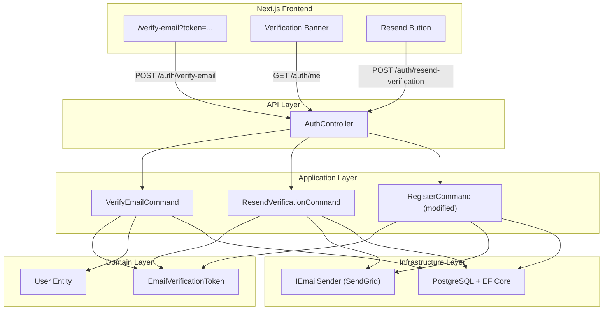
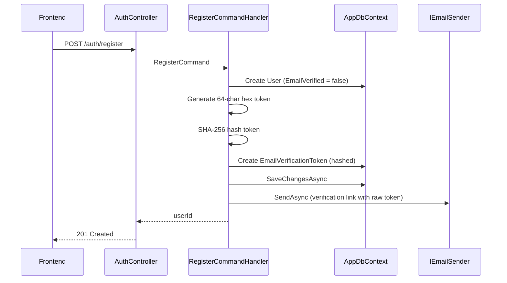
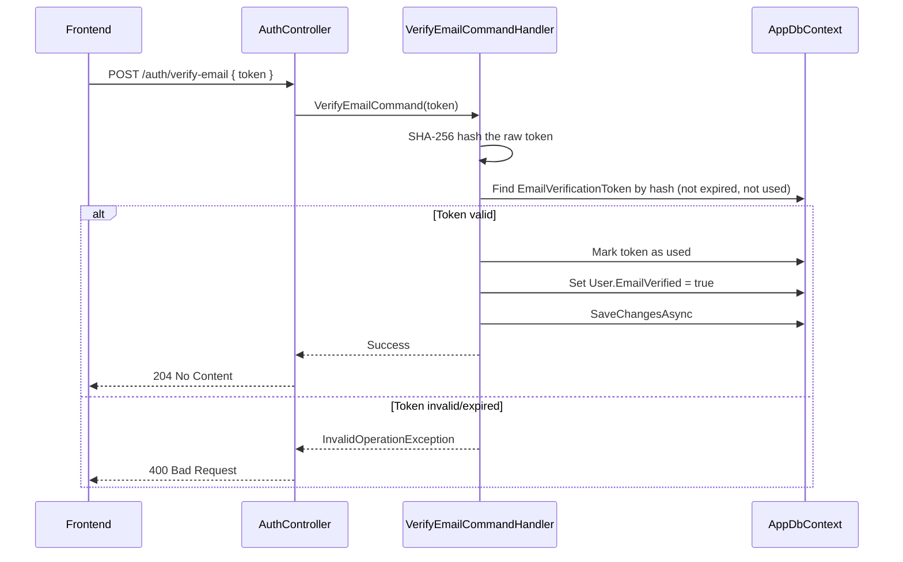
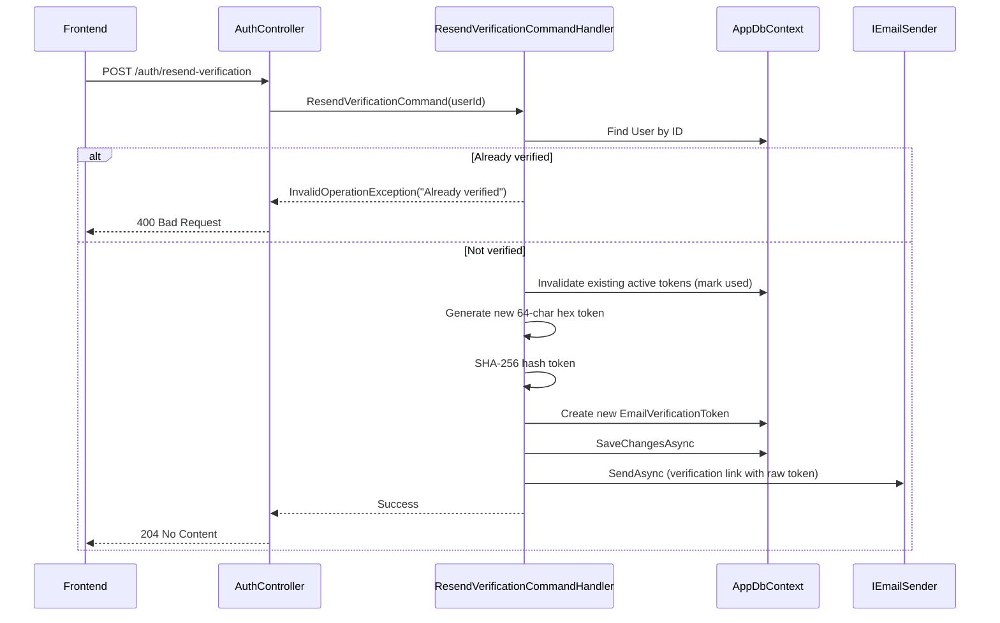

# Design Document: Email Verification

## Overview

Email verification adds a trust-building mechanism to the Shifter scheduling application. After registration, users receive a verification email containing a unique token link. Clicking the link marks their email as verified. This is **non-blocking** — unverified users retain full access to the application, but a subtle banner encourages them to verify.

The design follows the existing `ForgotPassword` / `ResetPassword` pattern: a dedicated domain entity (`EmailVerificationToken`) stores a hashed token with expiry, the Application layer orchestrates generation and validation via MediatR commands, and the frontend provides a token-consuming page at `/verify-email`.

## Architecture



## Sequence Diagrams

### Registration with Verification Email



### Email Verification



### Resend Verification Email



## Components and Interfaces

### Component 1: EmailVerificationToken (Domain Entity)

**Purpose**: Stores hashed verification tokens with expiry, following the same pattern as `PasswordResetToken`.

```csharp
// Jobuler.Domain/Identity/EmailVerificationToken.cs
public class EmailVerificationToken : Entity
{
    public Guid UserId { get; private set; }
    public string TokenHash { get; private set; } = default!;
    public DateTime ExpiresAt { get; private set; }
    public DateTime? UsedAt { get; private set; }

    public bool IsExpired => DateTime.UtcNow > ExpiresAt;
    public bool IsUsed => UsedAt.HasValue;
    public bool IsValid => !IsExpired && !IsUsed;

    private EmailVerificationToken() { }

    public static EmailVerificationToken Create(Guid userId, string tokenHash) =>
        new()
        {
            UserId = userId,
            TokenHash = tokenHash,
            ExpiresAt = DateTime.UtcNow.AddHours(24)
        };

    public void MarkUsed() => UsedAt = DateTime.UtcNow;
}
```

**Responsibilities**:
- Encapsulate token lifecycle (creation, expiry check, usage marking)
- Store only the SHA-256 hash of the token (never the raw value)
- Enforce 24-hour expiry window

### Component 2: User Entity (Modified)

**Purpose**: Add `EmailVerified` flag to the existing User entity.

```csharp
// Added to Jobuler.Domain/Identity/User.cs
public bool EmailVerified { get; private set; } = false;

public void MarkEmailVerified()
{
    EmailVerified = true;
    Touch();
}
```

**Responsibilities**:
- Track verification status
- Provide domain method for marking as verified

### Component 3: VerifyEmailCommand (Application)

**Purpose**: Validates a raw token and marks the user's email as verified.

```csharp
// Jobuler.Application/Auth/Commands/VerifyEmailCommand.cs
public record VerifyEmailCommand(string Token) : IRequest;
```

**Responsibilities**:
- Hash the incoming raw token
- Look up the matching `EmailVerificationToken`
- Validate it's not expired or used
- Mark the token as used and set `User.EmailVerified = true`

### Component 4: ResendVerificationCommand (Application)

**Purpose**: Generates a new verification token and sends a new email. Requires authentication.

```csharp
// Jobuler.Application/Auth/Commands/ResendVerificationCommand.cs
public record ResendVerificationCommand(Guid UserId) : IRequest;
```

**Responsibilities**:
- Verify the user exists and is not already verified
- Invalidate any existing active verification tokens
- Generate a new token and send the verification email

### Component 5: AuthController Endpoints (API)

**Purpose**: Expose verify-email and resend-verification HTTP endpoints.

```csharp
// Added to AuthController
[HttpPost("verify-email")]
[AllowAnonymous]
public async Task<IActionResult> VerifyEmail(
    [FromBody] VerifyEmailRequest req, CancellationToken ct);

[HttpPost("resend-verification")]
[Authorize]
public async Task<IActionResult> ResendVerification(CancellationToken ct);
```

**Responsibilities**:
- `verify-email`: Anonymous endpoint (user clicks link from email, may not be logged in)
- `resend-verification`: Authenticated endpoint (user must be logged in to request resend)

### Component 6: Frontend Verify Email Page

**Purpose**: Token-consuming page that calls the API and shows success/error states.

**Responsibilities**:
- Extract `token` from URL search params
- Call `POST /auth/verify-email` on mount
- Display success, error, or loading states
- Provide "Resend" button on error/expired states

### Component 7: Verification Banner

**Purpose**: Non-blocking banner shown to unverified users on protected pages.

**Responsibilities**:
- Check `emailVerified` field from `/auth/me` response
- Show dismissible banner with "Verify your email" message and resend button
- Does NOT block any functionality

## Data Models

### EmailVerificationToken

```csharp
public class EmailVerificationToken : Entity
{
    public Guid UserId { get; private set; }
    public string TokenHash { get; private set; } = default!;  // SHA-256 of raw token
    public DateTime ExpiresAt { get; private set; }
    public DateTime? UsedAt { get; private set; }
}
```

**Validation Rules**:
- `UserId` must reference an existing User
- `TokenHash` is a 64-character hex string (SHA-256 output)
- `ExpiresAt` is always 24 hours after creation
- `UsedAt` is null until the token is consumed

**Database Table**: `email_verification_tokens`

| Column | Type | Constraints |
|--------|------|-------------|
| id | uuid | PK, default gen |
| user_id | uuid | FK → users(id), NOT NULL |
| token_hash | varchar(128) | NOT NULL, indexed |
| expires_at | timestamptz | NOT NULL |
| used_at | timestamptz | NULL |
| created_at | timestamptz | NOT NULL |

### User Entity (Modified)

| New Column | Type | Constraints |
|------------|------|-------------|
| email_verified | boolean | NOT NULL, default false |

### API Request/Response Models

```csharp
public record VerifyEmailRequest(string Token);

// GET /auth/me response (modified)
// Add: emailVerified: boolean
```

### Frontend API Client

```typescript
// lib/api/auth.ts additions
export async function verifyEmail(token: string): Promise<void> {
    await apiClient.post("/auth/verify-email", { token });
}

export async function resendVerification(): Promise<void> {
    await apiClient.post("/auth/resend-verification");
}

// MeDto modification
export interface MeDto {
    // ... existing fields
    emailVerified: boolean;
}
```

## Key Functions with Formal Specifications

### Function 1: GenerateVerificationToken()

```csharp
// In RegisterCommandHandler / ResendVerificationCommandHandler
string rawToken = Convert.ToHexString(RandomNumberGenerator.GetBytes(32));
// Produces a 64-character hex string
```

**Preconditions:**
- System has access to a cryptographically secure random number generator

**Postconditions:**
- Returns a 64-character lowercase hex string
- Token is cryptographically random (256 bits of entropy)
- Token is unique with overwhelming probability (collision chance ≈ 2^-128)

### Function 2: VerifyEmailCommandHandler.Handle()

```csharp
public async Task Handle(VerifyEmailCommand req, CancellationToken ct)
{
    var tokenHash = ComputeSha256(req.Token);
    
    var token = await _db.EmailVerificationTokens
        .Include(t => t.User)  // if navigation property exists
        .FirstOrDefaultAsync(t => t.TokenHash == tokenHash 
            && t.UsedAt == null 
            && t.ExpiresAt > DateTime.UtcNow, ct);

    if (token is null)
        throw new InvalidOperationException("Invalid or expired verification token.");

    token.MarkUsed();

    var user = await _db.Users.FirstAsync(u => u.Id == token.UserId, ct);
    user.MarkEmailVerified();

    await _db.SaveChangesAsync(ct);
}
```

**Preconditions:**
- `req.Token` is a non-empty string
- Database is accessible

**Postconditions:**
- If token is valid: `User.EmailVerified == true`, `Token.UsedAt != null`
- If token is invalid/expired/used: throws `InvalidOperationException`
- The same token cannot be used twice (idempotency via `UsedAt` check)

**Loop Invariants:** N/A (no loops)

### Function 3: ResendVerificationCommandHandler.Handle()

```csharp
public async Task Handle(ResendVerificationCommand req, CancellationToken ct)
{
    var user = await _db.Users.FirstOrDefaultAsync(u => u.Id == req.UserId, ct);
    if (user is null) throw new KeyNotFoundException("User not found.");
    if (user.EmailVerified) throw new InvalidOperationException("Email already verified.");

    // Invalidate existing active tokens
    var existing = await _db.EmailVerificationTokens
        .Where(t => t.UserId == user.Id && t.UsedAt == null && t.ExpiresAt > DateTime.UtcNow)
        .ToListAsync(ct);
    foreach (var t in existing) t.MarkUsed();

    // Generate new token
    var rawToken = Convert.ToHexString(RandomNumberGenerator.GetBytes(32)).ToLowerInvariant();
    var tokenHash = ComputeSha256(rawToken);

    var verificationToken = EmailVerificationToken.Create(user.Id, tokenHash);
    _db.EmailVerificationTokens.Add(verificationToken);
    await _db.SaveChangesAsync(ct);

    // Send email
    var verifyUrl = $"{_frontendBaseUrl}/verify-email?token={rawToken}";
    var html = BuildVerificationEmailHtml(user.DisplayName, verifyUrl, user.PreferredLocale);
    await _emailSender.SendAsync(user.Email, GetSubject(user.PreferredLocale), html, ct);
}
```

**Preconditions:**
- `req.UserId` is a valid GUID of an existing user
- User is not already verified
- `IEmailSender` is available (may be no-op in dev)

**Postconditions:**
- All previously active tokens for this user are invalidated
- A new `EmailVerificationToken` is persisted with 24h expiry
- An email is sent (or logged in dev) with the verification link
- If user is already verified: throws `InvalidOperationException`

**Loop Invariants:**
- For the invalidation loop: all previously iterated tokens have `UsedAt` set

### Function 4: Modified RegisterCommandHandler.Handle()

```csharp
// After user creation and space setup (existing code), add:
var rawToken = Convert.ToHexString(RandomNumberGenerator.GetBytes(32)).ToLowerInvariant();
var tokenHash = ComputeSha256(rawToken);
var verificationToken = EmailVerificationToken.Create(user.Id, tokenHash);
_db.EmailVerificationTokens.Add(verificationToken);
await _db.SaveChangesAsync(ct);

var verifyUrl = $"{_frontendBaseUrl}/verify-email?token={rawToken}";
var html = BuildVerificationEmailHtml(user.DisplayName, verifyUrl, user.PreferredLocale);
await _emailSender.SendAsync(user.Email, GetSubject(user.PreferredLocale), html, ct);
```

**Preconditions:**
- User has been successfully created and saved
- `IEmailSender` is injected

**Postconditions:**
- A verification token is created for the new user
- A verification email is sent (or logged)
- Registration still succeeds even if email sending fails (fire-and-forget pattern or try-catch)

## Example Usage

### Backend: Verifying an Email

```csharp
// User clicks link: /verify-email?token=a1b2c3d4...
// Frontend calls:
// POST /auth/verify-email { "token": "a1b2c3d4..." }

// Controller dispatches:
await _mediator.Send(new VerifyEmailCommand("a1b2c3d4..."), ct);
// Returns 204 No Content on success
// Returns 400 on invalid/expired token
```

### Backend: Resending Verification

```csharp
// Authenticated user clicks "Resend" button
// POST /auth/resend-verification (no body, userId from JWT)

// Controller dispatches:
await _mediator.Send(new ResendVerificationCommand(CurrentUserId), ct);
// Returns 204 No Content on success
// Returns 400 if already verified
```

### Frontend: Verify Email Page

```typescript
// app/verify-email/page.tsx
"use client";
import { useSearchParams } from "next/navigation";
import { useEffect, useState } from "react";
import { verifyEmail } from "@/lib/api/auth";

function VerifyEmailContent() {
    const searchParams = useSearchParams();
    const token = searchParams.get("token") ?? "";
    const [status, setStatus] = useState<"loading" | "success" | "error">("loading");

    useEffect(() => {
        if (!token) { setStatus("error"); return; }
        verifyEmail(token)
            .then(() => setStatus("success"))
            .catch(() => setStatus("error"));
    }, [token]);

    // Render based on status...
}
```

### Frontend: Verification Banner

```typescript
// components/shell/VerificationBanner.tsx
export function VerificationBanner() {
    const { user } = useAuth(); // from auth context
    const [dismissed, setDismissed] = useState(false);

    if (!user || user.emailVerified || dismissed) return null;

    return (
        <div className="verification-banner">
            <p>{t("verifyEmailPrompt")}</p>
            <button onClick={handleResend}>{t("resendVerification")}</button>
            <button onClick={() => setDismissed(true)}>✕</button>
        </div>
    );
}
```

## Correctness Properties

*A property is a characteristic or behavior that should hold true across all valid executions of a system — essentially, a formal statement about what the system should do. Properties serve as the bridge between human-readable specifications and machine-verifiable correctness guarantees.*

### Property 1: Token format validity

*For any* generated verification token, the raw token SHALL be exactly 64 characters long and consist only of valid hexadecimal digits [0-9a-f], representing 256 bits of entropy.

**Validates: Requirements 1.1, 8.2**

### Property 2: Hash-only storage round-trip

*For any* raw verification token, the value stored in the database SHALL equal SHA-256(rawToken), and for any stored token_hash, there SHALL be no way to recover the raw token from the hash alone.

**Validates: Requirements 1.2, 1.3**

### Property 3: Expiry enforcement

*For any* EmailVerificationToken created at time T, the token SHALL be valid for all times before T + 24 hours and SHALL be rejected for all times at or after T + 24 hours.

**Validates: Requirements 2.1, 2.2**

### Property 4: Single-use enforcement

*For any* valid EmailVerificationToken, after a successful verification call, all subsequent verification attempts with the same token SHALL fail, and the token's UsedAt field SHALL be non-null.

**Validates: Requirements 2.3, 2.4, 4.4**

### Property 5: Verification marks user verified

*For any* valid, unexpired, unused token submitted to the verify-email endpoint, after successful processing the associated User's EmailVerified flag SHALL be true and the token SHALL be marked as used.

**Validates: Requirement 4.1**

### Property 6: Anti-enumeration uniform error

*For any* token that is non-existent, expired, or already used, the verify-email endpoint SHALL return an identical error response (same status code, same message structure), making it impossible to distinguish between failure reasons.

**Validates: Requirements 4.2, 8.1**

### Property 7: Resend invalidates old tokens and creates new

*For any* unverified user with N active tokens (N ≥ 0), after a successful resend-verification call, all N previously active tokens SHALL be marked as used, exactly one new valid token SHALL exist for that user, and a verification email SHALL be sent.

**Validates: Requirements 5.1, 5.2**

### Property 8: Already-verified resend rejection

*For any* user where EmailVerified is true, a resend-verification request SHALL fail with an error, and no new token SHALL be created.

**Validates: Requirement 5.3**

### Property 9: Registration creates verification token

*For any* successful user registration, the system SHALL create exactly one EmailVerificationToken for the new user, the new user's EmailVerified flag SHALL be false, and a verification email SHALL be sent.

**Validates: Requirements 3.1, 3.2, 3.4**

## Error Handling

### Error Scenario 1: Invalid/Expired Token

**Condition**: Token not found in DB, already used, or expired
**Response**: `InvalidOperationException` → 400 Bad Request with message "Invalid or expired verification token"
**Recovery**: User can request a new token via "Resend verification email"

### Error Scenario 2: Already Verified (Resend)

**Condition**: User calls resend-verification but `EmailVerified == true`
**Response**: `InvalidOperationException` → 400 Bad Request with message "Email already verified"
**Recovery**: Frontend hides the resend button when `emailVerified` is true

### Error Scenario 3: Email Sending Failure

**Condition**: `IEmailSender.SendAsync` throws during registration or resend
**Response during registration**: Catch and log — registration still succeeds. Token is saved, user can resend later.
**Response during resend**: Let exception bubble → 500 Internal Server Error. User can retry.
**Recovery**: User can always request a new resend

### Error Scenario 4: User Not Found (Resend)

**Condition**: JWT userId doesn't match any user in DB
**Response**: `KeyNotFoundException` → 404 Not Found
**Recovery**: This indicates a corrupted session — user should re-login

### Error Scenario 5: Rate Limiting

**Condition**: Too many resend requests from the same user
**Response**: Existing `[EnableRateLimiting("auth")]` on AuthController handles this → 429 Too Many Requests
**Recovery**: User waits and retries

## Testing Strategy

### Unit Testing Approach

- **VerifyEmailCommandHandler**: Test with valid token, expired token, used token, non-existent token
- **ResendVerificationCommandHandler**: Test with unverified user, already-verified user, non-existent user
- **RegisterCommandHandler**: Verify token is created alongside user, verify email is sent
- **EmailVerificationToken.Create()**: Verify expiry is 24h from now, verify IsValid/IsExpired/IsUsed logic
- **User.MarkEmailVerified()**: Verify flag is set and UpdatedAt is touched

### Property-Based Testing Approach

**Property Test Library**: `FsCheck` (for .NET) or `fast-check` (for frontend)

- **Token generation**: For any N generated tokens, all are unique and 64 chars hex
- **Expiry logic**: For any token created at time T, `IsExpired` is false for all times < T+24h and true for all times ≥ T+24h
- **Hash consistency**: For any raw token, hashing it twice produces the same result

### Integration Testing Approach

- **Full registration flow**: Register → check token in DB → call verify-email → check user.EmailVerified
- **Resend flow**: Register → resend → verify old token fails → verify new token succeeds
- **Rate limiting**: Multiple rapid resend requests → 429 response
- **Frontend E2E**: Navigate to `/verify-email?token=valid` → see success state

## Security Considerations

- **Token storage**: Only SHA-256 hashes stored in DB. Raw tokens exist only in transit (email → user → API request).
- **Token entropy**: 256 bits (32 random bytes → 64 hex chars). Brute-force infeasible.
- **Token expiry**: 24-hour window limits exposure if email is compromised.
- **Single-use**: Tokens are marked used immediately, preventing replay attacks.
- **No user enumeration**: The `verify-email` endpoint returns the same error for non-existent tokens and expired tokens.
- **Rate limiting**: Existing auth rate limiter prevents token generation abuse.
- **HTTPS only**: Tokens in URLs are protected by TLS in production.
- **AllowAnonymous on verify-email**: Required because users may click the link without being logged in. The token itself is the authentication factor.

## Performance Considerations

- **Index on token_hash**: The `email_verification_tokens.token_hash` column must be indexed for fast lookups.
- **Cleanup job (future)**: Expired/used tokens can be purged periodically. Not required for MVP.
- **Email sending**: Fire-and-forget during registration (don't block the response). For resend, it's acceptable to wait since the user explicitly requested it.

## Dependencies

- **Existing**: `IEmailSender` (Application), `IJwtService.HashToken()` (for SHA-256 — or use `System.Security.Cryptography` directly), `AppDbContext`, `MediatR`, `FluentValidation`
- **New NuGet packages**: None required
- **Frontend**: No new packages — uses existing `next-intl`, `useSearchParams`, `apiClient`
- **Database**: One new table (`email_verification_tokens`), one new column on `users` (`email_verified`)
- **EF Core Migration**: Required for schema changes
