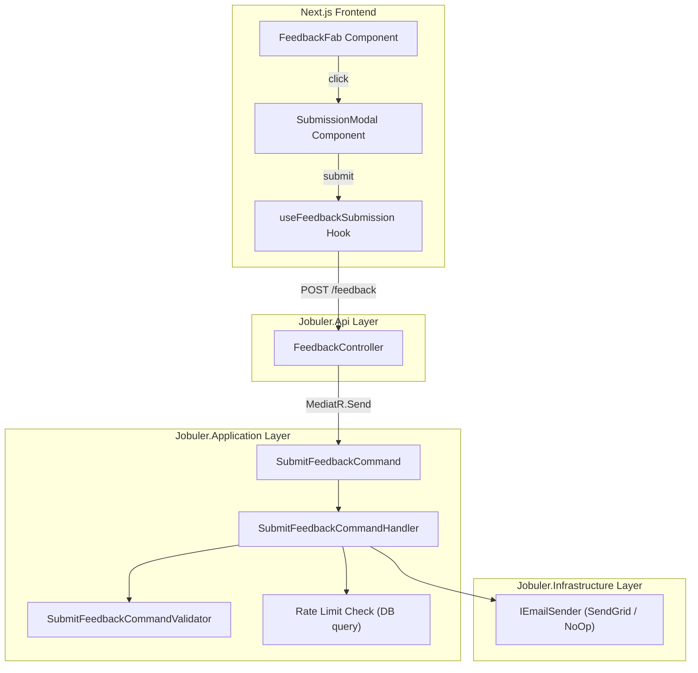
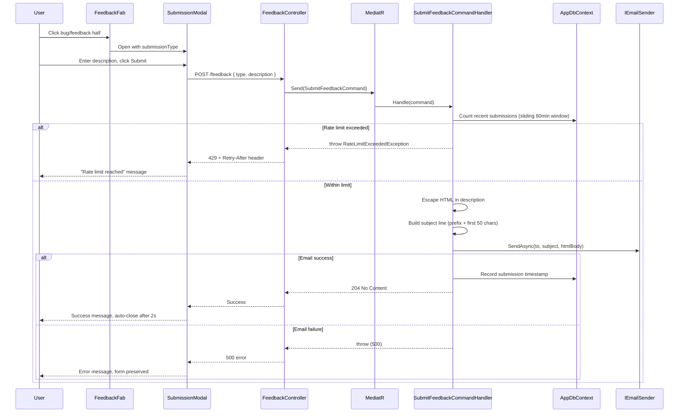

# Design Document: Feedback & Bug Report FAB

## Overview

This feature adds a floating action button (FAB) split into two halves — bug report and feedback — that appears on every authenticated page of the Shifter web application. Clicking either half opens a shared modal with a form. On submission, the system sends an email to the developer via the existing `IEmailSender` service with an appropriate subject line indicating the submission type.

The feature spans the full stack:
- **Frontend**: A React client component (`FeedbackFab`) rendered globally in the app layout, plus a `SubmissionModal` component for the form.
- **Backend**: A new `FeedbackController` in `Jobuler.Api` that dispatches a `SubmitFeedbackCommand` via MediatR. The command handler validates input, enforces per-user rate limiting, and sends the email.

### Key Design Decisions

| Decision | Rationale |
|----------|-----------|
| Single global FAB component in `providers.tsx` | Ensures visibility on all authenticated pages without per-page wiring |
| Shared modal for both types | Reduces code duplication; only the title and submission type differ |
| Rate limiting at the application layer (in-memory + DB timestamp tracking) | The existing ASP.NET Core rate limiter is IP-based; we need per-user sliding window counting only successful submissions |
| HTML escaping server-side | Prevents XSS in email clients; never trust client input |
| No separate domain entity | Feedback submissions are fire-and-forget emails, not persisted domain objects |

## Architecture



### Request Flow



## Components and Interfaces

### Frontend Components

#### `FeedbackFab` (Client Component)

**Location**: `apps/web/components/shell/FeedbackFab.tsx`

Renders a fixed-position split button at the bottom-left of the viewport. Each half is a `<button>` element with appropriate aria-labels.

```typescript
interface FeedbackFabProps {
  // No props — self-contained component
}

// Internal state
// - modalOpen: boolean
// - submissionType: "bug" | "feedback" | null
```

**Styling**:
- `position: fixed; bottom: 16px; left: 16px; z-index: 1000`
- Each half: `min-width: 44px; min-height: 44px`
- Visual divider between halves
- Bug icon (left) + Feedback icon (right)

#### `SubmissionModal` (Client Component)

**Location**: `apps/web/components/shell/SubmissionModal.tsx`

A modal dialog that wraps the existing `Modal` component pattern with focus trapping, escape-to-close, and focus restoration.

```typescript
interface SubmissionModalProps {
  open: boolean;
  submissionType: "bug" | "feedback";
  onClose: () => void;
  triggerRef: React.RefObject<HTMLButtonElement>;
}
```

**Internal state**:
- `description: string` — textarea value
- `status: "idle" | "loading" | "success" | "error"` — submission state
- `errorMessage: string | null` — error text to display
- `retryAfterSeconds: number | null` — from 429 Retry-After header

**Behavior**:
- Title: `submissionType === "bug" ? "Bug Report" : "Feedback"`
- Submit button disabled when `description.trim().length === 0` or `status === "loading"`
- Character counter: `${description.length}/5000`
- On success: show success message, auto-close after 2 seconds
- On error/timeout: show error message, preserve text
- On close without submit: discard text (reset state)
- Focus trap: Tab/Shift+Tab cycle within modal
- Escape key closes modal
- On close: return focus to `triggerRef`

#### `useFeedbackSubmission` Hook

**Location**: `apps/web/hooks/useFeedbackSubmission.ts`

```typescript
interface SubmitFeedbackPayload {
  type: "bug" | "feedback";
  description: string;
}

interface UseFeedbackSubmissionReturn {
  submit: (payload: SubmitFeedbackPayload) => Promise<void>;
  status: "idle" | "loading" | "success" | "error";
  errorMessage: string | null;
  retryAfterSeconds: number | null;
  reset: () => void;
}
```

Uses `apiClient.post("/feedback", payload)` with a 10-second timeout via Axios config. Parses `Retry-After` header on 429 responses.

### Backend Components

#### `FeedbackController`

**Location**: `apps/api/Jobuler.Api/Controllers/FeedbackController.cs`

```csharp
[ApiController]
[Route("feedback")]
[Authorize]
public class FeedbackController : ControllerBase
{
    private readonly IMediator _mediator;

    [HttpPost]
    public async Task<IActionResult> Submit(
        [FromBody] SubmitFeedbackRequest request, CancellationToken ct)
    {
        // Extract user ID and email from JWT claims
        // Dispatch SubmitFeedbackCommand via MediatR
        // Return 204 on success
        // Return 429 with Retry-After on rate limit
        // Return 400 on validation failure
        // Return 500 on email dispatch failure
    }
}
```

**Request DTO**:
```csharp
public record SubmitFeedbackRequest(string Type, string Description);
```

#### `SubmitFeedbackCommand`

**Location**: `apps/api/Jobuler.Application/Feedback/Commands/SubmitFeedbackCommand.cs`

```csharp
public record SubmitFeedbackCommand(
    Guid UserId,
    string UserEmail,
    string Type,        // "bug" | "feedback"
    string Description  // 1-5000 chars after trim
) : IRequest;
```

#### `SubmitFeedbackCommandValidator`

**Location**: `apps/api/Jobuler.Application/Feedback/Validators/SubmitFeedbackCommandValidator.cs`

```csharp
public class SubmitFeedbackCommandValidator : AbstractValidator<SubmitFeedbackCommand>
{
    private static readonly string[] AllowedTypes = ["bug", "feedback"];

    public SubmitFeedbackCommandValidator()
    {
        RuleFor(x => x.Description)
            .Must(d => !string.IsNullOrWhiteSpace(d))
            .WithMessage("Description is required.")
            .Must(d => d != null && d.Trim().Length <= 5000)
            .WithMessage("Description must not exceed 5000 characters.");

        RuleFor(x => x.Type)
            .Must(t => AllowedTypes.Contains(t))
            .WithMessage("Type must be 'bug' or 'feedback'.");
    }
}
```

#### `SubmitFeedbackCommandHandler`

**Location**: `apps/api/Jobuler.Application/Feedback/Commands/SubmitFeedbackCommandHandler.cs`

Responsibilities:
1. Query DB for count of successful submissions by this user in the last 60 minutes
2. If count >= 5, throw `RateLimitExceededException` with the oldest timestamp
3. Escape HTML entities in description
4. Build subject line: `"{Prefix}: {first 50 chars of description}"`
5. Build HTML body with full description and user email reference
6. Call `IEmailSender.SendAsync`
7. On success, record submission timestamp in DB

#### `RateLimitExceededException`

**Location**: `apps/api/Jobuler.Application/Feedback/Exceptions/RateLimitExceededException.cs`

```csharp
public class RateLimitExceededException : Exception
{
    public int RetryAfterSeconds { get; }

    public RateLimitExceededException(int retryAfterSeconds)
        : base("Rate limit exceeded.")
    {
        RetryAfterSeconds = retryAfterSeconds;
    }
}
```

Handled in `FeedbackController` (or `ExceptionHandlingMiddleware`) to return 429 with `Retry-After` header.

## Data Models

### `FeedbackSubmission` Entity

**Location**: `apps/api/Jobuler.Domain/Feedback/FeedbackSubmission.cs`

A lightweight entity used solely for rate limiting tracking. Not tenant-scoped (feedback is per-user, not per-space).

```csharp
public class FeedbackSubmission
{
    public Guid Id { get; private set; }
    public Guid UserId { get; private set; }
    public DateTime SubmittedAtUtc { get; private set; }

    private FeedbackSubmission() { }

    public static FeedbackSubmission Create(Guid userId)
    {
        return new FeedbackSubmission
        {
            Id = Guid.NewGuid(),
            UserId = userId,
            SubmittedAtUtc = DateTime.UtcNow
        };
    }
}
```

**EF Configuration** (in Infrastructure):
```csharp
public class FeedbackSubmissionConfiguration : IEntityTypeConfiguration<FeedbackSubmission>
{
    public void Configure(EntityTypeBuilder<FeedbackSubmission> builder)
    {
        builder.ToTable("feedback_submissions");
        builder.HasKey(x => x.Id);
        builder.Property(x => x.UserId).IsRequired();
        builder.Property(x => x.SubmittedAtUtc).IsRequired();
        builder.HasIndex(x => new { x.UserId, x.SubmittedAtUtc });
    }
}
```

### API Request/Response Models

**Request** (`POST /feedback`):
```json
{
  "type": "bug" | "feedback",
  "description": "string (1-5000 chars)"
}
```

**Success Response**: `204 No Content`

**Validation Error Response** (`400`):
```json
{
  "errors": {
    "description": ["Description is required."],
    "type": ["Type must be 'bug' or 'feedback'."]
  }
}
```

**Rate Limit Response** (`429`):
```
HTTP/1.1 429 Too Many Requests
Retry-After: 1847
Content-Type: application/json

{
  "message": "Rate limit exceeded. Try again later."
}
```

### Configuration

**`appsettings.json`** addition:
```json
{
  "Feedback": {
    "DeveloperEmail": "dev@shifter.ofeklabs.com",
    "MaxSubmissionsPerHour": 5
  }
}
```

## Correctness Properties

*A property is a characteristic or behavior that should hold true across all valid executions of a system — essentially, a formal statement about what the system should do. Properties serve as the bridge between human-readable specifications and machine-verifiable correctness guarantees.*

### Property 1: Whitespace-only descriptions are rejected

*For any* string composed entirely of whitespace characters (spaces, tabs, newlines, or empty string), the submit button on the frontend SHALL be disabled, and the backend validator SHALL reject the submission with a validation error.

**Validates: Requirements 3.3, 6.3**

### Property 2: Character count accuracy

*For any* string entered into the description field, the displayed character count SHALL equal the exact length of that string.

**Validates: Requirements 3.6**

### Property 3: Email subject construction with type prefix and truncation

*For any* submission type ("bug" or "feedback") and any valid description string, the email subject SHALL equal the type prefix ("Bug Report: " or "Feedback: ") concatenated with the first 50 characters of the description (or the full description if it contains fewer than 50 characters).

**Validates: Requirements 5.2, 5.3**

### Property 4: Email body contains description and sender reference

*For any* valid description text and authenticated user email, the HTML body passed to `IEmailSender.SendAsync` SHALL contain both the full (escaped) description text and the user's email address.

**Validates: Requirements 5.4**

### Property 5: HTML escaping in email body

*For any* description string containing HTML special characters (`<`, `>`, `&`, `"`, `'`), those characters SHALL be replaced with their corresponding HTML entities (`&lt;`, `&gt;`, `&amp;`, `&quot;`, `&#x27;`) in the email body.

**Validates: Requirements 5.6**

### Property 6: Description length validation

*For any* string, after trimming leading and trailing whitespace, if the resulting length is between 1 and 5000 (inclusive), the backend validator SHALL accept it; otherwise it SHALL reject it.

**Validates: Requirements 6.3**

### Property 7: Submission type enum validation

*For any* string value, the backend validator SHALL accept it if and only if it equals "bug" or "feedback" (case-sensitive).

**Validates: Requirements 6.4**

### Property 8: Rate limiting with correct Retry-After

*For any* authenticated user and any sequence of successful submissions with known timestamps, if the count of submissions within the most recent 60-minute sliding window exceeds 5, the system SHALL reject the next submission and the `Retry-After` header value SHALL equal the number of seconds until the oldest submission in the window expires (i.e., oldest timestamp + 60 minutes − current time, in seconds).

**Validates: Requirements 7.1, 7.2**

## Error Handling

| Scenario | Layer | Response | User Experience |
|----------|-------|----------|-----------------|
| Empty/whitespace description | Frontend | Submit button disabled | Cannot submit |
| Invalid type or description | Backend (FluentValidation) | 400 + field errors | Error message in modal |
| No JWT token | Backend (ASP.NET middleware) | 401 | Redirected to login by API client interceptor |
| Rate limit exceeded | Backend (Handler) | 429 + Retry-After | "Rate limit reached" message with countdown |
| Email dispatch failure | Backend (Handler) | 500 | "Could not process submission" error in modal |
| Network timeout (10s) | Frontend (Axios) | Timeout error | "Request timed out" error, form preserved |
| Network offline | Frontend (Axios) | Network error | Error message, form preserved |

### Exception Mapping in Controller

```csharp
// In FeedbackController.Submit:
try
{
    await _mediator.Send(command, ct);
    return NoContent();
}
catch (RateLimitExceededException ex)
{
    Response.Headers.Append("Retry-After", ex.RetryAfterSeconds.ToString());
    return StatusCode(429, new { message = "Rate limit exceeded. Try again later." });
}
// ValidationException and other exceptions handled by ExceptionHandlingMiddleware
```

## Testing Strategy

### Property-Based Tests (Backend — C# with FsCheck or custom generators)

Property-based tests validate the universal correctness properties defined above. Each test runs a minimum of 100 iterations with randomly generated inputs.

**Library**: `fast-check` (already in devDependencies) for frontend properties; `FsCheck` (NuGet) for backend properties.

| Property | Test Location | What Varies |
|----------|--------------|-------------|
| P1: Whitespace rejection | Frontend + Backend | Whitespace strings of varying length and composition |
| P2: Character count | Frontend | Strings of varying length (0–5000+) |
| P3: Subject construction | Backend | Description strings of length 0–200, both types |
| P4: Body contains content | Backend | Random descriptions + random email addresses |
| P5: HTML escaping | Backend | Strings with random HTML special characters |
| P6: Length validation | Backend | Strings of length 0–6000 with varying whitespace padding |
| P7: Type validation | Backend | Random strings including "bug", "feedback", and others |
| P8: Rate limiting | Backend | Random sequences of timestamps within/outside windows |

**Tag format**: `Feature: feedback-bug-fab, Property {N}: {title}`

### Unit Tests (Example-Based)

| Test | What It Verifies |
|------|-----------------|
| FAB renders with correct positioning and z-index | Requirements 1.1, 1.4 |
| FAB halves have correct aria-labels | Requirement 8.1 |
| Clicking bug half opens modal with "Bug Report" title | Requirements 2.1, 2.3 |
| Clicking feedback half opens modal with "Feedback" title | Requirements 2.2, 2.4 |
| Switching type while modal is open updates title | Requirement 2.5 |
| Modal shows loading state during submission | Requirement 4.2 |
| Modal shows success and auto-closes after 2s | Requirement 4.3 |
| Modal preserves text on error | Requirement 4.4 |
| Modal shows timeout error after 10s | Requirement 4.5 |
| Modal closes on Escape key | Requirement 8.3 |
| Focus returns to trigger on close | Requirement 8.6 |
| Modal has role="dialog" and accessible name | Requirement 8.7 |
| 401 returned without valid JWT | Requirement 6.2 |
| 400 returned with field-level errors | Requirement 6.5 |
| 429 displays rate limit message with Retry-After | Requirement 7.3 |
| Email dispatch failure returns 500 | Requirement 5.5 |

### Integration Tests

| Test | What It Verifies |
|------|-----------------|
| Full submission flow (authenticated user → email sent) | End-to-end happy path |
| Rate limit enforced across multiple requests | Requirement 7.1 in real request context |

### Accessibility Tests

- `@axe-core/react` integration in dev mode for automated a11y scanning
- Manual testing with screen reader (VoiceOver/NVDA) for focus management and announcements
