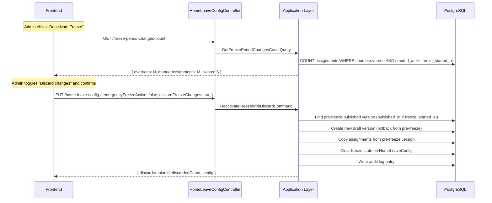
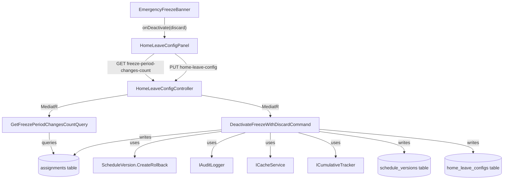

# Design Document: Freeze Period Discard

## Overview

This feature extends the emergency freeze deactivation flow to optionally discard all schedule modifications made during the freeze period. When an admin deactivates the freeze, they are presented with a summary of changes made during the freeze and can choose to revert them by creating a new immutable schedule version that copies assignments from the pre-freeze published version.

The design follows the existing rollback pattern: no data is ever mutated or deleted. Instead, a new draft version is created from the pre-freeze baseline, preserving full audit history.

### Key Design Decisions

1. **Reuse the existing `CreateRollback` pattern** — The discard operation is semantically a rollback to the pre-freeze version. We reuse `ScheduleVersion.CreateRollback()` with `RollbackSourceVersionId` pointing to the pre-freeze baseline.

2. **Extend the existing `UpsertHomeLeaveConfigCommand` handler** — Rather than creating a separate endpoint, we add a `discardFreezeChanges` parameter to the existing freeze deactivation flow. This keeps the API surface minimal and the frontend change small.

3. **Count changes via assignment `CreatedAt` filtering** — Since `Assignment` inherits `Entity.CreatedAt`, we can identify freeze-period changes by querying assignments with `Source = Override` and `CreatedAt >= freeze_started_at` in draft versions scoped to the space.

4. **Separate preview endpoint** — A dedicated query endpoint returns the count of freeze-period changes so the frontend can display the summary before the admin confirms.

5. **Permission split** — Standard deactivation requires only `constraints.manage`. The discard option additionally requires `schedule.rollback`, matching the existing rollback permission model.

## Architecture



### Component Interaction



## Components and Interfaces

### New Query: `GetFreezePeriodChangesCountQuery`

**Location:** `Jobuler.Application/HomeLeave/Queries/GetFreezePeriodChangesCountQuery.cs`

```csharp
public record GetFreezePeriodChangesCountQuery(
    Guid SpaceId,
    Guid GroupId,
    Guid RequestingUserId) : IRequest<FreezePeriodChangesCountResult>;

public record FreezePeriodChangesCountResult(
    int OverrideCount,
    int ManualAssignmentCount,
    int SwapCount,
    int TotalCount);
```

**Behavior:**
- Requires caller to be authenticated and have `space.view` permission
- Loads `HomeLeaveConfig` for the group to get `FreezeStartedAt`
- If freeze is not active or `FreezeStartedAt` is null, returns all zeros
- Queries assignments in draft versions for the space where `CreatedAt >= FreezeStartedAt`:
  - `OverrideCount`: assignments with `Source = Override`
  - `ManualAssignmentCount`: assignments with `Source = Solver` that replaced an override (identified by having a `ChangeReasonSummary` containing "Manual override" or "Rollback")
  - `SwapCount`: paired reassignments (two overrides on the same slot in the same version)

### New Command: `DeactivateFreezeWithDiscardCommand`

**Location:** `Jobuler.Application/HomeLeave/Commands/DeactivateFreezeWithDiscardCommand.cs`

```csharp
public record DeactivateFreezeWithDiscardCommand(
    Guid SpaceId,
    Guid GroupId,
    Guid RequestingUserId,
    bool DiscardFreezeChanges) : IRequest<DeactivateFreezeResult>;

public record DeactivateFreezeResult(
    Guid ConfigId,
    bool DiscardPerformed,
    Guid? DiscardVersionId,
    int DiscardedChangeCount,
    HomeLeaveConfigResult Config);
```

**Behavior:**
1. Requires `constraints.manage` permission
2. If `DiscardFreezeChanges` is true, additionally requires `schedule.rollback` permission
3. Loads `HomeLeaveConfig` — throws if freeze is not active
4. If `DiscardFreezeChanges` is true:
   a. Finds the most recent published version with `PublishedAt < FreezeStartedAt`
   b. If none exists, throws `InvalidOperationException` (no pre-freeze baseline)
   c. Counts freeze-period changes; if zero, skips version creation
   d. Creates a new draft version via `ScheduleVersion.CreateRollback()`
   e. Copies all assignments from the pre-freeze version into the new draft
   f. Recomputes cumulative hours for affected persons
   g. Invalidates cache
5. Calls `config.DeactivateEmergencyFreeze()` to clear freeze state
6. Writes audit log entry
7. Returns result with config and discard metadata

### Modified Component: `UpsertHomeLeaveConfigCommand`

The existing handler's freeze deactivation branch will be replaced with a dispatch to `DeactivateFreezeWithDiscardCommand` when `EmergencyFreezeActive == false` and the config currently has freeze active. Alternatively, the frontend will call the new command directly via a separate endpoint action.

**Decision:** We add a new `POST` action on `HomeLeaveConfigController` specifically for deactivation, keeping the existing `PUT` for config updates. This avoids overloading the upsert endpoint with discard logic.

### New Controller Action

**Location:** `HomeLeaveConfigController.cs`

```csharp
/// <summary>
/// Deactivate emergency freeze with optional discard of freeze-period changes.
/// </summary>
[HttpPost("deactivate-freeze")]
public async Task<IActionResult> DeactivateFreeze(
    Guid spaceId, Guid groupId,
    [FromBody] DeactivateFreezeRequest req,
    CancellationToken ct)
```

**Request DTO:**
```csharp
public record DeactivateFreezeRequest(bool DiscardFreezeChanges = false);
```

### New Controller Action: Change Count Preview

```csharp
/// <summary>
/// Get the count of schedule changes made during the active freeze period.
/// </summary>
[HttpGet("freeze-period-changes-count")]
public async Task<IActionResult> GetFreezePeriodChangesCount(
    Guid spaceId, Guid groupId, CancellationToken ct)
```

### Frontend Changes

**`EmergencyFreezeBanner.tsx`** — Add a deactivation dialog with:
- Change count summary (fetched on dialog open)
- Discard toggle (hidden if user lacks `schedule.rollback` or no changes exist)
- Confirm/cancel buttons

**`lib/api/homeLeave.ts`** — Add:
- `getFreezePeriodChangesCount(spaceId, groupId)` → GET
- `deactivateFreeze(spaceId, groupId, discardFreezeChanges)` → POST

## Data Models

### Existing Entities (No Schema Changes Required)

The feature leverages existing tables and columns without schema modifications:

| Entity | Relevant Fields | Usage |
|--------|----------------|-------|
| `HomeLeaveConfig` | `EmergencyFreezeActive`, `FreezeStartedAt`, `PreFreezeMode` | Identifies freeze window |
| `ScheduleVersion` | `PublishedAt`, `Status`, `RollbackSourceVersionId` | Finds pre-freeze baseline, creates discard version |
| `Assignment` | `CreatedAt`, `Source`, `ScheduleVersionId`, `SpaceId` | Identifies freeze-period changes |
| `AuditLog` | All fields | Records discard action |

### Query Strategy for Freeze-Period Changes

```sql
-- Find override assignments created during freeze in draft versions
SELECT COUNT(*) 
FROM assignments a
JOIN schedule_versions v ON a.schedule_version_id = v.id
WHERE a.space_id = @spaceId
  AND v.status = 'draft'
  AND a.assignment_source = 'override'
  AND a.created_at >= @freezeStartedAt;
```

### New Audit Log Action

| Action | Entity Type | Before JSON | After JSON |
|--------|-------------|-------------|------------|
| `discard_freeze_changes` | `schedule_version` | `{ group_id, freeze_started_at, change_count }` | `{ new_version_id, baseline_version_id }` |
| `deactivate_freeze` | `home_leave_config` | `{ group_id, freeze_started_at }` | `{ discard_performed: false }` |

