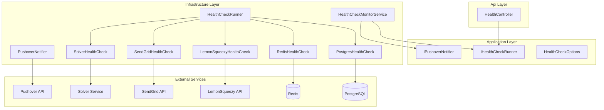

# Design Document: Health Check Alerts

## Overview

This feature adds a comprehensive health monitoring and alerting system to the Shifter API. It extends the existing `/health` endpoint with a new `/health/detailed` endpoint that reports per-service status for all critical dependencies (PostgreSQL, Redis, LemonSqueezy, SendGrid, Solver). A background `HealthCheckMonitorService` (IHostedService) continuously polls service health and sends high-priority Pushover notifications to the platform operator when a service transitions from healthy to unhealthy.

The design follows the existing 4-layer architecture:
- **Application layer**: Defines `IHealthCheckRunner` interface and `HealthCheckOptions` configuration model
- **Infrastructure layer**: Implements individual service health checks, the background monitor, and the Pushover notifier
- **Api layer**: Exposes the `/health/detailed` endpoint via the existing `HealthController`

## Architecture



### Key Design Decisions

1. **Reuse existing HealthController** — The new `/health/detailed` endpoint is added as a new action on the existing `HealthController` rather than creating a new controller. This keeps health-related endpoints co-located.

2. **Individual health check classes** — Each service check is encapsulated in its own class implementing `IServiceHealthCheck`. This makes checks independently testable and allows adding new services without modifying existing code.

3. **In-memory state tracking** — The background monitor stores last-known status in a `ConcurrentDictionary<string, ServiceState>`. No database persistence is needed since state is transient and rebuilds on startup (first check establishes baseline without alerting).

4. **Pushover over existing notification system** — Pushover is used directly (not through the existing `INotificationSender`) because this targets the platform operator specifically, not tenant users. It's a separate concern from user-facing notifications.

5. **Graceful degradation** — If Pushover credentials are missing, the monitor still runs and logs health transitions. This avoids coupling monitoring to alerting availability.

## Components and Interfaces

### Application Layer

```csharp
// Jobuler.Application/Common/HealthChecks/IServiceHealthCheck.cs
public interface IServiceHealthCheck
{
    string ServiceName { get; }
    Task<ServiceHealthResult> CheckAsync(CancellationToken ct);
}

public record ServiceHealthResult(
    string ServiceName,
    string Status,       // "healthy", "unhealthy", "skipped"
    string? ErrorMessage = null,
    TimeSpan? ResponseTime = null);

// Jobuler.Application/Common/HealthChecks/IHealthCheckRunner.cs
public interface IHealthCheckRunner
{
    Task<HealthCheckReport> RunAllAsync(CancellationToken ct);
}

public record HealthCheckReport(
    string OverallStatus,       // "healthy" or "degraded"
    string Version,
    DateTime Timestamp,
    IReadOnlyList<ServiceHealthResult> Checks);

// Jobuler.Application/Common/HealthChecks/IPushoverNotifier.cs
public interface IPushoverNotifier
{
    Task SendAlertAsync(string serviceName, DateTime detectedAtUtc, CancellationToken ct);
}

// Jobuler.Application/Common/HealthChecks/HealthCheckOptions.cs
public class HealthCheckOptions
{
    public string? PushoverUserKey { get; set; }
    public string? PushoverAppToken { get; set; }
    public int IntervalSeconds { get; set; } = 300;
    public int AlertCooldownSeconds { get; set; } = 3600;
}
```

### Infrastructure Layer

```csharp
// Individual health checks (all implement IServiceHealthCheck)
// - PostgresHealthCheck: executes SELECT 1 via AppDbContext
// - RedisHealthCheck: executes PING via IConnectionMultiplexer
// - LemonSqueezyHealthCheck: GET /v1/users/me with Bearer token
// - SendGridHealthCheck: GET /v3/user/profile with Bearer token (skipped if unconfigured)
// - SolverHealthCheck: GET {SolverBaseUrl}/ to verify reachability

// HealthCheckRunner: aggregates all IServiceHealthCheck instances
// - Runs each check with a 10-second CancellationTokenSource timeout
// - Catches exceptions and marks timed-out/failed checks as "unhealthy"
// - Derives overall status: "healthy" if all non-skipped checks pass, "degraded" otherwise

// HealthCheckMonitorService: BackgroundService
// - On startup: waits random 5-30s, then runs first check (establishes baseline)
// - Loop: runs checks at configured interval
// - Compares results to last-known state
// - On healthy→unhealthy transition: calls IPushoverNotifier (respecting cooldown)
// - On unhealthy→healthy transition: logs recovery, resets cooldown for that service
// - On exception: logs error, continues to next cycle

// PushoverNotifier: implements IPushoverNotifier
// - Uses IHttpClientFactory named client "Pushover"
// - POST to https://api.pushover.net/1/messages.json
// - Body: token, user, message, priority=1, title="Shifter Health Alert"
// - If credentials missing: logs warning, returns without sending
// - If request fails: logs error, does not retry
```

### Api Layer

```csharp
// New action on existing HealthController
[HttpGet("detailed")]
public async Task<IActionResult> Detailed(CancellationToken ct)
{
    var report = await _healthCheckRunner.RunAllAsync(ct);
    var statusCode = report.OverallStatus == "healthy" ? 200 : 503;
    return StatusCode(statusCode, report);
}
```

## Data Models

### In-Memory State (HealthCheckMonitorService)

```csharp
internal record ServiceState
{
    public string Status { get; init; } = "unknown";  // "healthy", "unhealthy", "unknown"
    public DateTime LastCheckedUtc { get; init; }
    public DateTime? LastAlertSentUtc { get; init; }
}
```

The monitor maintains a `ConcurrentDictionary<string, ServiceState>` keyed by service name. No database tables are needed — this state is ephemeral and rebuilds on application restart.

### Configuration Binding

Environment variables map to `HealthCheckOptions` via `IOptions<HealthCheckOptions>`:

| Environment Variable | Property | Default |
|---|---|---|
| `PUSHOVER_USER_KEY` | PushoverUserKey | null |
| `PUSHOVER_APP_TOKEN` | PushoverAppToken | null |
| `HEALTH_CHECK_INTERVAL_SECONDS` | IntervalSeconds | 300 |
| `HEALTH_CHECK_ALERT_COOLDOWN_SECONDS` | AlertCooldownSeconds | 3600 |

### API Response Format (`/health/detailed`)

```json
{
  "overallStatus": "degraded",
  "version": "1.9.0",
  "timestamp": "2024-01-15T10:30:00Z",
  "checks": [
    { "serviceName": "postgres", "status": "healthy", "responseTime": "00:00:00.012" },
    { "serviceName": "redis", "status": "healthy", "responseTime": "00:00:00.003" },
    { "serviceName": "lemonsqueezy", "status": "unhealthy", "errorMessage": "HTTP 401 Unauthorized", "responseTime": "00:00:00.450" },
    { "serviceName": "sendgrid", "status": "skipped" },
    { "serviceName": "solver", "status": "healthy", "responseTime": "00:00:00.025" }
  ]
}
```

## Correctness Properties

*A property is a characteristic or behavior that should hold true across all valid executions of a system — essentially, a formal statement about what the system should do. Properties serve as the bridge between human-readable specifications and machine-verifiable correctness guarantees.*

### Property 1: Response structure completeness

*For any* set of service health check results (regardless of individual statuses), the health check report SHALL contain an entry for every registered service, a UTC timestamp, and the application version string.

**Validates: Requirements 1.1, 1.4**

### Property 2: Overall status derivation

*For any* set of service health check results, the overall status SHALL be "healthy" if and only if all non-skipped services report "healthy"; otherwise the overall status SHALL be "degraded".

**Validates: Requirements 1.2, 1.3**

### Property 3: Timeout marks service unhealthy

*For any* service health check that exceeds the 10-second timeout, the resulting status SHALL be "unhealthy" regardless of which service timed out.

**Validates: Requirements 2.6**

### Property 4: State transition triggers alert with correct content

*For any* monitored service that transitions from healthy to unhealthy, the system SHALL send a Pushover notification whose message contains the service name and the UTC timestamp of detection.

**Validates: Requirements 3.4, 5.3**

### Property 5: Recovery logs at Information level

*For any* monitored service that transitions from unhealthy to healthy, the system SHALL produce a log entry at Information level containing the service name.

**Validates: Requirements 3.5**

### Property 6: Exception resilience

*For any* exception thrown during a health check cycle, the background monitor SHALL catch the exception, log it at Error level, and continue executing subsequent cycles without terminating.

**Validates: Requirements 3.7**

### Property 7: Cooldown suppresses duplicate alerts

*For any* service that remains continuously unhealthy, the system SHALL send at most one alert per cooldown period. Subsequent unhealthy checks within the cooldown window SHALL NOT trigger additional notifications.

**Validates: Requirements 4.1, 4.3**

### Property 8: Recovery resets cooldown

*For any* service that transitions unhealthy→healthy→unhealthy, the second unhealthy transition SHALL immediately trigger a new alert regardless of how much time has elapsed since the first alert.

**Validates: Requirements 4.4**

### Property 9: Interval clamping

*For any* configured interval value less than 30, the effective polling interval SHALL be clamped to 30 seconds.

**Validates: Requirements 6.4**

## Error Handling

| Scenario | Behavior |
|---|---|
| Individual health check throws exception | `HealthCheckRunner` catches it, marks that service as "unhealthy" with the exception message |
| Individual health check times out (>10s) | `CancellationTokenSource` cancels the check, service marked "unhealthy" |
| Pushover API returns non-success status | `PushoverNotifier` logs at Error level, does not retry, monitor continues |
| Pushover credentials not configured | `PushoverNotifier` logs warning at startup, `SendAlertAsync` returns immediately (no-op) |
| Entire check cycle throws unhandled exception | `HealthCheckMonitorService` catches in outer loop, logs Error, waits for next interval |
| Database unavailable during health check | PostgreSQL check fails gracefully, marked "unhealthy" — does not crash the monitor |
| Redis unavailable during health check | Redis check fails gracefully, marked "unhealthy" — does not crash the monitor |

All errors follow the existing pattern: exceptions bubble to the appropriate handler, are logged via Serilog, and never crash the background service.

## Testing Strategy

### Property-Based Tests (FsCheck + xunit)

The project already uses FsCheck 2.16.6 with xunit. Each correctness property maps to a single property-based test with minimum 100 iterations.

**Target components for PBT:**
- `HealthCheckRunner` — properties 1, 2, 3 (pure aggregation logic, easily testable with generated inputs)
- `HealthCheckMonitorService` state machine — properties 4, 5, 6, 7, 8 (state transition logic with generated service name sequences and timing)
- `HealthCheckOptions` validation — property 9 (interval clamping with generated integers)

**PBT library:** FsCheck.Xunit (already in project)
**Minimum iterations:** 100 per property
**Tag format:** `Feature: health-check-alerts, Property {N}: {description}`

### Unit Tests (xunit + NSubstitute + FluentAssertions)

- Individual health check classes: mock HttpClient/DbContext/Redis, verify correct calls
- `PushoverNotifier`: mock HttpClient, verify request body format, priority=1, credentials
- `HealthCheckOptions` defaults: verify 300s interval, 3600s cooldown
- SendGrid skip behavior when unconfigured
- Pushover graceful degradation when credentials missing

### Integration Tests

- `/health/detailed` endpoint: verify JSON structure, HTTP status codes, no-auth access
- `/health` endpoint: verify backward compatibility (regression)
- Background service startup: verify initial check runs within 30 seconds

### Test Organization

```
Jobuler.Tests/
  HealthChecks/
    HealthCheckRunnerPropertyTests.cs    ← Properties 1, 2, 3
    HealthCheckMonitorPropertyTests.cs   ← Properties 4, 5, 6, 7, 8
    HealthCheckOptionsPropertyTests.cs   ← Property 9
    PushoverNotifierTests.cs             ← Unit tests
    IndividualHealthCheckTests.cs        ← Unit tests per service
    HealthEndpointIntegrationTests.cs    ← Integration tests
```
