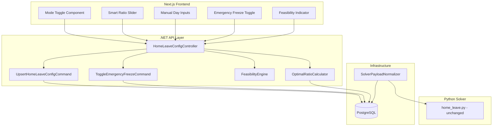
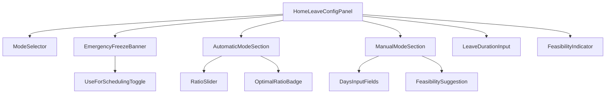

# Design Document: Home-Leave Overhaul

## Overview

This design replaces the current abstract threshold/balance home-leave configuration with a three-mode system: **Automatic** (smart slider centered on an optimal ratio), **Manual Override** (explicit day inputs with real-time feasibility feedback), and **Emergency Freeze** (immediate leave suspension with optional task scheduling inclusion).

The key insight is that admins think in **days**, not hours or abstract 0–100 values. The new system translates day-based ratios into the existing solver parameters (`eligibility_threshold_hours`, `balance_value`, `min_rest_hours`) so the solver logic remains unchanged.

### Design Decisions

1. **No solver changes** — All new behavior is achieved by translating the new UI inputs into existing solver parameters. The solver's `home_leave.py` remains untouched.
2. **Formula-based optimal ratio** — The optimal ratio is computed via a closed-form formula (not a solver invocation), ensuring sub-500ms response times.
3. **Additive migration** — New columns are added with safe defaults; no existing columns are removed. The `min_rest_hours` column is preserved but set to 0 for all new-system configs.
4. **Emergency freeze via payload manipulation** — Rather than adding a new solver mode, emergency freeze is implemented by either setting `balance_value = 0` (include in scheduling) or omitting `home_leave_config` entirely (exclude from scheduling).

## Architecture



### Data Flow

1. **Admin changes mode/ratio** → Frontend calls API → Command handler validates & persists → Response includes computed optimal ratio + feasibility
2. **Solver run triggered** → `SolverPayloadNormalizer` reads `home_leave_configs` → Translates mode + stored values into `HomeLeaveConfigDto` → Solver receives standard parameters
3. **Emergency freeze** → Persists freeze state → Next solver run sees freeze → Payload is modified accordingly (balance=0 or omitted)

## Components and Interfaces

### 1. Domain Entity: `HomeLeaveConfig` (Updated)

```csharp
public class HomeLeaveConfig : AuditableEntity, ITenantScoped
{
    // Existing fields
    public Guid SpaceId { get; private set; }
    public Guid GroupId { get; private set; }
    public decimal MinRestHours { get; private set; }
    public decimal EligibilityThresholdHours { get; private set; }
    public int LeaveCapacity { get; private set; }
    public decimal LeaveDurationHours { get; private set; }
    public int BalanceValue { get; private set; } = 50;

    // New fields
    public HomeLeaveMode Mode { get; private set; } = HomeLeaveMode.Automatic;
    public int BaseDays { get; private set; } = 7;
    public int HomeDays { get; private set; } = 2;
    public bool EmergencyFreezeActive { get; private set; } = false;
    public bool EmergencyUseForScheduling { get; private set; } = false;
    public DateTime? FreezeStartedAt { get; private set; }
    public HomeLeaveMode PreFreezeMode { get; private set; } = HomeLeaveMode.Automatic;
}

public enum HomeLeaveMode
{
    Automatic,
    Manual
}
```

**New methods:**
- `SetMode(HomeLeaveMode mode)` — switches mode, recalculates solver params
- `SetRatio(int baseDays, int homeDays)` — sets manual ratio, validates, converts to solver params
- `SetSliderPosition(int sliderValue, int optimalBaseDays, int optimalHomeDays)` — converts slider to ratio
- `ActivateEmergencyFreeze(bool useForScheduling)` — records pre-freeze mode, sets freeze state
- `DeactivateEmergencyFreeze()` — restores pre-freeze mode, clears freeze state

### 2. Application Layer: `OptimalRatioCalculator`

```csharp
public interface IOptimalRatioCalculator
{
    OptimalRatioResult Calculate(int memberCount, int leaveCapacity, decimal leaveDurationHours, int coverageRequirement);
}

public record OptimalRatioResult(
    int BaseDays,
    int HomeDays,
    bool IsReduced  // true if optimal results in < 1 day home
);
```

**Formula:**
```
home_days = ceil(leave_duration_hours / 24)
cycle_length = base_days + home_days
min_base_days = ceil((coverage_requirement × cycle_length) / (member_count - leave_capacity))
```

This is solved iteratively since `cycle_length` depends on `base_days`:
```
Start with home_days = ceil(leave_duration_hours / 24)
Iterate: base_days = ceil((coverage × (base_days + home_days)) / (members - capacity))
Converge when base_days stabilizes (typically 2-3 iterations)
```

### 3. Application Layer: `FeasibilityEngine`

```csharp
public interface IFeasibilityEngine
{
    FeasibilityResult Evaluate(int memberCount, int leaveCapacity, int baseDays, int homeDays, int coverageRequirement);
}

public record FeasibilityResult(
    bool IsFeasible,
    int? MaxFeasibleHomeDays,  // suggestion when feasible
    string? Reason             // localized explanation when not feasible
);
```

**Feasibility check:**
```
At any point in the cycle, the number of people at base must be >= coverage_requirement.
Feasible when: (member_count - leave_capacity) >= coverage_requirement
```

### 4. API Endpoints

**Updated `PUT /spaces/{spaceId}/groups/{groupId}/home-leave-config`:**

```csharp
public record UpsertHomeLeaveConfigRequest(
    HomeLeaveMode Mode,
    int? BaseDays,           // required for Manual mode
    int? HomeDays,           // required for Manual mode
    int? SliderValue,        // required for Automatic mode (0-100)
    decimal LeaveDurationHours,
    int LeaveCapacity,
    bool? EmergencyFreezeActive,
    bool? EmergencyUseForScheduling
);
```

**New `GET /spaces/{spaceId}/groups/{groupId}/home-leave-config/optimal-ratio`:**

Returns the computed optimal ratio for the group based on current member count and coverage requirements.

```csharp
public record OptimalRatioResponse(
    int BaseDays,
    int HomeDays,
    bool IsReduced,
    int MemberCount,
    int CoverageRequirement
);
```

**Updated `POST /spaces/{spaceId}/groups/{groupId}/home-leave-preview`:**

Extended to accept mode + ratio parameters for feasibility preview.

```csharp
public record HomeLeavePreviewRequest(
    HomeLeaveMode Mode,
    int? BaseDays,
    int? HomeDays,
    int? SliderValue,
    decimal? LeaveDurationHours
);
```

### 5. Solver Payload Changes

The `SolverPayloadNormalizer` logic changes based on mode:

| State | `home_leave_config` in payload |
|-------|-------------------------------|
| Automatic mode | `enabled: true`, `eligibility_threshold_hours = base_days × 24`, `balance_value` from slider mapping, `min_rest_hours = 0` |
| Manual mode | `enabled: true`, `eligibility_threshold_hours = base_days × 24`, `balance_value = 50` (neutral), `min_rest_hours = 0` |
| Emergency freeze + use for scheduling | `enabled: true`, `balance_value = 0`, `eligibility_threshold_hours = 9999` (effectively never eligible), `min_rest_hours = 0` |
| Emergency freeze + don't use for scheduling | `home_leave_config` omitted entirely |

**No changes to the Python solver or `HomeLeaveConfig` Pydantic model** — the existing fields carry all needed information.

### 6. Frontend Component Architecture



**New components:**
- `ModeSelector` — Segmented control (Automatic | Manual)
- `RatioSlider` — Replaces `BalanceSlider`, centered on optimal ratio, displays day ratio
- `ManualModeSection` — Two numeric inputs (base days, home days) with feasibility feedback
- `EmergencyFreezeBanner` — Prominent toggle + scheduling option
- `FeasibilityIndicator` — Green/red indicator with explanation
- `LeaveDurationInput` — Shared between modes, displays in days

### 7. RTL/LTR Slider Handling

The `RatioSlider` component handles directionality:

```typescript
interface RatioSliderProps {
  optimalBaseDays: number;
  optimalHomeDays: number;
  value: number; // 0-100 slider position
  onChange: (value: number) => void;
  locale: "he" | "en" | "ru";
}
```

**RTL Strategy:**
- Use CSS `direction: rtl` on the slider container when locale is Hebrew
- The HTML `<input type="range">` natively supports `dir="rtl"` — the thumb moves right-to-left
- Gradient is applied via CSS `background: linear-gradient(...)` — direction is flipped for RTL using `to left` (LTR) vs `to right` (RTL)
- Labels swap positions: in RTL, "more base" appears on the left, "more home" on the right
- The slider's internal value (0-100) remains the same regardless of direction — only the visual presentation changes
- Use `useDirection()` hook from next-intl or derive from locale

**Implementation detail:**
```tsx
const isRTL = locale === "he";
const gradientDirection = isRTL ? "to right" : "to left";
// In RTL: left = generous (more home), right = conservative (more base)
// In LTR: left = conservative (more base), right = generous (more home)
// The value semantics stay consistent: 0 = most conservative, 100 = most generous
```

## Data Models

### Database Schema Changes (Migration 053)

```sql
-- Migration 053: Home-leave overhaul — mode system and emergency freeze
ALTER TABLE home_leave_configs
    ADD COLUMN IF NOT EXISTS mode TEXT NOT NULL DEFAULT 'automatic',
    ADD COLUMN IF NOT EXISTS base_days INTEGER NOT NULL DEFAULT 7,
    ADD COLUMN IF NOT EXISTS home_days INTEGER NOT NULL DEFAULT 2,
    ADD COLUMN IF NOT EXISTS emergency_freeze_active BOOLEAN NOT NULL DEFAULT FALSE,
    ADD COLUMN IF NOT EXISTS emergency_use_for_scheduling BOOLEAN NOT NULL DEFAULT FALSE,
    ADD COLUMN IF NOT EXISTS freeze_started_at TIMESTAMPTZ,
    ADD COLUMN IF NOT EXISTS pre_freeze_mode TEXT NOT NULL DEFAULT 'automatic';

-- Constraints
ALTER TABLE home_leave_configs
    ADD CONSTRAINT chk_mode_valid CHECK (mode IN ('automatic', 'manual')),
    ADD CONSTRAINT chk_pre_freeze_mode_valid CHECK (pre_freeze_mode IN ('automatic', 'manual')),
    ADD CONSTRAINT chk_base_days_min CHECK (base_days >= 1),
    ADD CONSTRAINT chk_home_days_min CHECK (home_days >= 1);

-- Migration: compute base_days from existing eligibility_threshold_hours
UPDATE home_leave_configs
SET base_days = GREATEST(1, ROUND(eligibility_threshold_hours / 24)),
    home_days = GREATEST(1, ROUND(leave_duration_hours / 24)),
    min_rest_hours = 0;
```

### Updated `HomeLeaveConfigDto` (API Response)

```csharp
public record HomeLeaveConfigResponse(
    Guid Id,
    Guid GroupId,
    Guid SpaceId,
    string Mode,                    // "automatic" | "manual"
    int BaseDays,
    int HomeDays,
    decimal LeaveDurationHours,
    int LeaveCapacity,
    int BalanceValue,
    bool EmergencyFreezeActive,
    bool EmergencyUseForScheduling,
    DateTime? FreezeStartedAt,
    // Computed fields
    int OptimalBaseDays,
    int OptimalHomeDays,
    bool OptimalIsReduced
);
```

## Correctness Properties

*A property is a characteristic or behavior that should hold true across all valid executions of a system — essentially, a formal statement about what the system should do. Properties serve as the bridge between human-readable specifications and machine-verifiable correctness guarantees.*

### Property 1: Mode Mutual Exclusivity

*For any* sequence of mode changes applied to a `HomeLeaveConfig`, the entity SHALL have exactly one of `Automatic` or `Manual` as its active mode at all times, and `EmergencyFreezeActive` is an independent boolean that does not affect the mode value.

**Validates: Requirements 1.1**

### Property 2: Optimal Ratio Formula Correctness

*For any* valid combination of (memberCount ≥ 2, leaveCapacity ≥ 1, leaveDurationHours ∈ [12, 168], coverageRequirement ≥ 1) where memberCount > leaveCapacity + coverageRequirement, the `OptimalRatioCalculator` SHALL produce (baseDays, homeDays) where baseDays and homeDays are positive integers, and the configuration satisfies: (memberCount - leaveCapacity) ≥ coverageRequirement.

**Validates: Requirements 2.4, 2.2**

### Property 3: Slider Monotonicity

*For any* two slider positions `a` and `b` where `a < b` (both in [0, 100]), the ratio produced by position `b` SHALL have baseDays ≤ the baseDays produced by position `a` (i.e., moving the slider toward "more home" never increases base days).

**Validates: Requirements 3.2, 3.3**

### Property 4: Ratio-to-Solver-Params Round Trip

*For any* valid (baseDays ∈ [1, 14], homeDays ∈ [1, 7]) pair, the conversion to solver parameters SHALL produce `eligibility_threshold_hours = baseDays × 24` and `balance_value ∈ [0, 100]`, and the reverse computation `floor(eligibility_threshold_hours / 24)` SHALL equal the original baseDays.

**Validates: Requirements 3.6, 4.5, 8.1, 8.2**

### Property 5: Feasibility Engine Correctness

*For any* valid configuration (memberCount, leaveCapacity, baseDays, homeDays, coverageRequirement), the `FeasibilityEngine` SHALL return `IsFeasible = true` if and only if `(memberCount - leaveCapacity) ≥ coverageRequirement`. When feasible, `MaxFeasibleHomeDays` SHALL be ≥ homeDays. When not feasible, `Reason` SHALL be non-empty.

**Validates: Requirements 4.2, 4.3, 4.4, 5.2**

### Property 6: Day Input Validation

*For any* integer value < 1 provided as baseDays or homeDays, the domain entity SHALL reject the update with a validation error. *For any* integer value ≥ 1 and ≤ 14 (base) or ≤ 7 (home), the entity SHALL accept the update.

**Validates: Requirements 4.6**

### Property 7: Emergency Freeze Solver Payload

*For any* `HomeLeaveConfig` with `EmergencyFreezeActive = true`: if `EmergencyUseForScheduling = true`, the solver payload SHALL contain `home_leave_config` with `balance_value = 0`; if `EmergencyUseForScheduling = false`, the solver payload SHALL omit `home_leave_config` entirely.

**Validates: Requirements 6.1, 6.5, 6.6, 8.5, 8.6**

### Property 8: Emergency Freeze State Restoration

*For any* `HomeLeaveConfig` that has been through an activate-then-deactivate emergency freeze cycle, the `Mode`, `BaseDays`, `HomeDays`, and `BalanceValue` after deactivation SHALL equal the values that were active immediately before freeze activation.

**Validates: Requirements 7.1**

### Property 9: Min Rest Hours Invariant

*For any* `HomeLeaveConfig` using the new mode system (mode is `Automatic` or `Manual`), the solver payload SHALL always have `min_rest_hours = 0`.

**Validates: Requirements 8.4, 3.8**

### Property 10: Leave Duration Validation

*For any* decimal value outside the range [12, 168], the domain entity SHALL reject the update. *For any* value within [12, 168], the entity SHALL accept it and preserve it unchanged through persistence.

**Validates: Requirements 9.2**

### Property 11: Migration Rounding Correctness

*For any* existing `eligibility_threshold_hours` value, the migration SHALL produce `base_days = max(1, round(eligibility_threshold_hours / 24))`, ensuring no data loss and all migrated values are positive integers.

**Validates: Requirements 10.3**

## Error Handling

| Scenario | HTTP Status | Error Message |
|----------|-------------|---------------|
| Invalid mode value | 400 | "Mode must be 'automatic' or 'manual'" |
| BaseDays < 1 or HomeDays < 1 | 400 | "ימים בבסיס וימים בבית חייבים להיות לפחות 1" |
| LeaveDuration outside [12, 168] | 400 | "משך החופשה חייב להיות בין 12 ל-168 שעות" |
| LeaveCapacity > memberCount - 1 | 400 | "מכסת היוצאים חייבת להיות קטנה ממספר חברי הקבוצה" |
| Group not found | 404 | "Group not found in this space" |
| No permission | 403 | Standard permission denied |
| Emergency freeze already active (re-activate) | 400 | "Emergency freeze is already active" |
| Deactivate when not frozen | 400 | "Emergency freeze is not active" |
| Optimal ratio calculation with 0 members | 400 | "Group must have at least 2 members for home-leave" |

All errors follow the existing `ExceptionHandlingMiddleware` pattern. Domain validation throws `InvalidOperationException` (→ 400), missing entities throw `KeyNotFoundException` (→ 404).

## Testing Strategy

### Property-Based Tests (fast-check, minimum 100 iterations each)

The following properties are tested using property-based testing with the `fast-check` library (TypeScript) for frontend logic and a C# PBT library (FsCheck or similar) for backend:

1. **Optimal ratio formula** — Generate random valid inputs, verify formula convergence and output validity
2. **Slider monotonicity** — Generate random slider position pairs, verify ordering
3. **Ratio-to-solver conversion** — Generate random day pairs, verify round-trip
4. **Feasibility engine** — Generate random configurations, verify formula correctness
5. **Input validation** — Generate random values, verify acceptance/rejection boundaries
6. **Emergency payload logic** — Generate random freeze states, verify payload construction
7. **State restoration** — Generate random pre-freeze states, verify restoration after cycle
8. **Migration rounding** — Generate random hour values, verify rounding correctness

Each test is tagged: `Feature: home-leave-overhaul, Property {N}: {description}`

### Unit Tests (example-based)

- Mode toggle persists correctly (specific mode transitions)
- Default mode is Automatic when no config exists
- Slider at center position produces optimal ratio
- Emergency freeze records `freeze_started_at` timestamp
- Localized error messages in Hebrew/English/Russian
- RTL slider renders with correct direction attribute

### Integration Tests

- Full API round-trip: create config → read config → verify response
- Solver payload construction with each mode
- Emergency freeze → solver run → verify payload
- Migration script on sample data
- Preview endpoint returns feasibility result

### E2E Tests

- Mode switching UI flow
- Slider interaction with live feasibility feedback
- Emergency freeze activation/deactivation cycle
- RTL layout verification in Hebrew locale
