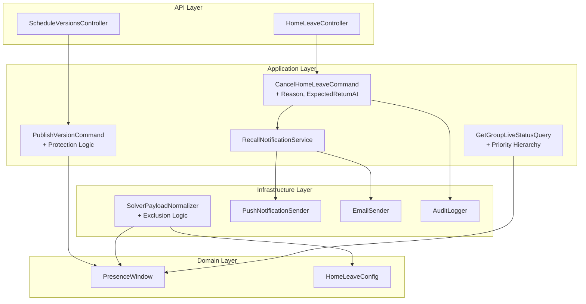

# Design Document: Home Leave Protection

## Overview

This feature ensures that approved home leave is treated as a high-priority, stable commitment that cannot be silently revoked by automated scheduling processes. It introduces four key mechanisms:

1. **Solver Exclusion** — People with active/future AtHome windows are excluded from the solver's available pool, preventing task assignment to people who are physically away.
2. **Publish-Time Protection** — The PublishVersionCommand preserves existing AtHome windows that were not produced by the current publish operation.
3. **Emergency Recall** — Home leave can only be cancelled through an explicit admin action with mandatory confirmation, notification delivery, and audit logging.
4. **Priority Hierarchy** — Live status correctly reflects AtHome as the highest-priority state, overriding assignment-based status.

The design builds on existing infrastructure: `SolverPayloadNormalizer`, `PublishVersionCommand`, `CancelHomeLeaveCommand`, `IPushNotificationSender`, `IEmailSender`, and `IAuditLogger`.

## Architecture



### Key Design Decisions

1. **Exclusion at payload-build time, not solver-side**: The SolverPayloadNormalizer filters people out before sending the payload. This keeps the solver stateless and unaware of home-leave protection logic.

2. **Protection via selective deletion**: Rather than adding a "protected" flag, the PublishVersionCommand only removes derived AtHome windows for people who appear in the new version's home_leave_assignments. All other AtHome windows are untouched.

3. **Recall as command enhancement**: Instead of creating a new command, we enhance the existing `CancelHomeLeaveCommand` with optional `Reason` and `ExpectedReturnAt` parameters, plus notification and audit side-effects.

4. **Notification as fire-and-forget with retry**: Push notifications use the existing `IPushNotificationSender` with a retry wrapper. Email uses `IEmailSender`. Both are non-blocking to the recall operation itself.

## Components and Interfaces

### 1. SolverPayloadNormalizer — Exclusion Logic

**Location**: `Jobuler.Infrastructure/Scheduling/SolverPayloadNormalizer.cs`

**Change**: After loading people, filter out those with AtHome windows overlapping the solver horizon. Skip filtering when `EmergencyFreezeActive && EmergencyUseForScheduling`.

```csharp
// New method in SolverPayloadNormalizer
private async Task<HashSet<Guid>> GetExcludedPersonIdsAsync(
    Guid spaceId, DateTime horizonStartDt, DateTime horizonEndDt,
    bool emergencyBypass, CancellationToken ct)
{
    if (emergencyBypass) return new HashSet<Guid>();

    var excludedIds = await _db.PresenceWindows.AsNoTracking()
        .Where(pw => pw.SpaceId == spaceId
            && pw.State == PresenceState.AtHome
            && pw.StartsAt < horizonEndDt
            && pw.EndsAt > horizonStartDt)
        .Select(pw => pw.PersonId)
        .Distinct()
        .ToListAsync(ct);

    return excludedIds.ToHashSet();
}
```

The exclusion is applied to `peopleDto` and `slotsDto` (no slots reference excluded person IDs).

### 2. PublishVersionCommand — Protection Logic

**Location**: `Jobuler.Application/Scheduling/Commands/PublishVersionCommand.cs`

**Change**: In `CreateHomeLeavePresenceWindowsAsync`, the stale-window removal query is scoped to only remove derived AtHome windows for people who appear in the new version's `home_leave_assignments`. Manual AtHome windows (`IsDerived = false`) are never touched.

Current behavior already partially implements this — it removes stale derived AtHome windows for `affectedPersonIds`. The protection enhancement ensures:
- Windows for people NOT in `affectedPersonIds` are never queried or deleted.
- Manual windows are excluded via `pw.IsDerived == true` filter (already present).
- The `StartsAt` and `EndsAt` of existing windows are never modified.

### 3. CancelHomeLeaveCommand — Enhanced Recall

**Location**: `Jobuler.Application/HomeLeave/Commands/CancelHomeLeaveCommand.cs`

**Changes**:
- Add `Reason` (string?, max 500 chars) and `ExpectedReturnAt` (DateTime?) parameters.
- Remove the `IsDerived == true` constraint — allow cancelling both manual and derived AtHome windows.
- After successful truncation/deletion, dispatch notification and audit log.
- Add confirmation requirement via a `Confirmed` boolean parameter (reject if false).

```csharp
public record CancelHomeLeaveCommand(
    Guid SpaceId,
    Guid PersonId,
    Guid PresenceWindowId,
    Guid RequestingUserId,
    bool Confirmed,
    string? Reason = null,
    DateTime? ExpectedReturnAt = null) : IRequest<CancelHomeLeaveResult>;
```

### 4. RecallNotificationService

**Location**: `Jobuler.Application/HomeLeave/Services/IRecallNotificationService.cs`

**New interface** for sending recall notifications (push + email) with retry logic.

```csharp
public interface IRecallNotificationService
{
    Task SendRecallNotificationAsync(
        Guid spaceId, Guid recalledPersonId,
        string adminName, string? reason,
        DateTime? expectedReturnAt,
        CancellationToken ct = default);
}
```

**Implementation** in `Jobuler.Infrastructure/Notifications/RecallNotificationService.cs`:
- Resolves the person's linked user ID.
- Sends push notification via `IPushNotificationSender.SendPushToUserAsync` with up to 3 retries (exponential backoff: 1s, 2s, 4s).
- Sends email via `IEmailSender.SendAsync`. On failure, logs and continues.

### 5. GetGroupLiveStatusQuery — Priority Hierarchy

**Location**: `Jobuler.Application/Scheduling/Queries/GetGroupLiveStatusQuery.cs`

**Change**: The current logic already checks presence windows first, then falls back to assignments. The fix ensures that when a person has BOTH an active AtHome window AND an active assignment, the AtHome window takes precedence. The current code already does this via the `if (presenceByPerson.TryGetValue(...))` check running before the assignment check. The `PresenceState.AtHome` case maps to `"at_home"` status.

No code change needed — the existing priority hierarchy is correct. We add a unit test to verify this behavior explicitly.

### 6. Validation

**Location**: `Jobuler.Application/HomeLeave/Validators/CancelHomeLeaveCommandValidator.cs`

```csharp
public class CancelHomeLeaveCommandValidator : AbstractValidator<CancelHomeLeaveCommand>
{
    public CancelHomeLeaveCommandValidator()
    {
        RuleFor(x => x.Reason)
            .MaximumLength(500)
            .When(x => x.Reason is not null);

        RuleFor(x => x.Confirmed)
            .Equal(true)
            .WithMessage("Recall must be explicitly confirmed.");
    }
}
```

## Data Models

### Modified: CancelHomeLeaveCommand

| Field | Type | Required | Description |
|-------|------|----------|-------------|
| SpaceId | Guid | Yes | Tenant scope |
| PersonId | Guid | Yes | Person being recalled |
| PresenceWindowId | Guid | Yes | The AtHome window to cancel |
| RequestingUserId | Guid | Yes | Admin performing the recall |
| Confirmed | bool | Yes | Must be true to proceed |
| Reason | string? | No | Free-text reason (max 500 chars) |
| ExpectedReturnAt | DateTime? | No | When the person should return |

### Modified: CancelHomeLeaveResult

| Field | Type | Description |
|-------|------|-------------|
| Deleted | bool | True if future window was fully deleted |
| Truncated | bool | True if in-progress window was truncated |
| TruncatedAt | DateTime? | Timestamp of truncation |
| NotificationSent | bool | Whether push notification was dispatched |

### Audit Log Entry (cancel_home_leave)

```json
{
  "action": "cancel_home_leave",
  "entity_type": "presence_window",
  "entity_id": "<presence_window_id>",
  "before_json": {
    "person_id": "<person_id>",
    "starts_at": "2024-01-15T08:00:00Z",
    "ends_at": "2024-01-17T08:00:00Z",
    "operation": "deleted|truncated"
  },
  "after_json": {
    "reason": "Emergency staffing need",
    "expected_return_at": "2024-01-16T06:00:00Z",
    "truncated_at": "2024-01-15T14:30:00Z"
  }
}
```

### Recall Notification Payload

```json
{
  "title": "Home Leave Recalled",
  "body": "You have been recalled from home leave by {adminName}. Reason: {reason}. Expected return: {expectedReturnAt}.",
  "tag": "home_leave_recall",
  "url": "/schedule"
}
```


## Correctness Properties

*A property is a characteristic or behavior that should hold true across all valid executions of a system — essentially, a formal statement about what the system should do. Properties serve as the bridge between human-readable specifications and machine-verifiable correctness guarantees.*

### Property 1: Solver exclusion completeness

*For any* set of people and any set of AtHome presence windows, the solver payload produced by `SolverPayloadNormalizer` SHALL NOT contain any person whose AtHome window overlaps with the solver horizon (StartsAt < horizonEnd AND EndsAt > horizonStart), and no slot in the payload SHALL reference an excluded person's ID.

**Validates: Requirements 1.1, 1.2, 1.4**

### Property 2: Emergency bypass includes all people

*For any* set of people with AtHome windows overlapping the solver horizon, WHEN `EmergencyFreezeActive = true` AND `EmergencyUseForScheduling = true`, the solver payload SHALL include all people regardless of their AtHome window status — the exclusion set SHALL be empty.

**Validates: Requirements 1.3**

### Property 3: Publish preserves non-target AtHome windows

*For any* set of existing AtHome presence windows and any new schedule version with `home_leave_assignments`, after `PublishVersionCommand` executes, all AtHome windows belonging to people who are NOT in the new version's `home_leave_assignments` list SHALL remain unchanged (same ID, StartsAt, EndsAt, IsDerived).

**Validates: Requirements 2.1, 2.2, 2.4, 7.3**

### Property 4: Manual AtHome windows are never removed by publish

*For any* manually-created AtHome window (`IsDerived = false`), regardless of whether the person appears in the new version's `home_leave_assignments`, the `PublishVersionCommand` SHALL NOT delete or modify that window.

**Validates: Requirements 2.3**

### Property 5: Recall notification contains all provided information

*For any* recall operation with a non-null admin name, optional reason, and optional expected return time, the generated notification payload SHALL contain the admin name, SHALL contain the reason text if provided, and SHALL contain the formatted expected return time if provided.

**Validates: Requirements 4.3, 4.4, 4.5, 8.3, 8.4**

### Property 6: Audit log entry contains complete recall information

*For any* successful recall operation (delete or truncate), the audit log entry SHALL include the admin's user ID, space ID, recalled person's ID, presence window ID, operation type ("deleted" or "truncated"), the original window's StartsAt and EndsAt in the before-snapshot, and the reason if one was provided.

**Validates: Requirements 5.1, 5.2, 5.3, 5.4**

### Property 7: Live status priority hierarchy

*For any* person in a group, the live status SHALL be determined by the following priority: (1) if an active AtHome window exists → "at_home", (2) else if an active assignment exists → "on_mission", (3) else → "free_in_base". The presence of an active assignment SHALL NOT override an active AtHome window.

**Validates: Requirements 6.1, 6.2, 6.3, 6.4, 6.5**

### Property 8: Reason length validation

*For any* string provided as the `Reason` parameter to `CancelHomeLeaveCommand`, if the string length exceeds 500 characters the command SHALL be rejected with a validation error, and if the string length is ≤ 500 characters (or null) the command SHALL NOT be rejected on the basis of reason length.

**Validates: Requirements 8.1, 8.5**

## Error Handling

| Scenario | Response | HTTP Status |
|----------|----------|-------------|
| Recall without SchedulePublish permission | `UnauthorizedAccessException` → 403 | 403 |
| Presence window not found | `KeyNotFoundException` → 404 | 404 |
| Window already ended (past) | `InvalidOperationException` → 400 | 400 |
| Recall not confirmed (`Confirmed = false`) | Validation error → 400 | 400 |
| Reason exceeds 500 characters | Validation error → 400 | 400 |
| Push notification delivery failure | Retry up to 3 times (1s, 2s, 4s backoff). After 3 failures, log error and continue. | N/A (async) |
| Email delivery failure | Log error and continue. Recall operation is not blocked. | N/A (async) |
| Invalid person_id in home_leave_assignments | Log warning, skip entry, continue with valid entries. | N/A |
| AtHome window conflicts with OnMission | Log warning, skip home-leave entry for that person. | N/A |

All errors bubble up to `ExceptionHandlingMiddleware` per architecture rules. Push/email failures are non-blocking — the recall operation succeeds regardless of notification delivery status.

## Testing Strategy

### Property-Based Tests (fast-check / FsCheck)

The project uses C# with xUnit. Property-based tests will use **FsCheck** (the .NET PBT library) with the `FsCheck.Xunit` integration.

Each property test runs a minimum of **100 iterations** with random inputs.

**Tag format**: `Feature: home-leave-protection, Property {N}: {title}`

| Property | Test Target | Generator Strategy |
|----------|-------------|-------------------|
| 1: Solver exclusion | `GetExcludedPersonIds` + payload filtering | Random people list + random AtHome windows with varying overlap positions relative to horizon |
| 2: Emergency bypass | `GetExcludedPersonIds` with emergency flag | Same as P1 but with emergency flags set |
| 3: Publish preserves non-target | `CreateHomeLeavePresenceWindowsAsync` logic | Random existing windows + random home_leave_assignments (subset of people) |
| 4: Manual windows preserved | `CreateHomeLeavePresenceWindowsAsync` logic | Random manual + derived windows, random assignments |
| 5: Notification content | `RecallNotificationService.BuildPayload` | Random admin names, reasons (including unicode, empty), return times |
| 6: Audit log content | `CancelHomeLeaveCommandHandler` audit call | Random window states, reasons, operation types |
| 7: Priority hierarchy | `ResolveStatus` pure function | Random combinations of AtHome windows and assignments |
| 8: Reason validation | `CancelHomeLeaveCommandValidator` | Random strings of length 0–1000 |

### Unit Tests (Example-Based)

- Recall rejected when `Confirmed = false`
- Recall rejected without SchedulePublish permission (mock `IPermissionService`)
- Push notification retries 3 times on failure
- Email failure doesn't block recall
- Recall of past window throws `InvalidOperationException`
- Future window is fully deleted (not truncated)
- In-progress window is truncated to now
- AtHome windows in presence DTO include both manual and derived

### Integration Tests

- End-to-end solver run with people on leave → no assignments to excluded people
- Publish with home_leave_assignments → correct windows created, existing preserved
- Full recall flow → notification dispatched, audit logged, window modified

### Test Configuration

```csharp
// FsCheck configuration for all property tests
[Property(MaxTest = 100, Arbitrary = new[] { typeof(HomeLeaveArbitraries) })]
```

Each property test references its design document property via a comment tag:
```csharp
// Feature: home-leave-protection, Property 1: Solver exclusion completeness
```
