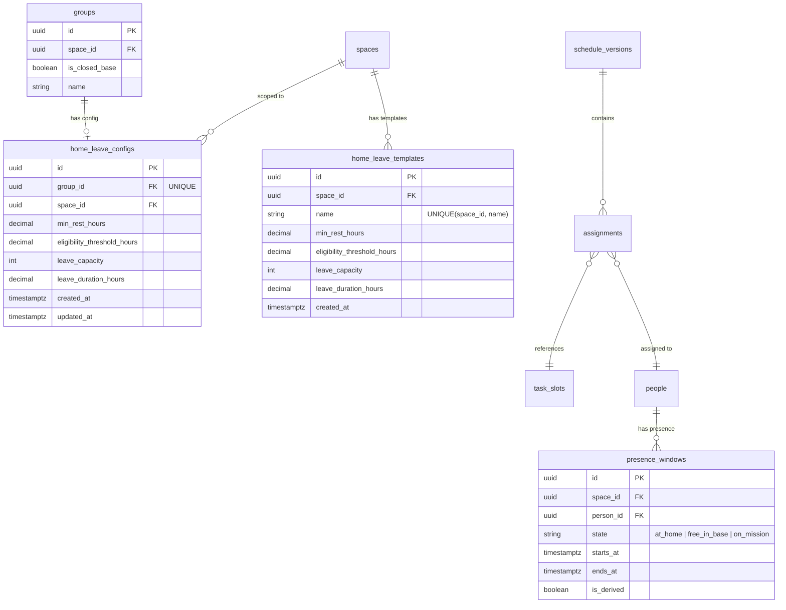
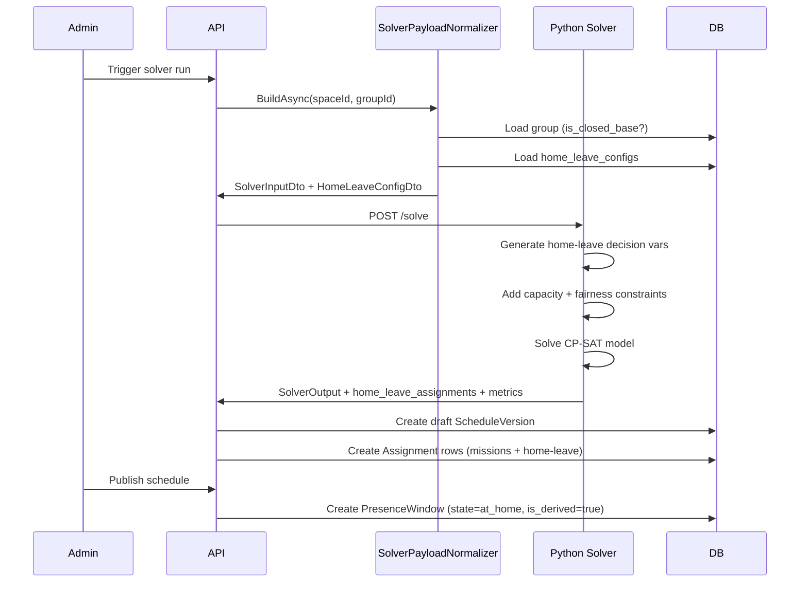

# Design Document: Home-Leave Scheduling

## Overview

Home-leave scheduling extends the Jobuler scheduling system to support closed-base military groups where personnel live on-base for extended periods. The feature introduces:

1. **Group-level configuration** — marking groups as "closed-base" and configuring leave parameters (min rest, eligibility threshold, capacity, duration).
2. **Solver extension** — new CP-SAT decision variables for home-leave slots, a fairness objective minimizing base-time-ratio variance, and capacity constraints.
3. **Presence state integration** — published home-leave assignments create `at_home` presence windows that block future mission assignment.
4. **Visualization** — a per-person base/home time panel with stacked bar charts and fairness warnings.
5. **Template management** — reusable leave configurations scoped to a space.

The design preserves backward compatibility: groups without `is_closed_base = true` behave identically to today. The solver payload gains an optional `home_leave_config` field; when absent, no home-leave logic executes.

---

## Architecture

```mermaid
flowchart TD
    subgraph Frontend ["Next.js Frontend"]
        ST[SettingsTab] -->|PUT /groups/:id| API
        ST -->|PUT /home-leave-config| API
        ST -->|POST/GET/DELETE /home-leave-templates| API
        SCH[ScheduleTab] -->|GET /schedule-versions/:id/home-leave-metrics| API
    end

    subgraph API [".NET API"]
        GC[GroupsController] --> CMD[UpdateGroupCommand]
        HLC[HomeLeaveConfigController] --> HLCMD[UpsertHomeLeaveConfigCommand]
        HLT[HomeLeaveTemplatesController] --> HLTCMD[Template CRUD Commands]
        SPN[SolverPayloadNormalizer] -->|reads home_leave_configs| DB
        SVW[SolverWorkerService] -->|POST /solve| Solver
        SVW -->|on result| PUB[PublishService]
        PUB -->|creates presence_windows| DB
    end

    subgraph Solver ["Python Solver"]
        ENG[engine.py] --> HLM[home_leave.py]
        HLM -->|decision vars| CPSAT[CP-SAT Model]
        ENG --> OBJ[objectives.py]
        OBJ -->|fairness objective| CPSAT
    end

    subgraph DB ["PostgreSQL"]
        GT[groups table] -->|is_closed_base| GT
        HCT[home_leave_configs]
        HLTT[home_leave_templates]
        PW[presence_windows]
        ASN[assignments]
    end
```

### Key Architectural Decisions

| Decision | Rationale |
|----------|-----------|
| Home-leave config in a **separate table** (`home_leave_configs`), not as constraint rules | It's a group-level configuration bundle, not a per-person/role constraint. Keeps the constraint system clean and avoids overloading `constraint_rules` with non-constraint data. |
| Solver gets a **new `home_leave_config` field** in the payload | Keeps the solver stateless — all context travels in the payload. No DB access from the solver. |
| Home-leave assignments stored in `assignments` table with **synthetic `task_type = "home_leave"`** | Reuses existing assignment infrastructure (schedule versions, publish/discard, overrides). The frontend can render them alongside mission assignments. |
| Fairness objective uses **minimax deviation** from group mean | Minimizing variance alone allows outliers; minimax ensures no single person is disproportionately burdened. Weight 500 places it below coverage (1000) but above burden preferences (≤99). |
| Eligibility threshold is **soft only** | Per user requirement — even at 16h rest it's fine to send people home. The threshold is a preference signal, not a gate. Only `min_rest_hours` is hard. |
| New solver module `home_leave.py` | Isolates home-leave constraint logic from existing `constraints.py`. Keeps the existing constraint functions untouched. |

---

## Components and Interfaces

### 1. Domain Layer (Jobuler.Domain)

#### New Entities

```csharp
// Domain/Groups/HomeLeaveConfig.cs
public class HomeLeaveConfig : AuditableEntity, ITenantScoped
{
    public Guid SpaceId { get; private set; }
    public Guid GroupId { get; private set; }
    public decimal MinRestHours { get; private set; }
    public decimal EligibilityThresholdHours { get; private set; }
    public int LeaveCapacity { get; private set; }
    public decimal LeaveDurationHours { get; private set; }
}

// Domain/Groups/HomeLeaveTemplate.cs
public class HomeLeaveTemplate : Entity, ITenantScoped
{
    public Guid SpaceId { get; private set; }
    public string Name { get; private set; }
    public decimal MinRestHours { get; private set; }
    public decimal EligibilityThresholdHours { get; private set; }
    public int LeaveCapacity { get; private set; }
    public decimal LeaveDurationHours { get; private set; }
}
```

#### Modified Entities

```csharp
// Domain/Groups/Group.cs — add:
public bool IsClosedBase { get; private set; } = false;
public void SetClosedBase(bool value) { IsClosedBase = value; Touch(); }
```

### 2. Application Layer (Jobuler.Application)

#### New Commands/Queries

| Command/Query | Purpose |
|---------------|---------|
| `UpsertHomeLeaveConfigCommand` | Create or update home-leave config for a group |
| `GetHomeLeaveConfigQuery` | Retrieve config for a group (returns defaults if none saved) |
| `CreateHomeLeaveTemplateCommand` | Save current config as a named template |
| `ListHomeLeaveTemplatesQuery` | List all templates for a space |
| `DeleteHomeLeaveTemplateCommand` | Remove a template |
| `LoadHomeLeaveTemplateQuery` | Get a specific template's values |

#### Solver Payload Extension

```csharp
// Application/Scheduling/Models/SolverInputDto.cs — add:
public record HomeLeaveConfigDto(
    bool Enabled,
    double MinRestHours,
    double EligibilityThresholdHours,
    int LeaveCapacity,
    double LeaveDurationHours);

// Add to SolverInputDto constructor:
// HomeLeaveConfigDto? HomeLeaveConfig = null
```

#### Solver Output Extension

```csharp
// Application/Scheduling/Models/SolverOutputDto.cs — add:
public class HomeLeaveAssignmentDto
{
    [JsonPropertyName("person_id")] public string PersonId { get; init; } = "";
    [JsonPropertyName("starts_at")] public string StartsAt { get; init; } = "";
    [JsonPropertyName("ends_at")] public string EndsAt { get; init; } = "";
}

public class HomeLeaveMetricDto
{
    [JsonPropertyName("person_id")] public string PersonId { get; init; } = "";
    [JsonPropertyName("total_base_hours")] public double TotalBaseHours { get; init; }
    [JsonPropertyName("total_home_hours")] public double TotalHomeHours { get; init; }
    [JsonPropertyName("base_time_ratio")] public double BaseTimeRatio { get; init; }
    [JsonPropertyName("leave_slot_count")] public int LeaveSlotCount { get; init; }
}

// Add to SolverOutputDto:
// [JsonPropertyName("home_leave_assignments")] public List<HomeLeaveAssignmentDto> HomeLeaveAssignments { get; init; } = new();
// [JsonPropertyName("home_leave_metrics")] public List<HomeLeaveMetricDto> HomeLeaveMetrics { get; init; } = new();
// [JsonPropertyName("fairness_variance")] public double? FairnessVariance { get; init; }
```

### 3. Infrastructure Layer

#### SolverPayloadNormalizer Extension

In `BuildAsync()`, after loading group data:
1. Check if `group.IsClosedBase == true`
2. Load `HomeLeaveConfig` for the group
3. If config exists with all fields populated → include `HomeLeaveConfigDto` in payload
4. If config missing → log warning, omit field

#### Publish Service Extension

When publishing a schedule version with home-leave assignments:
1. Create synthetic `TaskSlot` records with `task_type = "home_leave"` (or reuse a well-known task type ID)
2. Create `Assignment` records linking person → synthetic slot → schedule version
3. Create `PresenceWindow` records with `state = AtHome`, `is_derived = true`
4. Validate no overlap with existing `OnMission` presence windows

### 4. Solver Layer (Python)

#### New Module: `solver/home_leave.py`

```python
def add_home_leave_constraints(
    model, assign, home_leave_vars, slots, people, config, presence_windows
):
    """
    Adds:
    - Home-leave decision variables (one per person per possible start time)
    - Capacity constraint: at most leave_capacity people on leave at any hour
    - No-overlap: person on leave cannot be assigned to mission slots
    - Min-rest gate: person must have min_rest_hours before leave starts
    - One-at-a-time: person cannot have overlapping leave slots
    """

def add_home_leave_fairness_objective(
    model, home_leave_vars, people, config, horizon_hours
) -> list:
    """
    Returns penalty terms that minimize max deviation of base_time_ratio
    from group mean. Weight = 500.
    """

def add_home_leave_eligibility_preference(
    model, home_leave_vars, assign, slots, people, config, presence_windows
) -> list:
    """
    Soft preference: once a person exceeds eligibility_threshold_hours of
    continuous free_in_base time, prefer sending them home.
    """
```

#### Solver Input Extension

```python
# models/solver_input.py — add:
class HomeLeaveConfig(BaseModel):
    enabled: bool
    min_rest_hours: float
    eligibility_threshold_hours: float
    leave_capacity: int
    leave_duration_hours: float

# Add to SolverInput:
# home_leave_config: Optional[HomeLeaveConfig] = None
```

#### Solver Output Extension

```python
# models/solver_output.py — add:
class HomeLeaveAssignment(BaseModel):
    person_id: str
    starts_at: str  # ISO 8601 UTC
    ends_at: str    # ISO 8601 UTC

class HomeLeaveMetric(BaseModel):
    person_id: str
    total_base_hours: float
    total_home_hours: float
    base_time_ratio: float
    leave_slot_count: int

# Add to SolverOutput:
# home_leave_assignments: list[HomeLeaveAssignment] = []
# home_leave_metrics: list[HomeLeaveMetric] = []
# fairness_variance: Optional[float] = None
```

#### Engine Integration

In `engine.py`:
1. Check `input.home_leave_config` is present and `enabled == True`
2. Generate home-leave time slots (every hour boundary within horizon, duration = `leave_duration_hours`)
3. Create boolean decision variables: `home_leave[(person_idx, slot_start_hour)]`
4. Call `add_home_leave_constraints()`
5. Add fairness penalties to the objective
6. Extract results and build `HomeLeaveAssignment` + `HomeLeaveMetric` objects

### 5. API Layer

#### New Controller: `HomeLeaveConfigController`

```
PUT  /spaces/{spaceId}/groups/{groupId}/home-leave-config
GET  /spaces/{spaceId}/groups/{groupId}/home-leave-config
```

#### New Controller: `HomeLeaveTemplatesController`

```
POST   /spaces/{spaceId}/home-leave-templates
GET    /spaces/{spaceId}/home-leave-templates
DELETE /spaces/{spaceId}/home-leave-templates/{templateId}
GET    /spaces/{spaceId}/home-leave-templates/{templateId}
```

#### Modified Controller: `GroupsController`

Add `isClosedBase` field to the update endpoint request/response.

### 6. Frontend

#### SettingsTab Extension

- New "בסיס סגור" toggle in group settings
- Conditional "הגדרות חופשות" panel (visible when `isClosedBase = true`)
- Template save/load UI within the leave settings panel

#### ScheduleTab Extension

- New "זמן בבסיס / בבית" panel component (`HomeLeaveMetricsPanel.tsx`)
- Stacked bar chart per person (base vs. home time)
- Fairness warning when max deviation > 15pp
- Home-leave slots rendered on timeline with distinct styling

---

## Data Models

### Database Schema Changes

#### Migration: `042_home_leave.sql`

```sql
-- 1. Add is_closed_base to groups
ALTER TABLE groups ADD COLUMN is_closed_base BOOLEAN NOT NULL DEFAULT FALSE;

-- 2. Create home_leave_configs table
CREATE TABLE home_leave_configs (
    id UUID PRIMARY KEY DEFAULT gen_random_uuid(),
    group_id UUID NOT NULL UNIQUE REFERENCES groups(id) ON DELETE CASCADE,
    space_id UUID NOT NULL REFERENCES spaces(id) ON DELETE CASCADE,
    min_rest_hours DECIMAL NOT NULL,
    eligibility_threshold_hours DECIMAL NOT NULL,
    leave_capacity INTEGER NOT NULL,
    leave_duration_hours DECIMAL NOT NULL,
    created_at TIMESTAMPTZ NOT NULL DEFAULT NOW(),
    updated_at TIMESTAMPTZ NOT NULL DEFAULT NOW()
);

CREATE INDEX idx_home_leave_configs_group_id ON home_leave_configs(group_id);
CREATE INDEX idx_home_leave_configs_space_id ON home_leave_configs(space_id);

-- RLS
ALTER TABLE home_leave_configs ENABLE ROW LEVEL SECURITY;
CREATE POLICY home_leave_configs_tenant_isolation ON home_leave_configs
    USING (space_id = current_setting('app.current_space_id', TRUE)::UUID);

-- updated_at trigger
CREATE TRIGGER set_updated_at_home_leave_configs
    BEFORE UPDATE ON home_leave_configs
    FOR EACH ROW EXECUTE FUNCTION set_updated_at();

-- 3. Create home_leave_templates table
CREATE TABLE home_leave_templates (
    id UUID PRIMARY KEY DEFAULT gen_random_uuid(),
    space_id UUID NOT NULL REFERENCES spaces(id) ON DELETE CASCADE,
    name VARCHAR(100) NOT NULL,
    min_rest_hours DECIMAL NOT NULL,
    eligibility_threshold_hours DECIMAL NOT NULL,
    leave_capacity INTEGER NOT NULL,
    leave_duration_hours DECIMAL NOT NULL,
    created_at TIMESTAMPTZ NOT NULL DEFAULT NOW()
);

CREATE UNIQUE INDEX idx_home_leave_templates_space_name
    ON home_leave_templates(space_id, name);
CREATE INDEX idx_home_leave_templates_space_id ON home_leave_templates(space_id);

-- RLS
ALTER TABLE home_leave_templates ENABLE ROW LEVEL SECURITY;
CREATE POLICY home_leave_templates_tenant_isolation ON home_leave_templates
    USING (space_id = current_setting('app.current_space_id', TRUE)::UUID);
```

### Entity Relationship Diagram



### Solver Data Flow



### Validation Rules

| Field | Constraint | HTTP Status on Violation |
|-------|-----------|------------------------|
| `min_rest_hours` | 4 ≤ value ≤ 16 | 400 |
| `eligibility_threshold_hours` | min_rest_hours ≤ value ≤ 48 | 400 |
| `leave_capacity` | 1 ≤ value ≤ (group_member_count - 1) | 400 |
| `leave_duration_hours` | 12 ≤ value ≤ 168 | 400 |
| Template `name` | 1–100 chars, trimmed, no leading/trailing whitespace | 400 |
| Template `name` uniqueness | Unique per space | 409 |

---

## Correctness Properties

*A property is a characteristic or behavior that should hold true across all valid executions of a system — essentially, a formal statement about what the system should do. Properties serve as the bridge between human-readable specifications and machine-verifiable correctness guarantees.*

### Property 1: Home-leave config validation accepts valid inputs and rejects invalid inputs

*For any* tuple `(min_rest_hours, eligibility_threshold_hours, leave_capacity, leave_duration_hours, group_member_count)`, the validation function SHALL accept the input if and only if: `4 ≤ min_rest_hours ≤ 16` AND `min_rest_hours ≤ eligibility_threshold_hours ≤ 48` AND `1 ≤ leave_capacity ≤ group_member_count - 1` AND `12 ≤ leave_duration_hours ≤ 168`.

**Validates: Requirements 2.4, 2.5, 2.6, 2.7**

### Property 2: Solver payload includes home-leave config for closed-base groups with valid configuration

*For any* group where `is_closed_base = true` and a `home_leave_configs` record exists with all required fields populated, the solver payload built by `SolverPayloadNormalizer.BuildAsync` SHALL contain a `home_leave_config` field with `enabled = true` and values matching the stored configuration.

**Validates: Requirements 3.1, 7.3**

### Property 3: Minimum rest invariant — no assignment pair violates min rest

*For any* feasible solver output for a closed-base group, for every person in the output, no two consecutive mission assignments (sorted by start time) SHALL have a gap smaller than `min_rest_hours` between the end of the first and the start of the second — unless the person has an active emergency bypass.

**Validates: Requirements 3.2, 3.3**

### Property 4: Home-leave capacity invariant

*For any* feasible solver output with home-leave enabled, for every hour within the scheduling horizon, the number of people with an active home-leave assignment overlapping that hour SHALL NOT exceed `leave_capacity`.

**Validates: Requirements 4.5, 5.2**

### Property 5: Home-leave duration correctness

*For any* home-leave assignment in a feasible solver output, the duration `(ends_at - starts_at)` SHALL equal exactly `leave_duration_hours` from the group's configuration.

**Validates: Requirements 5.1**

### Property 6: No overlap between home-leave and mission assignments

*For any* feasible solver output, for every person, no mission assignment SHALL overlap in time with any of that person's home-leave assignments. Two time windows overlap if `starts_at_1 < ends_at_2` AND `starts_at_2 < ends_at_1`.

**Validates: Requirements 5.3**

### Property 7: No concurrent home-leave for the same person

*For any* feasible solver output, for every person, no two home-leave assignments SHALL overlap in time. A person must return to `free_in_base` before being eligible for a subsequent home-leave slot.

**Validates: Requirements 5.8**

### Property 8: Base-time ratio computation correctness

*For any* solver output with `home_leave_metrics`, for every person, `base_time_ratio` SHALL equal `total_base_hours / (total_base_hours + total_home_hours)` (rounded to 4 decimal places), where `total_base_hours` excludes any hours the person is in `blocked` state.

**Validates: Requirements 6.1, 6.2**

### Property 9: Disabled home-leave config produces empty output

*For any* solver input where `home_leave_config` is absent or has `enabled = false`, the solver output SHALL contain empty lists for both `home_leave_assignments` and `home_leave_metrics`, and `fairness_variance` SHALL be null.

**Validates: Requirements 7.2, 8.3**

### Property 10: Fairness warning threshold

*For any* set of `home_leave_metrics` with at least 2 entries, the UI fairness warning SHALL be displayed if and only if `max(base_time_ratio) - min(base_time_ratio) > 0.15`.

**Validates: Requirements 9.4**

### Property 11: Template name validation

*For any* string submitted as a template name, the system SHALL accept it if and only if: the trimmed length is between 1 and 100 characters inclusive, and the original string has no leading or trailing whitespace.

**Validates: Requirements 10.8**

### Property 12: Presence window overlap detection on publish

*For any* schedule version being published that contains home-leave assignments, if any home-leave assignment's time window `[starts_at, ends_at]` overlaps with an existing `on_mission` presence window for the same person, the publish operation SHALL be rejected.

**Validates: Requirements 11.2**

---

## Error Handling

### API Layer

| Scenario | HTTP Status | Response Body |
|----------|-------------|---------------|
| Missing `constraints.manage` permission | 403 | `{ "error": "Forbidden" }` |
| Missing `schedule.publish` permission | 403 | `{ "error": "Forbidden" }` |
| Group not found or wrong space | 404 | `{ "error": "Not found" }` |
| Template not found | 404 | `{ "error": "Not found" }` |
| Config validation failure | 400 | `{ "error": "<field> must be between X and Y" }` |
| Duplicate template name | 409 | `{ "error": "Template name already exists in this space" }` |
| Publish conflict (leave overlaps mission) | 409 | `{ "error": "Home-leave window conflicts with on_mission presence for person <name> at <time range>" }` |

### Solver Layer

| Scenario | Behavior |
|----------|----------|
| Infeasible due to min-rest conflicts | Return `feasible=false` with `HardConflict` entries describing the conflicting slots and people |
| Timeout with partial result | Return `timed_out=true`, `feasible=true` with best-known assignments (may have suboptimal fairness) |
| Timeout with no result | Return `timed_out=true`, `feasible=false` with conflict analysis |
| Zero eligible people for home-leave | Skip home-leave logic entirely, return empty lists |
| Single person in group | Skip fairness objective, still assign leave if capacity allows |

### Publish Service

| Scenario | Behavior |
|----------|----------|
| Home-leave assignment with unknown `person_id` | Discard entry, log warning in schedule run log |
| Home-leave assignment with `starts_at >= ends_at` | Discard entry, log warning |
| Overlap with existing `on_mission` window | Reject entire publish, return 409 with details |
| Cancellation of in-progress leave (starts_at in past) | Truncate presence window to current time, don't delete |

### Frontend

| Scenario | Behavior |
|----------|----------|
| API returns 403 on config save | Show error toast: "אין הרשאה לשנות הגדרות" |
| API returns 400 on config save | Show inline validation error next to the offending field |
| API returns 409 on template save | Show error: "שם התבנית כבר קיים" |
| No metrics data available | Hide the "זמן בבסיס / בבית" panel entirely |
| Solver returns infeasible | Show infeasibility banner with conflict descriptions |

---

## Testing Strategy

### Property-Based Tests (Python — Hypothesis)

The solver logic is pure-function computation ideal for PBT. Use **Hypothesis** (Python's PBT library) for the solver module.

**Configuration:**
- Minimum 100 iterations per property test (`@settings(max_examples=100)`)
- Each test tagged with: `# Feature: home-leave-scheduling, Property N: <property_text>`

**Properties to implement:**
1. **Property 3** — Min rest invariant on solver output
2. **Property 4** — Capacity invariant on solver output
3. **Property 5** — Leave duration correctness
4. **Property 6** — No leave-mission overlap
5. **Property 7** — No concurrent leave per person
6. **Property 8** — Base-time ratio computation
7. **Property 9** — Disabled config → empty output

**Generator strategy:**
- Generate random `HomeLeaveConfig` with valid parameters
- Generate random `PersonEligibility` lists (2–8 people)
- Generate random `TaskSlot` lists (3–20 slots) within a 3–7 day horizon
- Generate random `PresenceWindow` lists (some blocked, some free_in_base)
- Combine into valid `SolverInput` and run the solver

### Property-Based Tests (.NET — FsCheck via xUnit)

For the validation logic in the Application layer:

**Properties to implement:**
1. **Property 1** — Config validation correctness
2. **Property 11** — Template name validation

**Generator strategy:**
- Generate random tuples of config values (both valid and invalid ranges)
- Generate random strings for template names

### Property-Based Tests (TypeScript — fast-check)

For the frontend computation logic:

**Properties to implement:**
1. **Property 10** — Fairness warning threshold logic

**Generator strategy:**
- Generate random arrays of `base_time_ratio` values between 0.0 and 1.0

### Unit Tests (Example-Based)

| Area | Tests |
|------|-------|
| `HomeLeaveConfig` domain entity | Create with valid params, reject invalid params |
| `UpsertHomeLeaveConfigCommand` | Happy path, permission check, validation errors |
| `SolverPayloadNormalizer` | Includes config for closed-base, omits for non-closed-base, logs warning when config missing |
| Publish service | Creates presence windows, detects overlaps, handles cancellation |
| Template CRUD | Create, list, delete, duplicate name rejection |
| Frontend components | Toggle visibility, form defaults, template dropdown |

### Integration Tests

| Area | Tests |
|------|-------|
| Full solver pipeline | Trigger → normalize → solve → store draft → publish → presence windows |
| RLS policies | Verify tenant isolation on new tables |
| API endpoints | Full request/response cycle for all new endpoints |

### Test File Locations

```
apps/solver/tests/test_home_leave_properties.py    # PBT for solver properties
apps/solver/tests/test_home_leave_unit.py          # Unit tests for home_leave.py
apps/api/Jobuler.Tests/HomeLeave/                  # .NET unit + property tests
apps/web/__tests__/home-leave/                     # Frontend tests
```

