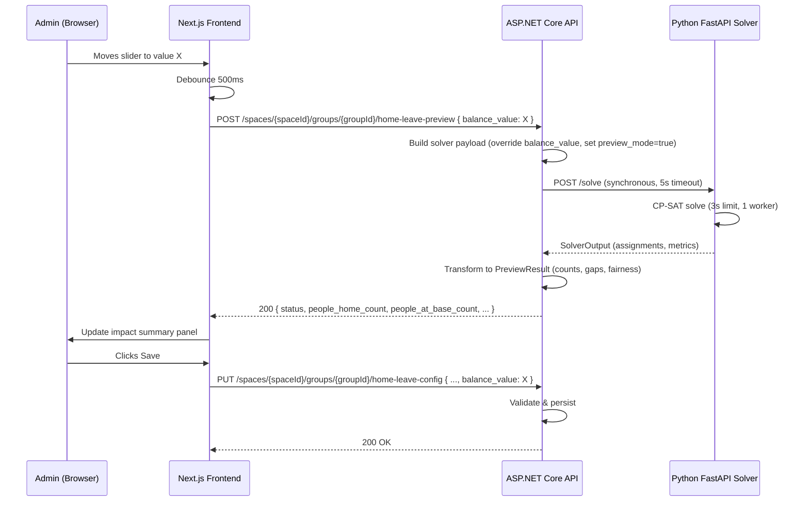

# Design Document: Home-Leave Slider

## Overview

This feature introduces an interactive slider control that replaces the abstract `priority_weight` concept with an intuitive 0–100 `balance_value` scale. Admins adjust a single slider to express their preference between "more people at base" (0) and "more people home" (100). A lightweight preview endpoint provides near-instant feedback showing the schedule impact of the chosen balance before committing to a full solver run.

The system spans all four layers:
- **Domain**: New `BalanceValue` property on `HomeLeaveConfig`
- **Infrastructure**: DB migration, updated solver payload builder, new preview orchestration
- **Application**: New `PreviewHomeLeaveCommand` + handler, updated `UpsertHomeLeaveConfigCommand`
- **API**: New preview controller endpoint, updated config endpoint
- **Solver**: `preview_mode` support, `balance_value` → weight mapping
- **Frontend**: Slider component, debounced preview requests, impact summary panel

---

## Architecture



### Key Architectural Decisions

1. **Synchronous preview** — The preview endpoint calls the solver directly (not via job queue) because the 3-second solver time limit + 5-second HTTP timeout keeps latency acceptable for interactive use. This is an exception to the architecture rule "never call solver synchronously from a controller" — justified because preview results are ephemeral and non-persisted.

2. **Linear weight mapping** — `weight = balance_value × 4` provides a simple, predictable relationship. The max weight of 400 is double the current default (200), giving the slider meaningful range above and below the current behavior.

3. **Reuse existing solver endpoint** — Rather than creating a separate `/preview` endpoint on the solver, we add a `preview_mode` flag to the existing `/solve` endpoint. This avoids code duplication and keeps the solver stateless.

4. **Preview result computed API-side** — The solver returns its standard `SolverOutput`. The API transforms it into the simplified `PreviewResult` format (counts, gaps, fairness spread). This keeps the solver generic and puts presentation logic in the API.

---

## Components and Interfaces

### Backend Components

#### 1. Domain Layer — `HomeLeaveConfig` Entity Extension

```csharp
// Added to HomeLeaveConfig.cs
public int BalanceValue { get; private set; } = 50;

public static HomeLeaveConfig Create(..., int balanceValue = 50) { ... }
public void Update(..., int? balanceValue = null) { ... }
private static void ValidateBalanceValue(int value) { ... }
```

#### 2. Application Layer — Commands & Queries

| Component | Type | Purpose |
|-----------|------|---------|
| `UpsertHomeLeaveConfigCommand` | Command | Extended with optional `BalanceValue` parameter |
| `PreviewHomeLeaveCommand` | Command | New — triggers preview solver run |
| `PreviewHomeLeaveHandler` | Handler | Builds payload, calls solver, transforms result |
| `HomeLeavePreviewResult` | DTO | Response model for preview endpoint |

#### 3. Infrastructure Layer — Solver Integration

| Component | Purpose |
|-----------|---------|
| `SolverPayloadNormalizer.BuildAsync` | Extended to include `balance_value` in `HomeLeaveConfigDto` |
| `SolverPayloadNormalizer.BuildPreviewAsync` | New method — builds payload with overridden balance_value and preview_mode=true |
| `ISolverClient.SolveAsync` | Existing HTTP client to solver — used for preview with reduced timeout |

#### 4. API Layer — Controllers

| Endpoint | Method | Purpose |
|----------|--------|---------|
| `/spaces/{spaceId}/groups/{groupId}/home-leave-config` | PUT | Updated to accept `balance_value` |
| `/spaces/{spaceId}/groups/{groupId}/home-leave-config` | GET | Updated to return `balance_value` |
| `/spaces/{spaceId}/groups/{groupId}/home-leave-preview` | POST | New — triggers preview |

### Solver Components

#### 5. Python Solver — Model Extensions

| Component | Change |
|-----------|--------|
| `HomeLeaveConfig` (Pydantic) | Add `balance_value: int = 50` field |
| `SolverInput` | Add `preview_mode: bool = False` field |
| `SolverOutput` | Add `solver_time_ms: int` field |
| `add_home_leave_eligibility_preference` | Use `balance_value × 4` as weight instead of hardcoded 200 |
| `solve()` in `engine.py` | Respect `preview_mode` (3s limit, 1 worker, no logging) |

### Frontend Components

#### 6. UI — React Components

| Component | Purpose |
|-----------|---------|
| `BalanceSlider` | Range input (0–100), Hebrew labels, keyboard accessible |
| `ImpactSummary` | Panel showing preview results (counts, bar, gaps, fairness) |
| `useHomeLeavePreview` | Custom hook — debounced API calls, request cancellation |

---

## Data Models

### Database Schema Change

```sql
-- Migration: AddBalanceValueToHomeLeaveConfigs
ALTER TABLE home_leave_configs
ADD COLUMN balance_value integer NOT NULL DEFAULT 50;

ALTER TABLE home_leave_configs
ADD CONSTRAINT chk_balance_value_range CHECK (balance_value >= 0 AND balance_value <= 100);
```

### Updated Domain Entity

```csharp
public class HomeLeaveConfig : AuditableEntity, ITenantScoped
{
    // ... existing fields ...
    public int BalanceValue { get; private set; } = 50;
}
```

### Updated Solver Payload DTO (C#)

```csharp
public record HomeLeaveConfigDto(
    [property: JsonPropertyName("enabled")]                     bool Enabled,
    [property: JsonPropertyName("min_rest_hours")]              double MinRestHours,
    [property: JsonPropertyName("eligibility_threshold_hours")] double EligibilityThresholdHours,
    [property: JsonPropertyName("leave_capacity")]              int LeaveCapacity,
    [property: JsonPropertyName("leave_duration_hours")]        double LeaveDurationHours,
    [property: JsonPropertyName("balance_value")]               int BalanceValue = 50);

public record SolverInputDto(
    // ... existing fields ...
    HomeLeaveConfigDto? HomeLeaveConfig = null,
    [property: JsonPropertyName("preview_mode")] bool PreviewMode = false);
```

### Updated Solver Input Model (Python)

```python
class HomeLeaveConfig(BaseModel):
    enabled: bool
    min_rest_hours: float
    eligibility_threshold_hours: float
    leave_capacity: int
    leave_duration_hours: float
    balance_value: int = 50  # 0–100, maps to weight 0–400

class SolverInput(BaseModel):
    # ... existing fields ...
    preview_mode: bool = False
```

### Preview Request/Response DTOs

```csharp
// Request
public record HomeLeavePreviewRequest(int BalanceValue);

// Response
public record HomeLeavePreviewResponse(
    string Status,           // "optimal" | "feasible" | "no_solution"
    int PeopleHomeCount,
    int PeopleAtBaseCount,
    int TotalHomeLeaveSlots,
    List<CoverageGapDto> CoverageGaps,
    decimal FairnessSpread,
    int SolverTimeMs);

public record CoverageGapDto(
    string StartsAt,
    string EndsAt,
    int AvailableCount);
```

### Solver Output Extension (Python)

```python
class SolverOutput(BaseModel):
    # ... existing fields ...
    solver_time_ms: int = 0  # wall-clock time spent solving
```

### Weight Mapping Formula

```
eligibility_weight = balance_value × 4

balance_value=0   → weight=0   (no preference to send people home)
balance_value=50  → weight=200 (current default behavior)
balance_value=100 → weight=400 (maximum preference to send people home)
```


---

## Correctness Properties

*A property is a characteristic or behavior that should hold true across all valid executions of a system — essentially, a formal statement about what the system should do. Properties serve as the bridge between human-readable specifications and machine-verifiable correctness guarantees.*

### Property 1: Balance value validation

*For any* integer value, the system SHALL accept it as a valid `balance_value` if and only if it is in the range [0, 100] inclusive. Values outside this range SHALL be rejected by domain validation, API validation, and database CHECK constraint alike.

**Validates: Requirements 1.3, 2.3, 9.3, 9.5**

### Property 2: Linear weight mapping

*For any* `balance_value` in [0, 100], the solver eligibility preference weight SHALL equal `balance_value × 4`. This mapping is linear, with boundary values: 0 → 0, 50 → 200, 100 → 400.

**Validates: Requirements 3.2, 3.3, 3.4**

### Property 3: Hard constraints invariant under balance_value changes

*For any* two distinct `balance_value` settings applied to the same group configuration, the set of hard constraints (capacity, min-rest, no-overlap, one-at-a-time) generated by the solver SHALL be identical. Only soft preference weights are affected by `balance_value`.

**Validates: Requirements 3.5**

### Property 4: Balance value persistence round-trip

*For any* valid `HomeLeaveConfig` with a `balance_value` in [0, 100], persisting the config and then reading it back SHALL return the same `balance_value`. The GET response SHALL include the exact value that was stored via PUT.

**Validates: Requirements 2.4, 2.5**

### Property 5: Solver payload includes correct balance_value

*For any* closed-base group with a stored `balance_value` B, the solver payload built for that group SHALL contain `home_leave_config.balance_value == B`. When a preview override value P is provided, the payload SHALL contain `balance_value == P` regardless of the stored value.

**Validates: Requirements 3.1, 4.2**

### Property 6: Preview result transformation completeness

*For any* valid `SolverOutput` containing home-leave assignments and metrics, the transformation to `HomeLeavePreviewResponse` SHALL produce: `people_home_count` equal to the count of distinct person_ids with at least one home-leave assignment, `people_at_base_count` equal to total group members minus `people_home_count`, and `total_home_leave_slots` equal to the total number of home-leave assignment entries.

**Validates: Requirements 5.1**

### Property 7: Coverage gap calculation correctness

*For any* set of home-leave assignments and a group with `leave_capacity` C and member count N, a coverage gap SHALL be reported for time window W if and only if the number of people on leave during W exceeds C (i.e., available people < N - C). The gap's `available_count` SHALL equal N minus the number of people on leave during that window.

**Validates: Requirements 5.2**

### Property 8: Solver status mapping

*For any* solver termination, the preview response `status` field SHALL be: `"optimal"` when the solver proves optimality, `"feasible"` when the solver finds a solution but cannot prove optimality within the time limit, and `"no_solution"` when no feasible solution is found within the time limit.

**Validates: Requirements 5.5**

### Property 9: Backward compatibility — omitting balance_value preserves stored value

*For any* existing `HomeLeaveConfig` with a stored `balance_value` B, sending a PUT request that omits the `balance_value` field SHALL leave the stored value unchanged at B.

**Validates: Requirements 10.3**

---

## Error Handling

| Scenario | HTTP Status | Response | Layer |
|----------|-------------|----------|-------|
| `balance_value` outside [0, 100] | 400 | `"balance_value must be between 0 and 100"` | Application (FluentValidation) |
| Caller lacks `constraints.manage` permission | 403 | Standard forbidden response | Application (IPermissionService) |
| Group not found | 400 | `"Group not found"` | Application handler |
| Group is not closed-base | 400 | `"Group is not a closed-base group"` | Application handler |
| Group has no home-leave config | 400 | `"Home-leave configuration not found for this group"` | Application handler |
| Solver preview times out (>5s HTTP) | 200 | `{ status: "no_solution", ... }` | API (catch timeout, return graceful response) |
| Solver service unreachable | 502 | `"Solver service unavailable"` | Infrastructure (HttpClient) |
| Network error during preview | 200 | `{ status: "no_solution", solver_time_ms: 0 }` | API (graceful degradation) |
| Invalid JSON in request body | 400 | Standard model binding error | ASP.NET middleware |

### Error Handling Design Decisions

1. **Preview never returns 5xx to the client** — If the solver is unreachable or times out, the API returns 200 with `status: "no_solution"`. This prevents the frontend from showing generic error states and allows the impact summary to display a meaningful "no solution found" message.

2. **Domain validation throws `InvalidOperationException`** — Caught by `ExceptionHandlingMiddleware` and mapped to 400, consistent with existing patterns.

3. **Frontend error resilience** — On preview failure, the UI retains the last successful preview result and shows an inline error message. The admin can still save the configuration even if preview is unavailable.

---

## Testing Strategy

### Unit Tests (Example-Based)

| Test | Layer | What it verifies |
|------|-------|-----------------|
| Slider renders with correct labels | Frontend | Hebrew labels present |
| Slider defaults to 50 when no stored value | Frontend | Default positioning |
| Keyboard accessibility (arrows, Page Up/Down) | Frontend | A11y compliance |
| Debounce fires after 500ms of inactivity | Frontend | Timing behavior |
| Stale response ignored when newer request pending | Frontend | Race condition handling |
| Impact summary shows "כיסוי מלא" when no gaps | Frontend | Conditional rendering |
| Impact summary shows warning when fairness > 0.15 | Frontend | Threshold behavior |
| Preview endpoint returns 403 without permission | API | Authorization |
| Preview endpoint returns 400 for non-closed-base group | API | Validation |
| Solver uses default weight 200 when balance_value absent | Solver | Backward compat |
| Preview mode uses 3s timeout and 1 worker | Solver | Configuration |

### Property-Based Tests

Property-based tests use **Hypothesis** (Python solver) and **FsCheck** (C# domain/application) to verify universal properties across randomized inputs. Each test runs a minimum of 100 iterations.

| Property | Library | Target |
|----------|---------|--------|
| Property 1: Balance value validation | FsCheck | `HomeLeaveConfig.ValidateBalanceValue` |
| Property 2: Linear weight mapping | Hypothesis | `add_home_leave_eligibility_preference` weight calculation |
| Property 3: Hard constraints invariant | Hypothesis | Solver constraint generation |
| Property 4: Persistence round-trip | FsCheck | `HomeLeaveConfig` Create → read back |
| Property 5: Payload includes balance_value | FsCheck | `SolverPayloadNormalizer.BuildAsync` |
| Property 6: Preview result transformation | FsCheck | Preview handler transformation logic |
| Property 7: Coverage gap calculation | FsCheck / Hypothesis | Gap detection algorithm |
| Property 8: Solver status mapping | Hypothesis | Status enum → string mapping |
| Property 9: Backward compat (omit retains) | FsCheck | `UpsertHomeLeaveConfigHandler` |

**Tag format**: `Feature: home-leave-slider, Property {N}: {title}`

### Integration Tests

| Test | What it verifies |
|------|-----------------|
| Full preview flow (API → Solver → Response) | End-to-end preview with real solver |
| Migration applies cleanly to existing data | DB schema change |
| Concurrent preview requests don't interfere | Thread safety |
| 5-second timeout enforced on solver call | HTTP client configuration |

### Test Configuration

- **Hypothesis**: `@settings(max_examples=100, deadline=timedelta(seconds=10))`
- **FsCheck**: `MaxTest = 100` per property
- **Preview integration tests**: Use a small group (3 people, 2 slots) to keep solver fast
