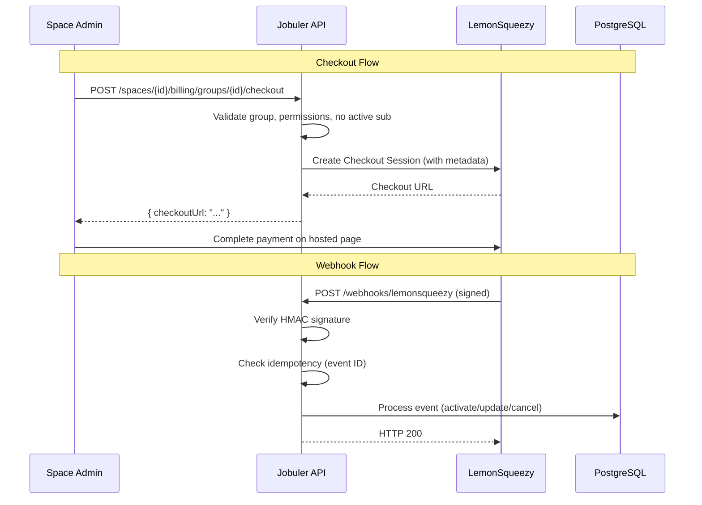

# Design Document: LemonSqueezy Billing Integration

## Overview

This design replaces the existing Stripe billing integration with LemonSqueezy as the payment provider. The migration touches the domain entity (`GroupSubscription`), the API layer (new webhook endpoint, updated checkout flow), and the infrastructure layer (new `ILemonSqueezyClient` service).

The architecture follows the existing Clean Architecture pattern:
- **Domain**: `GroupSubscription` entity with LemonSqueezy identifiers
- **Application**: MediatR commands/queries for checkout creation, webhook event handling
- **Infrastructure**: HTTP client for LemonSqueezy API, webhook signature verification
- **Api**: Controller endpoints for checkout, webhook reception, and test charge

Key design decisions:
1. **Webhook-first architecture** — All subscription state changes flow through webhooks, not direct API polling
2. **Idempotent processing** — Duplicate webhook events are detected via stored event IDs with 7-day TTL
3. **Deferred expiration** — Canceled subscriptions with future period end dates are expired by the existing `ExpireSubscriptionsJob`
4. **Test charge isolation** — Test transactions are tagged with metadata and never modify subscription state

## Architecture



### Layer Responsibilities

| Layer | Responsibility |
|-------|---------------|
| **Api** | `BillingController` (checkout, test-charge), `WebhookController` (public endpoint, signature verification, dispatch) |
| **Application** | `CreateCheckoutCommand`, `HandleWebhookCommand`, subscription event handlers via MediatR |
| **Domain** | `GroupSubscription` entity (state transitions, LemonSqueezy IDs), `SubscriptionStatus` enum |
| **Infrastructure** | `LemonSqueezyClient` (HTTP calls), `LemonSqueezySettings` (configuration), `WebhookEventLog` entity (idempotency) |

## Components and Interfaces

### 1. ILemonSqueezyClient (Application Interface)

```csharp
namespace Jobuler.Application.Billing;

public interface ILemonSqueezyClient
{
    /// <summary>Creates a checkout session and returns the checkout URL.</summary>
    Task<string> CreateCheckoutAsync(CreateCheckoutRequest request, CancellationToken ct);
}

public record CreateCheckoutRequest(
    string VariantId,
    Dictionary<string, string> Metadata,
    string? CustomerEmail = null);
```

### 2. IWebhookSignatureValidator (Application Interface)

```csharp
namespace Jobuler.Application.Billing;

public interface IWebhookSignatureValidator
{
    /// <summary>Verifies the HMAC-SHA256 signature of a LemonSqueezy webhook payload.</summary>
    bool Verify(string payload, string signature);
}
```

### 3. LemonSqueezyWebhookController (Api Layer)

```csharp
[ApiController]
[Route("webhooks/lemonsqueezy")]
[AllowAnonymous] // LemonSqueezy cannot provide bearer tokens
public class LemonSqueezyWebhookController : ControllerBase
{
    // POST /webhooks/lemonsqueezy
    // 1. Read raw body
    // 2. Verify signature via IWebhookSignatureValidator
    // 3. Parse event type
    // 4. Check idempotency (event ID already processed?)
    // 5. Dispatch to MediatR handler
    // 6. Return 200
}
```

### 4. BillingController Updates (Api Layer)

New endpoints added to existing `BillingController`:

```csharp
// POST /spaces/{spaceId}/billing/groups/{groupId}/checkout
// POST /spaces/{spaceId}/billing/test-charge
```

### 5. MediatR Commands

| Command | Purpose |
|---------|---------|
| `CreateCheckoutCommand` | Validates group, creates LemonSqueezy checkout session |
| `HandleSubscriptionCreatedCommand` | Activates subscription from webhook |
| `HandleSubscriptionUpdatedCommand` | Updates subscription status/period from webhook |
| `HandleSubscriptionCancelledCommand` | Cancels subscription from webhook |
| `HandlePaymentSuccessCommand` | Updates billing period, resets peak count |

### 6. LemonSqueezySettings (Infrastructure)

```csharp
namespace Jobuler.Infrastructure.Billing;

public class LemonSqueezySettings
{
    public string ApiKey { get; set; } = "";
    public string WebhookSecret { get; set; } = "";
    public string StoreId { get; set; } = "";
    public string DefaultVariantId { get; set; } = "";
    public string TestVariantId { get; set; } = "";
}
```

### 7. WebhookEventLog (Domain Entity)

```csharp
namespace Jobuler.Domain.Billing;

public class WebhookEventLog : Entity
{
    public string EventId { get; private set; } = "";
    public string EventType { get; private set; } = "";
    public DateTime ProcessedAt { get; private set; }

    public static WebhookEventLog Create(string eventId, string eventType) => new()
    {
        EventId = eventId,
        EventType = eventType,
        ProcessedAt = DateTime.UtcNow
    };
}
```

## Data Models

### GroupSubscription Entity (Updated)

```csharp
public class GroupSubscription : Entity, ITenantScoped
{
    public Guid SpaceId { get; private set; }
    public Guid GroupId { get; private set; }
    public string TierId { get; private set; } = "trial";
    public SubscriptionStatus Status { get; private set; } = SubscriptionStatus.Trialing;
    
    // Replaced: StripeSubscriptionId → LemonSqueezySubscriptionId
    public string? LemonSqueezySubscriptionId { get; private set; }
    // Replaced: StripeCustomerId → LemonSqueezyCustomerId
    public string? LemonSqueezyCustomerId { get; private set; }
    
    public DateTime? TrialEndsAt { get; private set; }
    public DateTime? CurrentPeriodStart { get; private set; }
    public DateTime? CurrentPeriodEnd { get; private set; }
    public int PeakMemberCount { get; private set; }
    public string? CouponCode { get; private set; }
    public int DiscountPercent { get; private set; }
    public DateTime? CanceledAt { get; private set; }

    // Updated method signature
    public void Activate(string tierId, string lemonSqueezySubscriptionId, 
        string lemonSqueezyCustomerId, DateTime periodStart, DateTime periodEnd)
    {
        TierId = tierId;
        Status = SubscriptionStatus.Active;
        LemonSqueezySubscriptionId = lemonSqueezySubscriptionId;
        LemonSqueezyCustomerId = lemonSqueezyCustomerId;
        CurrentPeriodStart = periodStart;
        CurrentPeriodEnd = periodEnd;
    }

    // New method for webhook-driven status updates
    public void UpdateStatus(SubscriptionStatus newStatus)
    {
        Status = newStatus;
    }

    // New method for period updates
    public void UpdatePeriod(DateTime periodStart, DateTime periodEnd)
    {
        if (periodStart != CurrentPeriodStart)
            PeakMemberCount = 0; // Reset peak on new period
        CurrentPeriodStart = periodStart;
        CurrentPeriodEnd = periodEnd;
    }
}
```

### WebhookEventLog Table

| Column | Type | Notes |
|--------|------|-------|
| `id` | UUID | PK |
| `event_id` | VARCHAR(255) | Unique, indexed |
| `event_type` | VARCHAR(100) | For debugging |
| `processed_at` | TIMESTAMP | UTC |

Rows older than 7 days are cleaned up by a periodic job or database TTL policy.

### LemonSqueezy Status Mapping

| LemonSqueezy Status | SubscriptionStatus Enum |
|---------------------|------------------------|
| `active` | Active |
| `on_trial` | Trialing |
| `past_due` | PastDue |
| `cancelled` | Canceled |
| `expired` | Expired |

### Database Migration

```sql
-- Rename Stripe columns to LemonSqueezy
ALTER TABLE group_subscriptions 
    RENAME COLUMN stripe_subscription_id TO lemonsqueezy_subscription_id;
ALTER TABLE group_subscriptions 
    RENAME COLUMN stripe_customer_id TO lemonsqueezy_customer_id;

-- Create webhook event log table
CREATE TABLE webhook_event_logs (
    id UUID PRIMARY KEY DEFAULT gen_random_uuid(),
    event_id VARCHAR(255) NOT NULL UNIQUE,
    event_type VARCHAR(100) NOT NULL,
    processed_at TIMESTAMP NOT NULL DEFAULT NOW()
);

CREATE INDEX idx_webhook_event_logs_event_id ON webhook_event_logs(event_id);
CREATE INDEX idx_webhook_event_logs_processed_at ON webhook_event_logs(processed_at);
```

## Correctness Properties

*A property is a characteristic or behavior that should hold true across all valid executions of a system — essentially, a formal statement about what the system should do. Properties serve as the bridge between human-readable specifications and machine-verifiable correctness guarantees.*

### Property 1: Webhook signature verification is sound

*For any* webhook payload and signing secret, the webhook handler SHALL accept the request if and only if the provided signature matches the HMAC-SHA256 of the payload computed with the configured secret.

**Validates: Requirements 2.1, 2.2**

### Property 2: Malformed payloads are rejected

*For any* webhook request body that is not valid JSON or lacks required fields (event type, event ID), the webhook handler SHALL return HTTP 400 without modifying any subscription state.

**Validates: Requirements 2.5**

### Property 3: Unrecognized event types are acknowledged without processing

*For any* webhook event with a valid signature whose event type is not in the set {subscription_created, subscription_updated, subscription_cancelled, subscription_payment_success}, the handler SHALL return HTTP 200 and not modify any subscription state.

**Validates: Requirements 2.7**

### Property 4: Subscription creation maps to correct entity state

*For any* valid `subscription_created` webhook payload with status "active" or "on_trial", the GroupSubscription entity SHALL be updated such that: if status is "active" then Status = Active and LemonSqueezySubscriptionId and LemonSqueezyCustomerId are stored and period dates are set; if status is "on_trial" then Status = Trialing and TrialEndsAt matches the payload trial end date.

**Validates: Requirements 3.1, 3.2**

### Property 5: Already-activated subscription ignores duplicate creation events

*For any* GroupSubscription that already has Status = Active or Trialing with a non-null LemonSqueezySubscriptionId, processing a `subscription_created` event SHALL not modify the entity state.

**Validates: Requirements 3.4**

### Property 6: Unrecognized creation statuses are skipped

*For any* `subscription_created` webhook payload whose status is not "active" or "on_trial", the handler SHALL not activate or modify the GroupSubscription.

**Validates: Requirements 3.5**

### Property 7: Unrecognized update statuses are skipped

*For any* `subscription_updated` webhook payload whose LemonSqueezy status string is not in the defined mapping set {"active", "on_trial", "past_due", "cancelled", "expired"}, the handler SHALL not modify the GroupSubscription status.

**Validates: Requirements 4.3**

### Property 8: Period dates are updated when they differ

*For any* `subscription_updated` webhook payload where the period start or end dates differ from the currently stored values, the GroupSubscription SHALL be updated with the new dates from the payload.

**Validates: Requirements 4.4**

### Property 9: Transition to Active reactivates the group

*For any* GroupSubscription with Status in {Trialing, PastDue, Canceled, Expired} whose associated group is deactivated, when a `subscription_updated` event transitions the status to Active, the group SHALL be reactivated.

**Validates: Requirements 4.5**

### Property 10: Cancellation sets status and timestamp

*For any* GroupSubscription with Status in {Trialing, Active, PastDue}, when a `subscription_cancelled` event is processed, the Status SHALL become Canceled and CanceledAt SHALL be set to a UTC timestamp.

**Validates: Requirements 5.1**

### Property 11: Cancellation deactivates group if and only if period has ended

*For any* GroupSubscription receiving a cancellation event, the associated group SHALL be deactivated if and only if CurrentPeriodEnd is null or in the past. If CurrentPeriodEnd is in the future, the group SHALL remain active.

**Validates: Requirements 5.2, 5.3**

### Property 12: Already-canceled subscriptions ignore cancellation events

*For any* GroupSubscription with Status = Canceled or Expired, processing a `subscription_cancelled` event SHALL not modify the entity state.

**Validates: Requirements 5.4**

### Property 13: Payment success updates period and conditionally resets peak

*For any* `subscription_payment_success` event, the GroupSubscription billing period SHALL be updated to the new dates. If the new period start differs from the current period start, PeakMemberCount SHALL be reset to 0.

**Validates: Requirements 6.1, 6.3**

### Property 14: Payment success transitions PastDue to Active

*For any* GroupSubscription with Status = PastDue, when a `subscription_payment_success` event is processed, the Status SHALL become Active.

**Validates: Requirements 6.2**

### Property 15: Test charges never modify subscriptions

*For any* webhook payload where metadata contains `charge_type = "test-charge"`, no GroupSubscription entity SHALL be created, modified, or deleted regardless of other payload content.

**Validates: Requirements 8.5**

### Property 16: Missing configuration prevents startup

*For any* combination where one or more required LemonSqueezy configuration values (ApiKey, WebhookSecret, StoreId, DefaultVariantId) are missing or whitespace-only, the service SHALL fail to start with an error message identifying the specific missing value(s).

**Validates: Requirements 9.4**

### Property 17: Duplicate event IDs are idempotent

*For any* webhook event that has already been processed (same event ID exists in WebhookEventLog), re-processing SHALL not modify any subscription state and SHALL return HTTP 200.

**Validates: Requirements 10.1**

### Property 18: No-op when incoming data matches current state

*For any* `subscription_updated` event where the status and period dates in the payload exactly match the current GroupSubscription values, no database write or audit log entry SHALL be produced.

**Validates: Requirements 10.3**

### Property 19: Checkout is rejected for active or trialing subscriptions

*For any* group that already has a GroupSubscription with Status = Active or Trialing, a checkout request SHALL be rejected with an error response.

**Validates: Requirements 1.6**

## Error Handling

| Scenario | HTTP Status | Behavior |
|----------|-------------|----------|
| Invalid webhook signature | 401 | Log warning, reject |
| Malformed webhook payload | 400 | Log error details, reject |
| Unrecognized event type | 200 | Log info, acknowledge |
| Missing GroupSubscription for webhook | 200 | Log warning, skip (don't fail webhook) |
| LemonSqueezy API error on checkout | 500 | Return error message (no secrets), log full error |
| Group not found for checkout | 404 | Standard not-found response |
| Already has active subscription | 400 | "Group already has an active subscription" |
| Missing BillingManage permission | 403 | Standard forbidden response |
| Duplicate webhook event ID | 200 | Skip processing, acknowledge |
| Missing configuration at startup | Fatal | Throw with specific missing key name |
| Concurrent duplicate webhooks | 200 | Database unique constraint on event_id ensures only one processes |

All exceptions bubble up to `ExceptionHandlingMiddleware` per architecture rules. The webhook controller catches specific exceptions to return appropriate HTTP codes to LemonSqueezy (always 200 for processed events, even if the subscription doesn't exist).

## Testing Strategy

### Property-Based Tests (fast-check or FsCheck for .NET)

The project will use **FsCheck** (the standard .NET property-based testing library) integrated with xUnit.

Each correctness property above maps to a single property-based test with minimum 100 iterations. Tests will use mocked `AppDbContext` (in-memory EF Core provider) and mocked `ILemonSqueezyClient`.

**Tag format**: `Feature: lemonsqueezy-billing, Property {N}: {title}`

Key generators needed:
- `Arbitrary<GroupSubscription>` — generates subscriptions in various states
- `Arbitrary<LemonSqueezyWebhookPayload>` — generates valid/invalid webhook payloads
- `Arbitrary<string>` for event IDs, subscription IDs, customer IDs
- `Arbitrary<DateTime>` for period dates (past, present, future)
- `Arbitrary<SubscriptionStatus>` for status transitions

### Unit Tests (xUnit)

- Status mapping (5 concrete examples for the finite mapping)
- Checkout metadata includes spaceId and groupId
- Test charge metadata includes `charge_type=test-charge`
- Webhook endpoint is `[AllowAnonymous]`
- Permission checks on checkout and test-charge endpoints
- Group not found returns 404
- LemonSqueezy API error returns error message without secrets

### Integration Tests

- Full webhook flow: signed request → event processing → database state change
- Checkout flow with mocked LemonSqueezy API
- Concurrent duplicate webhook handling (database unique constraint)
- Configuration validation at startup (missing values)
- ExpireSubscriptionsJob correctly expires canceled subscriptions past period end

### Test Configuration

```json
{
  "LemonSqueezy": {
    "ApiKey": "test_api_key",
    "WebhookSecret": "test_webhook_secret",
    "StoreId": "test_store_id",
    "DefaultVariantId": "test_variant_id",
    "TestVariantId": "test_variant_id_small"
  }
}
```
