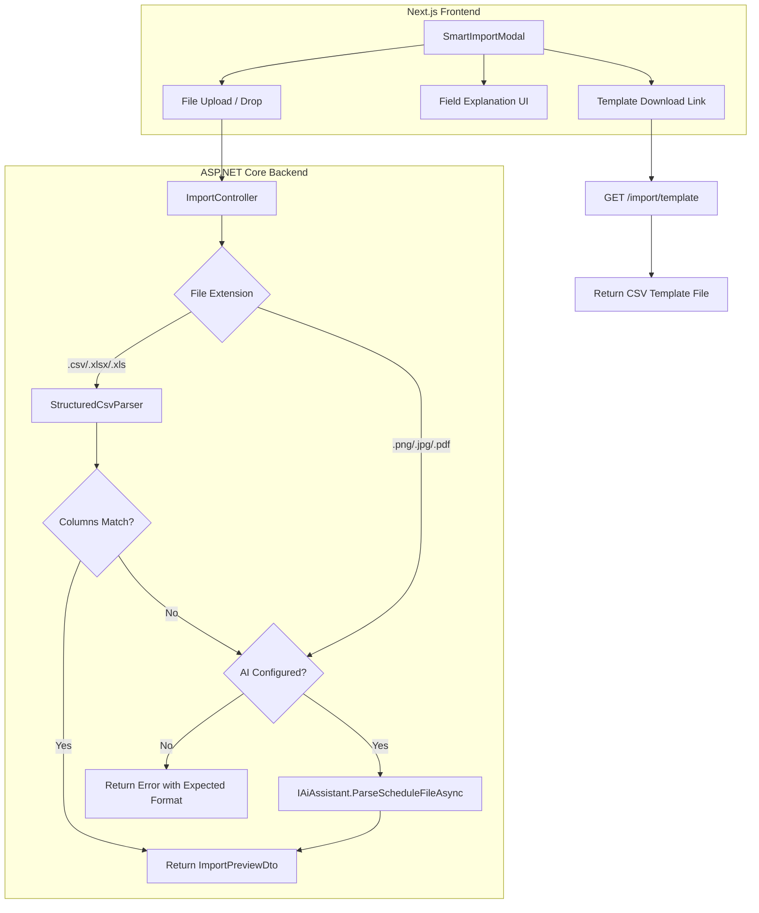
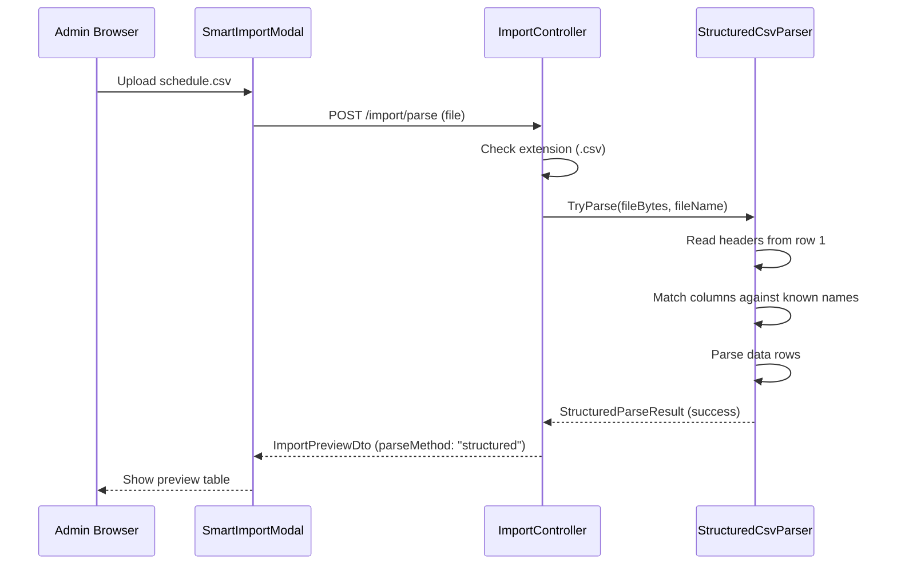
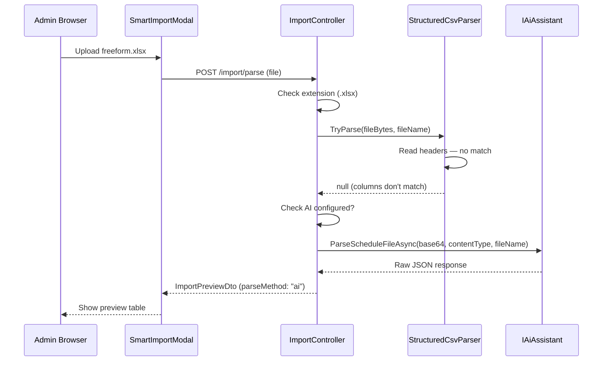
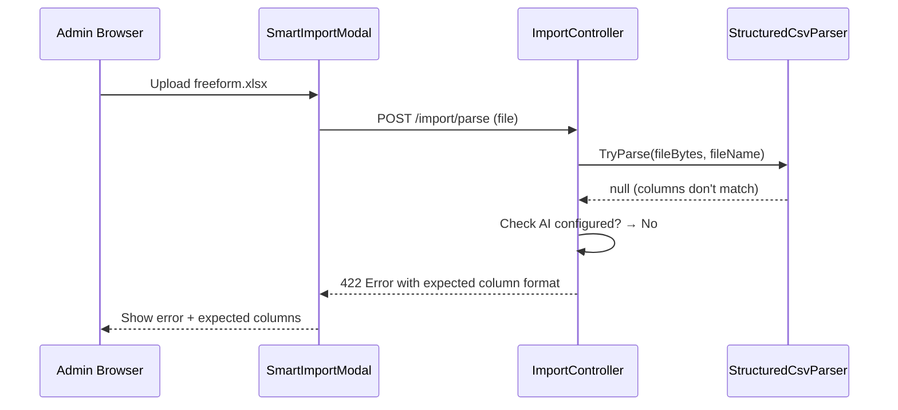

# Design Document: Manual Import Fallback

## Overview

The Manual Import Fallback feature adds auto-detection logic to the existing schedule import flow so that structured CSV/Excel files are parsed directly without AI. When a file is uploaded, the system first attempts to match the file's columns against a known schema. If all required columns are found, the file is parsed deterministically and returned as an `ImportPreviewDto` — no AI involved. If the columns don't match the expected structure, the system falls back to AI parsing (if configured) or returns a descriptive error explaining the expected format.

This ensures the import feature is fully functional even without an AI API key configured, while preserving the existing AI-powered flow for unstructured files (images, PDFs, free-form spreadsheets).

## Architecture



## Components and Interfaces

### Component 1: StructuredCsvParser

**Purpose**: Parses CSV/Excel files with known column structure into `ImportPreviewDto` without AI.

**Interface**:
```csharp
public interface IStructuredImportParser
{
    /// <summary>
    /// Attempts to parse a CSV/Excel file using known column structure.
    /// Returns null if columns don't match the expected schema.
    /// </summary>
    StructuredParseResult? TryParse(byte[] fileContent, string fileName);
}

public record StructuredParseResult(
    List<string> People,
    List<ImportTaskDto> Tasks,
    List<ImportAssignmentDto> Assignments);

public record ColumnMapping(
    int PersonNameIndex,
    int TaskNameIndex,
    int DayOfWeekIndex,
    int StartHourIndex,
    int EndHourIndex,
    int? ShiftDurationIndex,
    int? RequiredHeadcountIndex);
```

**Responsibilities**:
- Detect file format (CSV vs Excel) based on extension
- Read headers from the first row
- Match headers against known column names (Hebrew and English variants)
- Parse data rows into structured DTOs
- Normalize day-of-week values (Hebrew abbreviations → English lowercase)
- Validate hour values (0-23 range)
- Extract unique people and tasks from assignment rows
- Return `null` if required columns are not found (triggering fallback)

### Component 2: ImportController (Extended)

**Purpose**: Orchestrates the parse flow with structured-first strategy and adds template download endpoint.

**Interface**:
```csharp
// Existing endpoint — behavior changes internally
[HttpPost("parse")]
public async Task<IActionResult> Parse(Guid spaceId, Guid groupId, IFormFile file, CancellationToken ct);

// New endpoint — download CSV template
[HttpGet("template")]
public IActionResult DownloadTemplate(Guid spaceId, Guid groupId);
```

**Responsibilities**:
- For CSV/Excel files: attempt structured parsing first, fall back to AI
- For image/PDF files: go directly to AI parsing
- Serve a pre-formatted CSV template file for download
- Return clear error messages when neither parsing method is available

### Component 3: SmartImportModal (Extended)

**Purpose**: Enhanced upload UI with field explanation and template download.

**Interface**:
```typescript
// New UI elements added to the idle state
interface SmartImportModalExtensions {
  templateDownloadUrl: string;
  fieldExplanation: React.ReactNode;
  parseMethodIndicator: "csv" | "ai" | null; // shown in preview
}
```

**Responsibilities**:
- Display expected CSV column format explanation in the upload area
- Provide a "Download template" link that fetches the CSV template
- Show which parsing method was used (structured vs AI) in the preview state
- Display clear error messages when structured parsing fails and AI is unavailable

## Data Models

### Model 1: Column Name Mappings

```csharp
public static class ImportColumnNames
{
    public static readonly Dictionary<string, string[]> RequiredColumns = new()
    {
        ["person_name"] = new[] { "person_name", "שם", "name", "שם_מלא" },
        ["task_name"] = new[] { "task_name", "משימה", "task", "תפקיד" },
        ["day_of_week"] = new[] { "day_of_week", "יום", "day" },
        ["start_hour"] = new[] { "start_hour", "שעת_התחלה", "start", "התחלה" },
        ["end_hour"] = new[] { "end_hour", "שעת_סיום", "end", "סיום" },
    };

    public static readonly Dictionary<string, string[]> OptionalColumns = new()
    {
        ["shift_duration_hours"] = new[] { "shift_duration_hours", "משך_משמרת", "duration" },
        ["required_headcount"] = new[] { "required_headcount", "נדרשים", "headcount" },
    };
}
```

**Validation Rules**:
- All 5 required columns must be present (matched case-insensitively)
- `start_hour` and `end_hour` must be integers in range 0-23
- `day_of_week` must map to a valid day (English or Hebrew abbreviation)
- `person_name` and `task_name` must be non-empty strings
- Rows with invalid data are skipped (not rejected entirely)

### Model 2: Day-of-Week Normalization

```csharp
public static class DayOfWeekMapper
{
    private static readonly Dictionary<string, string> Mappings = new(StringComparer.OrdinalIgnoreCase)
    {
        // English
        ["sunday"] = "sunday", ["monday"] = "monday", ["tuesday"] = "tuesday",
        ["wednesday"] = "wednesday", ["thursday"] = "thursday",
        ["friday"] = "friday", ["saturday"] = "saturday",
        // Short English
        ["sun"] = "sunday", ["mon"] = "monday", ["tue"] = "tuesday",
        ["wed"] = "wednesday", ["thu"] = "thursday", ["fri"] = "friday", ["sat"] = "saturday",
        // Hebrew abbreviations
        ["א׳"] = "sunday", ["ב׳"] = "monday", ["ג׳"] = "tuesday",
        ["ד׳"] = "wednesday", ["ה׳"] = "thursday", ["ו׳"] = "friday", ["ש׳"] = "saturday",
        // Hebrew without geresh
        ["א"] = "sunday", ["ב"] = "monday", ["ג"] = "tuesday",
        ["ד"] = "wednesday", ["ה"] = "thursday", ["ו"] = "friday", ["ש"] = "saturday",
        // Hebrew full names
        ["ראשון"] = "sunday", ["שני"] = "monday", ["שלישי"] = "tuesday",
        ["רביעי"] = "wednesday", ["חמישי"] = "thursday", ["שישי"] = "friday", ["שבת"] = "saturday",
    };

    public static string? Normalize(string input) =>
        Mappings.TryGetValue(input.Trim(), out var day) ? day : null;
}
```

### Model 3: ImportPreviewDto (Extended)

```csharp
// Existing DTO — add ParseMethod field
public record ImportPreviewDto(
    List<string> People,
    List<ImportTaskDto> Tasks,
    List<ImportAssignmentDto> Assignments,
    string? AiConfidence,
    string? ParseMethod);  // "structured" | "ai" — new field
```

## Sequence Diagrams

### Structured CSV Parse (Happy Path)



### Fallback to AI



### No AI Available — Error



## Error Handling

### Error Scenario 1: Columns Not Found, AI Not Configured

**Condition**: CSV/Excel file uploaded but required columns not detected, and `AI:ApiKey` is not set.
**Response**: Return HTTP 422 with a structured error containing the expected column names in both Hebrew and English.
**Recovery**: Admin downloads the template, reformats their file, and re-uploads.

### Error Scenario 2: CSV Parse Errors (Partial)

**Condition**: Columns match but some rows have invalid data (e.g., hour > 23, empty name).
**Response**: Skip invalid rows, include a `warnings` list in the response indicating which rows were skipped and why.
**Recovery**: Admin reviews the preview (which shows only valid rows) and can re-upload a corrected file.

### Error Scenario 3: Empty File or No Data Rows

**Condition**: File has headers but zero valid data rows.
**Response**: Return HTTP 400 with error message "File contains no valid data rows."
**Recovery**: Admin checks their file content and re-uploads.

### Error Scenario 4: Excel Library Parse Failure

**Condition**: .xlsx/.xls file is corrupted or uses unsupported features.
**Response**: Fall back to AI parsing (if available) or return HTTP 400 with generic parse error.
**Recovery**: Admin exports their spreadsheet as CSV and re-uploads.

## Testing Strategy

### Unit Testing Approach

- Test `StructuredCsvParser.TryParse` with various CSV inputs:
  - Valid CSV with English headers
  - Valid CSV with Hebrew headers
  - Mixed valid/invalid rows (verify skipping)
  - Missing required columns (verify null return)
  - Edge cases: empty file, headers only, BOM characters
- Test `DayOfWeekMapper.Normalize` with all supported formats
- Test the orchestration logic in the command handler (structured → AI fallback)

### Property-Based Testing Approach

**Property Test Library**: FsCheck (for .NET) or fast-check (for TypeScript frontend tests)

- Round-trip: Generate random valid assignment data → write to CSV → parse → verify data matches
- Column detection: For any permutation of valid column names, parser should detect them
- Day normalization: For any valid day input, normalization produces a valid English day name

### Integration Testing Approach

- End-to-end test: Upload a structured CSV via the API endpoint, verify `ImportPreviewDto` returned with `parseMethod: "structured"`
- Fallback test: Upload a non-matching CSV with AI mocked, verify AI is called
- Template download: Verify GET `/import/template` returns a valid CSV file with correct headers

## Security Considerations

- **CSV Injection Prevention**: Strip leading `=`, `+`, `-`, `@`, `\t`, `\r` characters from cell values to prevent formula injection when data is later exported
- **File Size Limit**: Existing 10MB limit applies; structured parser should also enforce a maximum row count (e.g., 10,000 rows) to prevent memory exhaustion
- **Input Sanitization**: All parsed string values are trimmed and validated before being stored
- **Tenant Isolation**: Template download endpoint requires authentication and space membership (existing pattern)
- **No Path Traversal**: File content is read from the uploaded stream only, never from disk paths

## Correctness Properties

*A property is a characteristic or behavior that should hold true across all valid executions of a system — essentially, a formal statement about what the system should do. Properties serve as the bridge between human-readable specifications and machine-verifiable correctness guarantees.*

### Property 1: Parse Round-Trip Consistency

*For any* valid set of assignment data (people, tasks, assignments with valid days/hours), writing that data to CSV format and then parsing it with the Structured_Parser SHALL produce an equivalent set of people, tasks, and assignments.

**Validates: Requirements 1.1, 2.1**

### Property 2: Column Detection Across Variants

*For any* permutation of valid column names (Hebrew or English variants, any casing), the Structured_Parser SHALL successfully detect all required columns and return a non-null result.

**Validates: Requirements 1.2, 1.3**

### Property 3: Missing Required Columns Yield Null

*For any* CSV file that is missing at least one required column (person_name, task_name, day_of_week, start_hour, end_hour), the Structured_Parser SHALL return null.

**Validates: Requirements 1.6**

### Property 4: Day Normalization Completeness

*For any* valid day-of-week input (Hebrew abbreviation with/without geresh, full Hebrew name, English full/abbreviated name in any case), the Day_Mapper SHALL return a non-null lowercase English day name that is one of: sunday, monday, tuesday, wednesday, thursday, friday, saturday.

**Validates: Requirements 3.1, 3.2, 3.3, 3.4**

### Property 5: Invalid Day Values Yield Null

*For any* string that is not in the set of recognized day-of-week representations, the Day_Mapper SHALL return null.

**Validates: Requirements 3.5**

### Property 6: CSV Injection Prevention

*For any* cell value that begins with a formula-triggering character (=, +, -, @, \t, \r), the Structured_Parser SHALL produce a sanitized value with those leading characters removed before further processing.

**Validates: Requirements 9.1, 9.2**

### Property 7: Invalid Rows Are Skipped With Warnings

*For any* CSV file containing a mix of valid and invalid data rows (invalid hours, empty names, unrecognized days), the Structured_Parser SHALL include only valid rows in the result and produce a warning entry for each skipped row.

**Validates: Requirements 10.1, 10.2, 10.3, 10.4**

## Dependencies

- **ClosedXML** (NuGet): For reading .xlsx/.xls files — already commonly used in .NET for Excel parsing, lightweight, no COM dependency
- **CsvHelper** (NuGet): For robust CSV parsing with header mapping — handles BOM, encoding, quoted fields
- Existing: MediatR, Entity Framework Core, next-intl
