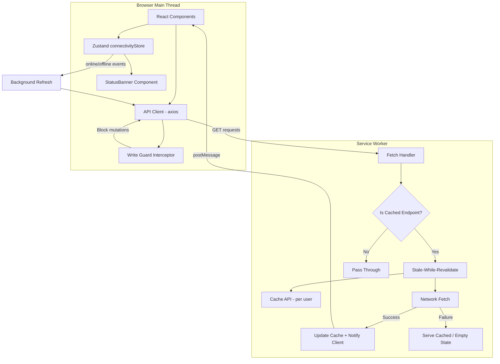
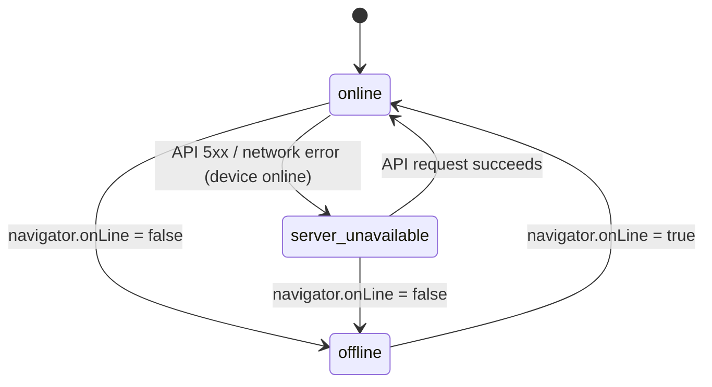

# Design Document: Offline Cache Resilience

## Overview

This feature adds a stale-while-revalidate caching layer to the Shifter web app, enabling users to view their schedule and group data when offline or when the API server is unavailable. The implementation leverages the existing service worker (`sw.js`) and extends it with per-user Cache API storage, a Zustand-based connectivity monitor, and a write guard that prevents mutations during disconnection.

**Key design decisions:**
- **Cache API in the Service Worker** over IndexedDB in the main thread — keeps cache reads off the main thread entirely, leverages the existing SW infrastructure, and provides native request/response matching.
- **Zustand store for connectivity state** over React context — consistent with the existing `authStore`/`spaceStore` pattern, supports subscription from non-React code (e.g., the API client interceptor).
- **Stale-while-revalidate** over network-first — prioritizes perceived performance by showing cached data instantly while refreshing in the background.
- **Per-user cache partitioning via cache name** — uses separate `Cache` instances named by user ID rather than prefixing keys, making logout cleanup a single `caches.delete()` call.

## Architecture



### Data Flow

1. **Normal operation (online):** GET requests hit the SW fetch handler → SW returns cached response immediately → SW fetches from network in background → if response differs, SW posts message to client → React Query invalidates and re-renders.
2. **Offline / Server down:** GET requests hit SW → SW returns cached response → network fetch fails silently → connectivity store updates → banner shows → write guard activates.
3. **Reconnection:** Browser fires `online` event or API request succeeds → connectivity store transitions to `online` → banner dismisses → background refresh re-fetches all cached endpoints → write guard deactivates.

## Components and Interfaces

### 1. Service Worker Cache Layer (`public/sw.js` — enhanced)

```typescript
// Cache naming convention
type CacheName = `shifter-api-${userId}`;

// Message types between SW and client
interface SWCacheMessage {
  type: "CACHE_UPDATED";
  url: string;
  timestamp: number;
}

interface SWClearCacheMessage {
  type: "CLEAR_USER_CACHE";
  userId: string;
}

interface SWSetUserMessage {
  type: "SET_CURRENT_USER";
  userId: string;
}
```

**Responsibilities:**
- Intercept GET requests to cached endpoint patterns
- Implement stale-while-revalidate: return cache hit, fetch in background
- Store responses in per-user Cache API instances (`shifter-api-{userId}`)
- Post `CACHE_UPDATED` message to all clients when fresh data differs from cached
- Handle `CLEAR_USER_CACHE` message to delete a user's entire cache on logout
- Handle `SET_CURRENT_USER` message to know which cache namespace to use
- Enforce 50MB per-user storage limit with LRU eviction

### 2. Connectivity Store (`lib/store/connectivityStore.ts`)

```typescript
type ConnectivityStatus = "online" | "offline" | "server-unavailable";

interface ConnectivityState {
  status: ConnectivityStatus;
  lastOnlineAt: number | null;
  isConnected: boolean; // derived: status === "online"

  // Actions
  goOffline: () => void;
  goOnline: () => void;
  setServerUnavailable: () => void;
  setServerRecovered: () => void;
}
```

**Responsibilities:**
- Track device online/offline via `navigator.onLine` + event listeners
- Track server availability via API response interceptor
- Expose `isConnected` derived boolean for write guard and UI
- Emit state transitions that trigger background refresh

### 3. Status Banner Component (`components/shell/OfflineBanner.tsx` — enhanced)

The existing `OfflineBanner` component will be refactored to consume the new `connectivityStore` instead of `useServiceWorker` directly, and will render two distinct banner variants:

| State | Text | Style |
|-------|------|-------|
| `offline` | "אתה לא מחובר לאינטרנט" | Amber/warning |
| `server-unavailable` | "השרת אינו זמין כרגע, נסה שוב מאוחר יותר" | Red/error |

The update-available toast remains unchanged.

### 4. Write Guard (`lib/api/writeGuard.ts`)

```typescript
interface WriteGuardConfig {
  isConnected: () => boolean;
}

// Axios request interceptor
function writeGuardInterceptor(config: AxiosRequestConfig): AxiosRequestConfig | Promise<never>;

// React hook for UI controls
function useWriteGuard(): {
  isDisabled: boolean;
  tooltipText: string;
};
```

**Responsibilities:**
- Axios request interceptor that rejects non-GET requests when `connectivityStore.isConnected` is false
- React hook that returns `isDisabled` + tooltip text for mutation buttons
- Re-enables automatically when connectivity store transitions to `online`

### 5. Background Refresh (`lib/cache/backgroundRefresh.ts`)

```typescript
interface BackgroundRefreshConfig {
  endpoints: string[]; // URL patterns to refresh
  spaceId: string;
  retryDelayMs: number; // 30_000
}

function triggerBackgroundRefresh(config: BackgroundRefreshConfig): void;
```

**Responsibilities:**
- Subscribe to connectivity store transitions (`offline→online`, `server-unavailable→online`)
- Re-fetch all cached endpoints for the current space
- Does NOT set loading states in React Query (silent refresh)
- On failure, retains existing cache and schedules retry after 30 seconds

### 6. Cache Lifecycle Hook (`lib/hooks/useCacheLifecycle.ts`)

```typescript
function useCacheLifecycle(): void;
```

**Responsibilities:**
- On mount: send `SET_CURRENT_USER` message to SW with current `authStore.userId`
- On logout: send `CLEAR_USER_CACHE` message to SW
- Listen for `CACHE_UPDATED` messages from SW and invalidate relevant React Query keys
- Integrated into `Providers` component

## Data Models

### Cache Storage Structure

```
Cache API Storage:
├── shifter-api-{userId_A}     ← Cache instance for user A
│   ├── GET /spaces/abc/groups → Response (with X-Cache-Timestamp header)
│   ├── GET /spaces/abc/groups/g1/members → Response
│   └── ...
├── shifter-api-{userId_B}     ← Cache instance for user B
│   └── ...
├── shifter-static-1.9.0       ← Existing static asset cache (unchanged)
└── shifter-1.9.0              ← Existing HTML/schedule cache (unchanged)
```

### Cache Metadata (stored as response headers)

| Header | Purpose |
|--------|---------|
| `X-Cache-Timestamp` | When the response was cached (Unix ms) |
| `X-Cache-Size` | Approximate response size in bytes |

### Cached Endpoint Patterns

```typescript
const CACHED_API_PATTERNS = [
  /\/spaces\/[^/]+\/groups$/,
  /\/spaces\/[^/]+\/groups\/[^/]+\/members$/,
  /\/spaces\/[^/]+\/groups\/[^/]+\/tasks$/,
  /\/spaces\/[^/]+\/schedule-versions$/,
  /\/spaces\/[^/]+\/billing\/subscription$/,
];
```

### Connectivity State Machine



## Correctness Properties

*A property is a characteristic or behavior that should hold true across all valid executions of a system — essentially, a formal statement about what the system should do. Properties serve as the bridge between human-readable specifications and machine-verifiable correctness guarantees.*

### Property 1: Stale-while-revalidate serves cached response first

*For any* GET request to a cached endpoint that has an existing cache entry, the service worker SHALL return the cached response immediately (before the network response arrives), regardless of whether the device is online, offline, or the server is unavailable.

**Validates: Requirements 1.1, 4.1, 4.2, 8.3**

### Property 2: Successful network fetch updates cache and notifies on difference

*For any* cached endpoint where a background network fetch succeeds, the cache entry SHALL be updated with the fresh response, AND if the fresh response body differs from the previously cached body, a `CACHE_UPDATED` message SHALL be posted to all clients.

**Validates: Requirements 1.2, 1.3, 5.2**

### Property 3: Cache miss with network failure returns empty-state indicator

*For any* GET request to a cached endpoint where no cache entry exists AND the network request fails (offline or server error), the service worker SHALL return a response with a recognizable empty-state indicator (503 status with `{"error": "offline"}` body).

**Validates: Requirements 1.6, 4.3**

### Property 4: Connectivity state machine correctness

*For any* sequence of connectivity events (navigator offline/online transitions, API 5xx responses, API success responses), the connectivity store SHALL be in exactly one of the three states (`online`, `offline`, `server-unavailable`) at any time, AND the state transitions SHALL follow the defined state machine (offline takes priority over server-unavailable when device is offline).

**Validates: Requirements 2.1, 2.3, 3.1, 3.3, 3.5**

### Property 5: Per-user cache isolation

*For any* two distinct user IDs and any request URL, the cached response stored for user A at that URL SHALL NOT be accessible when the current user is user B, and vice versa.

**Validates: Requirements 1.5, 7.1, 7.3**

### Property 6: Cache cleared on logout

*For any* user with one or more cached entries, after a logout event for that user, the cache instance for that user SHALL contain zero entries.

**Validates: Requirements 7.2**

### Property 7: Write guard blocks mutations when disconnected

*For any* HTTP request with a non-GET method (POST, PUT, PATCH, DELETE) while the connectivity store status is `offline` or `server-unavailable`, the write guard interceptor SHALL reject the request without sending it to the network.

**Validates: Requirements 6.1, 6.2**

### Property 8: LRU eviction enforces storage limit

*For any* user whose total cached response size exceeds 50 MB, the cache layer SHALL evict the least-recently-used entries until total size is at or below 50 MB, AND the most-recently-used entries SHALL be preserved.

**Validates: Requirements 8.4**

## Error Handling

| Scenario | Handling |
|----------|----------|
| SW registration fails | App works without caching; `useServiceWorker` logs warning, connectivity store still functions via API interceptor |
| Cache API quota exceeded | Trigger LRU eviction; if eviction fails, log error and continue without caching |
| Background refresh fails | Retain existing cache, schedule retry after 30s, max 3 retries then stop until next connectivity change |
| SW message channel broken | Fall back to polling-based cache invalidation (check cache timestamps on React Query refetch) |
| User has no cached data and goes offline | Show empty-state UI ("אין נתונים זמינים") instead of error screen |
| Multiple tabs open | SW broadcasts `CACHE_UPDATED` to all clients via `self.clients.matchAll()` — all tabs update |
| Token expired while offline | Write guard already blocks mutations; on reconnection, the existing 401 interceptor handles refresh before background refresh proceeds |

## Testing Strategy

### Property-Based Tests (fast-check)

The feature's pure logic components are well-suited for property-based testing:
- **Service Worker caching logic** — stale-while-revalidate behavior, cache key generation, LRU eviction
- **Connectivity state machine** — state transitions given arbitrary event sequences
- **Write guard interceptor** — mutation blocking given arbitrary request configs and connectivity states
- **Cache isolation** — key partitioning given arbitrary user IDs and URLs

**Library:** [fast-check](https://github.com/dubzzz/fast-check) (already compatible with the project's Vitest/Jest setup)

**Configuration:**
- Minimum 100 iterations per property test
- Each test tagged with: `Feature: offline-cache-resilience, Property {N}: {description}`

### Unit Tests (Vitest)

- Connectivity store state transitions (specific examples: offline→online, online→server-unavailable→online)
- Banner component renders correct text/style for each state
- Write guard tooltip text content
- Background refresh scheduling and retry logic
- Cache lifecycle hook message dispatching

### Integration Tests

- Full SW fetch handler with mocked Cache API and fetch
- API client with write guard interceptor end-to-end
- Logout flow clearing cache via SW message
- React Query invalidation on `CACHE_UPDATED` message

### Manual Testing Checklist

- Chrome DevTools → Network → Offline toggle
- Kill API server while app is running
- Switch between users on same device
- Exceed 50MB cache and verify eviction
- Verify no loading spinners during background refresh
