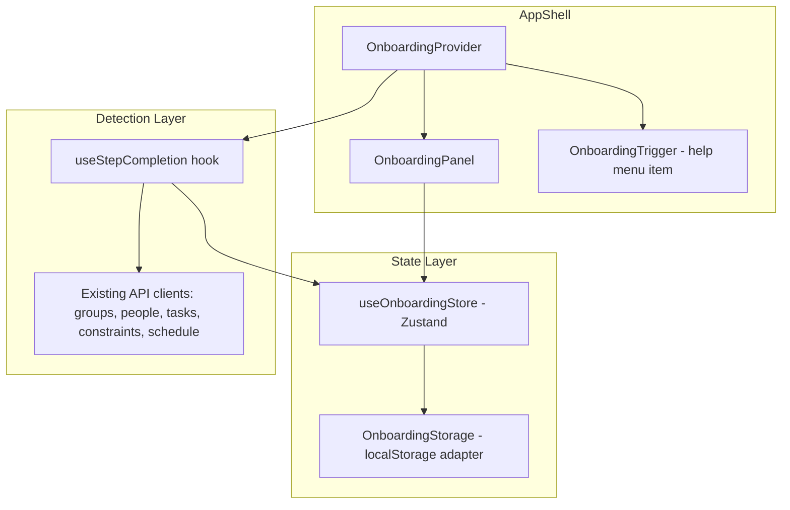
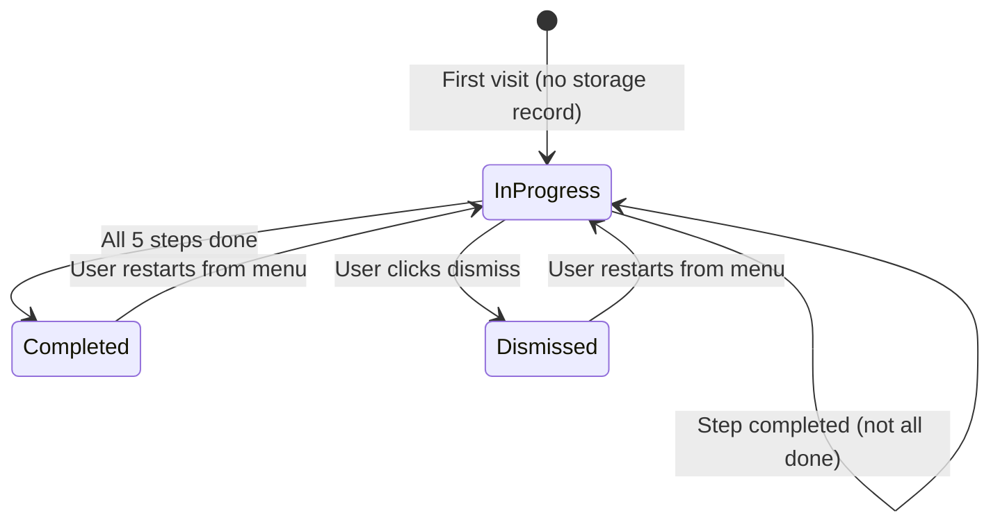

# Design Document: Onboarding Wizard

## Overview

The Onboarding Wizard is a frontend-only, non-blocking floating checklist panel that guides new users through the five core steps of setting up their first schedule in Shifter: creating a group, adding members, defining tasks, setting constraints, and running the solver.

The panel appears on the inline-end side of the viewport (right in LTR, left in RTL) as a slide-in overlay that does not block interaction with the application behind it. It uses localStorage for persistence, supports all three locales (en, he, ru) with RTL layout for Hebrew, and follows a Linear/Notion-inspired clean aesthetic using the existing Tailwind design system.

**Key design decisions:**
- Pure frontend implementation — no backend changes required
- Zustand store for runtime state, localStorage for persistence
- Step completion detected by querying existing API endpoints (groups, people, tasks, constraints, schedule-runs)
- Panel rendered inside AppShell as a sibling to the main content area
- Uses `next-intl` translation keys for all user-facing text
- Logical CSS properties (`inset-inline-end`, `padding-inline-start`) for bidirectional support

## Architecture



The architecture follows a layered approach:

1. **Storage Layer** (`OnboardingStorage`) — A pure utility module that reads/writes onboarding state to localStorage, scoped by user ID. Handles serialization, error recovery, and key formatting.

2. **State Layer** (`useOnboardingStore`) — A Zustand store that holds the runtime onboarding state (visibility, step completions, current step). Syncs with the storage layer on mutations.

3. **Detection Layer** (`useStepCompletion`) — A React hook that queries existing API endpoints to determine which steps are already complete. Runs on mount and when the panel becomes visible.

4. **UI Layer** — The `OnboardingPanel` component (the floating checklist) and `OnboardingProvider` (context wrapper that manages lifecycle).

## Components and Interfaces

### OnboardingStorage (Pure Utility)

```typescript
// lib/onboarding/storage.ts

export type OnboardingStatus = "in-progress" | "completed" | "dismissed";

export interface OnboardingState {
  status: OnboardingStatus;
  steps: StepCompletionMap;
}

export type StepCompletionMap = {
  createGroup: boolean;
  addMembers: boolean;
  defineTasks: boolean;
  setConstraints: boolean;
  runSolver: boolean;
};

export const EMPTY_STEPS: StepCompletionMap = {
  createGroup: false,
  addMembers: false,
  defineTasks: false,
  setConstraints: false,
  runSolver: false,
};

/** Returns the localStorage key for a given user */
export function getStorageKey(userId: string): string;

/** Reads onboarding state from localStorage. Returns null if not found or on error. */
export function readOnboardingState(userId: string): OnboardingState | null;

/** Writes onboarding state to localStorage. Silently fails if localStorage is unavailable. */
export function writeOnboardingState(userId: string, state: OnboardingState): void;

/** Computes the overall status from step completions */
export function computeStatus(steps: StepCompletionMap): OnboardingStatus;
```

### Decision Functions (Pure)

```typescript
// lib/onboarding/decisions.ts

export interface OnboardingContext {
  groupCount: number;
  storageState: OnboardingState | null;
}

/** Determines whether the onboarding wizard should display */
export function shouldShowOnboarding(ctx: OnboardingContext): boolean;

/** Returns the index of the first incomplete step, or -1 if all complete */
export function getCurrentStepIndex(steps: StepCompletionMap): number;

/** Maps a step key to its navigation route */
export function getStepRoute(
  stepKey: keyof StepCompletionMap,
  spaceId: string,
  groupId?: string
): string;

/** Computes step completion from application state counts */
export function computeStepCompletion(appState: {
  groupCount: number;
  memberCount: number;
  taskCount: number;
  constraintCount: number;
  solverRunCount: number;
}): StepCompletionMap;
```

### useOnboardingStore (Zustand)

```typescript
// lib/store/onboardingStore.ts

interface OnboardingStoreState {
  isVisible: boolean;
  steps: StepCompletionMap;
  status: OnboardingStatus;

  show: () => void;
  hide: () => void;
  dismiss: (userId: string) => void;
  completeStep: (userId: string, stepKey: keyof StepCompletionMap) => void;
  reset: (userId: string) => void;
  hydrate: (userId: string) => void;
  setSteps: (userId: string, steps: StepCompletionMap) => void;
}
```

### useStepCompletion Hook

```typescript
// lib/hooks/useStepCompletion.ts

/**
 * Queries existing API endpoints to determine current step completion.
 * Returns the computed StepCompletionMap.
 * Runs when the onboarding panel becomes visible or on explicit refresh.
 */
export function useStepCompletion(spaceId: string | null): {
  steps: StepCompletionMap;
  isLoading: boolean;
  refresh: () => void;
};
```

### OnboardingPanel Component

```typescript
// components/onboarding/OnboardingPanel.tsx

/**
 * Floating checklist panel rendered at inset-inline-end.
 * Shows step list with progressive disclosure.
 * Non-blocking — user can interact with app behind it.
 */
export function OnboardingPanel(): JSX.Element | null;
```

### OnboardingProvider Component

```typescript
// components/onboarding/OnboardingProvider.tsx

/**
 * Wraps the app content inside AppShell.
 * Handles:
 * - Hydrating onboarding state from localStorage on mount
 * - Auto-showing the wizard when conditions are met
 * - Re-evaluating step completion on visibility change
 */
export function OnboardingProvider({ children }: { children: React.ReactNode }): JSX.Element;
```

### Step Configuration

```typescript
// lib/onboarding/steps.ts

export interface OnboardingStepConfig {
  key: keyof StepCompletionMap;
  titleKey: string;       // next-intl translation key
  descriptionKey: string; // next-intl translation key
  ctaLabelKey: string;    // next-intl translation key
  icon: string;           // icon identifier or SVG path
}

export const ONBOARDING_STEPS: OnboardingStepConfig[];
```

## Data Models

### localStorage Schema

Key format: `shifter-onboarding-{userId}`

```json
{
  "status": "in-progress",
  "steps": {
    "createGroup": false,
    "addMembers": false,
    "defineTasks": false,
    "setConstraints": false,
    "runSolver": false
  }
}
```

Valid `status` values: `"in-progress"`, `"completed"`, `"dismissed"`

### State Transitions



### Step Completion Detection

| Step | Detection Logic | API Source |
|------|----------------|------------|
| Create Group | `groups.length > 0` | `GET /spaces/{spaceId}/groups` |
| Add Members | Any group has `memberCount > 1` (owner + at least 1 member) | `GET /spaces/{spaceId}/groups` (uses `memberCount` field) |
| Define Tasks | `tasks.length > 0` for any group | `GET /spaces/{spaceId}/groups/{groupId}/tasks` |
| Set Constraints | `constraints.length > 0` for any group | `GET /spaces/{spaceId}/groups/{groupId}/constraints` |
| Run Solver | `scheduleRuns.length > 0` for any group | `GET /spaces/{spaceId}/groups/{groupId}/schedule-runs` |

## Correctness Properties

*A property is a characteristic or behavior that should hold true across all valid executions of a system — essentially, a formal statement about what the system should do. Properties serve as the bridge between human-readable specifications and machine-verifiable correctness guarantees.*

### Property 1: Display Decision Logic

*For any* combination of group count (0 or positive integer) and storage state (null, in-progress, completed, or dismissed), `shouldShowOnboarding` returns `true` if and only if `groupCount === 0` AND the storage state is neither `"completed"` nor `"dismissed"`.

**Validates: Requirements 1.1, 1.2, 1.3, 1.4, 5.4**

### Property 2: Step Completion from Application State

*For any* application state consisting of non-negative integer counts (groupCount, memberCount, taskCount, constraintCount, solverRunCount), `computeStepCompletion` returns a `StepCompletionMap` where each step is `true` if and only if its corresponding count is greater than zero (with memberCount threshold being > 1 to account for the owner).

**Validates: Requirements 4.1, 4.2, 4.3, 4.4, 4.5, 10.3**

### Property 3: Current Step Index

*For any* `StepCompletionMap` (array of 5 booleans), `getCurrentStepIndex` returns the index of the first `false` value, or `-1` if all values are `true`.

**Validates: Requirements 2.4**

### Property 4: Step-to-Route Mapping

*For any* valid step key and space/group ID combination, `getStepRoute` returns a non-empty string that starts with `/` and contains the space ID in the path.

**Validates: Requirements 3.1, 3.2, 3.3, 3.4, 3.5**

### Property 5: Storage Round-Trip

*For any* valid `OnboardingState` object and any non-empty user ID string, writing the state via `writeOnboardingState` and then reading it back via `readOnboardingState` produces an object deeply equal to the original.

**Validates: Requirements 4.6, 6.1, 6.2**

### Property 6: Status Computation from Steps

*For any* `StepCompletionMap`, `computeStatus` returns `"completed"` if and only if all five step values are `true`; otherwise it returns `"in-progress"`.

**Validates: Requirements 6.3**

### Property 7: Reset Produces Clean State

*For any* existing `OnboardingState` (regardless of current status or step values), calling the reset logic produces a state with `status === "in-progress"` and all steps set to `false`.

**Validates: Requirements 10.2**

## Error Handling

| Scenario | Behavior |
|----------|----------|
| localStorage unavailable (private browsing, quota exceeded) | Wizard functions in memory-only mode. `writeOnboardingState` silently fails. `readOnboardingState` returns `null`. Wizard defaults to showing (per Req 6.4). |
| API call fails during step completion detection | Step remains marked as incomplete. No error shown to user. Retry on next visibility change. |
| Invalid/corrupted JSON in localStorage | `readOnboardingState` returns `null`, treating it as a fresh state. Old corrupted data is overwritten on next write. |
| User ID is null (not authenticated) | Onboarding does not render. The `OnboardingProvider` gates on `userId` being present. |
| Space ID is null (no space selected) | Step completion detection is skipped. Steps remain in their last known state. |

## Testing Strategy

### Property-Based Tests (fast-check)

The project already has `fast-check@^3.23.2` as a dev dependency. Each correctness property maps to a single property-based test with a minimum of 100 iterations.

**Test file:** `apps/web/__tests__/onboarding.property.test.ts`

| Property | Test Description | Tag |
|----------|-----------------|-----|
| 1 | Display decision logic | Feature: onboarding-wizard, Property 1: Display decision returns true iff groupCount=0 and state is not completed/dismissed |
| 2 | Step completion from app state | Feature: onboarding-wizard, Property 2: computeStepCompletion maps counts > 0 to true |
| 3 | Current step index | Feature: onboarding-wizard, Property 3: getCurrentStepIndex returns first false index |
| 4 | Step-to-route mapping | Feature: onboarding-wizard, Property 4: getStepRoute returns valid route for any step |
| 5 | Storage round-trip | Feature: onboarding-wizard, Property 5: write then read produces equal state |
| 6 | Status computation | Feature: onboarding-wizard, Property 6: computeStatus returns completed iff all true |
| 7 | Reset produces clean state | Feature: onboarding-wizard, Property 7: reset always produces in-progress with all false |

### Unit Tests (vitest)

**Test file:** `apps/web/__tests__/onboarding.test.ts`

- Step order is exactly [createGroup, addMembers, defineTasks, setConstraints, runSolver]
- Success state renders when all steps complete
- Dismiss button is always visible when panel is open
- Dismiss action writes "dismissed" to storage
- RTL layout applied when locale is "he"
- All three locales render without errors
- ARIA attributes present on panel and interactive elements
- Focus trap works within the panel
- Panel does not cover full viewport (has max-width constraint)

### E2E Tests (Playwright)

- Full onboarding flow: new user sees wizard → completes all steps → wizard shows success
- Dismiss flow: user dismisses → wizard does not reappear on reload
- Restart flow: user restarts from menu → wizard re-evaluates completion
- Responsive: wizard usable at 320px and 1920px viewports
- Keyboard navigation through all steps
