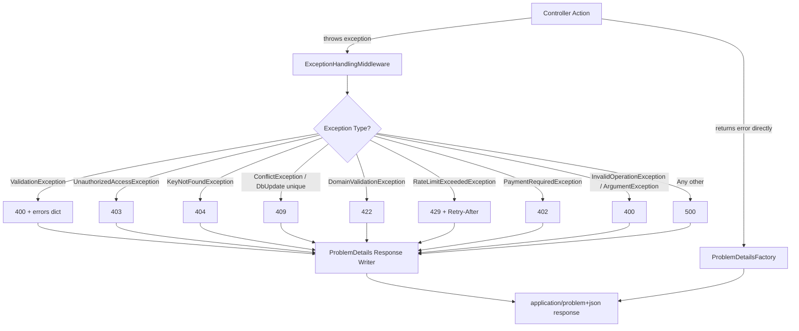

# Design Document: Problem Details Migration

## Overview

This design migrates all API error responses from the current custom JSON format (`{ error: "...", errors: [...] }`) to the RFC 7807 ProblemDetails standard (`application/problem+json`). The migration is scoped to two areas:

1. **ExceptionHandlingMiddleware** — the central error handler that catches unhandled exceptions and maps them to HTTP responses.
2. **Controller-level error responses** — controllers that currently return custom error shapes (e.g., `ShiftRequestsController`, `WaitlistController`).

The new format adds structured metadata (`traceId`, `type` URI, `instance` path, extension properties) while preserving existing HTTP status codes and Hebrew error messages for backward compatibility.

### Design Rationale

- **RFC 7807 compliance** provides a machine-readable, standardized error format that frontend clients and monitoring tools can parse uniformly.
- **Single error-handling path** on the frontend — one parser handles all error types.
- **traceId correlation** enables log-to-response tracing without exposing internal details.
- **Extension properties** carry domain-specific data (e.g., `alternativeSlots`, `retryAfterSeconds`) within the standard envelope.

## Architecture



The middleware remains the single point of exception-to-response conversion. A new internal `ProblemDetailsFactory` helper constructs the `ProblemDetails` object with all required fields, and a `ProblemDetailsWriter` serializes it to the response stream atomically.

Controllers that need to return errors with domain-specific extensions (e.g., `alternativeSlots`) will use ASP.NET Core's built-in `ProblemDetails` class directly via helper methods, rather than anonymous objects.

## Components and Interfaces

### 1. `ProblemDetailsFactory` (internal helper)

Responsible for constructing a `ProblemDetails` instance from exception metadata.

```csharp
namespace Jobuler.Api.Middleware;

internal static class ProblemDetailsFactory
{
    public static ProblemDetails Create(
        HttpContext context,
        int statusCode,
        string title,
        string detail,
        string typeSlug,
        IDictionary<string, object?>? extensions = null);
}
```

**Behavior:**
- Sets `Type` to `https://docs.jobuler.com/errors/{typeSlug}`
- Sets `Instance` to `context.Request.Path`
- Sets `Status` to `statusCode`
- Always adds `traceId` extension from `context.TraceIdentifier`
- Merges any additional extensions

### 2. `ExceptionHandlingMiddleware` (refactored)

The existing middleware is refactored to:
- Use `ProblemDetailsFactory` for all response construction
- Set `Content-Type` to `application/problem+json`
- Write the response atomically (single `WriteAsJsonAsync` call)
- Check `IHostEnvironment.IsProduction()` to gate debug details

```csharp
public class ExceptionHandlingMiddleware
{
    private readonly RequestDelegate _next;
    private readonly ILogger<ExceptionHandlingMiddleware> _logger;
    private readonly IHostEnvironment _environment;

    // Exception → (StatusCode, Title, Detail, TypeSlug, Extensions?)
    private async Task HandleExceptionAsync(HttpContext context, Exception ex);
}
```

### 3. Exception Mapping Table

| Exception Type | Status | Title | Detail | Type Slug | Extensions |
|---|---|---|---|---|---|
| `ValidationException` | 400 | Validation Failed | אימות הנתונים נכשל. | `validation-failed` | `errors`: field→messages dict |
| `InvalidOperationException` | 400 | Bad Request | exception message | `bad-request` | — |
| `ArgumentException` | 400 | Bad Request | exception message | `bad-request` | — |
| `PaymentRequiredException` | 402 | Payment Required | exception message | `payment-required` | — |
| `UnauthorizedAccessException` | 403 | Forbidden | אין לך הרשאה לבצע פעולה זו. | `forbidden` | — |
| `KeyNotFoundException` | 404 | Not Found | הפריט המבוקש לא נמצא. | `not-found` | — |
| `ConflictException` | 409 | Conflict | exception message | `conflict` | — |
| `DbUpdateException` (unique) | 409 | Conflict | localized message | `conflict` | — |
| `DomainValidationException` | 422 | Unprocessable Entity | exception message | `unprocessable-entity` | — |
| `RateLimitExceededException` | 429 | Too Many Requests | Rate limit exceeded. Try again later. | `rate-limit-exceeded` | `retryAfterSeconds`: int |
| Any other | 500 | Internal Server Error | אירעה שגיאה בלתי צפויה. נסה שוב מאוחר יותר. | `internal-server-error` | — |

### 4. Controller Error Helpers

A base class extension or static helper for controllers to produce `ProblemDetails` responses with extensions:

```csharp
internal static class ProblemDetailsResults
{
    public static IActionResult Problem(
        HttpContext context,
        int statusCode,
        string title,
        string detail,
        string typeSlug,
        IDictionary<string, object?>? extensions = null);
}
```

**Usage in ShiftRequestsController:**
```csharp
return ProblemDetailsResults.Problem(
    HttpContext, 422, "Unprocessable Entity",
    result.RejectionReason!,
    "shift-request-rejected",
    new Dictionary<string, object?>
    {
        ["alternativeSlots"] = result.AlternativeSlots
    });
```

### 5. Production Safety Guard

```csharp
internal static class ProductionSafetyGuard
{
    /// <summary>
    /// Strips any sensitive data from ProblemDetails when running in production.
    /// Ensures stack traces, exception type names, and inner exception details
    /// are never present regardless of configuration.
    /// </summary>
    public static ProblemDetails Sanitize(ProblemDetails problem, IHostEnvironment env);
}
```

In development mode, the middleware may optionally add:
- `exceptionType`: the exception's full type name
- `stackTrace`: the exception's stack trace
- `innerException`: inner exception message

These are stripped by `ProductionSafetyGuard.Sanitize()` in production, which runs as the final step before serialization regardless of any other configuration.

## Data Models

### ProblemDetails Response Shape (RFC 7807)

```json
{
  "type": "https://docs.jobuler.com/errors/validation-failed",
  "title": "Validation Failed",
  "status": 400,
  "detail": "אימות הנתונים נכשל.",
  "instance": "/spaces/abc/groups/def/shift-requests",
  "traceId": "0HN4EXAMPLE:00000001",
  "errors": {
    "ShiftSlotId": ["The shift slot ID is required."],
    "Reason": ["Reason must be between 1 and 500 characters."]
  }
}
```

### Rate Limit Response Shape

```json
{
  "type": "https://docs.jobuler.com/errors/rate-limit-exceeded",
  "title": "Too Many Requests",
  "status": 429,
  "detail": "Rate limit exceeded. Try again later.",
  "instance": "/api/feedback",
  "traceId": "0HN4EXAMPLE:00000002",
  "retryAfterSeconds": 60
}
```

### Controller Extension Response Shape (Shift Request Rejection)

```json
{
  "type": "https://docs.jobuler.com/errors/shift-request-rejected",
  "title": "Unprocessable Entity",
  "status": 422,
  "detail": "המשמרת מלאה.",
  "instance": "/spaces/abc/groups/def/shift-requests",
  "traceId": "0HN4EXAMPLE:00000003",
  "alternativeSlots": [
    { "slotId": "...", "date": "2025-01-15", "startTime": "08:00", "endTime": "16:00" }
  ]
}
```

### Internal Server Error Response Shape (Production)

```json
{
  "type": "https://docs.jobuler.com/errors/internal-server-error",
  "title": "Internal Server Error",
  "status": 500,
  "detail": "אירעה שגיאה בלתי צפויה. נסה שוב מאוחר יותר.",
  "instance": "/spaces/abc/schedule-runs",
  "traceId": "0HN4EXAMPLE:00000004"
}
```

## Correctness Properties

*A property is a characteristic or behavior that should hold true across all valid executions of a system — essentially, a formal statement about what the system should do. Properties serve as the bridge between human-readable specifications and machine-verifiable correctness guarantees.*

### Property 1: Structural Completeness

*For any* exception thrown during request processing, the middleware response SHALL always contain a valid JSON body with all five RFC 7807 fields (`type`, `title`, `status`, `detail`, `instance`), a `traceId` extension matching `HttpContext.TraceIdentifier`, `Content-Type` header set to `application/problem+json`, `type` matching the URI pattern `https://docs.jobuler.com/errors/{slug}`, and `instance` matching the request path.

**Validates: Requirements 1.1, 1.2, 1.3, 1.4, 1.5**

### Property 2: Exception-to-Response Mapping Correctness

*For any* exception of a mapped type (ValidationException, UnauthorizedAccessException, KeyNotFoundException, ConflictException, DomainValidationException, RateLimitExceededException, PaymentRequiredException, InvalidOperationException, ArgumentException), the middleware SHALL produce the correct HTTP status code, `title`, and `detail` value as defined in the mapping table. For exceptions with hardcoded messages, the `detail` must match exactly. For exceptions with dynamic messages, the `detail` must equal the exception's `Message` property.

**Validates: Requirements 2.1, 2.2, 2.4, 2.5, 3.1, 3.2, 3.3, 4.1, 4.2, 4.3, 5.1, 5.2, 5.4, 6.1, 6.2, 6.3, 7.1, 7.4, 7.5, 8.1, 8.2, 8.3, 10.1, 10.2, 10.3, 11.1, 11.2, 11.3, 13.1, 13.2, 13.3**

### Property 3: Validation Errors Round-Trip

*For any* set of FluentValidation failures with arbitrary property names and error messages, the `errors` extension property in the ProblemDetails response SHALL contain a dictionary where each key is a property name and each value is an array containing exactly the error messages associated with that property — no messages lost, no messages added, no messages assigned to the wrong property.

**Validates: Requirements 2.3**

### Property 4: Rate Limit Extension Data Preservation

*For any* `RateLimitExceededException` with a positive `RetryAfterSeconds` value, the response SHALL include both a `Retry-After` HTTP header and a `retryAfterSeconds` extension property, both containing the exact numeric value from the exception.

**Validates: Requirements 7.2, 7.3**

### Property 5: Production Safety — No Sensitive Data Leaks

*For any* exception (including those with stack traces, inner exceptions, and type metadata) processed in a production environment, the serialized ProblemDetails response body SHALL never contain the exception's stack trace text, the exception's type name, or any inner exception message — regardless of application configuration settings.

**Validates: Requirements 8.4, 12.1, 12.2, 12.3, 12.5**

## Error Handling

### Middleware Error Handling Strategy

| Scenario | Behavior |
|---|---|
| Known exception type | Map to specific ProblemDetails per mapping table |
| Unknown exception type | Return 500 with generic Hebrew message |
| Serialization failure during ProblemDetails creation | Return the mapped status code with a minimal fallback JSON body: `{"type":"about:blank","title":"Error","status":<code>}` |
| Response already started (`HasStarted`) | Log error, do not attempt to write (ASP.NET Core limitation) |
| DbUpdateException with unique constraint | Map to 409 Conflict with localized message |
| DbUpdateException with check constraint | Map to 409 Conflict with constraint-specific Hebrew message |
| DbUpdateException (other) | Map to 500 Internal Server Error |

### Fallback Safety Net

If the `ProblemDetailsFactory` or JSON serialization throws during error handling, the middleware catches this inner exception, logs it, and writes a minimal response:

```csharp
catch (Exception innerEx)
{
    _logger.LogCritical(innerEx, "Failed to write ProblemDetails response");
    context.Response.StatusCode = statusCode; // preserve original status
    context.Response.ContentType = "application/problem+json";
    await context.Response.WriteAsync(
        $"{{\"type\":\"about:blank\",\"title\":\"Error\",\"status\":{statusCode}}}");
}
```

### Controller Error Handling

Controllers that return errors directly (not via exceptions) use `ProblemDetailsResults.Problem()` which internally calls `ProblemDetailsFactory.Create()`. If the factory fails, the same fallback applies.

## Testing Strategy

### Property-Based Tests (FsCheck.Xunit)

The project already uses **FsCheck 2.16.6** with **FsCheck.Xunit** for property-based testing. Each correctness property maps to a single property-based test with minimum 100 iterations.

**Test file:** `Jobuler.Tests/Middleware/ExceptionHandlingMiddlewarePropertyTests.cs`

| Property | Test Method | Generator Strategy |
|---|---|---|
| Property 1: Structural Completeness | `AllExceptions_ProduceProblemDetailsWithRequiredFields` | Generate random exceptions from all mapped types + random unmapped exceptions, random request paths, random TraceIdentifiers |
| Property 2: Mapping Correctness | `MappedExceptions_ProduceCorrectStatusTitleDetail` | Generate random exceptions of each mapped type with random messages, verify status/title/detail per mapping table |
| Property 3: Validation Errors Round-Trip | `ValidationFailures_AreGroupedByPropertyNameFaithfully` | Generate random lists of `ValidationFailure` with random property names and messages, verify dictionary grouping |
| Property 4: Rate Limit Extension | `RateLimitException_PreservesRetryAfterInHeaderAndBody` | Generate random positive integers for RetryAfterSeconds, verify header and extension match |
| Property 5: Production Safety | `ProductionMode_NeverLeaksSensitiveExceptionData` | Generate random exceptions with stack traces, inner exceptions, and type names; verify none appear in response |

**Configuration:**
- Each test runs minimum 100 iterations (FsCheck default is 100, which satisfies the requirement)
- Each test is tagged with a comment referencing the design property
- Tag format: `// Feature: problem-details-migration, Property {N}: {title}`

### Unit Tests (xUnit + FluentAssertions)

**Test file:** `Jobuler.Tests/Middleware/ExceptionHandlingMiddlewareTests.cs`

| Scenario | Purpose |
|---|---|
| Development mode includes exception details | Verify debug info is present in dev (Req 12.4) |
| Response already started — no write attempted | Verify graceful handling of `HasStarted` |
| Serialization failure triggers fallback | Verify minimal JSON fallback (Req 11.4) |
| DbUpdateException with specific constraint names | Verify Hebrew messages per constraint |
| ShiftRequestsController rejection with alternativeSlots | Verify extension property in controller response (Req 9.1, 9.2) |
| WaitlistController rejection | Verify ProblemDetails format (Req 9.3) |
| Atomic write — single response operation | Verify no partial writes (Req 3.4) |

### Test Infrastructure

- **Middleware tests** use a fake `HttpContext` (via `DefaultHttpContext`) with a `MemoryStream` response body for assertion.
- **Controller tests** use the existing `NSubstitute` mocks for services and verify the `IActionResult` shape.
- No new test dependencies required — FsCheck, xUnit, FluentAssertions, and NSubstitute are already available.
