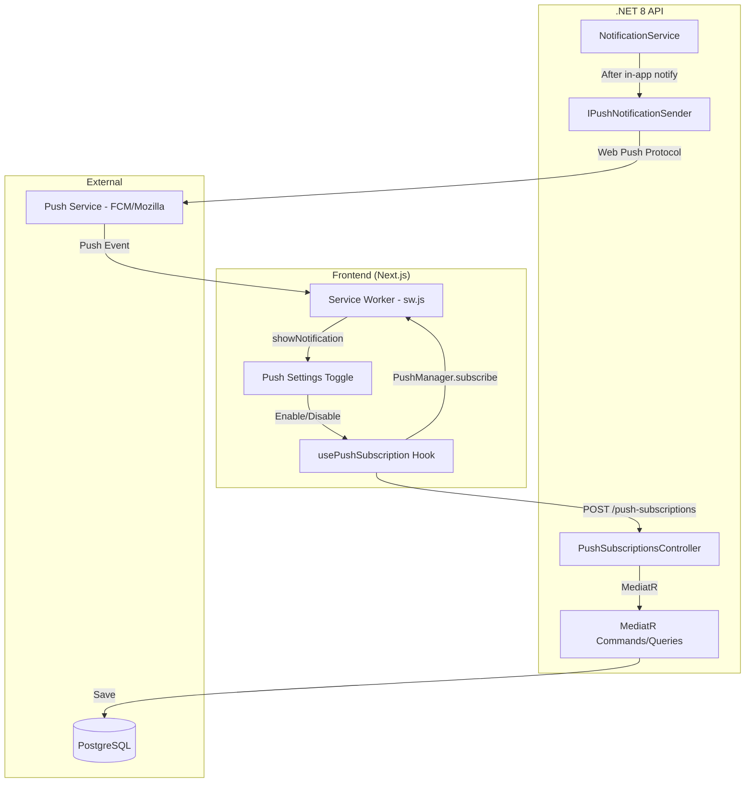
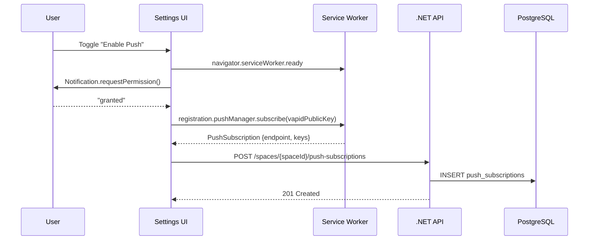
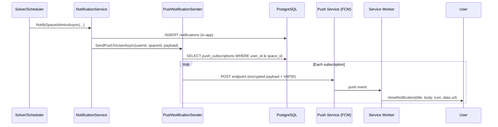
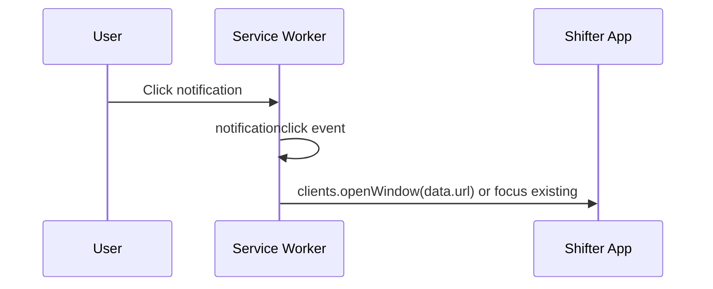

# Design Document: Web Push Notifications

## Overview

Web Push Notifications extends the existing in-app notification system in Shifter to deliver real-time browser push notifications to subscribed users. When the system creates a notification (solver completed, schedule published, etc.), it also sends a Web Push message to all devices the user has subscribed. The feature spans the service worker (push event handling), the Next.js frontend (permission request, subscription management, settings UI), and the .NET 8 backend (subscription storage, VAPID-based push delivery).

The design integrates with the existing `INotificationService` and `NotificationService` in the Infrastructure layer, adding a push dispatch step after in-app notifications are persisted. VAPID authentication ensures secure, standards-compliant delivery without requiring a third-party push service SDK.

## Architecture



## Sequence Diagrams

### Subscription Flow



### Push Delivery Flow



### Notification Click Flow



## Components and Interfaces

### Component 1: PushSubscriptionsController (API Layer)

**Purpose**: REST endpoints for managing push subscriptions per user per space.

**Interface**:
```csharp
[ApiController]
[Route("spaces/{spaceId:guid}/push-subscriptions")]
[Authorize]
public class PushSubscriptionsController : ControllerBase
{
    // Register a new push subscription for the current user
    [HttpPost]
    Task<IActionResult> Subscribe(Guid spaceId, CreatePushSubscriptionRequest request);

    // Remove a push subscription by endpoint
    [HttpDelete]
    Task<IActionResult> Unsubscribe(Guid spaceId, DeletePushSubscriptionRequest request);

    // Check if current user has an active subscription in this space
    [HttpGet("status")]
    Task<IActionResult> GetStatus(Guid spaceId);
}
```

**Responsibilities**:
- Validate incoming subscription data (endpoint URL format, key lengths)
- Dispatch MediatR commands for subscription CRUD
- Enforce tenant isolation via spaceId route parameter
- Return appropriate HTTP status codes (201, 204, 200)

### Component 2: IPushNotificationSender (Application Layer Interface)

**Purpose**: Abstraction for sending web push notifications, implemented in Infrastructure.

**Interface**:
```csharp
namespace Jobuler.Application.Notifications;

public interface IPushNotificationSender
{
    /// <summary>
    /// Sends a push notification to all subscribed devices for a user in a space.
    /// Silently removes expired/invalid subscriptions (410 Gone responses).
    /// </summary>
    Task SendPushToUserAsync(
        Guid userId, Guid spaceId,
        PushPayload payload, CancellationToken ct = default);

    /// <summary>
    /// Sends push notifications to all subscribed devices for multiple users.
    /// Used when notifying all space members.
    /// </summary>
    Task SendPushToUsersAsync(
        IEnumerable<Guid> userIds, Guid spaceId,
        PushPayload payload, CancellationToken ct = default);
}

public record PushPayload(
    string Title,
    string Body,
    string? Icon = null,
    string? Url = null,
    string? Tag = null);
```

**Responsibilities**:
- Encrypt push payloads per Web Push protocol (RFC 8291)
- Sign requests with VAPID keys (RFC 8292)
- Handle push service responses (201 success, 410 gone → delete subscription)
- Batch delivery for multiple users without blocking the caller

### Component 3: Service Worker Push Handler (Frontend)

**Purpose**: Receive push events and display native notifications; handle click navigation.

**Interface**:
```typescript
// Added to existing public/sw.js

// Push event: display notification from server payload
self.addEventListener("push", (event: PushEvent) => void);

// Notification click: navigate to the URL in the payload
self.addEventListener("notificationclick", (event: NotificationEvent) => void);
```

**Responsibilities**:
- Parse push event payload (JSON with title, body, icon, url)
- Display notification via `self.registration.showNotification()`
- On click, focus existing app window or open new one at the target URL
- Handle missing/malformed payloads gracefully

### Component 4: usePushSubscription Hook (Frontend)

**Purpose**: React hook managing the full push subscription lifecycle.

**Interface**:
```typescript
interface UsePushSubscriptionReturn {
  /** Whether push is supported in this browser */
  isSupported: boolean;
  /** Current permission state: 'default' | 'granted' | 'denied' */
  permission: NotificationPermission;
  /** Whether the user has an active subscription for this space */
  isSubscribed: boolean;
  /** Loading state during subscribe/unsubscribe operations */
  isLoading: boolean;
  /** Subscribe to push notifications (requests permission if needed) */
  subscribe: () => Promise<void>;
  /** Unsubscribe from push notifications */
  unsubscribe: () => Promise<void>;
}

function usePushSubscription(spaceId: string): UsePushSubscriptionReturn;
```

**Responsibilities**:
- Check browser support for Push API and service workers
- Manage permission request flow
- Create/remove PushManager subscriptions
- Sync subscription state with the backend API
- Expose reactive state for UI components

### Component 5: Push Settings UI (Frontend)

**Purpose**: Toggle in profile/settings page for enabling/disabling push notifications.

**Responsibilities**:
- Render toggle switch reflecting current subscription state
- Show appropriate messaging for denied permission state
- Handle unsupported browsers gracefully
- Integrate with i18n (en, he, ru translations)

## Data Models

### PushSubscription Entity (Domain)

```csharp
namespace Jobuler.Domain.Notifications;

public class PushSubscription : Entity, ITenantScoped
{
    public Guid SpaceId { get; private set; }
    public Guid UserId { get; private set; }
    
    /// <summary>Push service endpoint URL (unique per device+browser)</summary>
    public string Endpoint { get; private set; } = default!;
    
    /// <summary>Client public key for payload encryption (Base64URL)</summary>
    public string P256dh { get; private set; } = default!;
    
    /// <summary>Authentication secret for payload encryption (Base64URL)</summary>
    public string Auth { get; private set; } = default!;

    private PushSubscription() { }

    public static PushSubscription Create(
        Guid spaceId, Guid userId,
        string endpoint, string p256dh, string auth) =>
        new()
        {
            SpaceId = spaceId,
            UserId = userId,
            Endpoint = endpoint,
            P256dh = p256dh,
            Auth = auth
        };
}
```

**Validation Rules**:
- `Endpoint` must be a valid HTTPS URL (push services always use HTTPS)
- `P256dh` must be a non-empty Base64URL string (65 bytes decoded — uncompressed P-256 point)
- `Auth` must be a non-empty Base64URL string (16 bytes decoded)
- Unique constraint on `(UserId, SpaceId, Endpoint)` — one subscription per device per space
- `SpaceId` must reference a valid space the user is a member of

### Database Table: push_subscriptions

```sql
CREATE TABLE push_subscriptions (
    id UUID PRIMARY KEY DEFAULT gen_random_uuid(),
    space_id UUID NOT NULL REFERENCES spaces(id) ON DELETE CASCADE,
    user_id UUID NOT NULL REFERENCES users(id) ON DELETE CASCADE,
    endpoint TEXT NOT NULL,
    p256dh TEXT NOT NULL,
    auth TEXT NOT NULL,
    created_at TIMESTAMPTZ NOT NULL DEFAULT now(),
    
    CONSTRAINT uq_push_sub_user_space_endpoint 
        UNIQUE (user_id, space_id, endpoint)
);

CREATE INDEX ix_push_subscriptions_user_space 
    ON push_subscriptions(user_id, space_id);
```

### Request/Response DTOs

```csharp
public record CreatePushSubscriptionRequest(
    string Endpoint,
    string P256dh,
    string Auth);

public record DeletePushSubscriptionRequest(
    string Endpoint);

public record PushSubscriptionStatusResponse(
    bool IsSubscribed);
```

### Push Payload (sent to Push Service)

```typescript
interface PushNotificationPayload {
  title: string;
  body: string;
  icon: string;       // "/favicon.jpeg"
  url: string;        // Click navigation target, e.g. "/schedule/my-missions"
  tag?: string;       // Collapse key for replacing notifications
  timestamp: number;  // Unix ms for notification ordering
}
```

## Algorithmic Pseudocode

### Push Delivery Algorithm

```csharp
// Called by NotificationService after persisting in-app notifications
async Task DeliverPushNotifications(
    IEnumerable<Guid> userIds, Guid spaceId, PushPayload payload, CancellationToken ct)
{
    // PRECONDITION: userIds is non-empty, spaceId is valid, payload is well-formed
    
    var subscriptions = await db.PushSubscriptions
        .Where(s => s.SpaceId == spaceId && userIds.Contains(s.UserId))
        .ToListAsync(ct);

    // LOOP INVARIANT: All processed subscriptions have been attempted exactly once
    var expiredEndpoints = new List<Guid>();

    foreach (var sub in subscriptions)
    {
        var result = await SendWebPush(sub.Endpoint, sub.P256dh, sub.Auth, payload);
        
        if (result == PushResult.Gone)
        {
            // Push service reports subscription expired
            expiredEndpoints.Add(sub.Id);
        }
        // result == PushResult.Success → no action needed
        // result == PushResult.RateLimit → log warning, skip (retry on next notification)
        // result == PushResult.Error → log error, skip
    }

    // Cleanup expired subscriptions
    if (expiredEndpoints.Count > 0)
    {
        await db.PushSubscriptions
            .Where(s => expiredEndpoints.Contains(s.Id))
            .ExecuteDeleteAsync(ct);
    }

    // POSTCONDITION: All valid subscriptions received the push payload
    // POSTCONDITION: All expired subscriptions (410) have been removed from DB
}
```

### Subscription Registration Algorithm

```csharp
async Task<PushSubscription> RegisterSubscription(
    Guid spaceId, Guid userId, string endpoint, string p256dh, string auth, CancellationToken ct)
{
    // PRECONDITION: userId is authenticated, spaceId is a space the user belongs to
    // PRECONDITION: endpoint is valid HTTPS URL, p256dh and auth are valid Base64URL
    
    // Check for existing subscription (upsert semantics)
    var existing = await db.PushSubscriptions
        .FirstOrDefaultAsync(s => 
            s.UserId == userId && s.SpaceId == spaceId && s.Endpoint == endpoint, ct);

    if (existing != null)
    {
        // Update keys if they changed (browser may rotate keys)
        // In practice, just return existing — keys don't change for same endpoint
        return existing;
    }

    var subscription = PushSubscription.Create(spaceId, userId, endpoint, p256dh, auth);
    db.PushSubscriptions.Add(subscription);
    await db.SaveChangesAsync(ct);

    // POSTCONDITION: Exactly one subscription exists for (userId, spaceId, endpoint)
    return subscription;
}
```

### Frontend Subscription Flow

```typescript
async function subscribeToPush(spaceId: string): Promise<void> {
  // PRECONDITION: Service worker is registered and active
  // PRECONDITION: Browser supports Push API
  
  const registration = await navigator.serviceWorker.ready;
  
  // Step 1: Request permission
  const permission = await Notification.requestPermission();
  if (permission !== "granted") {
    throw new Error("Push permission denied");
  }

  // Step 2: Subscribe via Push API with VAPID public key
  const subscription = await registration.pushManager.subscribe({
    userVisibleOnly: true,
    applicationServerKey: urlBase64ToUint8Array(VAPID_PUBLIC_KEY),
  });

  // Step 3: Extract keys and send to backend
  const keys = subscription.toJSON().keys!;
  await apiClient.post(`/spaces/${spaceId}/push-subscriptions`, {
    endpoint: subscription.endpoint,
    p256dh: keys.p256dh,
    auth: keys.auth,
  });

  // POSTCONDITION: Subscription is stored in backend
  // POSTCONDITION: Push service will deliver messages to this endpoint
}
```

## Key Functions with Formal Specifications

### SendWebPush (Infrastructure)

```csharp
async Task<PushResult> SendWebPush(
    string endpoint, string p256dh, string auth, PushPayload payload)
```

**Preconditions:**
- `endpoint` is a valid HTTPS URL pointing to a push service
- `p256dh` is a valid Base64URL-encoded P-256 public key (65 bytes uncompressed)
- `auth` is a valid Base64URL-encoded authentication secret (16 bytes)
- `payload` is non-null with non-empty Title and Body
- VAPID private key is available from configuration

**Postconditions:**
- Returns `PushResult.Success` if push service accepted the message (201)
- Returns `PushResult.Gone` if subscription is expired (410)
- Returns `PushResult.RateLimit` if push service rate-limited (429)
- Returns `PushResult.Error` for any other failure
- No exceptions thrown — all errors are captured in the return value
- VAPID JWT is signed with the configured private key

**Loop Invariants:** N/A (single request, no loops)

### NotifySpaceAdminsAsync (Modified)

```csharp
async Task NotifySpaceAdminsAsync(
    Guid spaceId, string eventType, string title, string body,
    string? metadataJson = null, CancellationToken ct = default)
```

**Preconditions:**
- `spaceId` references a valid space with at least one member
- `eventType` is a known notification event type string
- `title` and `body` are non-empty strings

**Postconditions:**
- In-app notifications are persisted for all space members (existing behavior)
- Push notifications are dispatched to all subscribed devices for those members (new behavior)
- Push delivery failures do not affect in-app notification persistence
- Expired subscriptions are cleaned up asynchronously

**Loop Invariants:**
- For member iteration: all previously processed members have their in-app notification persisted

## Example Usage

### Service Worker Push Handler

```typescript
// In public/sw.js — added to existing service worker

self.addEventListener("push", (event) => {
  if (!event.data) return;

  const payload = event.data.json();
  const { title, body, icon, url, tag, timestamp } = payload;

  event.waitUntil(
    self.registration.showNotification(title, {
      body,
      icon: icon || "/favicon.jpeg",
      badge: "/favicon.jpeg",
      tag: tag || undefined,
      timestamp: timestamp || Date.now(),
      data: { url },
      dir: "auto",
    })
  );
});

self.addEventListener("notificationclick", (event) => {
  event.notification.close();

  const url = event.notification.data?.url || "/";

  event.waitUntil(
    self.clients.matchAll({ type: "window", includeUncontrolled: true })
      .then((clients) => {
        // Focus existing window if one is open
        const existing = clients.find((c) => c.url.includes(self.location.origin));
        if (existing) {
          existing.navigate(url);
          return existing.focus();
        }
        // Otherwise open a new window
        return self.clients.openWindow(url);
      })
  );
});
```

### React Hook Usage

```typescript
// In profile/settings page
import { usePushSubscription } from "@/lib/hooks/usePushSubscription";

function PushNotificationSettings({ spaceId }: { spaceId: string }) {
  const { isSupported, permission, isSubscribed, isLoading, subscribe, unsubscribe } =
    usePushSubscription(spaceId);

  if (!isSupported) {
    return <p>{t("push.notSupported")}</p>;
  }

  if (permission === "denied") {
    return <p>{t("push.permissionDenied")}</p>;
  }

  return (
    <Switch
      checked={isSubscribed}
      disabled={isLoading}
      onCheckedChange={(checked) => (checked ? subscribe() : unsubscribe())}
      label={t("push.enableLabel")}
    />
  );
}
```

### Backend Controller Usage

```csharp
[HttpPost]
public async Task<IActionResult> Subscribe(
    Guid spaceId, [FromBody] CreatePushSubscriptionRequest request, CancellationToken ct)
{
    await _mediator.Send(new CreatePushSubscriptionCommand(
        spaceId, CurrentUserId, request.Endpoint, request.P256dh, request.Auth), ct);
    return StatusCode(201);
}

[HttpDelete]
public async Task<IActionResult> Unsubscribe(
    Guid spaceId, [FromBody] DeletePushSubscriptionRequest request, CancellationToken ct)
{
    await _mediator.Send(new DeletePushSubscriptionCommand(
        spaceId, CurrentUserId, request.Endpoint), ct);
    return NoContent();
}
```

## Correctness Properties

*A property is a characteristic or behavior that should hold true across all valid executions of a system — essentially, a formal statement about what the system should do. Properties serve as the bridge between human-readable specifications and machine-verifiable correctness guarantees.*

### Property 1: Subscription Persistence

*For any* valid subscription data (HTTPS endpoint, valid Base64URL p256dh and auth), persisting it via the CreatePushSubscription command SHALL produce exactly one Push_Subscription record with the correct userId, spaceId, endpoint, p256dh, and auth values.

**Validates: Requirement 1.4**

### Property 2: Idempotent Subscribe

*For any* userId, spaceId, and endpoint combination, calling the create subscription operation multiple times SHALL result in at most one Push_Subscription record for that tuple. Subsequent calls return success without creating duplicates.

**Validates: Requirements 1.5, 8.3**

### Property 3: Unsubscribe Removes Record

*For any* existing Push_Subscription, calling the delete subscription operation with the matching endpoint, userId, and spaceId SHALL remove that record from the database, and the subscription SHALL no longer be returned in status queries.

**Validates: Requirement 2.2**

### Property 4: Push Delivery to All Subscriptions

*For any* set of users with active subscriptions in a space, when the NotificationService creates in-app notifications for those users, the PushNotificationSender SHALL attempt delivery to every active subscription for those users in that space — no subscription is skipped and no subscription outside the target set is contacted.

**Validates: Requirements 3.1, 3.4**

### Property 5: Expired Subscription Cleanup

*For any* Push_Subscription where the Push_Service returns HTTP 410 (Gone) during delivery, that subscription SHALL be deleted from the database after the delivery attempt completes.

**Validates: Requirement 3.5**

### Property 6: Push Failure Isolation

*For any* push delivery failure (network error, HTTP 429, HTTP 500, timeout, or exception), the in-app notification persistence SHALL complete successfully. Push failures never propagate to the in-app notification path.

**Validates: Requirement 3.7**

### Property 7: Payload Display Correctness

*For any* valid Push_Payload containing title, body, and icon, when the Service_Worker receives the push event, it SHALL call showNotification with a title matching the payload's title, a body matching the payload's body, and an icon matching the payload's icon.

**Validates: Requirement 4.1**

### Property 8: Tenant Isolation

*For any* push delivery or subscription operation, the system SHALL scope all database queries and mutations to the specified spaceId. A notification event in space A SHALL never cause push delivery to subscriptions belonging to space B, even if the same user has subscriptions in both spaces.

**Validates: Requirements 8.1, 8.2**

### Property 9: Input Validation Rejects Invalid Data

*For any* subscription request where the endpoint is not a valid HTTPS URL, or the p256dh field is empty or contains non-Base64URL characters, or the auth field is empty or contains non-Base64URL characters, the PushSubscriptionsController SHALL return HTTP 400 and SHALL NOT persist any data to the database.

**Validates: Requirements 9.1, 9.2, 9.3, 9.4**

### Property 10: Ownership Enforcement

*For any* authenticated user, all subscription operations (create, delete, status check) SHALL use the authenticated user's ID from the JWT token. A user cannot create or delete subscriptions attributed to a different user, regardless of request body content.

**Validates: Requirement 10.2**

### Property 11: Payload Encryption

*For any* Push_Payload sent to a Push_Service endpoint, the HTTP request body SHALL be encrypted using the subscriber's p256dh and auth keys per RFC 8291. The plaintext payload SHALL NOT appear in the request body.

**Validates: Requirement 10.4**

## Error Handling

### Error Scenario 1: Permission Denied

**Condition**: User clicks "Enable Push" but browser permission is denied (either actively denied or previously blocked).
**Response**: UI shows informational message explaining how to re-enable in browser settings. No API call is made.
**Recovery**: User must manually change browser notification settings, then retry.

### Error Scenario 2: Push Service Returns 410 Gone

**Condition**: A subscription endpoint is no longer valid (user cleared browser data, uninstalled browser, etc.).
**Response**: Backend deletes the stale subscription from the database. No error surfaced to any user.
**Recovery**: Automatic — user will re-subscribe next time they enable push on that device.

### Error Scenario 3: Push Service Rate Limiting (429)

**Condition**: Too many push messages sent to the same push service in a short window.
**Response**: Log warning with retry-after header value. Skip this delivery attempt.
**Recovery**: Next notification will attempt delivery again. No manual intervention needed.

### Error Scenario 4: VAPID Key Mismatch

**Condition**: VAPID public key used for subscription differs from the one used for sending (e.g., after key rotation).
**Response**: Push service rejects with 403. Log error.
**Recovery**: All existing subscriptions become invalid after key rotation. Users must re-subscribe. A migration strategy (re-subscribe prompt) should be shown in the UI.

### Error Scenario 5: Service Worker Not Registered

**Condition**: Service worker failed to register (HTTPS not available in dev, browser doesn't support SW).
**Response**: `usePushSubscription` hook returns `isSupported: false`. UI hides the push toggle entirely.
**Recovery**: No recovery needed — feature is simply unavailable in that environment.

### Error Scenario 6: Backend Unreachable During Subscribe

**Condition**: User grants permission and browser creates a PushSubscription, but the POST to backend fails.
**Response**: Frontend shows error toast. The browser-side subscription exists but backend doesn't know about it.
**Recovery**: On next page load, the hook checks subscription status with the backend and re-syncs if needed.

## Testing Strategy

### Unit Testing Approach

**Backend:**
- Test `CreatePushSubscriptionCommand` handler: validates input, creates entity, handles duplicates
- Test `DeletePushSubscriptionCommand` handler: removes subscription, handles not-found gracefully
- Test `PushNotificationSender`: mock HttpClient to verify VAPID headers, payload encryption, 410 cleanup
- Test modified `NotificationService`: verify push sender is called after in-app notifications are created

**Frontend:**
- Test `usePushSubscription` hook: mock PushManager, verify state transitions
- Test `urlBase64ToUint8Array` utility function
- Test push settings component rendering for all permission states

### Property-Based Testing Approach

**Property Test Library**: fast-check (frontend), FsCheck (.NET backend)

**Properties to test:**
- For any valid Base64URL string of correct length, subscription creation succeeds
- For any subscription that exists, unsubscribe always removes exactly that subscription
- Push payload serialization/deserialization is lossless for all valid Unicode title/body combinations
- Subscription uniqueness constraint holds regardless of concurrent creation attempts

### Integration Testing Approach

- End-to-end subscription flow: create subscription → verify in DB → send push → verify delivery
- Tenant isolation: create subscriptions in two spaces → notify space A → verify only space A devices receive push
- Expired subscription cleanup: mock push service returning 410 → verify subscription deleted
- Permission check: unauthenticated request to push-subscriptions → 401

## Performance Considerations

- **Batch delivery**: When notifying all space members, query all subscriptions in a single DB call rather than per-user queries
- **Fire-and-forget**: Push delivery should not block the notification creation response. Use `Task.Run` or a background channel to dispatch pushes asynchronously
- **Connection pooling**: Use a shared `HttpClient` instance for push service requests (registered via `IHttpClientFactory`)
- **Payload size**: Keep push payloads under 4KB (push service limit). Title + body + URL should comfortably fit
- **Index optimization**: The `ix_push_subscriptions_user_space` index ensures O(log n) lookup for user+space subscription queries
- **Subscription cap**: Consider limiting subscriptions per user (e.g., max 10 devices) to prevent abuse

## Security Considerations

- **VAPID keys from environment**: Private key never committed to source. Loaded from `VAPID_PRIVATE_KEY` env var
- **Endpoint validation**: Only HTTPS endpoints accepted (push services always use HTTPS)
- **Payload encryption**: All push payloads encrypted per RFC 8291 — push service cannot read notification content
- **Tenant isolation**: Subscriptions are scoped to `(userId, spaceId)`. RLS provides defense-in-depth
- **No sensitive data in push**: Push payloads contain only title, body, icon, and URL. No PII, no tokens, no schedule details
- **Subscription ownership**: Only the authenticated user can create/delete their own subscriptions. No admin override needed
- **Rate limiting**: Push subscription endpoints inherit the global API rate limiter (100 req/min per IP)
- **CSRF protection**: Subscription endpoints require JWT Bearer auth, not cookies — CSRF not applicable

## Dependencies

### Backend (NuGet)
- **WebPush** (`web-push-csharp` or `Lib.Net.Http.WebPush`): Handles VAPID signing and payload encryption per RFC 8291/8292
- **Microsoft.EntityFrameworkCore** (existing): For PushSubscription persistence
- **MediatR** (existing): For command/query dispatch

### Frontend (npm)
- No new dependencies required. The Push API and Service Worker API are native browser APIs
- `NEXT_PUBLIC_VAPID_PUBLIC_KEY` environment variable exposed to the client

### Environment Variables
| Variable | Layer | Purpose |
|----------|-------|---------|
| `VAPID_PUBLIC_KEY` | Frontend + Backend | Application server identification (shared) |
| `VAPID_PRIVATE_KEY` | Backend only | Signs VAPID JWTs for push requests |
| `VAPID_SUBJECT` | Backend only | Contact URI (mailto: or https://) for push service |
