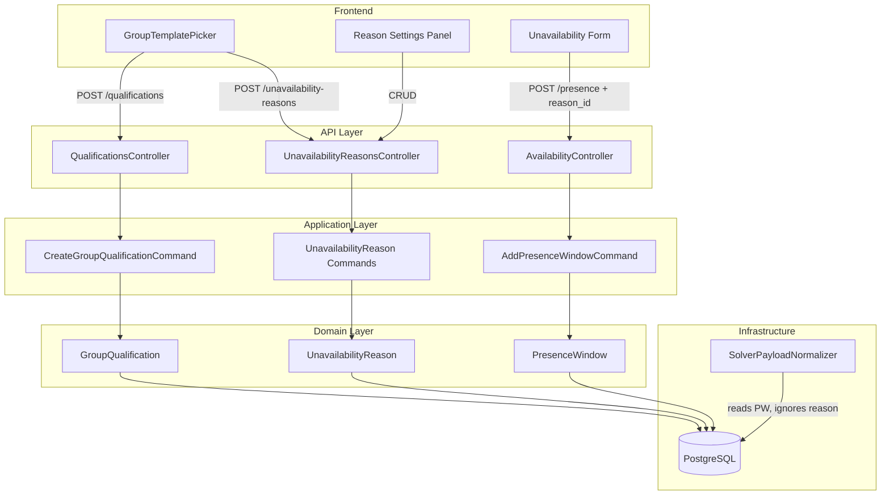

# Design Document: Qualification Templates & Unavailability Reasons

## Overview

This feature extends the group template system in two directions:

1. **Qualification Templates** — Each industry template (Army, Restaurant, Hospital, Security) ships with a predefined list of qualifications. When the `GroupTemplatePicker` applies a template, it creates `GroupQualification` records for the group, skipping any that already exist. This is purely additive and uses the existing qualification CRUD infrastructure.

2. **Unavailability Reasons** — A new `UnavailabilityReason` entity scoped to the space level provides structured reasons for marking someone as unavailable. Templates seed default reasons into a space (only if the space has none yet). Presence windows gain an optional FK to this table, while the existing `Note` field continues to serve as the custom/free-text reason. The solver is unaffected — it never sees reason data.

### Design Rationale

- **Data-driven templates**: Qualification and reason lists live in a JSON seed file (`groupTemplates.ts` on the frontend), not hardcoded in C# backend logic. The frontend sends individual create requests during template application, keeping the backend stateless about template definitions.
- **Space-scoped reasons**: Unavailability reasons are shared across all groups in a space because people can belong to multiple groups and their unavailability reason is person-level, not group-level.
- **Backward compatibility**: The `reason_id` FK on `PresenceWindow` is nullable. Existing windows with only a `Note` continue to work. The solver normalizer ignores the new field entirely.

## Architecture



### Flow: Template Application (Extended)

1. User selects a template in `GroupTemplatePicker`
2. Frontend creates tasks (existing)
3. Frontend creates constraints (existing)
4. Frontend updates solver horizon (existing)
5. **NEW**: Frontend creates qualifications via `POST /spaces/{spaceId}/groups/{groupId}/qualifications` for each entry in the template
6. **NEW**: Frontend creates unavailability reasons via `POST /spaces/{spaceId}/unavailability-reasons/seed` (only if space has none)

### Flow: Marking Unavailability with Reason

1. Admin opens unavailability form for a person
2. Frontend fetches `GET /spaces/{spaceId}/unavailability-reasons`
3. Admin selects a predefined reason OR "Custom" + free text
4. Frontend sends `POST /presence` with `reasonId` (predefined) or `customReason` (free text)
5. Backend validates `reasonId` belongs to the space (if provided)
6. Backend creates `PresenceWindow` with the optional `UnavailabilityReasonId` and/or `Note`

## Components and Interfaces

### New Domain Entity: `UnavailabilityReason`

**Location**: `Jobuler.Domain/Spaces/UnavailabilityReason.cs`

```csharp
public class UnavailabilityReason : AuditableEntity, ITenantScoped
{
    public Guid SpaceId { get; private set; }
    public string DisplayName { get; private set; } = default!;
    public int SortOrder { get; private set; }
    public bool IsActive { get; private set; } = true;

    private UnavailabilityReason() { }

    public static UnavailabilityReason Create(Guid spaceId, string displayName, int sortOrder);
    public void Update(string displayName, int sortOrder);
    public void Deactivate();
}
```

### Modified Domain Entity: `PresenceWindow`

**Location**: `Jobuler.Domain/People/PresenceWindow.cs`

Add an optional FK:

```csharp
public Guid? UnavailabilityReasonId { get; private set; }
```

Modify `CreateManual` factory to accept an optional `Guid? unavailabilityReasonId` parameter.

### New Controller: `UnavailabilityReasonsController`

**Location**: `Jobuler.Api/Controllers/UnavailabilityReasonsController.cs`  
**Route**: `spaces/{spaceId:guid}/unavailability-reasons`

| Method | Endpoint | Description |
|--------|----------|-------------|
| GET | `/` | List active reasons for the space |
| POST | `/` | Create a new reason |
| PUT | `/{reasonId}` | Update name/sort order |
| DELETE | `/{reasonId}` | Deactivate a reason |
| POST | `/seed` | Seed reasons from template (no-op if space already has reasons) |

### Modified Controller: `AvailabilityController`

Extend `AddPresenceRequest` to include:

```csharp
public record AddPresenceRequest(
    string State, DateTime StartsAt, DateTime EndsAt,
    string? Note, Guid? ReasonId, string? CustomReason);
```

### Extended Frontend Template Data

**Location**: `apps/web/lib/utils/groupTemplates.ts`

Add to `GroupTemplate` interface:

```typescript
export interface GroupTemplate {
  // ... existing fields
  qualifications: Array<{ name: string; description?: string }>;
  unavailabilityReasons: string[];
}
```

### New Application Commands

| Command | Purpose |
|---------|---------|
| `CreateUnavailabilityReasonCommand` | Create a single reason in a space |
| `UpdateUnavailabilityReasonCommand` | Update display name / sort order |
| `DeactivateUnavailabilityReasonCommand` | Soft-delete a reason |
| `SeedUnavailabilityReasonsCommand` | Bulk-create reasons if space has none |
| `GetUnavailabilityReasonsQuery` | List active reasons for a space |

### Modified Application Command

`AddPresenceWindowCommand` gains an optional `Guid? ReasonId` parameter. The handler validates that the reason exists in the space before creating the window.

## Data Models

### Database Schema

```sql
-- New table: unavailability_reasons
CREATE TABLE unavailability_reasons (
    id UUID PRIMARY KEY DEFAULT gen_random_uuid(),
    space_id UUID NOT NULL REFERENCES spaces(id),
    display_name VARCHAR(100) NOT NULL,
    sort_order INTEGER NOT NULL DEFAULT 0,
    is_active BOOLEAN NOT NULL DEFAULT TRUE,
    created_at TIMESTAMPTZ NOT NULL DEFAULT NOW(),
    updated_at TIMESTAMPTZ NOT NULL DEFAULT NOW()
);

-- RLS policy
ALTER TABLE unavailability_reasons ENABLE ROW LEVEL SECURITY;
CREATE POLICY tenant_isolation ON unavailability_reasons
    USING (space_id::text = current_setting('app.current_space_id'));

-- Index for listing
CREATE INDEX ix_unavailability_reasons_space_active
    ON unavailability_reasons(space_id, is_active) WHERE is_active = TRUE;

-- Constraint: max 50 per space (enforced in application layer, not DB)

-- Alter presence_windows: add optional FK
ALTER TABLE presence_windows
    ADD COLUMN unavailability_reason_id UUID REFERENCES unavailability_reasons(id);
```

### EF Core Configuration

```csharp
// UnavailabilityReasonConfiguration.cs
builder.ToTable("unavailability_reasons");
builder.HasKey(e => e.Id);
builder.Property(e => e.DisplayName).HasMaxLength(100).IsRequired();
builder.Property(e => e.SortOrder).IsRequired();
builder.HasIndex(e => new { e.SpaceId, e.IsActive });

// PresenceWindowConfiguration.cs (addition)
builder.Property(e => e.UnavailabilityReasonId).IsRequired(false);
builder.HasOne<UnavailabilityReason>()
    .WithMany()
    .HasForeignKey(e => e.UnavailabilityReasonId)
    .OnDelete(DeleteBehavior.SetNull);
```

### Template Data Structure (Frontend)

```typescript
// Army template qualifications
qualifications: [
  { name: "Combat Medic" },
  { name: "Radio Operator" },
  { name: "Driver" },
  { name: "Commander" },
  { name: "Sharpshooter" },
]

// Shared unavailability reasons (all templates)
unavailabilityReasons: ["חופשה", "מחלה", "אישי", "לימודים"]
```


## Correctness Properties

*A property is a characteristic or behavior that should hold true across all valid executions of a system — essentially, a formal statement about what the system should do. Properties serve as the bridge between human-readable specifications and machine-verifiable correctness guarantees.*

### Property 1: Template qualification creation preserves all entries with correct context

*For any* template with N qualification entries (each with a valid name ≤ 100 chars) applied to a group that has zero existing qualifications, the system SHALL create exactly N `GroupQualification` records, each with the correct `SpaceId` and `GroupId` matching the target group.

**Validates: Requirements 1.2, 1.3**

### Property 2: Template application skips duplicate qualification names

*For any* group that already has K qualifications with names overlapping M entries in the template (where M ≤ K), applying the template SHALL result in exactly (template.length - M) new qualifications being created, and the total count SHALL equal K + (template.length - M). No duplicate names SHALL exist in the group after application.

**Validates: Requirements 1.4**

### Property 3: Unavailability reason tenant isolation

*For any* two distinct spaces each with their own unavailability reasons, querying reasons for space A SHALL return only reasons where `SpaceId == A`, and SHALL never include reasons belonging to space B.

**Validates: Requirements 4.5**

### Property 4: Unavailability reason seed idempotence

*For any* space, if the space already has one or more `UnavailabilityReason` entries, the seed operation SHALL not create additional entries (count remains unchanged). If the space has zero entries, the seed operation SHALL create the template's default reasons.

**Validates: Requirements 5.2, 5.3**

### Property 5: Presence window reason round-trip

*For any* valid presence window creation request that includes either a predefined `reasonId` (pointing to an existing reason in the space) or a `customReason` text (≤ 200 chars), retrieving that presence window SHALL return the same reason data: the predefined reason's display name when a `reasonId` was used, or the exact custom text when a custom reason was used.

**Validates: Requirements 6.3, 6.4, 7.1, 7.2**

### Property 6: Invalid reason id rejection

*For any* GUID that does not correspond to an active `UnavailabilityReason` in the current space, attempting to create a presence window with that GUID as `reasonId` SHALL result in a validation error (400 response), and no presence window SHALL be created.

**Validates: Requirements 7.4**

### Property 7: Solver normalizer reason-invariance

*For any* two presence windows that are identical in `PersonId`, `State`, `StartsAt`, and `EndsAt` but differ only in `UnavailabilityReasonId` (one has a reason, one has null), the `SolverPayloadNormalizer` SHALL produce identical `PresenceWindowDto` entries for both. The solver payload SHALL not contain any reason-related fields.

**Validates: Requirements 8.1, 8.2, 8.3**

## Error Handling

| Scenario | Error | HTTP Status | Handling |
|----------|-------|-------------|----------|
| Qualification name > 100 chars | `InvalidOperationException` | 400 | FluentValidation rejects before handler |
| Duplicate qualification name (active) | `ConflictException` | 409 | Existing handler already throws this |
| Unavailability reason display name > 100 chars | `InvalidOperationException` | 400 | FluentValidation rejects |
| Space already has 50 reasons, create attempted | `InvalidOperationException` | 400 | Handler checks count before insert |
| Reason id not found in space | `KeyNotFoundException` | 404 | Handler validates FK before creating window |
| Reason id belongs to different space | `KeyNotFoundException` | 404 | Query scoped to space returns null → 404 |
| Custom reason > 200 chars | `InvalidOperationException` | 400 | FluentValidation rejects |
| Template application with no template selected | N/A | N/A | Frontend prevents — "Custom" template creates nothing |
| Deactivated reason used in new presence window | `KeyNotFoundException` | 404 | Query filters `IsActive = true` |

### Error Handling Design Decisions

- **Existing presence windows with deactivated reasons**: The FK remains intact. The reason is still visible in historical data. Only new windows cannot reference deactivated reasons.
- **Concurrent template application**: The existing `CreateGroupQualificationCommand` already handles the "reactivate if deactivated with same name" case. Two concurrent template applications will not create duplicates due to the existing name-uniqueness check.
- **Cascade on reason deletion**: Using `SetNull` on the FK means if a reason is hard-deleted (not expected in normal flow), the presence window's `UnavailabilityReasonId` becomes null rather than causing a cascade failure.

## Testing Strategy

### Unit Tests (Example-Based)

| Test | Validates |
|------|-----------|
| Army template contains exactly 5 specified qualifications | Req 2.1 |
| Restaurant template contains exactly 5 specified qualifications | Req 2.2 |
| Hospital template contains exactly 5 specified qualifications | Req 2.3 |
| Security template contains exactly 5 specified qualifications | Req 2.4 |
| Custom template has empty qualifications array | Req 1.5 |
| All templates include 4 default unavailability reasons | Req 5.4 |
| Template-created qualifications can be edited | Req 3.2 |
| Template-created qualifications can be deactivated | Req 3.3 |
| New qualifications can be added after template application | Req 3.1 |
| Empty space returns empty reason list | Req 4.3 |
| 51st reason creation is rejected | Req 4.2 |
| Presence window with no reason succeeds (backward compat) | Req 7.3 |

### Property-Based Tests

**Library**: FsCheck (C# / .NET) — integrates with xUnit, already available in the test project ecosystem.

**Configuration**: Minimum 100 iterations per property test.

| Property Test | Tag |
|---------------|-----|
| Template qualification creation | Feature: qualification-templates, Property 1: Template qualification creation preserves all entries with correct context |
| Duplicate name skipping | Feature: qualification-templates, Property 2: Template application skips duplicate qualification names |
| Tenant isolation | Feature: qualification-templates, Property 3: Unavailability reason tenant isolation |
| Seed idempotence | Feature: qualification-templates, Property 4: Unavailability reason seed idempotence |
| Reason round-trip | Feature: qualification-templates, Property 5: Presence window reason round-trip |
| Invalid reason rejection | Feature: qualification-templates, Property 6: Invalid reason id rejection |
| Normalizer invariance | Feature: qualification-templates, Property 7: Solver normalizer reason-invariance |

### Integration Tests

| Test | Purpose |
|------|---------|
| Full template application flow (tasks + constraints + qualifications + reasons) | End-to-end via API |
| Presence window creation with reason → GET returns reason | API round-trip |
| Solver run with presence windows that have reasons | Verify solver still works |

### Test Infrastructure Notes

- Property tests use an in-memory EF Core provider (same pattern as existing `SolverPayloadNormalizerTests`)
- Generators produce random qualification names (alphanumeric, 1–100 chars), random GUIDs for spaces/groups, and random reason display names
- The normalizer invariance test creates two identical presence windows differing only in `UnavailabilityReasonId`, runs `BuildAsync`, and asserts the `PresenceWindowDto` outputs are equal
