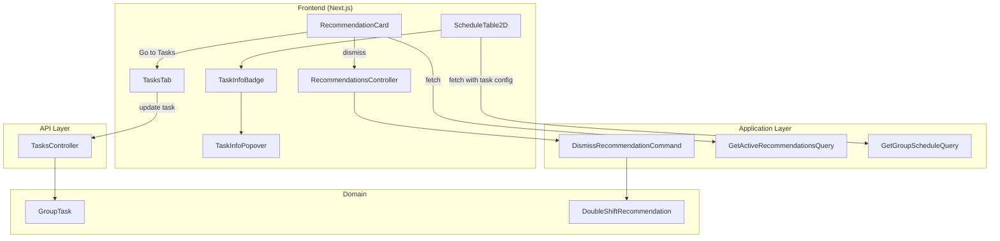

# Design Document: Recommendation Approval Flow

## Overview

This feature transforms the recommendation system from an auto-action model (where accepting a recommendation silently enables double shift) into a passive informational model. The changes span three areas:

1. **Backend simplification** — Remove the `AcceptRecommendationCommand`'s task-mutation logic. The accept endpoint is either removed or repurposed as a dismiss-only action. The only way to enable double shift remains the existing task update endpoint.

2. **Informational recommendation card** — Replace the action-oriented recommendation banner with a passive card displayed above the emergency freeze section in the `HomeLeaveConfigPanel`. The card shows which tasks have uncovered slots and links to the Tasks tab.

3. **Task info badges in schedule grid** — Add an "ℹ" icon next to each task name in the `ScheduleTable2D` column headers. Clicking/hovering reveals a popover with the task's configuration (double shift, overlap, time window, burden, qualifications, split count).

## Architecture



### Key Architectural Decisions

1. **Remove accept endpoint entirely** rather than repurposing it. The dismiss endpoint already exists and handles the only needed action. Removing the accept endpoint eliminates confusion and dead code.

2. **Embed task configuration in the schedule response** rather than making a separate API call. The `ScheduleTable2D` already receives assignment data per task — we extend the response to include a `taskConfigurations` map keyed by task name, avoiding N+1 queries and ensuring instant popover display.

3. **Place the recommendation card in `HomeLeaveConfigPanel`** above the `EmergencyFreezeBanner`. This is the natural location since the emergency freeze section is already the "operational alerts" area of the settings tab. The card is only visible when `isClosedBase` is true (same condition that shows the panel).

4. **Use a client-side popover component** (Radix UI or headless UI pattern) for the task info badge, consistent with existing UI patterns in the app.

## Components and Interfaces

### Backend Changes

#### Removed: `AcceptRecommendationCommand`

The entire `AcceptRecommendationCommand.cs` file is deleted. The `POST /spaces/{spaceId}/recommendations/{id}/accept` endpoint is removed from `RecommendationsController`.

#### Modified: `RecommendationsController`

```csharp
// Remove the Accept endpoint and AcceptRecommendationRequest record.
// The Dismiss endpoint remains unchanged.
// The GET endpoints remain unchanged.
```

#### Modified: `GetGroupScheduleQuery` Response

Extend the schedule query to include task configuration data alongside assignments:

```csharp
public record GroupScheduleResponseDto(
    List<GroupScheduleAssignmentDto> Assignments,
    Dictionary<string, TaskConfigSummaryDto> TaskConfigurations);

public record TaskConfigSummaryDto(
    string TaskId,
    bool AllowsDoubleShift,
    bool AllowsOverlap,
    string? DailyStartTime,
    string? DailyEndTime,
    string BurdenLevel,
    List<string> RequiredQualificationNames,
    int SplitCount);
```

The handler joins `GroupTask` data for all tasks referenced in the published schedule and returns it in a single response.

#### Modified: `GroupTask` Domain Entity

Remove the `EnableDoubleShift(Guid updatedByUserId)` method. The only way to change `AllowsDoubleShift` is through the full `Update(...)` method, which is called by the task update endpoint.

### Frontend Changes

#### New: `RecommendationCard` Component

Located at `components/recommendations/RecommendationCard.tsx`. A passive informational card that:
- Fetches active recommendations for the group via `useRecommendations` hook
- Displays task names and uncovered slot count
- Provides a "Go to Tasks" button that navigates to `?tab=tasks`
- Provides a "Dismiss" button that calls the dismiss endpoint
- Renders nothing when no active recommendations exist

#### Modified: `HomeLeaveConfigPanel`

Import and render `RecommendationCard` above the `EmergencyFreezeBanner`:

```tsx
{/* Recommendation Card — above emergency freeze */}
<RecommendationCard spaceId={spaceId} groupId={groupId} />

{/* Emergency Freeze Banner — always visible at top */}
<EmergencyFreezeBanner ... />
```

#### New: `TaskInfoBadge` Component

Located at `components/schedule/TaskInfoBadge.tsx`. A small "ℹ" icon button that:
- Accepts a `TaskConfigSummaryDto` as props
- Renders nothing if config data is unavailable
- Opens a `TaskInfoPopover` on click/hover
- Has `aria-label` for accessibility

#### New: `TaskInfoPopover` Component

Located at `components/schedule/TaskInfoPopover.tsx`. A popover/tooltip that:
- Displays all task configuration fields with localized labels
- Shows "24/7" when no daily time window is set
- Shows split count only when > 1
- Shows a "default settings" message when all values are defaults
- Closes on click-outside or blur

#### Modified: `ScheduleTable2D`

- Accept an optional `taskConfigurations` prop: `Map<string, TaskConfigSummaryDto>`
- Render `TaskInfoBadge` next to each task name in the `<th>` column header
- Pass the relevant config to each badge

#### Modified: `useRecommendations` Hook

- Remove `useAcceptRecommendation` hook (no longer needed)
- Keep `useDismissRecommendation` unchanged

#### Modified: Frontend API Client

- Remove `acceptRecommendation` function from `lib/api/recommendations.ts`
- Update `getGroupSchedule` return type to include `taskConfigurations`

### Localization

New keys added to `messages/` JSON files:

```json
{
  "recommendations": {
    "cardTitle": "...",
    "cardDescription": "...",
    "goToTasks": "...",
    "dismiss": "...",
    "slotsCount": "..."
  },
  "schedule": {
    "taskInfoLabel": "...",
    "taskInfo": {
      "doubleShift": "...",
      "overlap": "...",
      "timeWindow": "...",
      "allDay": "...",
      "burden": "...",
      "qualifications": "...",
      "splitCount": "...",
      "defaultSettings": "..."
    }
  }
}
```

## Data Models

### Existing: `DoubleShiftRecommendation` (unchanged)

The recommendation entity retains its current schema. Status transitions:
- `Active` → `Dismissed` (via dismiss endpoint)
- `Active` → `Cleared` (when referenced task is deleted)
- `Active` → `Resolved` (when task already has double shift enabled — detected on next engine run)

### Existing: `GroupTask` (minor change)

Remove the `EnableDoubleShift` method. All other properties remain unchanged:

| Property | Type | Description |
|----------|------|-------------|
| AllowsDoubleShift | bool | Whether double shift is enabled |
| AllowsOverlap | bool | Whether overlap is allowed |
| DailyStartTime | TimeOnly? | Daily window start (null = 24/7) |
| DailyEndTime | TimeOnly? | Daily window end |
| BurdenLevel | TaskBurdenLevel | Hard/Normal/Easy |
| QualificationRequirements | List | Structured qualification requirements |
| SplitCount | int | Number of sub-shifts (1 = no split) |

### New: `TaskConfigSummaryDto`

A lightweight DTO returned as part of the schedule response:

```csharp
public record TaskConfigSummaryDto(
    string TaskId,
    bool AllowsDoubleShift,
    bool AllowsOverlap,
    string? DailyStartTime,   // "HH:mm" or null
    string? DailyEndTime,     // "HH:mm" or null
    string BurdenLevel,       // "Hard" | "Normal" | "Easy"
    List<string> RequiredQualificationNames,
    int SplitCount);
```

### Modified: `GroupScheduleResponseDto`

The schedule endpoint response changes from a flat array of assignments to a structured object:

```
Before: GroupScheduleAssignmentDto[]
After:  { assignments: GroupScheduleAssignmentDto[], taskConfigurations: Record<string, TaskConfigSummaryDto> }
```

This is a **breaking change** for the frontend — the schedule data fetching code must be updated to destructure the new response shape.

## Correctness Properties

*A property is a characteristic or behavior that should hold true across all valid executions of a system — essentially, a formal statement about what the system should do. Properties serve as the bridge between human-readable specifications and machine-verifiable correctness guarantees.*

### Property 1: Dismiss preserves task state

*For any* recommendation and any GroupTask state, dismissing the recommendation SHALL set the recommendation status to `Dismissed` AND leave the GroupTask's `AllowsDoubleShift` property unchanged from its value before the dismiss operation.

**Validates: Requirements 1.1, 1.3, 4.2**

### Property 2: Recommendation card displays all task names and slot counts

*For any* set of active recommendations with varying task names and uncovered slot counts, the rendered RecommendationCard SHALL contain every task name from the recommendation set and display the total uncovered slot count.

**Validates: Requirements 2.2**

### Property 3: Task info badge presence and accessibility

*For any* set of tasks displayed in the ScheduleTable2D with available configuration data, each task column header SHALL contain exactly one TaskInfoBadge element with an `aria-label` attribute describing its purpose.

**Validates: Requirements 5.1, 5.3**

### Property 4: Task info popover displays correct configuration

*For any* GroupTask configuration (with varying AllowsDoubleShift, AllowsOverlap, DailyStartTime, DailyEndTime, BurdenLevel, QualificationRequirements, and SplitCount values), the TaskInfoPopover SHALL display the correct value for each non-default field, and SHALL show SplitCount only when greater than 1.

**Validates: Requirements 6.1**

## Error Handling

| Scenario | Handling |
|----------|----------|
| Dismiss fails (network error) | Show toast error, keep card visible, allow retry |
| Recommendation not found (404) | Remove card from UI, invalidate query cache |
| Schedule endpoint returns old format (no taskConfigurations) | Gracefully degrade — hide all TaskInfoBadges |
| Task config missing for a specific task | Hide TaskInfoBadge for that task only |
| Permission denied on dismiss | Show unauthorized error toast |
| Concurrent dismiss (409) | Treat as success — card was already dismissed |

Backend error mapping (via `ExceptionHandlingMiddleware`):
- `KeyNotFoundException` → 404 (recommendation not found)
- `UnauthorizedAccessException` → 403 (missing TasksManage permission)
- `InvalidOperationException` → 400 (recommendation already dismissed)

## Testing Strategy

### Unit Tests (Example-Based)

| Test | Validates |
|------|-----------|
| Dismiss handler sets status to Dismissed | Req 1.3, 4.2 |
| Dismiss handler does not call EnableDoubleShift | Req 1.1, 1.2 |
| RecommendationCard renders when recommendations exist | Req 2.1 |
| RecommendationCard does not render when empty | Req 2.5 |
| "Go to Tasks" button navigates to `?tab=tasks` | Req 3.1 |
| TaskInfoPopover shows "default settings" message for default config | Req 6.4 |
| TaskInfoBadge hidden when config unavailable | Req 7.3 |
| Popover closes on click-outside | Req 6.3 |
| Localized strings render correctly | Req 6.2 |

### Property-Based Tests

Property-based testing is appropriate for this feature because the core logic involves:
- A state-preserving operation (dismiss) that must hold across all possible task/recommendation states
- UI rendering that must correctly reflect arbitrary combinations of task configuration values

**Library**: `fast-check` (already available in the project via vitest)

**Configuration**: Minimum 100 iterations per property test.

| Property Test | Tag |
|---------------|-----|
| Dismiss preserves task state | Feature: recommendation-approval-flow, Property 1: Dismiss preserves task state |
| Card displays all task names and slot counts | Feature: recommendation-approval-flow, Property 2: Recommendation card displays all task names and slot counts |
| Badge presence and accessibility per task | Feature: recommendation-approval-flow, Property 3: Task info badge presence and accessibility |
| Popover displays correct configuration | Feature: recommendation-approval-flow, Property 4: Task info popover displays correct configuration |

### Integration Tests

| Test | Validates |
|------|-----------|
| Accept endpoint returns 404 after removal | Req 4.1 |
| Schedule endpoint includes taskConfigurations in response | Req 7.1, 7.2 |
| Recommendation engine still generates recommendations after refactor | Req 4.3 |
| Task update endpoint remains the only way to enable double shift | Req 4.4 |
