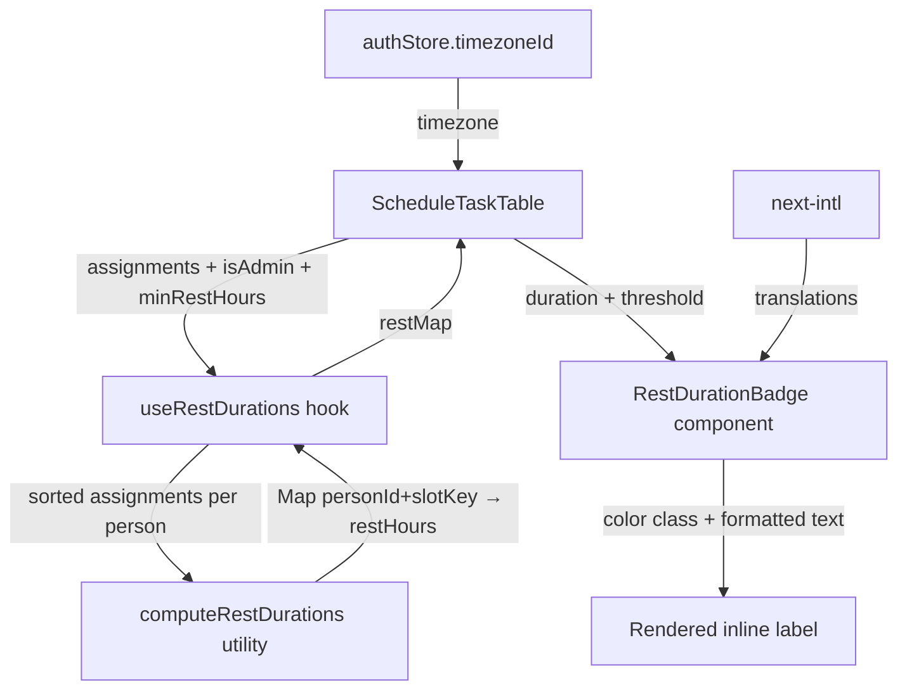

# Design Document: Rest Duration Display

## Overview

This feature adds inline rest duration indicators to the schedule view, showing admins the time gap between a person's consecutive assignments. The implementation is entirely frontend — a pure computation layer calculates gaps from already-loaded assignment data, and a presentational component renders the result with color-coding relative to the group's `minRestBetweenShiftsHours` threshold.

The design prioritizes:
- **Zero backend changes** — all data is already available in `ScheduleVersionDetailDto.assignments`
- **Minimal UI footprint** — secondary-styled labels that don't clutter the existing table
- **Correctness** — proper chronological sorting across task types before gap computation
- **i18n** — locale-aware duration formatting using existing `next-intl` infrastructure

## Architecture



**Data flow:**
1. `ScheduleTaskTable` receives `assignments[]` and the new `minRestHours` prop
2. A custom hook (`useRestDurations`) calls the pure calculator with all assignments
3. The calculator groups by `personId`, sorts chronologically, computes gaps
4. Results are keyed by `personId + slotStartsAt` for O(1) lookup during render
5. Each person cell renders a `RestDurationBadge` when a rest value exists and `isAdmin` is true

## Components and Interfaces

### 1. `computeRestDurations` — Pure utility function

**Location:** `apps/web/lib/utils/restDuration.ts`

```typescript
export interface RestDurationEntry {
  personId: string;
  slotStartsAt: string;       // the assignment this rest follows
  slotEndsAt: string;
  nextSlotStartsAt: string;   // the next assignment
  restHours: number;           // gap in decimal hours
}

export interface RestDurationInput {
  personId: string;
  slotStartsAt: string;
  slotEndsAt: string;
}

/**
 * Computes rest durations between consecutive assignments for each person.
 * Considers ALL assignments across task types.
 * Returns one entry per assignment that has a subsequent assignment for the same person.
 */
export function computeRestDurations(
  assignments: RestDurationInput[]
): RestDurationEntry[];
```

**Algorithm:**
1. Group assignments by `personId`
2. For each person, sort by `slotStartsAt` ascending (UTC string comparison is safe for ISO 8601)
3. For each consecutive pair `(current, next)`, compute `restHours = (next.slotStartsAt - current.slotEndsAt) / 3600000`
4. Return entries only for assignments that have a subsequent one

### 2. `formatRestDuration` — Locale-aware formatter

**Location:** `apps/web/lib/utils/restDuration.ts`

```typescript
export type SupportedLocale = "en" | "he" | "ru";

/**
 * Formats a rest duration in hours into a localized string.
 * - >= 24h: "1d 4h" / "1י 4ש" / "1д 4ч"
 * - < 24h: "8h" / "8ש" / "8ч"
 */
export function formatRestDuration(
  hours: number,
  locale: SupportedLocale
): string;
```

**Locale abbreviations:**
| Locale | Hours | Days |
|--------|-------|------|
| en     | h     | d    |
| he     | ש     | י    |
| ru     | ч     | д    |

### 3. `getRestColorClass` — Threshold comparison

**Location:** `apps/web/lib/utils/restDuration.ts`

```typescript
/**
 * Returns the Tailwind color class based on rest vs threshold comparison.
 */
export function getRestColorClass(
  restHours: number,
  minRestThresholdHours: number
): string;
// Returns: "text-red-600" | "text-amber-600" | "text-slate-500"
```

### 4. `RestDurationBadge` — Presentational component

**Location:** `apps/web/components/schedule/RestDurationBadge.tsx`

```typescript
interface RestDurationBadgeProps {
  restHours: number;
  minRestThresholdHours: number;
}
```

Renders a small `<span>` with:
- The formatted duration (e.g., "8h rest" / "8ש מנוחה")
- Color class from `getRestColorClass`
- `text-[10px] font-normal` styling to stay visually subordinate

### 5. `ScheduleTaskTable` — Modified props

New optional props added:
```typescript
interface Props {
  // ... existing props
  /** Min rest threshold in hours — enables rest duration display when provided with isAdmin */
  minRestHours?: number;
}
```

The component will:
- Call `computeRestDurations` on the full `assignments` array (once, memoized)
- Build a lookup map keyed by `${personId}|${slotStartsAt}`
- Render `RestDurationBadge` below each person name cell when `isAdmin && minRestHours != null && restEntry exists`

## Data Models

### Input data (already exists)

```typescript
// From ScheduleVersionDetailDto — already loaded by the schedule page
interface AssignmentDto {
  id: string;
  personId: string;
  personName: string;
  taskTypeName: string;
  slotStartsAt: string;  // UTC ISO 8601
  slotEndsAt: string;    // UTC ISO 8601
}
```

### Computed data (new, client-side only)

```typescript
// Internal map structure for O(1) lookup during render
type RestDurationMap = Map<string, RestDurationEntry>;
// Key format: `${personId}|${slotStartsAt}`
```

### Translation keys (new)

Added to `schedule` namespace in all three locale files:

```json
{
  "schedule": {
    "rest": {
      "label": "rest",
      "hoursAbbrev": "h",
      "daysAbbrev": "d"
    }
  }
}
```

Hebrew (`he.json`):
```json
{
  "schedule": {
    "rest": {
      "label": "מנוחה",
      "hoursAbbrev": "ש",
      "daysAbbrev": "י"
    }
  }
}
```

Russian (`ru.json`):
```json
{
  "schedule": {
    "rest": {
      "label": "отдых",
      "hoursAbbrev": "ч",
      "daysAbbrev": "д"
    }
  }
}
```

## Correctness Properties

*A property is a characteristic or behavior that should hold true across all valid executions of a system — essentially, a formal statement about what the system should do. Properties serve as the bridge between human-readable specifications and machine-verifiable correctness guarantees.*

### Property 1: Rest gap computation correctness

*For any* set of assignments for a person (across any number of task types, in any input order), the computed rest duration between each consecutive pair equals the millisecond difference between the earlier assignment's `slotEndsAt` and the later assignment's `slotStartsAt`, divided by 3,600,000, and the results are ordered chronologically.

**Validates: Requirements 1.1, 1.2, 5.1, 5.2, 5.3**

### Property 2: Duration formatting correctness

*For any* positive number of hours and any supported locale, the formatted string uses "Xd Yh" pattern (with locale-appropriate abbreviations) when hours ≥ 24, and "Xh" pattern when hours < 24, where X and Y are the correct integer values (days = floor(hours/24), remaining hours = floor(hours % 24)).

**Validates: Requirements 1.4, 6.3**

### Property 3: Color classification correctness

*For any* rest duration value and any positive min-rest threshold, the returned color class is `text-red-600` when duration < threshold, `text-amber-600` when duration === threshold, and `text-slate-500` when duration > threshold.

**Validates: Requirements 4.1, 4.2, 4.3**

### Property 4: No rest entry for terminal assignments

*For any* set of assignments where a person has exactly one assignment, the computed rest durations map contains no entry for that person. More generally, for a person with N assignments, exactly N-1 rest entries are produced.

**Validates: Requirements 1.5**

## Error Handling

| Scenario | Handling |
|----------|----------|
| Invalid/null `slotStartsAt` or `slotEndsAt` | Skip assignment in computation (treat as if it doesn't exist) |
| Negative rest duration (overlapping assignments) | Display as "0h" with red color — indicates a scheduling conflict |
| Missing `personId` on assignment | Skip assignment — cannot group without person identity |
| `minRestHours` prop not provided | Do not render any rest badges (feature disabled) |
| Empty assignments array | Return empty map — no badges rendered |

The calculator is a pure function with no side effects or API calls, so error handling is limited to input validation and graceful degradation.

## Testing Strategy

### Property-Based Tests (fast-check)

The feature's core logic consists of pure functions ideal for property-based testing:

- **Library:** `fast-check` (already available in the project's test dependencies)
- **Minimum iterations:** 100 per property
- **Test file:** `apps/web/__tests__/restDuration.property.test.ts`

Each property test will be tagged with:
```
Feature: rest-duration-display, Property {N}: {property text}
```

Properties to implement:
1. Gap computation correctness — generate random assignment arrays, verify output
2. Duration formatting — generate random hour values, verify format pattern
3. Color classification — generate random (duration, threshold) pairs, verify color
4. Terminal assignment count — generate random person assignment sets, verify N-1 entries

### Unit Tests (example-based)

**File:** `apps/web/__tests__/restDuration.test.ts`

- Specific formatting examples: `25.5h → "1d 1h"`, `8h → "8h"`, `0h → "0h"`
- Locale-specific output verification for he, en, ru
- Admin visibility: render ScheduleTaskTable with `isAdmin=false`, verify no badges
- Admin visibility: render ScheduleTaskTable with `isAdmin=true` + `minRestHours`, verify badges present
- Edge case: person with single assignment → no badge
- Edge case: overlapping assignments (negative gap) → shows "0h" in red
- Edge case: exactly 24h gap → shows "1d 0h" format

### Integration Tests

- Render `ScheduleTaskTable` with realistic assignment data and verify rest badges appear in correct positions relative to person names
- Verify that the `minRestHours` prop flows correctly from the group page through ScheduleTab to ScheduleTaskTable
