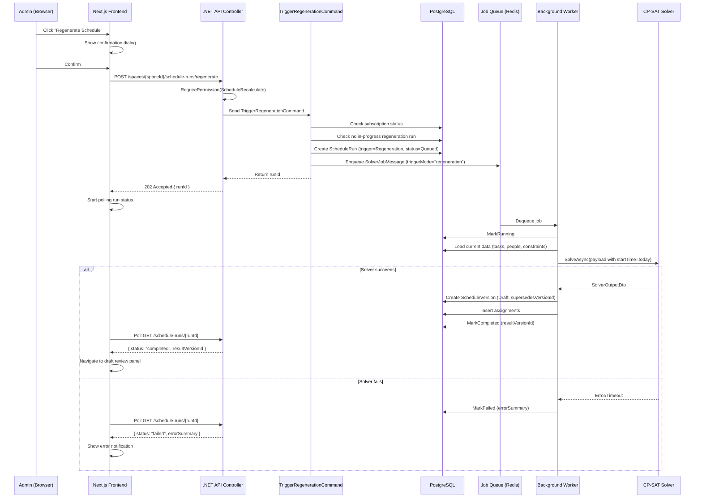

# Design Document: Schedule Regeneration

## Overview

Schedule Regeneration allows an admin to re-run the constraint solver for the period from today forward, producing a new draft version with fresh assignments. The feature integrates into the existing scheduling pipeline by introducing a new trigger mode ("regeneration") on the `ScheduleRun` entity and a new `TriggerRegenerationCommand` in the Application layer. The solver result is always stored as a draft — never auto-published — and the existing published version remains active until the admin explicitly publishes the new draft.

Key design decisions:
- **Reuse over reinvention**: The regeneration flow reuses the existing `ISolverPayloadNormalizer`, `ISolverJobQueue`, and `ISolverClient` interfaces. No new solver infrastructure is needed.
- **New trigger mode**: A `Regeneration` value is added to the `ScheduleRunTrigger` enum, distinguishing regeneration runs from standard/emergency runs.
- **Supersession tracking**: A new `SupersedesVersionId` field on `ScheduleVersion` records which published version the draft is intended to replace, enabling audit trail and UI context.
- **Concurrency guard**: An atomic check prevents multiple concurrent regeneration runs for the same group.

## Architecture

### Sequence Diagram — Regeneration Flow



### Layer Responsibilities

| Layer | Responsibility |
|-------|---------------|
| **Api** | New endpoint on `ScheduleRunsController`, permission check, request validation |
| **Application** | `TriggerRegenerationCommand` — subscription check, concurrency guard, run creation, job dispatch |
| **Infrastructure** | Existing `ISolverJobQueue` (Redis), `ISolverClient` (HTTP), `ISolverPayloadNormalizer` |
| **Domain** | New `Regeneration` trigger enum value, new `SupersedesVersionId` on `ScheduleVersion`, new `SourceType` field |
| **Frontend** | Regenerate button, confirmation dialog, polling status indicator |

## Components and Interfaces

### Backend — New Command

```csharp
// Application/Scheduling/Commands/TriggerRegenerationCommand.cs
public record TriggerRegenerationCommand(
    Guid SpaceId,
    Guid GroupId,
    Guid RequestedByUserId) : IRequest<Guid>; // Returns RunId
```

**Handler logic:**
1. Set RLS session variables
2. Check group subscription status (reject with 402 if expired)
3. Check for in-progress regeneration runs for this group (reject with 409 if exists)
4. Handle stale runs: if a run has been "running" longer than timeout + grace period, mark it failed
5. Find current published version (reject with 400 if none exists)
6. Create `ScheduleRun` with `TriggerType = Regeneration`, `BaselineVersionId = publishedVersion.Id`
7. Enqueue `SolverJobMessage` with `triggerMode = "regeneration"`, `startTime = today in space timezone`
8. Return `run.Id`

### Backend — New API Endpoint

```csharp
// On ScheduleRunsController
[HttpPost("regenerate")]
public async Task<IActionResult> Regenerate(
    Guid spaceId, [FromBody] RegenerateRequest request, CancellationToken ct)
```

**Request DTO:**
```csharp
public record RegenerateRequest(Guid GroupId);
```

**Response:** `202 Accepted` with `{ runId: Guid }`

### Backend — Worker Changes

The existing background worker already processes `SolverJobMessage`. Changes needed:
- When `triggerMode == "regeneration"`, after creating the draft version, set `SupersedesVersionId` to the baseline version ID
- Set `SourceType = "regeneration"` in the version's `SummaryJson` metadata
- Do NOT auto-discard existing drafts (unlike standard runs) — regeneration drafts coexist with other drafts

### Frontend Components

| Component | Location | Purpose |
|-----------|----------|---------|
| `RegenerateButton` | Schedule management panel | Triggers regeneration, disabled when run in progress or no published version |
| `RegenerateConfirmDialog` | Modal overlay | Explains the action, requires explicit confirmation |
| `RegenerationStatusIndicator` | Schedule management panel | Shows real-time status (queued/running/completed/failed) via polling |

### Frontend API Function

```typescript
// lib/api/schedule.ts
export async function triggerRegeneration(
  spaceId: string, groupId: string
): Promise<{ runId: string }> {
  const { data } = await apiClient.post(
    `/spaces/${spaceId}/schedule-runs/regenerate`,
    { groupId }
  );
  return data;
}
```

Polling reuses the existing `getRunStatus(spaceId, runId)` function.

## Data Models

### ScheduleRun — Changes

| Field | Change | Description |
|-------|--------|-------------|
| `TriggerType` | Add enum value `Regeneration` | Distinguishes regeneration runs from standard/emergency |
| `GroupId` | New nullable field | The group this regeneration targets (required for concurrency guard) |
| `ResultVersionId` | New nullable field | The draft version ID created on success |

```csharp
// Domain/Scheduling/ScheduleRun.cs — additions
public enum ScheduleRunTrigger { Standard, Emergency, Manual, Rollback, Regeneration }

// New fields on ScheduleRun
public Guid? GroupId { get; private set; }
public Guid? ResultVersionId { get; private set; }

public void SetResultVersion(Guid versionId) => ResultVersionId = versionId;
```

### ScheduleVersion — Changes

| Field | Change | Description |
|-------|--------|-------------|
| `SupersedesVersionId` | New nullable FK | Points to the published version this draft is intended to replace |
| `SourceType` | New nullable string | "standard", "emergency", "rollback", "regeneration" — stored in metadata |

```csharp
// Domain/Scheduling/ScheduleVersion.cs — additions
public Guid? SupersedesVersionId { get; private set; }
public string? SourceType { get; private set; }

public static ScheduleVersion CreateRegenerationDraft(
    Guid spaceId, int versionNumber, Guid sourceRunId,
    Guid supersedesVersionId, Guid createdByUserId, string? summaryJson = null) =>
    new()
    {
        SpaceId = spaceId,
        VersionNumber = versionNumber,
        Status = ScheduleVersionStatus.Draft,
        SourceRunId = sourceRunId,
        SupersedesVersionId = supersedesVersionId,
        CreatedByUserId = createdByUserId,
        SourceType = "regeneration",
        SummaryJson = summaryJson
    };
```

### Database Migration

```sql
-- Add Regeneration to trigger_type enum
ALTER TYPE schedule_run_trigger ADD VALUE 'Regeneration';

-- Add new columns to schedule_runs
ALTER TABLE schedule_runs ADD COLUMN group_id UUID REFERENCES groups(id);
ALTER TABLE schedule_runs ADD COLUMN result_version_id UUID REFERENCES schedule_versions(id);

-- Add new columns to schedule_versions
ALTER TABLE schedule_versions ADD COLUMN supersedes_version_id UUID REFERENCES schedule_versions(id);
ALTER TABLE schedule_versions ADD COLUMN source_type VARCHAR(50);

-- Index for concurrency guard: find in-progress regeneration runs per group
CREATE INDEX ix_schedule_runs_group_regeneration 
    ON schedule_runs (space_id, group_id, status) 
    WHERE trigger_type = 'Regeneration' AND status IN ('Queued', 'Running');
```

## Correctness Properties

*A property is a characteristic or behavior that should hold true across all valid executions of a system — essentially, a formal statement about what the system should do. Properties serve as the bridge between human-readable specifications and machine-verifiable correctness guarantees.*

### Property 1: Published version immutability during regeneration lifecycle

*For any* published schedule version and any regeneration lifecycle event (run creation, solver success, solver failure, draft discard), the published version's status SHALL remain "Published" and its assignment rows SHALL remain identical in count and content.

**Validates: Requirements 3.2, 3.3, 3.5, 5.4, 6.2**

### Property 2: Successful regeneration creates a correctly linked draft

*For any* valid solver output produced by a regeneration run, the system SHALL create exactly one new ScheduleVersion with status=Draft, SourceRunId matching the run ID, SupersedesVersionId matching the current published version ID, and SourceType="regeneration".

**Validates: Requirements 2.3, 3.1, 4.3, 8.3**

### Property 3: Failed regeneration records error without side effects

*For any* solver failure (timeout, infeasibility, or exception), the regeneration run SHALL have status=Failed, a non-empty ErrorSummary, and no new ScheduleVersion SHALL be created.

**Validates: Requirements 3.3, 3.4, 8.4**

### Property 4: All regeneration draft assignments are within the regeneration period

*For any* draft version created by regeneration with start date S, every assignment in that version SHALL have a slot start date >= S.

**Validates: Requirements 2.2, 4.2**

### Property 5: Concurrent regeneration rejection

*For any* group that has a regeneration run with status "Queued" or "Running", a new regeneration request for that same group SHALL be rejected with a 409 Conflict response, and no new ScheduleRun SHALL be created.

**Validates: Requirements 9.1**

### Property 6: Stale run timeout recovery

*For any* regeneration run that has been in "Running" status for longer than (solver_timeout + grace_period), the system SHALL treat it as failed and allow new regeneration requests for that group.

**Validates: Requirements 9.3**

### Property 7: Regeneration does not block standard runs

*For any* group with an in-progress regeneration run, triggering a standard or emergency solver run for that group SHALL succeed without conflict.

**Validates: Requirements 9.4**

### Property 8: Permission enforcement

*For any* user who does not hold the ScheduleRecalculate permission for the target space, a regeneration request SHALL be rejected with HTTP 403 and no ScheduleRun SHALL be created.

**Validates: Requirements 7.1, 7.2**

### Property 9: Subscription gating

*For any* group whose trial has expired and has no active subscription, a regeneration request SHALL be rejected with HTTP 402. Conversely, for any group with an active subscription or within trial period, the request SHALL proceed to dispatch.

**Validates: Requirements 10.2, 10.3**

### Property 10: Audit log completeness on regeneration publish

*For any* regeneration draft that is published, the system SHALL create an audit log entry containing the superseded version ID, the regeneration run ID, and the publishing user ID.

**Validates: Requirements 5.3**

## Error Handling

| Scenario | HTTP Status | Error Response | System Behavior |
|----------|-------------|----------------|-----------------|
| No published version exists | 400 Bad Request | `{ error: "No published version exists for this group" }` | No run created |
| User lacks ScheduleRecalculate permission | 403 Forbidden | Standard permission denied | No run created |
| Group subscription expired | 402 Payment Required | `{ error: "תקופת הניסיון הסתיימה..." }` | No run created |
| Concurrent regeneration in progress | 409 Conflict | `{ error: "A regeneration run is already in progress" }` | No run created |
| Solver timeout | — (async) | Run marked Failed | Published version unchanged, admin notified |
| Solver infeasibility | — (async) | Run marked Failed | Published version unchanged, admin notified |
| Solver internal error | — (async) | Run marked Failed | Published version unchanged, admin notified |
| Group inactive/deleted | 400 Bad Request | `{ error: "Group is not active" }` | No run created |
| All tasks end in the past | 400 Bad Request | `{ error: "Cannot create a schedule: all tasks end in the past" }` | No run created |

### Error Propagation

- Synchronous errors (permission, subscription, concurrency) are returned immediately in the HTTP response.
- Asynchronous errors (solver failures) are recorded in the `ScheduleRun.ErrorSummary` field and surfaced via polling.
- All 500-level errors bubble to `ExceptionHandlingMiddleware` and are logged with full context via Serilog.
- The frontend polls `GET /schedule-runs/{runId}` and displays the error message when status is "failed".

## Testing Strategy

### Property-Based Tests (PBT)

**Library:** [FsCheck](https://fscheck.github.io/FsCheck/) for .NET (integrates with xUnit)

**Configuration:** Minimum 100 iterations per property test.

**Tag format:** `Feature: schedule-regeneration, Property {N}: {title}`

Each correctness property (1–10) maps to a single property-based test that generates random valid inputs and verifies the invariant holds. Key generators:
- Random solver outputs (varying assignment counts, dates, person IDs)
- Random failure modes (timeout, infeasibility, exception messages)
- Random group states (with/without published versions, with/without in-progress runs)
- Random permission sets (with/without ScheduleRecalculate)
- Random subscription states (active, expired trial, no subscription)

### Unit Tests (Example-Based)

- Confirm the `RegenerateButton` renders only when a published version exists
- Confirm the confirmation dialog displays correct text
- Confirm the status indicator shows each state correctly
- Confirm the API returns 202 with the correct response shape
- Confirm the `CreateRegenerationDraft` factory method sets all fields correctly

### Integration Tests

- End-to-end: trigger regeneration → solver completes → draft created → publish → old version archived
- Concurrent requests: two simultaneous regeneration requests → only one succeeds
- Existing mechanisms: publish/discard/override work on regeneration drafts
- Polling: run status transitions are visible via the schedule-runs endpoint

### What Is NOT Tested with PBT

- UI rendering and navigation (use component tests with React Testing Library)
- Solver algorithm correctness (tested in the Python solver's own test suite)
- Database migration correctness (verified by EF Core migration tooling)
- External service wiring (covered by integration tests)
