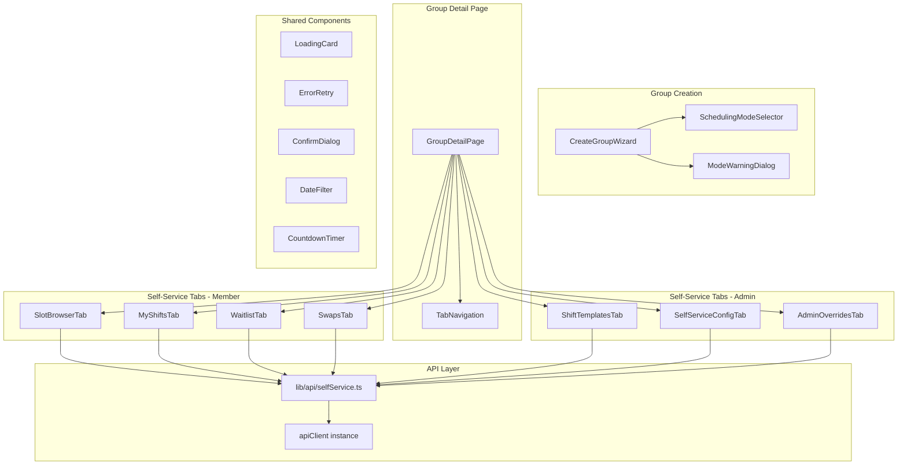
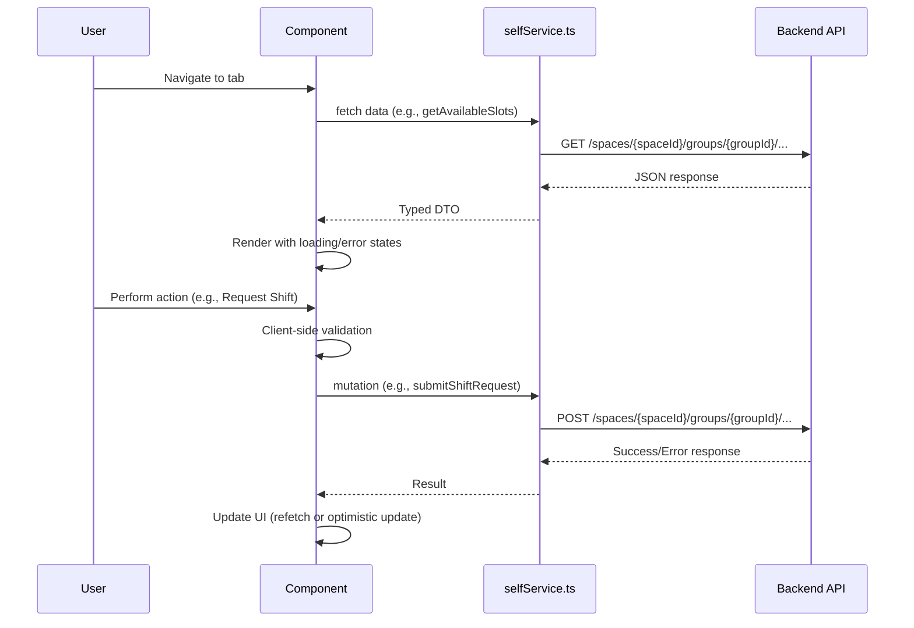
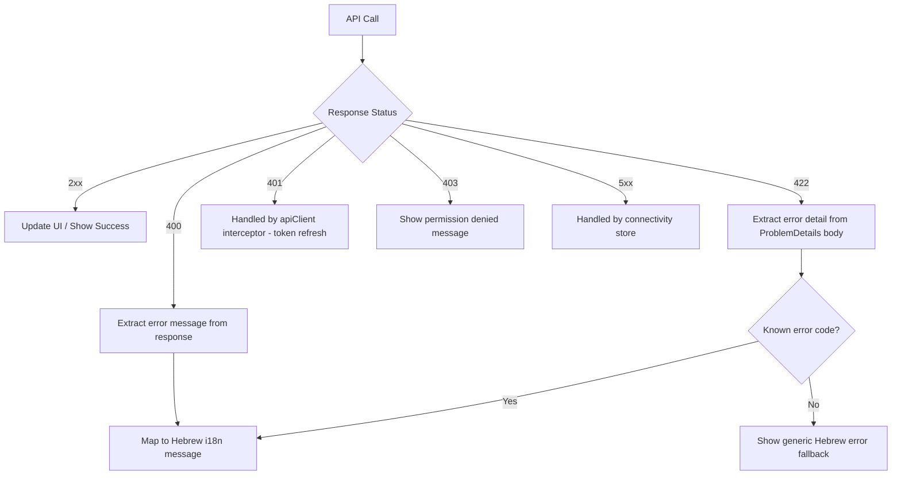

# Design Document: Self-Service Scheduling UI

## Overview

This design covers the frontend implementation for the self-service scheduling system in the Shifter web application. The backend is fully implemented with controllers for shift templates, slots, requests, waitlist, swaps, admin overrides, and configuration. This spec defines the Next.js component architecture, state management, API client layer, and data flow needed to expose all self-service functionality to members and admins.

### Key Design Decisions

1. **Mode-conditional tab rendering**: The group detail page dynamically renders tabs based on `schedulingMode` from the group entity, reusing the existing lazy-load pattern.
2. **Dedicated API module**: A single `lib/api/selfService.ts` module encapsulates all self-service endpoints, following the existing `apiClient` pattern.
3. **No new global store**: Self-service state is local to each tab component (fetched on mount, mutations trigger refetch). The existing `spaceStore` and `authStore` provide context.
4. **Wizard extension**: The `CreateGroupWizard` gains a scheduling mode step before the template picker, with a confirmation dialog for the irreversible choice.
5. **Client-side validation**: Form validation (time ranges, min/max constraints) runs before API calls to provide instant feedback.

## Architecture

### Component Hierarchy



### Data Flow



### State Management Approach

- **No new zustand store** — self-service data is request-scoped and doesn't need cross-component sharing
- Each tab component manages its own state via `useState` + `useEffect` for data fetching
- Mutations use local loading/error state with button disabling during in-flight requests
- The existing `useSpaceStore` provides `currentSpaceId`
- The existing `useAuthStore` provides `userId`, `isAdminForGroup`
- Group data (including `schedulingMode`) is fetched by the parent `GroupDetailPage` and passed down

## Components and Interfaces

### Extended Group Creation Wizard

The existing `CreateGroupWizard` is extended to a multi-step flow:

**Step 1: Name Input** (existing)
**Step 2: Scheduling Mode Selection** (new)
**Step 3: Template Picker** (existing, mode-conditional)
**Step 4: Confirmation Dialog** (new, warns about permanence)

```typescript
// SchedulingModeSelector component props
interface SchedulingModeSelectorProps {
  selectedMode: "AutoGenerated" | "SelfService" | null;
  onSelect: (mode: "AutoGenerated" | "SelfService") => void;
}

// ModeWarningDialog component props
interface ModeWarningDialogProps {
  open: boolean;
  selectedMode: "AutoGenerated" | "SelfService";
  onConfirm: () => void;
  onCancel: () => void;
}
```

### Tab Navigation Extension

The `ActiveTab` type and tab configuration become mode-conditional:

```typescript
// Extended ActiveTab type
export type ActiveTab =
  | "schedule" | "members" | "qualifications" | "roles"
  | "alerts" | "messages" | "tasks" | "constraints"
  | "settings" | "stats" | "live-status"
  // Self-service tabs:
  | "available-slots" | "my-shifts" | "waitlist" | "swaps"
  | "shift-templates" | "self-service-config" | "admin-overrides";

// Tab configuration by mode
const AUTO_GENERATED_TABS: ActiveTab[] = [
  "schedule", "live-status", "members", "qualifications",
  "roles", "alerts", "messages", "tasks", "constraints", "stats", "settings"
];

const SELF_SERVICE_MEMBER_TABS: ActiveTab[] = [
  "available-slots", "my-shifts", "waitlist", "swaps",
  "members", "qualifications", "roles", "alerts", "messages", "settings"
];

const SELF_SERVICE_ADMIN_TABS: ActiveTab[] = [
  "available-slots", "my-shifts", "waitlist", "swaps",
  "shift-templates", "self-service-config", "admin-overrides",
  "members", "qualifications", "roles", "alerts", "messages", "settings"
];
```

### Self-Service Tab Components

Each tab is a lazy-loaded component following the existing pattern:

```typescript
// SlotBrowserTab props
interface SlotBrowserTabProps {
  spaceId: string;
  groupId: string;
  isAdmin: boolean;
}

// MyShiftsTab props
interface MyShiftsTabProps {
  spaceId: string;
  groupId: string;
}

// WaitlistTab props
interface WaitlistTabProps {
  spaceId: string;
  groupId: string;
}

// SwapsTab props
interface SwapsTabProps {
  spaceId: string;
  groupId: string;
  members: GroupMemberDto[]; // for member picker in propose flow
}

// ShiftTemplatesTab props (admin only)
interface ShiftTemplatesTabProps {
  spaceId: string;
  groupId: string;
  tasks: GroupTaskDto[]; // for task dropdown
}

// SelfServiceConfigTab props (admin only)
interface SelfServiceConfigTabProps {
  spaceId: string;
  groupId: string;
}

// AdminOverridesTab props (admin only)
interface AdminOverridesTabProps {
  spaceId: string;
  groupId: string;
  members: GroupMemberDto[]; // for member picker
}
```

### API Client Module (`lib/api/selfService.ts`)

All self-service API functions follow the existing pattern: async functions using `apiClient`, returning typed DTOs.

```typescript
// ── Shift Templates ──────────────────────────────────────────────────────────

export async function listShiftTemplates(
  spaceId: string, groupId: string
): Promise<ShiftTemplateDto[]>;

export async function createShiftTemplate(
  spaceId: string, groupId: string, payload: CreateShiftTemplatePayload
): Promise<{ id: string }>;

export async function updateShiftTemplate(
  spaceId: string, groupId: string, templateId: string, payload: UpdateShiftTemplatePayload
): Promise<ShiftTemplateDto>;

export async function deleteShiftTemplate(
  spaceId: string, groupId: string, templateId: string
): Promise<void>;

// ── Self-Service Config ──────────────────────────────────────────────────────

export async function getSelfServiceConfig(
  spaceId: string, groupId: string
): Promise<SelfServiceConfigDto>;

export async function updateSelfServiceConfig(
  spaceId: string, groupId: string, payload: UpdateSelfServiceConfigPayload
): Promise<SelfServiceConfigDto>;

// ── Available Slots ──────────────────────────────────────────────────────────

export async function getAvailableSlots(
  spaceId: string, groupId: string, cycleId: string
): Promise<AvailableSlotsResponse>;

// ── Shift Requests ───────────────────────────────────────────────────────────

export async function submitShiftRequest(
  spaceId: string, groupId: string, shiftSlotId: string
): Promise<{ shiftRequestId: string }>;

export async function cancelShiftRequest(
  spaceId: string, groupId: string, shiftRequestId: string, reason: string
): Promise<void>;

export async function getMyShiftRequests(
  spaceId: string, groupId: string, schedulingCycleId?: string
): Promise<ShiftRequestDto[]>;

// ── Waitlist ─────────────────────────────────────────────────────────────────

export async function joinWaitlist(
  spaceId: string, groupId: string, shiftSlotId: string
): Promise<{ position: number; shiftSlotId: string }>;

export async function leaveWaitlist(
  spaceId: string, groupId: string, shiftSlotId: string
): Promise<void>;

export async function acceptWaitlistOffer(
  spaceId: string, groupId: string, shiftSlotId: string
): Promise<{ shiftRequestId: string }>;

export async function getMyWaitlistEntries(
  spaceId: string, groupId: string
): Promise<WaitlistEntryDto[]>;

// ── Shift Swaps ──────────────────────────────────────────────────────────────

export async function proposeSwap(
  spaceId: string, groupId: string,
  initiatorShiftRequestId: string, targetShiftRequestId: string
): Promise<{ swapRequestId: string }>;

export async function acceptSwap(
  spaceId: string, groupId: string, swapRequestId: string
): Promise<{ swapRequestId: string }>;

export async function declineSwap(
  spaceId: string, groupId: string, swapRequestId: string
): Promise<void>;

export async function cancelSwap(
  spaceId: string, groupId: string, swapRequestId: string
): Promise<void>;

export async function getMySwaps(
  spaceId: string, groupId: string
): Promise<SwapRequestDto[]>;

// ── Admin Overrides ──────────────────────────────────────────────────────────

export async function adminAssignMember(
  spaceId: string, groupId: string, shiftSlotId: string, personId: string
): Promise<{ shiftRequestId: string }>;

export async function adminRemoveMember(
  spaceId: string, groupId: string, shiftSlotId: string, personId: string
): Promise<void>;
```

### Validation Utilities

Client-side validation functions used by form components:

```typescript
// lib/utils/selfServiceValidation.ts

export interface ValidationResult {
  valid: boolean;
  errorKey?: string; // i18n key for error message
}

/** Validates shift template time range: start must be before end */
export function validateTemplateTimeRange(
  startTime: string, endTime: string
): ValidationResult;

/** Validates self-service config fields against allowed ranges */
export function validateSelfServiceConfig(config: {
  minShiftsPerCycle: number;
  maxShiftsPerCycle: number;
  requestWindowOpenOffsetHours: number;
  requestWindowCloseOffsetHours: number;
  cancellationCutoffHours: number;
  waitlistOfferMinutes: number;
  cycleDurationDays: number;
}): ValidationResult;

/** Validates cancellation reason length (1-500 chars) */
export function validateCancellationReason(reason: string): ValidationResult;
```

### Formatting Utilities

```typescript
// lib/utils/selfServiceFormat.ts

/** Hebrew day names indexed by JS getDay() (0=Sunday) */
export const HEBREW_DAY_NAMES = ["ראשון", "שני", "שלישי", "רביעי", "חמישי", "שישי", "שבת"];

/** Format a date as Hebrew locale string with day name */
export function formatSlotDate(date: string): string;

/** Format time in 24h format (HH:mm) */
export function formatTime24h(time: string): string;

/** Calculate remaining time string for countdown display */
export function formatCountdown(expiresAt: string): string;

/** Determine capacity visual class based on fill ratio */
export function getCapacityClass(currentFill: number, capacity: number): string;
```

## Data Models

### Frontend TypeScript Types (`lib/api/selfService.ts`)

```typescript
// ── Shift Template ───────────────────────────────────────────────────────────

export interface ShiftTemplateDto {
  id: string;
  groupId: string;
  groupTaskId: string;
  groupTaskName: string;
  dayOfWeek: number; // 0=Sunday, 6=Saturday
  startTime: string; // "HH:mm:ss"
  endTime: string;   // "HH:mm:ss"
  requiredHeadcount: number;
  isDeleted: boolean;
  createdAt: string;
}

export interface CreateShiftTemplatePayload {
  groupTaskId: string;
  dayOfWeek: number;
  startTime: string; // "HH:mm"
  endTime: string;   // "HH:mm"
  requiredHeadcount: number;
}

export interface UpdateShiftTemplatePayload {
  dayOfWeek: number;
  startTime: string;
  endTime: string;
  requiredHeadcount: number;
  groupTaskId?: string;
}

// ── Self-Service Config ──────────────────────────────────────────────────────

export interface SelfServiceConfigDto {
  id: string | null;
  groupId: string;
  minShiftsPerCycle: number;
  maxShiftsPerCycle: number;
  requestWindowOpenOffsetHours: number;
  requestWindowCloseOffsetHours: number;
  cancellationCutoffHours: number;
  waitlistOfferMinutes: number;
  cycleDurationDays: number;
}

export interface UpdateSelfServiceConfigPayload {
  minShiftsPerCycle: number;
  maxShiftsPerCycle: number;
  requestWindowOpenOffsetHours: number;
  requestWindowCloseOffsetHours: number;
  cancellationCutoffHours: number;
  waitlistOfferMinutes: number;
  cycleDurationDays: number;
}

// ── Shift Slot ───────────────────────────────────────────────────────────────

export interface AvailableSlotDto {
  id: string;
  date: string;         // "YYYY-MM-DD"
  startTime: string;    // "HH:mm"
  endTime: string;      // "HH:mm"
  taskName: string;
  capacity: number;
  currentFillCount: number;
  schedulingCycleId: string;
}

export interface AvailableSlotsResponse {
  slots: AvailableSlotDto[];
  requestWindowOpen: boolean;
  requestWindowOpensAt: string | null;
  requestWindowClosesAt: string | null;
  currentCycleId: string;
}

// ── Shift Request ────────────────────────────────────────────────────────────

export interface ShiftRequestDto {
  id: string;
  shiftSlotId: string;
  slotDate: string;
  slotStartTime: string;
  slotEndTime: string;
  taskName: string;
  status: "Pending" | "Approved" | "Rejected" | "Cancelled";
  isAdminOverride: boolean;
  rejectionReason: string | null;
  cancellationReason: string | null;
  cancelledAt: string | null;
  createdAt: string;
}

export interface MyShiftsResponse {
  requests: ShiftRequestDto[];
  currentShiftCount: number;
  minShiftsPerCycle: number;
  maxShiftsPerCycle: number;
  cancellationCutoffHours: number;
}

// ── Waitlist ─────────────────────────────────────────────────────────────────

export interface WaitlistEntryDto {
  id: string;
  shiftSlotId: string;
  slotDate: string;
  slotStartTime: string;
  slotEndTime: string;
  taskName: string;
  position: number;
  status: "Waiting" | "Offered" | "Accepted" | "Expired" | "Declined" | "Removed";
  offeredAt: string | null;
  expiresAt: string | null;
}

// ── Swap Request ─────────────────────────────────────────────────────────────

export interface SwapRequestDto {
  id: string;
  initiatorPersonId: string;
  targetPersonId: string;
  initiatorPersonName: string;
  targetPersonName: string;
  initiatorShiftRequestId: string;
  targetShiftRequestId: string;
  initiatorSlotDate: string;
  initiatorSlotTime: string;
  initiatorTaskName: string;
  targetSlotDate: string;
  targetSlotTime: string;
  targetTaskName: string;
  status: "Pending" | "Accepted" | "Declined" | "Cancelled" | "Expired";
  expiresAt: string | null;
  createdAt: string;
}
```

### API Endpoint Mapping

| Frontend Function | HTTP Method | Backend Route |
|---|---|---|
| `listShiftTemplates` | GET | `/spaces/{spaceId}/groups/{groupId}/shift-templates` |
| `createShiftTemplate` | POST | `/spaces/{spaceId}/groups/{groupId}/shift-templates` |
| `updateShiftTemplate` | PUT | `/spaces/{spaceId}/groups/{groupId}/shift-templates/{templateId}` |
| `deleteShiftTemplate` | DELETE | `/spaces/{spaceId}/groups/{groupId}/shift-templates/{templateId}` |
| `getSelfServiceConfig` | GET | `/spaces/{spaceId}/groups/{groupId}/self-service-config` |
| `updateSelfServiceConfig` | PUT | `/spaces/{spaceId}/groups/{groupId}/self-service-config` |
| `getAvailableSlots` | GET | `/spaces/{spaceId}/groups/{groupId}/shift-slots/available?cycleId={cycleId}` |
| `submitShiftRequest` | POST | `/spaces/{spaceId}/groups/{groupId}/shift-requests` |
| `cancelShiftRequest` | POST | `/spaces/{spaceId}/groups/{groupId}/shift-requests/{id}/cancel` |
| `getMyShiftRequests` | GET | `/spaces/{spaceId}/groups/{groupId}/shift-requests/mine` |
| `joinWaitlist` | POST | `/spaces/{spaceId}/groups/{groupId}/waitlist` |
| `leaveWaitlist` | DELETE | `/spaces/{spaceId}/groups/{groupId}/waitlist/{shiftSlotId}` |
| `acceptWaitlistOffer` | POST | `/spaces/{spaceId}/groups/{groupId}/waitlist/accept` |
| `getMyWaitlistEntries` | GET | `/spaces/{spaceId}/groups/{groupId}/waitlist/mine` |
| `proposeSwap` | POST | `/spaces/{spaceId}/groups/{groupId}/shift-swaps/propose` |
| `acceptSwap` | POST | `/spaces/{spaceId}/groups/{groupId}/shift-swaps/{id}/accept` |
| `declineSwap` | POST | `/spaces/{spaceId}/groups/{groupId}/shift-swaps/{id}/decline` |
| `cancelSwap` | POST | `/spaces/{spaceId}/groups/{groupId}/shift-swaps/{id}/cancel` |
| `getMySwaps` | GET | `/spaces/{spaceId}/groups/{groupId}/shift-swaps/my` |
| `adminAssignMember` | POST | `/spaces/{spaceId}/groups/{groupId}/shift-slots/{slotId}/admin-overrides/assign` |
| `adminRemoveMember` | POST | `/spaces/{spaceId}/groups/{groupId}/shift-slots/{slotId}/admin-overrides/remove` |

### i18n Message Keys

New keys added to `apps/web/messages/he.json` and `apps/web/messages/en.json` under a `selfService` namespace:

```
selfService.modeSelector.title
selfService.modeSelector.autoTitle / .autoDescription
selfService.modeSelector.selfServiceTitle / .selfServiceDescription
selfService.modeSelector.permanentWarning
selfService.confirmDialog.title / .message / .confirm / .cancel
selfService.tabs.availableSlots / .myShifts / .waitlist / .swaps
selfService.tabs.shiftTemplates / .selfServiceConfig / .adminOverrides
selfService.slotBrowser.requestButton / .joinWaitlistButton / .windowClosed / ...
selfService.myShifts.cancelButton / .cancelDialog / .shiftCount / .underScheduled / ...
selfService.waitlist.acceptButton / .declineButton / .leaveButton / .countdown / ...
selfService.swaps.proposeButton / .acceptButton / .declineButton / .cancelButton / .countdown / ...
selfService.templates.createButton / .editButton / .deleteButton / .form.* / ...
selfService.config.* (all config field labels and validation messages)
selfService.adminOverrides.assignButton / .removeButton / .noPermission / ...
selfService.errors.* (mapped error codes to Hebrew messages)
selfService.loading / .error / .retry
```

## Correctness Properties

*A property is a characteristic or behavior that should hold true across all valid executions of a system — essentially, a formal statement about what the system should do. Properties serve as the bridge between human-readable specifications and machine-verifiable correctness guarantees.*

### Property 1: Shift template time validation rejects invalid ranges

*For any* pair of time values where `startTime >= endTime`, the `validateTemplateTimeRange` function SHALL return `{ valid: false }` and the form SHALL NOT call the API.

**Validates: Requirements 3.3**

### Property 2: Self-service config validation rejects out-of-range values

*For any* configuration object where `minShiftsPerCycle > maxShiftsPerCycle`, OR any field is outside its valid range (min: 0-100, max: 1-100, offsets: 1-720, waitlistOfferMinutes: 1-1440, cycleDurationDays: 1-365), the `validateSelfServiceConfig` function SHALL return `{ valid: false }` with an appropriate error key.

**Validates: Requirements 4.3, 4.4**

### Property 3: Slot browser displays slots in correct sort order

*For any* set of available slots returned by the API, the rendered slot list SHALL be ordered by date ascending, then by start time ascending within the same date.

**Validates: Requirements 5.1**

### Property 4: Slot display includes all required fields

*For any* available slot DTO with non-null values for date, startTime, endTime, taskName, currentFillCount, and capacity, the rendered slot element SHALL contain all six pieces of information plus the Hebrew day-of-week name.

**Validates: Requirements 5.2**

### Property 5: Full slots show "Join Waitlist" instead of "Request"

*For any* available slot where `currentFillCount === capacity`, the rendered action button SHALL display the "Join Waitlist" label. For any slot where `currentFillCount < capacity`, the button SHALL display "Request".

**Validates: Requirements 5.8**

### Property 6: Capacity visual distinction at 50% threshold

*For any* available slot, if `(capacity - currentFillCount) / capacity > 0.5` the slot SHALL receive the "high availability" CSS class, otherwise it SHALL receive the "nearly full" CSS class.

**Validates: Requirements 5.10**

### Property 7: Shift requests are grouped by status

*For any* set of shift request DTOs with mixed statuses, the rendered my-shifts view SHALL group them into three sections: approved first, then pending, then cancelled, with each request appearing in exactly one section matching its status.

**Validates: Requirements 6.1**

### Property 8: Shift request display includes all required fields

*For any* shift request DTO, the rendered element SHALL contain: date, Hebrew day-of-week name, start time, end time, task name, and a status badge with the correct status text.

**Validates: Requirements 6.2**

### Property 9: Waitlist entry display includes all required fields

*For any* waitlist entry DTO, the rendered element SHALL contain: slot date, start time, end time, task name, queue position number, and status text.

**Validates: Requirements 7.1**

### Property 10: Swap request display includes all required fields

*For any* swap request DTO, the rendered element SHALL contain: status, counterpart member name, offered shift details (date + time + task), and requested shift details (date + time + task).

**Validates: Requirements 8.1**

### Property 11: Countdown timer displays correct remaining time

*For any* `expiresAt` timestamp in the future, the `formatCountdown` function SHALL return a string representing the remaining hours and minutes (or days/hours if > 24h) that decreases monotonically as current time advances toward `expiresAt`.

**Validates: Requirements 8.10**

### Property 12: Hebrew date formatting produces Hebrew day names

*For any* valid date string, the `formatSlotDate` function SHALL return a string containing one of the seven Hebrew day names (ראשון, שני, שלישי, רביעי, חמישי, שישי, שבת) corresponding to the correct day of week.

**Validates: Requirements 10.3**

### Property 13: Time formatting uses 24-hour format

*For any* valid time string, the `formatTime24h` function SHALL return a string matching the pattern `HH:mm` (two-digit hour 00-23, colon, two-digit minute 00-59) with no AM/PM suffix.

**Validates: Requirements 10.4**

### Property 14: Error code mapping produces Hebrew messages

*For any* known error code in the self-service error code set, the error mapping function SHALL return a non-empty Hebrew string (containing at least one Hebrew character). For unknown codes, it SHALL return the generic Hebrew fallback message.

**Validates: Requirements 10.5**

### Property 15: API client URLs contain spaceId and groupId

*For any* valid UUID pair (spaceId, groupId), every self-service API function SHALL construct a request URL containing both `/spaces/{spaceId}/groups/{groupId}/` as path segments.

**Validates: Requirements 11.3**

## Error Handling

### Error Flow



### Error Code Mapping

The frontend maintains a mapping from backend error type slugs to i18n keys:

```typescript
const ERROR_CODE_MAP: Record<string, string> = {
  "shift-request-rejected": "selfService.errors.requestRejected",
  "waitlist-rejected": "selfService.errors.waitlistRejected",
  // Specific detail messages are displayed directly from the API response
};
```

For 422 responses, the `detail` field from the ProblemDetails body is displayed directly (it's already a human-readable message from the backend). The i18n fallback is used only when the response lacks a `detail` field.

### Loading States

- **Tab initial load**: Full-height skeleton with 3-5 placeholder rows matching the expected layout
- **Mutation in progress**: The triggering button shows a spinner icon and is disabled; other buttons remain interactive
- **Refetch after mutation**: Silent background refetch — no loading indicator shown, UI updates when data arrives

### Retry Strategy

- **Data fetch failure**: Show error card with Hebrew message + "נסה שוב" (Retry) button
- **Mutation failure**: Show toast/inline error, restore previous state, user can retry manually
- **No automatic retry**: All retries are user-initiated to avoid confusion

## Testing Strategy

### Dual Testing Approach

This feature uses both unit tests and property-based tests for comprehensive coverage.

**Unit Tests (example-based):**
- Component rendering tests (React Testing Library) for each tab
- Interaction flow tests (click handlers, form submissions, dialog flows)
- API integration tests (mocked axios, verify correct endpoints called)
- Permission-based rendering (admin vs member tab visibility)
- Error state rendering (loading, error, retry)
- i18n rendering (Hebrew text present)

**Property-Based Tests (fast-check):**
- Validation functions (`validateTemplateTimeRange`, `validateSelfServiceConfig`)
- Formatting functions (`formatSlotDate`, `formatTime24h`, `formatCountdown`)
- Sort/grouping logic (slot ordering, request status grouping)
- Display completeness (all required fields rendered for any valid DTO)
- Capacity threshold logic (button label, CSS class selection)
- Error code mapping (known codes → Hebrew, unknown → fallback)
- URL construction (all API functions include spaceId/groupId)

### Property Test Configuration

- Library: **fast-check** (already available in the project's test dependencies)
- Minimum iterations: **100** per property test
- Each property test references its design document property via tag comment:
  ```typescript
  // Feature: self-service-scheduling-ui, Property 1: Shift template time validation rejects invalid ranges
  ```

### Test File Organization

```
apps/web/__tests__/
  selfService/
    validation.property.test.ts    — Properties 1, 2
    formatting.property.test.ts    — Properties 11, 12, 13
    slotBrowser.property.test.ts   — Properties 3, 4, 5, 6
    myShifts.property.test.ts      — Properties 7, 8
    waitlist.property.test.ts      — Property 9
    swaps.property.test.ts         — Properties 10, 11
    errorMapping.property.test.ts  — Property 14
    apiClient.property.test.ts     — Property 15
    components/
      CreateGroupWizard.test.tsx
      SlotBrowserTab.test.tsx
      MyShiftsTab.test.tsx
      WaitlistTab.test.tsx
      SwapsTab.test.tsx
      ShiftTemplatesTab.test.tsx
      SelfServiceConfigTab.test.tsx
      AdminOverridesTab.test.tsx
```

