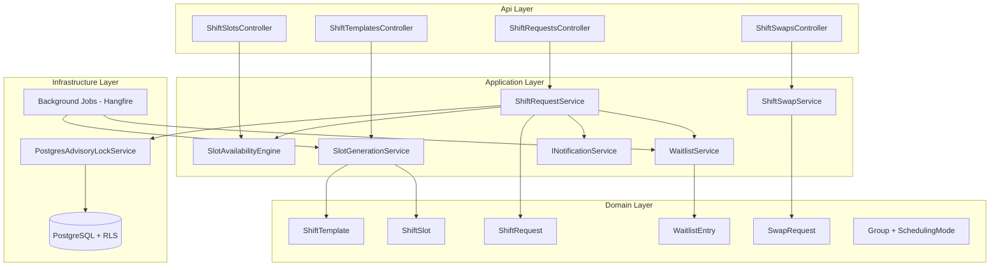
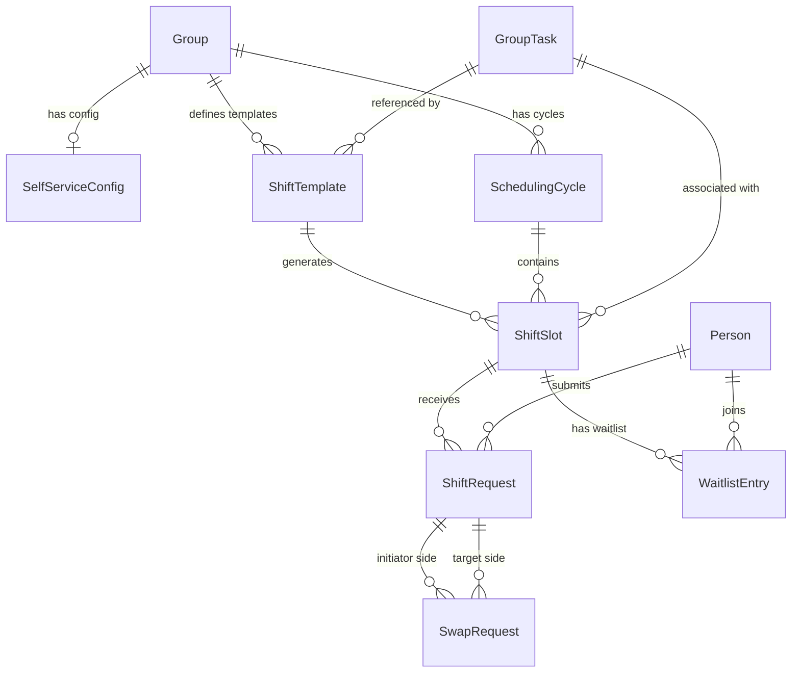

# Design Document: Self-Service Scheduling

## Overview

This design introduces a **Self-Service Scheduling** mode to the Jobuler platform, enabling groups to let members request shifts from available slots rather than relying on the solver-based auto-generation. The feature targets normal businesses (restaurants, hospitals, security firms) where members have agency over their schedules.

The system adds:
- A `SchedulingMode` enum on the `Group` entity to toggle between `AutoGenerated` and `SelfService`
- A `ShiftTemplate` → `ShiftSlot` generation pipeline for recurring weekly patterns
- A concurrency-safe `ShiftRequest` flow using PostgreSQL advisory locks
- Min/Max shift constraints enforcement per scheduling cycle
- A request window that controls when members can submit requests
- A waitlist system with timed offers for full slots
- A shift swap mechanism between members
- Admin manual override capabilities
- Notifications for all self-service lifecycle events

The solver service remains untouched — it only operates on `AutoGenerated` groups. Self-service groups bypass the solver entirely.

## Architecture

The self-service scheduling feature follows the existing Clean Architecture layering:

```
Api (Controllers) → Application (Commands/Queries via MediatR) → Domain (Entities/Logic)
Infrastructure (EF Core, PostgreSQL advisory locks) → Application (Interfaces)
```



### Key Architectural Decisions

1. **PostgreSQL Advisory Locks for Slot Locking**: Using `pg_advisory_xact_lock(slot_id_hash)` scoped to the transaction. This avoids row-level lock contention and deadlocks while providing exclusive access during request processing.

2. **No Solver Involvement**: Self-service groups never trigger solver runs. The `TriggerSolverCommand` handler checks `SchedulingMode` and short-circuits.

3. **Background Job for Slot Generation**: A recurring Hangfire job generates slots from templates at cycle boundaries. Idempotent by design (skip if slot already exists for template+date).

4. **Background Job for Waitlist Expiry**: A periodic job checks for expired waitlist offers and cascades to the next member.

5. **Existing ConflictDetector Reuse**: The shift swap validation reuses `ConflictDetector.Detect()` by projecting the hypothetical post-swap state into `FlatAssignment` records.

## Components and Interfaces

### New Domain Entities

#### `SchedulingMode` (Enum)
```csharp
public enum SchedulingMode { AutoGenerated, SelfService }
```
Added as a property on the existing `Group` entity.

#### `ShiftTemplate`
Defines a recurring weekly pattern for slot generation.

```csharp
public class ShiftTemplate : AuditableEntity, ITenantScoped
{
    public Guid SpaceId { get; private set; }
    public Guid GroupId { get; private set; }
    public Guid GroupTaskId { get; private set; }
    public DayOfWeek DayOfWeek { get; private set; }
    public TimeOnly StartTime { get; private set; }
    public TimeOnly EndTime { get; private set; }
    public int RequiredHeadcount { get; private set; }
    public bool IsDeleted { get; private set; }
    public Guid? CreatedByUserId { get; private set; }
}
```

#### `ShiftSlot`
A concrete time slot generated from a template for a specific date.

```csharp
public enum ShiftSlotStatus { Open, Closed }

public class ShiftSlot : AuditableEntity, ITenantScoped
{
    public Guid SpaceId { get; private set; }
    public Guid GroupId { get; private set; }
    public Guid GroupTaskId { get; private set; }
    public Guid ShiftTemplateId { get; private set; }
    public Guid SchedulingCycleId { get; private set; }
    public DateOnly Date { get; private set; }
    public TimeOnly StartTime { get; private set; }
    public TimeOnly EndTime { get; private set; }
    public int Capacity { get; private set; }        // from template's RequiredHeadcount
    public int CurrentFillCount { get; private set; } // incremented on approval
    public ShiftSlotStatus Status { get; private set; }
}
```

#### `ShiftRequest`
A member's request to claim a specific slot.

```csharp
public enum ShiftRequestStatus { Pending, Approved, Rejected, Cancelled }

public class ShiftRequest : AuditableEntity, ITenantScoped
{
    public Guid SpaceId { get; private set; }
    public Guid ShiftSlotId { get; private set; }
    public Guid PersonId { get; private set; }
    public Guid GroupId { get; private set; }
    public Guid SchedulingCycleId { get; private set; }
    public ShiftRequestStatus Status { get; private set; }
    public bool IsAdminOverride { get; private set; }
    public Guid? ProcessedByUserId { get; private set; }
    public string? RejectionReason { get; private set; }
    public string? CancellationReason { get; private set; }
    public DateTime? CancelledAt { get; private set; }
}
```

#### `SchedulingCycle`
Represents a scheduling period (typically one week).

```csharp
public class SchedulingCycle : AuditableEntity, ITenantScoped
{
    public Guid SpaceId { get; private set; }
    public Guid GroupId { get; private set; }
    public DateTime StartsAt { get; private set; }
    public DateTime EndsAt { get; private set; }
    public DateTime RequestWindowOpensAt { get; private set; }
    public DateTime RequestWindowClosesAt { get; private set; }
    public bool IsGenerated { get; private set; } // slots generated flag
}
```

#### `WaitlistEntry`
A member's position in the waitlist for a full slot.

```csharp
public enum WaitlistEntryStatus { Waiting, Offered, Accepted, Expired, Declined, Removed }

public class WaitlistEntry : AuditableEntity, ITenantScoped
{
    public Guid SpaceId { get; private set; }
    public Guid ShiftSlotId { get; private set; }
    public Guid PersonId { get; private set; }
    public int Position { get; private set; }
    public WaitlistEntryStatus Status { get; private set; }
    public DateTime? OfferedAt { get; private set; }
    public DateTime? ExpiresAt { get; private set; }
}
```

#### `SwapRequest`
A proposal to swap shifts between two members.

```csharp
public enum SwapRequestStatus { Pending, Accepted, Declined, Cancelled, Expired }

public class SwapRequest : AuditableEntity, ITenantScoped
{
    public Guid SpaceId { get; private set; }
    public Guid GroupId { get; private set; }
    public Guid InitiatorPersonId { get; private set; }
    public Guid TargetPersonId { get; private set; }
    public Guid InitiatorShiftRequestId { get; private set; }
    public Guid TargetShiftRequestId { get; private set; }
    public SwapRequestStatus Status { get; private set; }
    public DateTime? ExpiresAt { get; private set; } // 72h from creation
}
```

#### `SelfServiceConfig`
Group-level configuration for self-service scheduling.

```csharp
public class SelfServiceConfig : AuditableEntity, ITenantScoped
{
    public Guid SpaceId { get; private set; }
    public Guid GroupId { get; private set; }
    public int MinShiftsPerCycle { get; private set; } = 0;
    public int MaxShiftsPerCycle { get; private set; } = 7;
    public int RequestWindowOpenOffsetHours { get; private set; } = 168; // 7 days
    public int RequestWindowCloseOffsetHours { get; private set; } = 24; // 1 day
    public int CancellationCutoffHours { get; private set; } = 24;
    public int WaitlistOfferMinutes { get; private set; } = 60;
    public int CycleDurationDays { get; private set; } = 7;
}
```

### Application Layer Interfaces

```csharp
public interface ISlotLockService
{
    /// <summary>
    /// Acquires a PostgreSQL advisory lock scoped to the given shift slot.
    /// Returns true if acquired within timeout, false otherwise.
    /// Must be called within an active transaction.
    /// </summary>
    Task<bool> TryAcquireSlotLockAsync(Guid shiftSlotId, TimeSpan timeout, CancellationToken ct);
}

public interface IShiftRequestService
{
    Task<ShiftRequestResult> ProcessRequestAsync(Guid personId, Guid shiftSlotId, CancellationToken ct);
    Task<CancellationResult> CancelRequestAsync(Guid personId, Guid shiftRequestId, string reason, CancellationToken ct);
}

public interface ISlotAvailabilityEngine
{
    Task<IReadOnlyList<AvailableSlotDto>> GetAvailableSlotsAsync(
        Guid personId, Guid groupId, Guid schedulingCycleId, CancellationToken ct);
}

public interface IWaitlistService
{
    Task<WaitlistResult> JoinWaitlistAsync(Guid personId, Guid shiftSlotId, CancellationToken ct);
    Task LeaveWaitlistAsync(Guid personId, Guid shiftSlotId, CancellationToken ct);
    Task ProcessSlotReleasedAsync(Guid shiftSlotId, CancellationToken ct);
    Task ProcessExpiredOffersAsync(CancellationToken ct);
}

public interface ISlotGenerationService
{
    Task GenerateSlotsForCycleAsync(Guid groupId, Guid schedulingCycleId, CancellationToken ct);
}

public interface IShiftSwapService
{
    Task<SwapResult> ProposeSwapAsync(Guid initiatorPersonId, Guid initiatorRequestId, Guid targetRequestId, CancellationToken ct);
    Task<SwapResult> AcceptSwapAsync(Guid targetPersonId, Guid swapRequestId, CancellationToken ct);
    Task DeclineSwapAsync(Guid targetPersonId, Guid swapRequestId, CancellationToken ct);
    Task CancelSwapAsync(Guid initiatorPersonId, Guid swapRequestId, CancellationToken ct);
}
```

### New Controllers

| Controller | Responsibility |
|---|---|
| `ShiftTemplatesController` | CRUD for shift templates |
| `ShiftSlotsController` | Query available slots, view slot details |
| `ShiftRequestsController` | Submit, cancel, list shift requests |
| `ShiftSwapsController` | Propose, accept, decline, cancel swaps |
| `SelfServiceConfigController` | Configure min/max, request window, waitlist settings |
| `WaitlistController` | Join, leave, view waitlist position |

### Background Jobs (Hangfire)

| Job | Schedule | Responsibility |
|---|---|---|
| `GenerateCycleSlotsJob` | Daily at midnight UTC | Generate slots for upcoming cycles from templates |
| `ProcessExpiredWaitlistOffersJob` | Every 5 minutes | Expire timed-out offers, cascade to next member |
| `ExpireSwapRequestsJob` | Every hour | Mark 72h-old pending swaps as expired |
| `NotifyRequestWindowOpenJob` | Every 5 minutes | Send notifications when request windows open |
| `CheckUnderScheduledMembersJob` | On request window close | Flag members below Min_Shifts |

## Data Models

### Database Schema (PostgreSQL)

```sql
-- Enum type for scheduling mode (stored as text on Group table)
-- Added column to existing groups table:
ALTER TABLE groups ADD COLUMN scheduling_mode TEXT NOT NULL DEFAULT 'AutoGenerated';

-- Self-service configuration per group
CREATE TABLE self_service_configs (
    id UUID PRIMARY KEY DEFAULT gen_random_uuid(),
    space_id UUID NOT NULL REFERENCES spaces(id),
    group_id UUID NOT NULL REFERENCES groups(id),
    min_shifts_per_cycle INT NOT NULL DEFAULT 0,
    max_shifts_per_cycle INT NOT NULL DEFAULT 7,
    request_window_open_offset_hours INT NOT NULL DEFAULT 168,
    request_window_close_offset_hours INT NOT NULL DEFAULT 24,
    cancellation_cutoff_hours INT NOT NULL DEFAULT 24,
    waitlist_offer_minutes INT NOT NULL DEFAULT 60,
    cycle_duration_days INT NOT NULL DEFAULT 7,
    created_at TIMESTAMPTZ NOT NULL DEFAULT now(),
    updated_at TIMESTAMPTZ NOT NULL DEFAULT now(),
    UNIQUE(group_id)
);

-- Scheduling cycles
CREATE TABLE scheduling_cycles (
    id UUID PRIMARY KEY DEFAULT gen_random_uuid(),
    space_id UUID NOT NULL REFERENCES spaces(id),
    group_id UUID NOT NULL REFERENCES groups(id),
    starts_at TIMESTAMPTZ NOT NULL,
    ends_at TIMESTAMPTZ NOT NULL,
    request_window_opens_at TIMESTAMPTZ NOT NULL,
    request_window_closes_at TIMESTAMPTZ NOT NULL,
    is_generated BOOLEAN NOT NULL DEFAULT FALSE,
    created_at TIMESTAMPTZ NOT NULL DEFAULT now(),
    updated_at TIMESTAMPTZ NOT NULL DEFAULT now()
);
CREATE INDEX idx_scheduling_cycles_group_dates ON scheduling_cycles(group_id, starts_at, ends_at);

-- Shift templates (recurring weekly patterns)
CREATE TABLE shift_templates (
    id UUID PRIMARY KEY DEFAULT gen_random_uuid(),
    space_id UUID NOT NULL REFERENCES spaces(id),
    group_id UUID NOT NULL REFERENCES groups(id),
    group_task_id UUID NOT NULL REFERENCES group_tasks(id),
    day_of_week INT NOT NULL CHECK (day_of_week BETWEEN 0 AND 6),
    start_time TIME NOT NULL,
    end_time TIME NOT NULL,
    required_headcount INT NOT NULL CHECK (required_headcount BETWEEN 1 AND 999),
    is_deleted BOOLEAN NOT NULL DEFAULT FALSE,
    created_by_user_id UUID,
    created_at TIMESTAMPTZ NOT NULL DEFAULT now(),
    updated_at TIMESTAMPTZ NOT NULL DEFAULT now(),
    CHECK (start_time < end_time)
);
CREATE INDEX idx_shift_templates_group ON shift_templates(group_id) WHERE NOT is_deleted;

-- Shift slots (generated from templates)
CREATE TABLE shift_slots (
    id UUID PRIMARY KEY DEFAULT gen_random_uuid(),
    space_id UUID NOT NULL REFERENCES spaces(id),
    group_id UUID NOT NULL REFERENCES groups(id),
    group_task_id UUID NOT NULL REFERENCES group_tasks(id),
    shift_template_id UUID NOT NULL REFERENCES shift_templates(id),
    scheduling_cycle_id UUID NOT NULL REFERENCES scheduling_cycles(id),
    date DATE NOT NULL,
    start_time TIME NOT NULL,
    end_time TIME NOT NULL,
    capacity INT NOT NULL,
    current_fill_count INT NOT NULL DEFAULT 0,
    status TEXT NOT NULL DEFAULT 'Open',
    created_at TIMESTAMPTZ NOT NULL DEFAULT now(),
    updated_at TIMESTAMPTZ NOT NULL DEFAULT now(),
    UNIQUE(shift_template_id, date, group_id)
);
CREATE INDEX idx_shift_slots_cycle ON shift_slots(scheduling_cycle_id, status);
CREATE INDEX idx_shift_slots_group_date ON shift_slots(group_id, date, start_time);

-- Shift requests
CREATE TABLE shift_requests (
    id UUID PRIMARY KEY DEFAULT gen_random_uuid(),
    space_id UUID NOT NULL REFERENCES spaces(id),
    shift_slot_id UUID NOT NULL REFERENCES shift_slots(id),
    person_id UUID NOT NULL REFERENCES people(id),
    group_id UUID NOT NULL REFERENCES groups(id),
    scheduling_cycle_id UUID NOT NULL REFERENCES scheduling_cycles(id),
    status TEXT NOT NULL DEFAULT 'Pending',
    is_admin_override BOOLEAN NOT NULL DEFAULT FALSE,
    processed_by_user_id UUID,
    rejection_reason TEXT,
    cancellation_reason TEXT,
    cancelled_at TIMESTAMPTZ,
    created_at TIMESTAMPTZ NOT NULL DEFAULT now(),
    updated_at TIMESTAMPTZ NOT NULL DEFAULT now()
);
CREATE INDEX idx_shift_requests_person_cycle ON shift_requests(person_id, scheduling_cycle_id, status);
CREATE INDEX idx_shift_requests_slot ON shift_requests(shift_slot_id, status);
CREATE UNIQUE INDEX idx_shift_requests_no_dup 
    ON shift_requests(shift_slot_id, person_id) 
    WHERE status IN ('Pending', 'Approved');

-- Waitlist entries
CREATE TABLE waitlist_entries (
    id UUID PRIMARY KEY DEFAULT gen_random_uuid(),
    space_id UUID NOT NULL REFERENCES spaces(id),
    shift_slot_id UUID NOT NULL REFERENCES shift_slots(id),
    person_id UUID NOT NULL REFERENCES people(id),
    position INT NOT NULL,
    status TEXT NOT NULL DEFAULT 'Waiting',
    offered_at TIMESTAMPTZ,
    expires_at TIMESTAMPTZ,
    created_at TIMESTAMPTZ NOT NULL DEFAULT now(),
    updated_at TIMESTAMPTZ NOT NULL DEFAULT now()
);
CREATE UNIQUE INDEX idx_waitlist_no_dup 
    ON waitlist_entries(shift_slot_id, person_id) 
    WHERE status IN ('Waiting', 'Offered');
CREATE INDEX idx_waitlist_slot_position ON waitlist_entries(shift_slot_id, position) WHERE status = 'Waiting';

-- Swap requests
CREATE TABLE swap_requests (
    id UUID PRIMARY KEY DEFAULT gen_random_uuid(),
    space_id UUID NOT NULL REFERENCES spaces(id),
    group_id UUID NOT NULL REFERENCES groups(id),
    initiator_person_id UUID NOT NULL REFERENCES people(id),
    target_person_id UUID NOT NULL REFERENCES people(id),
    initiator_shift_request_id UUID NOT NULL REFERENCES shift_requests(id),
    target_shift_request_id UUID NOT NULL REFERENCES shift_requests(id),
    status TEXT NOT NULL DEFAULT 'Pending',
    expires_at TIMESTAMPTZ NOT NULL,
    created_at TIMESTAMPTZ NOT NULL DEFAULT now(),
    updated_at TIMESTAMPTZ NOT NULL DEFAULT now()
);
CREATE INDEX idx_swap_requests_status ON swap_requests(status, expires_at) WHERE status = 'Pending';

-- RLS policies (all tables follow the same pattern)
ALTER TABLE self_service_configs ENABLE ROW LEVEL SECURITY;
ALTER TABLE scheduling_cycles ENABLE ROW LEVEL SECURITY;
ALTER TABLE shift_templates ENABLE ROW LEVEL SECURITY;
ALTER TABLE shift_slots ENABLE ROW LEVEL SECURITY;
ALTER TABLE shift_requests ENABLE ROW LEVEL SECURITY;
ALTER TABLE waitlist_entries ENABLE ROW LEVEL SECURITY;
ALTER TABLE swap_requests ENABLE ROW LEVEL SECURITY;

-- Example RLS policy (same pattern for all)
CREATE POLICY tenant_isolation ON shift_slots
    USING (space_id = current_setting('app.current_space_id')::UUID);
```

### Advisory Lock Strategy

```sql
-- Lock acquisition within a transaction:
SELECT pg_advisory_xact_lock(hashtext(shift_slot_id::text));

-- The lock is automatically released when the transaction commits or rolls back.
-- No explicit release needed. Timeout handled at application level with cancellation token.
```

### Entity Relationships




## Correctness Properties

*A property is a characteristic or behavior that should hold true across all valid executions of a system — essentially, a formal statement about what the system should do. Properties serve as the bridge between human-readable specifications and machine-verifiable correctness guarantees.*

### Property 1: Scheduling mode gates solver runs

*For any* group with `SchedulingMode = SelfService`, attempting to trigger a solver-based schedule run SHALL be rejected.

**Validates: Requirements 1.2**

### Property 2: Scheduling mode gates shift requests

*For any* group with `SchedulingMode = AutoGenerated`, attempting to submit a self-service shift request SHALL be rejected.

**Validates: Requirements 1.3**

### Property 3: Mode change blocked by active requests

*For any* group that has at least one ShiftRequest in `Pending` or `Approved` status for the current scheduling cycle, attempting to change the `SchedulingMode` SHALL be rejected.

**Validates: Requirements 1.5**

### Property 4: Shift template validation

*For any* ShiftTemplate creation or update where `StartTime >= EndTime` OR `RequiredHeadcount < 1` OR `RequiredHeadcount > 999`, the operation SHALL be rejected with a validation error.

**Validates: Requirements 2.5, 2.6**

### Property 5: Slot generation produces correct count from active templates

*For any* set of ShiftTemplates (mix of deleted/non-deleted, with active/inactive GroupTasks) and a SchedulingCycle date range, slot generation SHALL produce exactly one ShiftSlot per non-deleted template with an active GroupTask for each date in the cycle that matches the template's DayOfWeek.

**Validates: Requirements 2.2, 3.1, 3.5, 3.6**

### Property 6: Generated slots inherit template properties

*For any* ShiftSlot generated from a ShiftTemplate, the slot SHALL have `Status = Open`, `CurrentFillCount = 0`, `StartTime` and `EndTime` matching the template, `Capacity` equal to the template's `RequiredHeadcount`, the template's `GroupTaskId`, the template's `Id` as `ShiftTemplateId`, and the cycle's `Id` as `SchedulingCycleId`.

**Validates: Requirements 3.2, 3.4**

### Property 7: Idempotent slot generation

*For any* set of ShiftTemplates and SchedulingCycle, running the slot generation process N times (N ≥ 1) SHALL produce the same set of ShiftSlots as running it exactly once.

**Validates: Requirements 3.3**

### Property 8: Template modification preserves protected slots

*For any* ShiftSlot that has at least one ShiftRequest in `Approved` status, modifying or deleting the source ShiftTemplate SHALL NOT change that slot's properties (date, times, capacity, status, fill count).

**Validates: Requirements 2.3, 2.4**

### Property 9: Request approval on available slot

*For any* ShiftSlot where `CurrentFillCount < Capacity` and the requesting member passes all other validations (within request window, below Max_Shifts, no duplicate, valid slot), submitting a ShiftRequest SHALL result in the request being `Approved` and the slot's `CurrentFillCount` incrementing by exactly 1.

**Validates: Requirements 4.1, 4.2**

### Property 10: Full slot rejects requests

*For any* ShiftSlot where `CurrentFillCount == Capacity`, submitting a ShiftRequest SHALL be rejected with a full-capacity message.

**Validates: Requirements 4.3, 11.7**

### Property 11: Max_Shifts enforcement

*For any* member whose count of `Approved` + `Pending` ShiftRequests in the current SchedulingCycle equals `MaxShiftsPerCycle`, submitting a new ShiftRequest SHALL be rejected.

**Validates: Requirements 4.5, 5.5**

### Property 12: Duplicate request prevention

*For any* member who already has a ShiftRequest in `Approved` or `Pending` status for a given ShiftSlot, submitting another ShiftRequest for the same slot SHALL be rejected.

**Validates: Requirements 4.6**

### Property 13: Min/Max configuration validation

*For any* configuration update where `MinShiftsPerCycle > MaxShiftsPerCycle`, OR `MinShiftsPerCycle < 0`, OR `MaxShiftsPerCycle < 1`, OR `MaxShiftsPerCycle > 100`, the update SHALL be rejected.

**Validates: Requirements 5.1, 5.2, 5.3**

### Property 14: Under-scheduled detection

*For any* member whose count of `Approved` ShiftRequests in a SchedulingCycle is less than `MinShiftsPerCycle` when the RequestWindow closes, the member SHALL be marked as under-scheduled.

**Validates: Requirements 5.4**

### Property 15: Lowering Max_Shifts does not revoke existing approvals

*For any* configuration update that sets `MaxShiftsPerCycle` to a value lower than a member's current `Approved` shift count, the update SHALL succeed and all existing `Approved` ShiftRequests SHALL remain in `Approved` status.

**Validates: Requirements 5.7**

### Property 16: Request window time enforcement

*For any* ShiftRequest submitted when the current time is before `RequestWindowOpensAt` OR after `RequestWindowClosesAt` for the target SchedulingCycle, the request SHALL be rejected.

**Validates: Requirements 6.3, 6.4**

### Property 17: Request window offset validation

*For any* RequestWindow configuration where `RequestWindowOpenOffsetHours <= RequestWindowCloseOffsetHours` (meaning open time is not before close time), OR offsets are outside [1, 720] hours, the configuration SHALL be rejected.

**Validates: Requirements 6.1, 6.2**

### Property 18: Slot availability filtering

*For any* member querying available slots, the returned list SHALL contain only ShiftSlots where: (a) `Capacity - CurrentFillCount > 0`, (b) the member does not have an `Approved` or `Pending` request on that slot, (c) the slot does not overlap in time with any of the member's existing approved shifts (using exclusive endpoints), and the list SHALL be sorted by date ascending then start time ascending.

**Validates: Requirements 7.1, 7.3, 7.4**

### Property 19: Availability response completeness

*For any* ShiftSlot returned by the availability engine, the response SHALL include non-null values for: date, start_time, end_time, task_name, current_fill_count, and capacity.

**Validates: Requirements 7.2**

### Property 20: Cancellation decrements fill count

*For any* ShiftRequest in `Approved` status that is successfully cancelled, the associated ShiftSlot's `CurrentFillCount` SHALL decrease by exactly 1 and the request status SHALL be `Cancelled`.

**Validates: Requirements 8.1**

### Property 21: Cancellation cutoff enforcement

*For any* cancellation attempt where the RequestWindow is closed AND the current time is past `shift_start - CancellationCutoffHours`, the cancellation SHALL be rejected.

**Validates: Requirements 8.2**

### Property 22: Cancellation reason validation

*For any* cancellation submission where the reason string length is less than 1 or greater than 500 characters, the cancellation SHALL be rejected.

**Validates: Requirements 8.5**

### Property 23: Only approved requests can be cancelled

*For any* ShiftRequest not in `Approved` status, a cancellation attempt SHALL be rejected.

**Validates: Requirements 8.6**

### Property 24: Waitlist FIFO ordering

*For any* two WaitlistEntries on the same ShiftSlot, the entry with the earlier `CreatedAt` timestamp SHALL have a lower `Position` value.

**Validates: Requirements 9.2**

### Property 25: Waitlist offer on slot release

*For any* ShiftSlot that transitions from full to having available capacity (via cancellation or admin removal) and has WaitlistEntries in `Waiting` status, the entry with the lowest `Position` SHALL transition to `Offered` status with `ExpiresAt` set to `now + WaitlistOfferMinutes`.

**Validates: Requirements 8.3, 9.3**

### Property 26: Expired waitlist offer cascades to next

*For any* WaitlistEntry in `Offered` status where `ExpiresAt < current_time`, the entry SHALL be marked `Expired` and the next entry in `Waiting` status (by position) SHALL be offered. If no entries remain, the slot SHALL remain in `Open` status with available capacity.

**Validates: Requirements 9.4**

### Property 27: Waitlist acceptance subject to Max_Shifts

*For any* waitlist offer acceptance where the member's current `Approved + Pending` count equals `MaxShiftsPerCycle`, the acceptance SHALL fail, the entry SHALL be removed from the waitlist, and the slot SHALL be offered to the next waitlisted member.

**Validates: Requirements 9.5**

### Property 28: No duplicate waitlist entries

*For any* member who already has a WaitlistEntry in `Waiting` or `Offered` status for a given ShiftSlot, attempting to join the same waitlist SHALL be rejected.

**Validates: Requirements 9.7**

### Property 29: Admin override bypasses constraints

*For any* admin assignment operation (with `SchedulePublish` permission), the assignment SHALL succeed regardless of the slot's current fill count relative to capacity AND regardless of the member's current shift count relative to Max_Shifts.

**Validates: Requirements 10.1, 10.2**

### Property 30: Admin removal triggers waitlist processing

*For any* admin removal that causes a slot's `CurrentFillCount` to drop below `Capacity` and the slot has WaitlistEntries in `Waiting` status, the waitlist SHALL be processed (first waiting entry offered).

**Validates: Requirements 10.4**

### Property 31: Concurrent request serialization

*For any* ShiftSlot with exactly 1 remaining capacity unit and N concurrent ShiftRequests (N > 1), exactly 1 request SHALL be approved and N-1 SHALL be rejected.

**Validates: Requirements 11.6**

### Property 32: Swap creation validation

*For any* swap proposal where both shift requests are in `Approved` status, belong to the same group, and both shifts start in the future, the SwapRequest SHALL be created with status `Pending` and `ExpiresAt` set to 72 hours from creation.

**Validates: Requirements 12.1**

### Property 33: Valid swap execution

*For any* accepted SwapRequest where the `ConflictDetector` finds no overlap or rest-period violations in the resulting assignment state, the system SHALL atomically reassign both shifts (initiator gets target's slot, target gets initiator's slot) and mark the SwapRequest as `Accepted`.

**Validates: Requirements 12.3**

### Property 34: Conflicting swap rejection

*For any* SwapRequest acceptance where the `ConflictDetector` detects an overlap or rest-period violation in the resulting assignment state, the acceptance SHALL be rejected, both assignments SHALL remain unchanged, and the error SHALL indicate which member has the conflict.

**Validates: Requirements 12.4**

### Property 35: Swap expiry

*For any* SwapRequest in `Pending` status where `CreatedAt + 72 hours < current_time`, the status SHALL be set to `Expired`.

**Validates: Requirements 12.7**

### Property 36: No duplicate pending swaps per shift

*For any* ShiftRequest that already has a SwapRequest in `Pending` status, proposing another swap involving that shift SHALL be rejected.

**Validates: Requirements 12.8**

### Property 37: Swap ownership validation

*For any* swap proposal where the initiator does not own the offered ShiftRequest OR the target member does not own the requested ShiftRequest, the proposal SHALL be rejected.

**Validates: Requirements 12.9**

## Error Handling

All errors follow the existing `ExceptionHandlingMiddleware` pattern:

| Scenario | Exception Type | HTTP Status | Response |
|---|---|---|---|
| Slot at full capacity | `InvalidOperationException` | 400 | `{ "error": "Slot is full", "alternatives": [...] }` |
| Max shifts reached | `InvalidOperationException` | 400 | `{ "error": "Maximum shift limit reached" }` |
| Request window closed | `InvalidOperationException` | 400 | `{ "error": "Request window closed", "opensAt": "..." }` |
| Duplicate request | `InvalidOperationException` | 400 | `{ "error": "Duplicate request" }` |
| Slot lock timeout | `TimeoutException` | 503 | `{ "error": "Slot temporarily unavailable, retry later" }` |
| Mode mismatch (solver on self-service) | `InvalidOperationException` | 400 | `{ "error": "Group uses self-service scheduling" }` |
| Mode change with active requests | `InvalidOperationException` | 400 | `{ "error": "Unresolved requests exist" }` |
| Insufficient permissions | `UnauthorizedAccessException` | 403 | `{ "error": "Insufficient permissions" }` |
| Slot/Request not found | `KeyNotFoundException` | 404 | `{ "error": "Resource not found" }` |
| Cancellation window passed | `InvalidOperationException` | 400 | `{ "error": "Cancellation window has passed" }` |
| Swap conflict detected | `InvalidOperationException` | 400 | `{ "error": "Conflict detected", "details": {...} }` |
| Validation failure (FluentValidation) | `ValidationException` | 400 | `{ "errors": { "field": ["message"] } }` |

### Retry Strategy

- **Slot lock timeout (503)**: Client should retry with exponential backoff (initial 500ms, max 3 retries)
- **All other errors**: No automatic retry — user must correct input or wait

### Audit Trail

The following self-service actions produce audit log entries:
- Shift request approved/rejected/cancelled
- Admin override assign/remove
- Swap request accepted
- Scheduling mode changed
- Self-service config updated

## Testing Strategy

### Property-Based Testing

This feature is well-suited for property-based testing due to:
- Pure domain logic (constraint validation, conflict detection, availability filtering)
- Large input spaces (arbitrary slot configurations, member counts, time windows)
- Clear universal invariants (idempotence, ordering, capacity bounds)

**Library**: [FsCheck](https://fscheck.github.io/FsCheck/) for .NET (integrates with xUnit)

**Configuration**: Minimum 100 iterations per property test.

**Tag format**: `Feature: self-service-scheduling, Property {N}: {property_text}`

Each correctness property (1–37) maps to a single property-based test. Generators will produce:
- Random `ShiftTemplate` configurations (valid and invalid)
- Random `ShiftSlot` states (varying fill counts, capacities)
- Random member states (varying approved/pending counts)
- Random time windows and scheduling cycles
- Random waitlist orderings

### Unit Tests (Example-Based)

| Area | Tests |
|---|---|
| Default values | New group defaults to AutoGenerated; new config defaults to min=0, max=7 |
| Slot generation edge cases | No templates → zero slots; inactive task → skip |
| Admin override | Creates request with `is_admin_override = true` |
| Notification content | Correct event types, titles, metadata JSON |
| Swap decline/cancel | Status transitions without side effects |

### Integration Tests

| Area | Tests |
|---|---|
| Advisory lock behavior | Concurrent requests with 1 remaining capacity |
| Notification delivery | Push + in-app creation on approval/rejection |
| Background jobs | Slot generation job idempotency; waitlist expiry job |
| RLS isolation | Cross-space queries return empty |
| End-to-end flow | Template → generation → request → approval → cancellation → waitlist cascade |

### Test Organization

```
Jobuler.Tests/
├── SelfService/
│   ├── Properties/
│   │   ├── ShiftRequestPropertyTests.cs
│   │   ├── SlotGenerationPropertyTests.cs
│   │   ├── AvailabilityPropertyTests.cs
│   │   ├── WaitlistPropertyTests.cs
│   │   ├── SwapPropertyTests.cs
│   │   └── ConfigValidationPropertyTests.cs
│   ├── Unit/
│   │   ├── ShiftRequestServiceTests.cs
│   │   ├── SlotGenerationServiceTests.cs
│   │   ├── WaitlistServiceTests.cs
│   │   └── SwapServiceTests.cs
│   └── Integration/
│       ├── AdvisoryLockTests.cs
│       ├── ConcurrencyTests.cs
│       └── EndToEndFlowTests.cs
```
