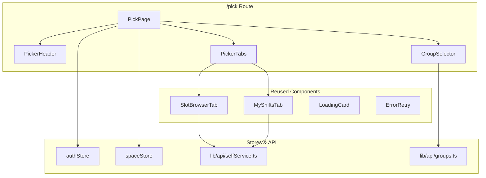
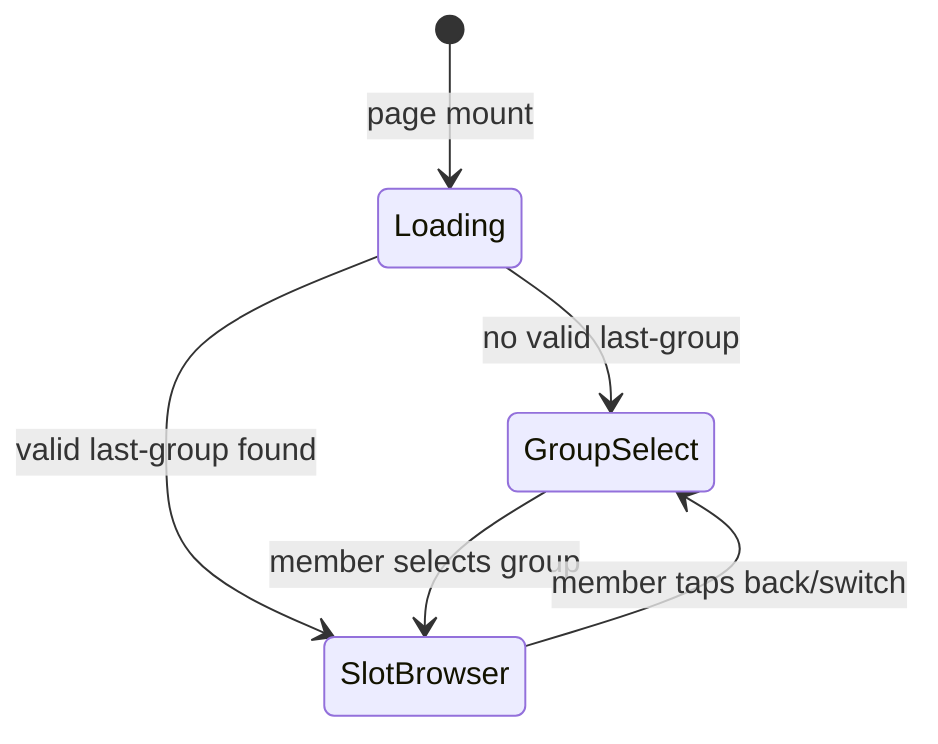
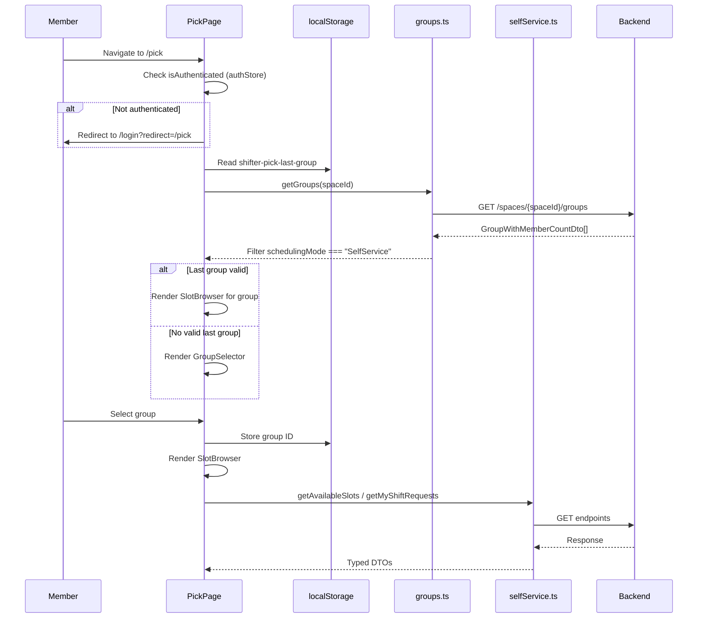

# Design Document: Shift Picker Lite

## Overview

This design covers the implementation of a lightweight `/pick` route within the existing Shifter Next.js web application. The route provides a focused, mobile-optimized experience for members to browse and request shifts from self-service scheduling groups.

### Key Design Decisions

1. **New route, not a new app**: The shift picker is a route (`/pick`) inside the existing Next.js app, sharing auth, i18n, API client, and design tokens. No separate deployment or build.
2. **Component reuse via wrapper pattern**: `SlotBrowserTab` and `MyShiftsTab` are reused directly — the picker page passes `spaceId` and `groupId` props after resolving them from the group selector. No forking or duplicating these components.
3. **No sidebar shell**: The `/pick` route renders outside the main app shell (no sidebar, no desktop navigation). It has its own minimal header with group name and back button.
4. **localStorage for last-group memory**: The last selected group ID is stored in `localStorage` under a namespaced key (`shifter-pick-last-group`). This is validated on load against the member's current groups.
5. **Client-side auth guard**: The existing `apiClient` interceptor handles 401 → redirect to `/login?redirect=/pick`. No server-side middleware needed beyond what already exists.
6. **Single-page state machine**: The picker view uses a simple state machine: `loading → group-select | slot-browser`. Tab switching between slots and my-shifts is handled within the slot-browser state.

## Architecture

### Component Hierarchy



### Page State Machine



### Data Flow



## Components and Interfaces

### New Components

```typescript
// PickPage — the route page component at apps/web/app/pick/page.tsx
// Orchestrates auth check, group resolution, and view switching
interface PickPageState {
  phase: "loading" | "group-select" | "slot-browser";
  selectedGroupId: string | null;
  selectedGroupName: string | null;
  selfServiceGroups: GroupWithMemberCountDto[];
  activeTab: "slots" | "my-shifts";
}
```

```typescript
// PickerHeader — minimal mobile header
interface PickerHeaderProps {
  groupName: string | null;
  onBack: () => void;       // returns to group selector
  onRefresh: () => void;    // triggers data reload
  refreshing: boolean;
}
```

```typescript
// GroupSelector — list of self-service groups
interface GroupSelectorProps {
  groups: GroupWithMemberCountDto[];
  onSelect: (groupId: string, groupName: string) => void;
}
```

```typescript
// PickerTabs — tab switcher between slots and my-shifts
interface PickerTabsProps {
  activeTab: "slots" | "my-shifts";
  onTabChange: (tab: "slots" | "my-shifts") => void;
}
```

### Reused Components (no changes needed)

| Component | Location | Props passed from PickPage |
|-----------|----------|---------------------------|
| `SlotBrowserTab` | `apps/web/app/groups/[groupId]/tabs/SlotBrowserTab.tsx` | `spaceId`, `groupId`, `isAdmin=false` |
| `MyShiftsTab` | `apps/web/components/groups/selfService/MyShiftsTab.tsx` | `spaceId`, `groupId` |
| `LoadingCard` | `apps/web/components/groups/selfService/LoadingCard.tsx` | `rows`, `variant` |
| `ErrorRetry` | `apps/web/components/groups/selfService/ErrorRetry.tsx` | `message`, `onRetry` |

### localStorage Key

```typescript
const LAST_GROUP_KEY = "shifter-pick-last-group";

// Stored value: plain group ID string (UUID)
// Example: "a1b2c3d4-e5f6-7890-abcd-ef1234567890"
```

### Validation Logic for Last Group Memory

```typescript
function resolveLastGroup(
  storedGroupId: string | null,
  selfServiceGroups: GroupWithMemberCountDto[]
): string | null {
  if (!storedGroupId) return null;
  // UUID format check
  const uuidRegex = /^[0-9a-f]{8}-[0-9a-f]{4}-[0-9a-f]{4}-[0-9a-f]{4}-[0-9a-f]{12}$/i;
  if (!uuidRegex.test(storedGroupId)) return null;
  // Must exist in the member's current self-service groups
  const match = selfServiceGroups.find(g => g.id === storedGroupId);
  return match ? storedGroupId : null;
}
```

## Data Models

### Existing DTOs Used (no new backend endpoints)

| DTO | Source | Used For |
|-----|--------|----------|
| `GroupWithMemberCountDto` | `lib/api/groups.ts` | Group selector list, filtering by `schedulingMode` |
| `AvailableSlotDto` | `lib/api/selfService.ts` | Slot browser display |
| `AvailableSlotsResponse` | `lib/api/selfService.ts` | Request window state, slot list |
| `ShiftRequestDto` | `lib/api/selfService.ts` | My shifts display |
| `MyShiftsResponse` | `lib/api/selfService.ts` | Shift count, cancellation config |

### Group Filtering Logic

```typescript
// Filter groups to only self-service ones
const selfServiceGroups = allGroups.filter(
  g => g.schedulingMode === "SelfService"
);
// Sort by name ascending
selfServiceGroups.sort((a, b) => a.name.localeCompare(b.name, "he"));
```

### i18n Keys (new namespace)

All user-visible strings live under a `pick` namespace in the Hebrew messages file:

```json
{
  "pick": {
    "title": "בחירת משמרות",
    "selectGroup": "בחר קבוצה",
    "noGroups": "אין קבוצות שירות עצמי זמינות",
    "tabs": {
      "slots": "משמרות פנויות",
      "myShifts": "המשמרות שלי"
    },
    "refresh": "רענון",
    "back": "חזרה",
    "memberCount": "{count} חברים",
    "error": "שגיאה בטעינת הנתונים",
    "retry": "נסה שוב"
  }
}
```

## Correctness Properties

*A property is a characteristic or behavior that should hold true across all valid executions of a system — essentially, a formal statement about what the system should do. Properties serve as the bridge between human-readable specifications and machine-verifiable correctness guarantees.*

### Property 1: Last group memory round-trip

*For any* valid group ID that exists in the member's self-service groups list, storing it in Last_Group_Memory and then resolving it on the next page load should return the same group ID.

**Validates: Requirements 3.1, 3.4**

### Property 2: Invalid last-group memory is cleared

*For any* string that is not a valid UUID, or any valid UUID that does not appear in the member's current self-service groups list, resolving the Last_Group_Memory should return null (triggering group selector display).

**Validates: Requirements 3.2, 3.5**

### Property 3: Group filtering preserves only self-service groups

*For any* list of groups with mixed scheduling modes, filtering for self-service groups should return exactly those groups where `schedulingMode === "SelfService"`, and no others.

**Validates: Requirements 2.1**

### Property 4: Group list sorting is stable and locale-aware

*For any* list of self-service groups, the sorted output should be in ascending order by group name using Hebrew locale comparison.

**Validates: Requirements 2.1**

### Property 5: Slot sorting is date-first then time-second

*For any* list of available slots, sorting by date ascending then start time ascending should produce a list where no slot appears before another slot with an earlier date, and within the same date, no slot appears before another with an earlier start time.

**Validates: Requirements 4.1**

### Property 6: Capacity indicator format

*For any* slot with `currentFillCount` and `capacity` values, the capacity indicator should render as the string `"{currentFillCount}/{capacity}"`.

**Validates: Requirements 4.2**

### Property 7: Cancellation eligibility is time-based

*For any* approved shift request and cancellation cutoff hours value, the cancel button should be visible if and only if the shift start time minus the current time is greater than the cutoff hours converted to milliseconds.

**Validates: Requirements 5.4**

## Error Handling

### Error Categories and Responses

| Error Source | Handling | User Feedback |
|---|---|---|
| Groups fetch fails | Show `ErrorRetry` component | Hebrew error message + "נסה שוב" button |
| Slots fetch fails | Show `ErrorRetry` within slot browser | Hebrew error message + retry |
| Shift request rejected (full capacity) | Show rejection reason + alternatives | Inline error below slot card |
| Shift request rejected (max shifts) | Show max-shifts message | Inline error below slot card |
| Waitlist join rejected (duplicate) | Show duplicate message | Inline error below slot card |
| Cancel request fails (window closed) | Show window-closed message, hide cancel button | Error in cancel dialog |
| Network error / 5xx | Connectivity store handles globally | Offline banner from existing infrastructure |
| 401 Unauthorized | `apiClient` interceptor refreshes token or redirects to login | Automatic redirect to `/login?redirect=/pick` |

### Optimistic UI Revert Pattern

For mutations (shift request, cancel, join waitlist):
1. Disable the triggering button immediately
2. Show spinner within the button
3. On success: update local state optimistically (e.g., increment fill count)
4. On failure: re-enable button, display localized error, revert any optimistic changes

### Error Message Resolution

```typescript
// Uses existing getSelfServiceErrorMessage utility
// Maps API error codes to i18n keys under selfService.errors.*
// Falls back to generic Hebrew error if no specific key exists
```

## Testing Strategy

### Unit Tests (example-based)

| Test | What it verifies |
|------|-----------------|
| PickPage renders group selector when no last-group | Correct initial state |
| PickPage skips to slot browser when valid last-group exists | Last-group memory flow |
| GroupSelector shows empty state for zero groups | Empty state message |
| PickerHeader shows group name and back button | Header rendering |
| Tab switching between slots and my-shifts | Tab state management |
| Auth redirect when not authenticated | Security guard |

### Property-Based Tests

Property-based testing is appropriate for this feature because the core logic involves pure functions (group filtering, sorting, UUID validation, time-based eligibility) with clear input/output behavior and large input spaces.

**Library**: `fast-check` (already available in the project's test dependencies)

**Configuration**: Minimum 100 iterations per property test.

| Property | Test Description | Tag |
|----------|-----------------|-----|
| Property 1 | Round-trip: store valid group ID → resolve returns same ID | Feature: shift-picker-lite, Property 1: Last group memory round-trip |
| Property 2 | Invalid/missing IDs resolve to null | Feature: shift-picker-lite, Property 2: Invalid last-group memory is cleared |
| Property 3 | Filter returns only SelfService groups | Feature: shift-picker-lite, Property 3: Group filtering preserves only self-service groups |
| Property 4 | Sorted groups are in Hebrew locale ascending order | Feature: shift-picker-lite, Property 4: Group list sorting is stable and locale-aware |
| Property 5 | Sorted slots maintain date-then-time ordering | Feature: shift-picker-lite, Property 5: Slot sorting is date-first then time-second |
| Property 6 | Capacity string matches "{fill}/{capacity}" format | Feature: shift-picker-lite, Property 6: Capacity indicator format |
| Property 7 | Cancel button visibility matches time-based eligibility | Feature: shift-picker-lite, Property 7: Cancellation eligibility is time-based |

### Integration Tests

| Test | What it verifies |
|------|-----------------|
| Full flow: login → /pick → select group → see slots | End-to-end happy path |
| /pick redirects to login when unauthenticated | Auth guard integration |
| Slot request mutation updates UI correctly | API integration |
