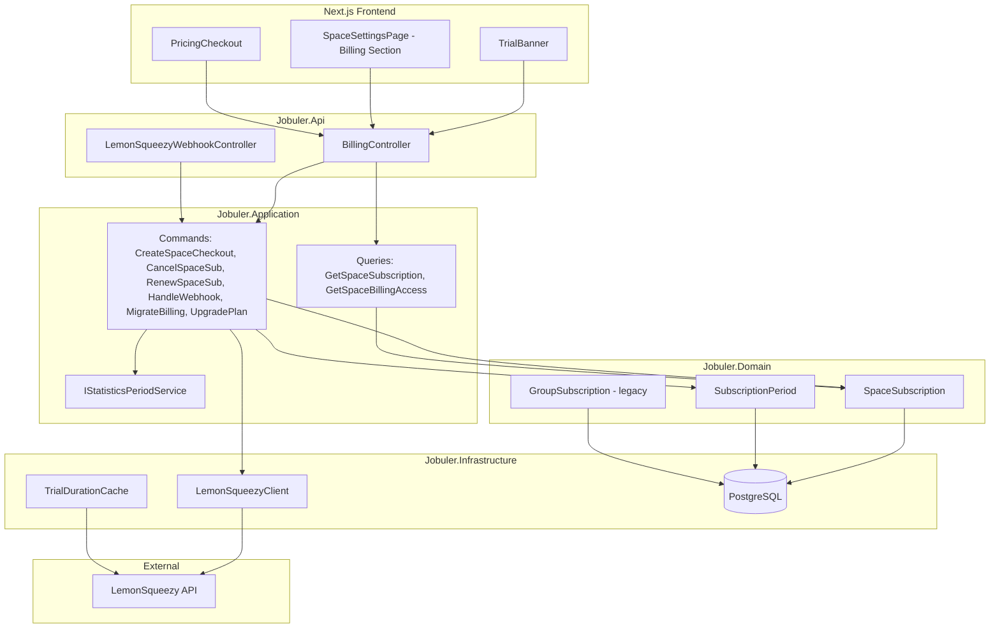
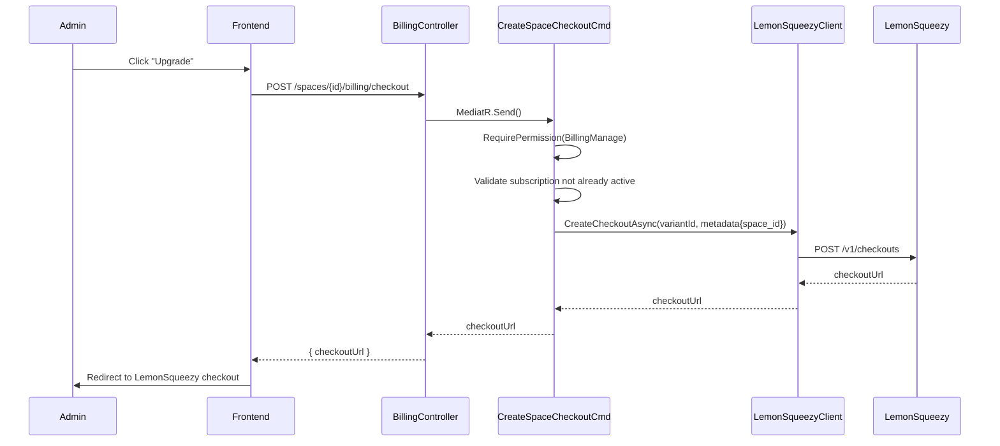
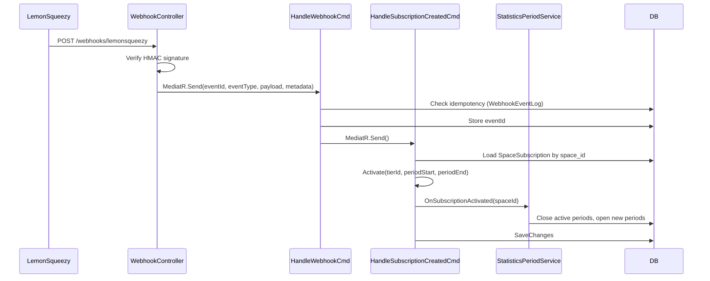
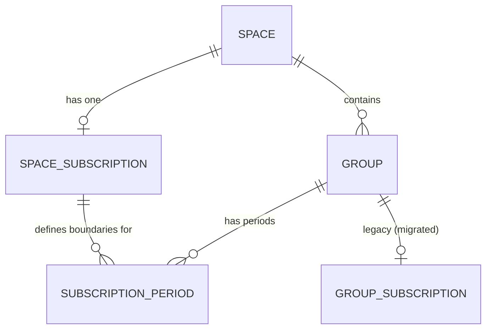

# Design Document: Space-Level Billing

## Overview

This design migrates billing from per-group subscriptions to per-space subscriptions. A single `SpaceSubscription` entity replaces the existing `GroupSubscription` model, providing one subscription per space that covers all groups within it. Trial duration is sourced from a locally cached LemonSqueezy product variant configuration with a 14-day fallback. Subscription lifecycle events (trial start/end, activation, expiry, period renewal) define statistics period boundaries for cumulative tracking.

The migration is non-destructive: existing `GroupSubscription` records are marked "migrated" but never deleted. After migration, all billing operations route through the space-level model.

## Architecture

### High-Level System Diagram



### Request Flow: Checkout



### Request Flow: Webhook Processing



## Components and Interfaces

### Domain Layer

#### `SpaceSubscription` Entity

```csharp
// Jobuler.Domain/Billing/SpaceSubscription.cs
public class SpaceSubscription : AuditableEntity, ITenantScoped
{
    public Guid SpaceId { get; private set; }
    public string TierId { get; private set; } = "trial";
    public SubscriptionStatus Status { get; private set; } = SubscriptionStatus.Trialing;
    public string? LemonSqueezySubscriptionId { get; private set; }
    public string? LemonSqueezyCustomerId { get; private set; }
    public DateTime TrialStartsAt { get; private set; }
    public DateTime TrialEndsAt { get; private set; }
    public DateTime? CurrentPeriodStart { get; private set; }
    public DateTime? CurrentPeriodEnd { get; private set; }
    public int PeakMemberCount { get; private set; }
    public DateTime? CanceledAt { get; private set; }
    public bool AutoRenew { get; private set; } = true;

    // Factory
    public static SpaceSubscription CreateTrial(Guid spaceId, int trialDays);

    // State transitions
    public void Activate(string tierId, string lsSubscriptionId, string lsCustomerId, DateTime periodStart, DateTime periodEnd);
    public void Cancel();
    public void Expire();
    public void RenewWithinGracePeriod();
    public void RenewAfterExpiry(DateTime newPeriodStart, DateTime newPeriodEnd);
    public void UpdatePeriod(DateTime periodStart, DateTime periodEnd);
    public void UpdateTier(string newTierId);
    public void UpdatePeakMemberCount(int currentCount);
    public void ResetPeakForNewPeriod();
    public void SetAutoRenew(bool autoRenew);

    // Queries
    public bool IsAccessGranted { get; }
    public bool IsTrialExpired { get; }
    public int DaysRemaining { get; }
}
```

#### `SubscriptionPeriod` Entity (existing, unchanged)

Already exists at `Jobuler.Domain/Scheduling/SubscriptionPeriod.cs`. The `SpaceId` + `GroupId` + `Status` model is reused. Lifecycle events from the space subscription trigger period rotation for all groups in the space.

### Application Layer

#### New Commands

| Command | Purpose |
|---------|---------|
| `CreateSpaceCheckoutCommand(SpaceId, UserId, VariantId?)` | Creates a LemonSqueezy checkout for the space |
| `CancelSpaceSubscriptionCommand(SpaceId, UserId)` | Cancels the space subscription |
| `RenewSpaceSubscriptionCommand(SpaceId, UserId)` | Renews a canceled/expired space subscription |
| `UpgradeSpacePlanCommand(SpaceId, UserId, VariantId)` | Creates a checkout for a higher-tier variant |
| `HandleSpaceSubscriptionCreatedCommand(Payload, Metadata)` | Processes subscription_created webhook for space |
| `HandleSpaceSubscriptionUpdatedCommand(Payload, Metadata)` | Processes subscription_updated webhook for space |
| `HandleSpaceSubscriptionCancelledCommand(Payload, Metadata)` | Processes subscription_cancelled webhook for space |
| `ExpireSpaceSubscriptionsCommand()` | Background job: expires canceled subscriptions past period end |
| `SyncTrialDurationCommand()` | Background job: syncs trial duration from LemonSqueezy |
| `MigrateToSpaceBillingCommand(BatchSize)` | One-time migration from group to space billing |

#### New Queries

| Query | Purpose |
|-------|---------|
| `GetSpaceSubscriptionQuery(SpaceId)` | Returns subscription status, dates, tier for the space |
| `GetSpaceBillingAccessQuery(SpaceId, GroupId)` | Returns whether a group has premium access |

#### `IStatisticsPeriodService` Interface

```csharp
// Jobuler.Application/Billing/IStatisticsPeriodService.cs
public interface IStatisticsPeriodService
{
    Task OnTrialStartedAsync(Guid spaceId, DateTime startBoundary, CancellationToken ct);
    Task OnTrialExpiredAsync(Guid spaceId, DateTime endBoundary, CancellationToken ct);
    Task OnSubscriptionActivatedAsync(Guid spaceId, DateTime startBoundary, CancellationToken ct);
    Task OnSubscriptionExpiredAsync(Guid spaceId, DateTime endBoundary, CancellationToken ct);
    Task OnPeriodRenewedAsync(Guid spaceId, DateTime newPeriodStart, CancellationToken ct);
}
```

#### `ITrialDurationCache` Interface

```csharp
// Jobuler.Application/Billing/ITrialDurationCache.cs
public interface ITrialDurationCache
{
    Task<int> GetTrialDaysAsync(CancellationToken ct = default);
    Task SyncFromLemonSqueezyAsync(CancellationToken ct = default);
}
```

### Infrastructure Layer

#### `TrialDurationCache` Implementation

```csharp
// Jobuler.Infrastructure/Billing/TrialDurationCache.cs
public class TrialDurationCache : ITrialDurationCache
{
    private const int DefaultTrialDays = 14;
    private int? _cachedDays;
    private DateTime _lastSync = DateTime.MinValue;
    private readonly TimeSpan _syncInterval = TimeSpan.FromHours(6);

    public Task<int> GetTrialDaysAsync(CancellationToken ct)
    {
        if (_cachedDays.HasValue && DateTime.UtcNow - _lastSync < _syncInterval)
            return Task.FromResult(_cachedDays.Value);
        return Task.FromResult(_cachedDays ?? DefaultTrialDays);
    }

    public async Task SyncFromLemonSqueezyAsync(CancellationToken ct)
    {
        // Fetch variant config from LemonSqueezy API
        // Extract trial_duration_days from variant attributes
        // Update _cachedDays and _lastSync
        // On failure: log warning, keep existing cached value
    }
}
```

#### EF Configuration: `SpaceSubscriptionConfiguration`

```csharp
// Jobuler.Infrastructure/Persistence/Configurations/SpaceSubscriptionConfiguration.cs
public class SpaceSubscriptionConfiguration : IEntityTypeConfiguration<SpaceSubscription>
{
    public void Configure(EntityTypeBuilder<SpaceSubscription> builder)
    {
        builder.ToTable("space_subscriptions");
        builder.HasKey(s => s.Id);
        builder.Property(s => s.Id).HasColumnName("id");
        builder.Property(s => s.SpaceId).HasColumnName("space_id");
        builder.Property(s => s.TierId).HasColumnName("tier_id");
        builder.Property(s => s.Status).HasColumnName("status")
            .HasConversion<string>();
        builder.Property(s => s.LemonSqueezySubscriptionId).HasColumnName("lemonsqueezy_subscription_id");
        builder.Property(s => s.LemonSqueezyCustomerId).HasColumnName("lemonsqueezy_customer_id");
        builder.Property(s => s.TrialStartsAt).HasColumnName("trial_starts_at");
        builder.Property(s => s.TrialEndsAt).HasColumnName("trial_ends_at");
        builder.Property(s => s.CurrentPeriodStart).HasColumnName("current_period_start");
        builder.Property(s => s.CurrentPeriodEnd).HasColumnName("current_period_end");
        builder.Property(s => s.PeakMemberCount).HasColumnName("peak_member_count");
        builder.Property(s => s.CanceledAt).HasColumnName("canceled_at");
        builder.Property(s => s.AutoRenew).HasColumnName("auto_renew");
        builder.Property(s => s.CreatedAt).HasColumnName("created_at");
        builder.Property(s => s.UpdatedAt).HasColumnName("updated_at");

        builder.HasIndex(s => s.SpaceId).IsUnique()
            .HasDatabaseName("uq_space_subscriptions_space_id");
        builder.HasIndex(s => s.Status)
            .HasDatabaseName("idx_space_subscriptions_status");
    }
}
```

### API Layer

#### New Endpoints on `BillingController`

| Method | Route | Purpose |
|--------|-------|---------|
| GET | `/spaces/{spaceId}/billing/subscription` | Get space subscription status |
| POST | `/spaces/{spaceId}/billing/checkout` | Create space-level checkout |
| POST | `/spaces/{spaceId}/billing/cancel` | Cancel space subscription |
| POST | `/spaces/{spaceId}/billing/renew` | Renew space subscription |
| POST | `/spaces/{spaceId}/billing/upgrade` | Upgrade to higher tier |

The existing group-level endpoints (`/spaces/{spaceId}/billing/groups/{groupId}/*`) remain for backward compatibility during migration but return 410 Gone after migration completes.

### Frontend Components

#### Updated `TrialBanner`

The `TrialBanner` component is updated to:
1. Accept no `groupId` prop (removed)
2. Fetch from `GET /spaces/{spaceId}/billing/subscription` instead of the group endpoint
3. Handle the `autoRenew` field for non-renewing active subscriptions
4. Preserve existing color logic: sky >7d, amber 4-7d, red ≤3d

#### New Billing Section on Space Settings Page

A new `SpaceBillingCard` component is added to the space settings page, displaying:
- Current subscription status badge
- Trial start/end dates (when trialing)
- Period start/end dates (when active)
- Cancellation date and access expiry (when canceled)
- Upgrade/Cancel/Renew action buttons based on state
- Permission-gated: only visible to users with `BillingManage`

## Data Models

### `space_subscriptions` Table

| Column | Type | Constraints |
|--------|------|-------------|
| `id` | `uuid` | PK, default gen_random_uuid() |
| `space_id` | `uuid` | FK → spaces(id), UNIQUE, NOT NULL |
| `tier_id` | `varchar(50)` | NOT NULL, default 'trial' |
| `status` | `varchar(20)` | NOT NULL, default 'trialing' |
| `lemonsqueezy_subscription_id` | `varchar(100)` | NULL |
| `lemonsqueezy_customer_id` | `varchar(100)` | NULL |
| `trial_starts_at` | `timestamptz` | NOT NULL |
| `trial_ends_at` | `timestamptz` | NOT NULL |
| `current_period_start` | `timestamptz` | NULL |
| `current_period_end` | `timestamptz` | NULL |
| `peak_member_count` | `integer` | NOT NULL, default 0 |
| `canceled_at` | `timestamptz` | NULL |
| `auto_renew` | `boolean` | NOT NULL, default true |
| `created_at` | `timestamptz` | NOT NULL |
| `updated_at` | `timestamptz` | NOT NULL |

**Indexes:**
- `uq_space_subscriptions_space_id` — UNIQUE on `space_id` (one subscription per space)
- `idx_space_subscriptions_status` — on `status` (for expiry job queries)

### `group_subscriptions` Table (existing, modified)

A new `status` value `"migrated"` is added to the `SubscriptionStatus` enum. No columns are added or removed.

### `subscription_periods` Table (existing, unchanged)

Already has `space_id`, `group_id`, `status`, `starts_at`, `ends_at`. No schema changes needed.

### Entity Relationship



### API Response DTOs

#### `SpaceSubscriptionDto`

```typescript
interface SpaceSubscriptionDto {
  status: "trialing" | "active" | "past_due" | "canceled" | "expired";
  tierId: string | null;
  trialStartsAt: string | null;   // ISO 8601
  trialEndsAt: string | null;     // ISO 8601
  currentPeriodStart: string | null;
  currentPeriodEnd: string | null;
  canceledAt: string | null;
  autoRenew: boolean;
  isActive: boolean;
  daysRemaining: number | null;
}
```

## Correctness Properties

*A property is a characteristic or behavior that should hold true across all valid executions of a system — essentially, a formal statement about what the system should do. Properties serve as the bridge between human-readable specifications and machine-verifiable correctness guarantees.*

### Property 1: Trial date computation

*For any* positive integer trial duration (1–365 days), when a `SpaceSubscription` is created via `CreateTrial(spaceId, trialDays)`, the resulting entity SHALL have `TrialStartsAt` equal to the creation time and `TrialEndsAt` equal to `TrialStartsAt + trialDays`.

**Validates: Requirements 1.3, 1.4**

### Property 2: Subscription creation idempotency

*For any* space that already has a `SpaceSubscription`, calling the subscription creation logic again SHALL NOT create a second subscription and SHALL leave the existing record's fields unchanged.

**Validates: Requirements 1.6**

### Property 3: Access granted when subscription is active or trialing

*For any* group belonging to a space whose `SpaceSubscription` status is `Active` or `Trialing` (and trial has not expired), the billing access check SHALL return `true` (access granted).

**Validates: Requirements 2.1, 2.2**

### Property 4: Access denied when subscription is inactive

*For any* group belonging to a space whose `SpaceSubscription` status is `Canceled` (past period end), `Expired`, or `PastDue`, the billing access check SHALL return `false` (access denied).

**Validates: Requirements 2.3, 2.4**

### Property 5: Days remaining and color computation

*For any* trial end date and current date where `trialEndsAt >= now`, the computed `daysRemaining` SHALL equal `ceil((trialEndsAt - now) / 1 day)` and the color SHALL be: sky if daysRemaining > 7, amber if 4 ≤ daysRemaining ≤ 7, red if daysRemaining ≤ 3. If `trialEndsAt < now`, daysRemaining SHALL be 0 with red color.

**Validates: Requirements 3.1, 3.4, 3.6**

### Property 6: Checkout metadata always includes space_id

*For any* checkout creation request (standard, upgrade, or test charge), the metadata dictionary passed to `LemonSqueezyClient.CreateCheckoutAsync` SHALL contain a `"space_id"` key with the requesting space's ID as the value.

**Validates: Requirements 5.1, 9.4**

### Property 7: Active subscription rejects checkout

*For any* space whose `SpaceSubscription` status is `Active`, initiating a checkout SHALL throw an `InvalidOperationException` and SHALL NOT call the LemonSqueezy API.

**Validates: Requirements 5.2**

### Property 8: Webhook idempotency

*For any* webhook event ID that has already been processed (exists in `WebhookEventLog`), processing the same event ID again SHALL NOT modify the `SpaceSubscription` state and SHALL return early.

**Validates: Requirements 5.3**

### Property 9: Cancel state transition

*For any* `SpaceSubscription` with status `Active` or `Trialing`, calling `Cancel()` SHALL set status to `Canceled` and set `CanceledAt` to the current UTC time. For any subscription with status `Canceled` or `Expired`, calling `Cancel()` SHALL throw an `InvalidOperationException`.

**Validates: Requirements 6.1, 6.2**

### Property 10: Grace period access

*For any* `SpaceSubscription` with status `Canceled` where `CurrentPeriodEnd > now`, the billing access check SHALL return `true` (access still granted during grace period).

**Validates: Requirements 6.3**

### Property 11: Expiry state transition

*For any* `SpaceSubscription` with status `Canceled` where `CurrentPeriodEnd <= now`, the expiry job SHALL set status to `Expired`.

**Validates: Requirements 6.4**

### Property 12: Renewal preserves or resets period

*For any* `SpaceSubscription` with status `Canceled` where `CurrentPeriodEnd > now`, calling `RenewWithinGracePeriod()` SHALL set status to `Active`, clear `CanceledAt`, and preserve existing `CurrentPeriodStart` and `CurrentPeriodEnd`. For any subscription with status `Expired` (or `Canceled` past period end), calling `RenewAfterExpiry(start, end)` SHALL set status to `Active`, clear `CanceledAt`, and set new period dates. For any subscription with status `Active`, calling renew SHALL throw an `InvalidOperationException`.

**Validates: Requirements 6.5, 6.6, 6.7**

### Property 13: Lifecycle events rotate statistics periods

*For any* space with N groups (N > 0), when a subscription lifecycle event occurs (trial start, trial expiry, activation, expiry, period renewal), the service SHALL close all currently active `SubscriptionPeriod` records for those groups and open exactly N new `SubscriptionPeriod` records with the event's boundary date as `StartsAt`.

**Validates: Requirements 7.1, 7.2, 7.3, 7.4, 7.5**

### Property 14: Migration creates correct space subscriptions

*For any* set of spaces where each space has zero or more `GroupSubscription` records: (a) all group subscriptions SHALL be set to status "migrated", (b) spaces with at least one active/trialing group subscription SHALL get a `SpaceSubscription` with status `Active` and period dates from the group subscription with the latest `CurrentPeriodEnd`, (c) spaces with no active/trialing group subscriptions SHALL get a `SpaceSubscription` with status `Trialing`, (d) spaces that already have a `SpaceSubscription` SHALL be skipped.

**Validates: Requirements 8.1, 8.2, 8.3, 8.4**

### Property 15: Peak member count tracking

*For any* sequence of member additions to a space within a billing period, `PeakMemberCount` SHALL always equal the maximum member count observed during that period. When the billing period changes, `PeakMemberCount` SHALL reset to zero.

**Validates: Requirements 10.4, 10.5**

### Property 16: Upgrade guard

*For any* `SpaceSubscription` whose status is not `Active` and not `Trialing`, requesting a plan upgrade SHALL throw an `InvalidOperationException`.

**Validates: Requirements 10.2**

### Property 17: Webhook signature rejection

*For any* webhook request where the HMAC signature does not match the computed signature of the payload, the controller SHALL return 401 Unauthorized and SHALL NOT dispatch any command or modify any database state.

**Validates: Requirements 5.4**

## Error Handling

### Backend Error Mapping

| Exception | HTTP Status | Scenario |
|-----------|-------------|----------|
| `UnauthorizedAccessException` | 403 | User lacks `BillingManage` permission |
| `KeyNotFoundException` | 404 | Space or subscription not found |
| `InvalidOperationException` | 400 | Invalid state transition (e.g., cancel already-canceled, renew already-active, checkout when active) |
| `HttpRequestException` / timeout | 502 | LemonSqueezy API unavailable (10s timeout) |

### LemonSqueezy Client Error Handling

- **Timeout**: `HttpClient` configured with 10s timeout. Timeout throws `TaskCanceledException` which maps to 502 via middleware.
- **401 response**: Log "LemonSqueezy API key authentication failed", throw `InvalidOperationException`.
- **4xx/5xx (non-401)**: Log HTTP status code and response body, throw `InvalidOperationException` with user-friendly message.
- **Network failure**: Let `HttpRequestException` bubble to `ExceptionHandlingMiddleware` → 502.

### Webhook Error Handling

- **Invalid signature**: Return 401 immediately, log warning.
- **Malformed JSON**: Return 400, log error.
- **Missing metadata (space_id)**: Log warning, return 200 (acknowledge to prevent retries), skip processing.
- **Duplicate event ID**: Return 200, log info, skip processing.

### Frontend Error Handling

- **TrialBanner**: On API failure, render nothing (fail silent — requirement 3.5).
- **SpaceBillingCard**: On API failure, show "Could not load billing information" with retry button.
- **Checkout**: On failure, show toast with error message, no navigation.

## Testing Strategy

### Property-Based Tests (PBT)

**Library**: [FsCheck](https://fscheck.github.io/FsCheck/) for .NET (integrates with xUnit)

**Configuration**: Minimum 100 iterations per property test.

Each property test references its design document property via tag comment:

```csharp
// Feature: space-billing, Property 1: Trial date computation
[Property(MaxTest = 100)]
public Property TrialDateComputation() => ...
```

**Properties to implement as PBT:**

1. Trial date computation (Property 1)
2. Subscription creation idempotency (Property 2)
3. Access granted/denied based on status (Properties 3, 4, 10)
4. Days remaining and color computation (Property 5)
5. Checkout metadata inclusion (Property 6)
6. Active subscription rejects checkout (Property 7)
7. Webhook idempotency (Property 8)
8. Cancel state transitions (Property 9)
9. Expiry state transition (Property 11)
10. Renewal logic (Property 12)
11. Statistics period rotation (Property 13)
12. Migration correctness (Property 14)
13. Peak member count tracking (Property 15)
14. Upgrade guard (Property 16)
15. Webhook signature rejection (Property 17)

### Unit Tests (Example-Based)

- Trial duration fallback to 14 days when cache unavailable (Req 1.5)
- Banner hidden when subscription is active and auto-renewing (Req 3.3)
- Banner hidden on API failure (Req 3.5)
- Space settings shows "no subscription" message (Req 4.5)
- Checkout abandoned leaves subscription unchanged (Req 5.5)
- LemonSqueezy 401 response handling (Req 9.2)
- LemonSqueezy timeout handling (Req 9.3)
- Upgrade checkout failure leaves subscription unchanged (Req 10.6)
- Migration routing: post-migration, group-level billing ops are rejected (Req 8.6)

### Integration Tests

- End-to-end webhook flow: signature verification → idempotency → state update
- Trial duration sync job fetches from LemonSqueezy API
- Migration batch processing with rollback on failure (Req 8.5)
- LemonSqueezy checkout creation with real HTTP (test environment)

### Frontend Tests

- TrialBanner renders correct colors for various day counts
- SpaceBillingCard displays correct dates per status
- Permission gating hides billing section for non-admins
