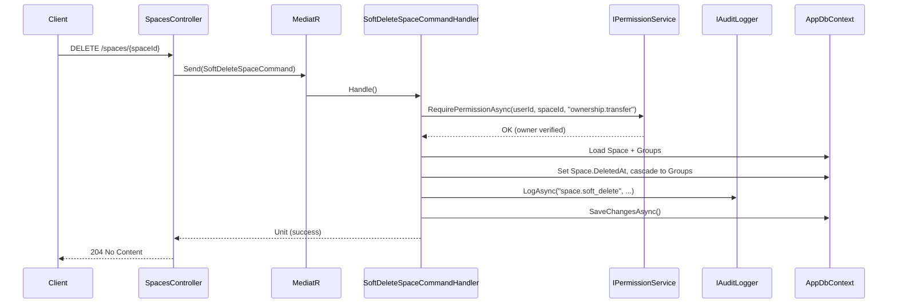

# Design Document: Space Management

## Overview

This feature extends the existing Space entity with full lifecycle management capabilities: soft-delete/restore, ownership transfer with audit trail, a formalized four-tier permission hierarchy, and centralized space-level settings (management timeout, home-leave configuration). It consolidates settings that currently live at the group level into the space level, establishing the Space as the single source of truth for cross-cutting configuration.

The design builds on the existing `Space`, `SpaceMembership`, `SpacePermissionGrant`, and `OwnershipTransferHistory` domain entities, adding a `DeletedAt` column to Space, a `SpaceHomeLeaveConfig` entity, a `ManagementTimeoutMinutes` property on Space, and enhancing the `IPermissionService` to enforce the four-tier hierarchy.

### Key Design Decisions

1. **Soft-delete over hard-delete**: Space and its groups use a `DeletedAt` timestamp pattern (already established on `Group`). This allows restoration and preserves referential integrity.
2. **Cascade tracking via `DeletedBySpaceDeletion` flag on Group**: When a space is soft-deleted, groups that were already individually deleted are distinguished from those cascade-deleted, enabling selective restore.
3. **Permission hierarchy in IPermissionService, not in middleware**: The hierarchy is enforced at the Application layer via `IPermissionService.RequirePermissionAsync`, keeping controllers thin.
4. **Space-level settings override group-level**: When a space-level management timeout or home-leave config exists, group-level values are ignored. The solver payload normalizer reads from the space first.
5. **Existing TransferOwnershipCommand is enhanced** rather than replaced — adding audit logging, membership validation, and permission grants.

## Architecture

```mermaid
graph TD
    subgraph "Api Layer"
        SC[SpacesController]
    end

    subgraph "Application Layer"
        SDC[SoftDeleteSpaceCommand]
        RSC[RestoreSpaceCommand]
        TOC[TransferOwnershipCommand]
        UMT[UpdateManagementTimeoutCommand]
        UHLC[UpdateSpaceHomeLeaveConfigCommand]
        USC[UpdateSpaceCommand]
        RIC[RegenerateSpaceInviteCodeCommand]
        ARP[AssignRoleCommand]
        PS[IPermissionService]
        AL[IAuditLogger]
        VAL[FluentValidation]
    end

    subgraph "Domain Layer"
        S[Space Entity]
        G[Group Entity]
        SM[SpaceMembership]
        SPG[SpacePermissionGrant]
        OTH[OwnershipTransferHistory]
        SHLC[SpaceHomeLeaveConfig]
        PL[PermissionLevel Enum]
    end

    subgraph "Infrastructure Layer"
        DB[(PostgreSQL + RLS)]
        ALS[AuditLogService]
        PMS[PermissionService]
    end

    SC --> SDC
    SC --> RSC
    SC --> TOC
    SC --> UMT
    SC --> UHLC
    SC --> USC
    SC --> RIC
    SC --> ARP

    SDC --> PS
    SDC --> AL
    SDC --> S
    SDC --> G

    RSC --> PS
    RSC --> AL
    RSC --> S
    RSC --> G

    TOC --> PS
    TOC --> AL
    TOC --> S
    TOC --> SM
    TOC --> SPG
    TOC --> OTH

    UMT --> PS
    UMT --> VAL
    UMT --> S

    UHLC --> PS
    UHLC --> VAL
    UHLC --> SHLC

    ARP --> PS
    ARP --> AL
    ARP --> SPG

    PMS --> SPG
    PMS --> S
    ALS --> DB
```



### Request Flow (Soft-Delete Example)



## Components and Interfaces

### New Commands (Application Layer)

| Command | Purpose | Permission Required |
|---------|---------|-------------------|
| `SoftDeleteSpaceCommand` | Sets `DeletedAt` on space and cascades to groups | Space Owner only |
| `RestoreSpaceCommand` | Clears `DeletedAt` on space and selectively restores groups | Space Owner only |
| `UpdateManagementTimeoutCommand` | Sets space-level management timeout (5–120 min) | Space Owner only |
| `UpdateSpaceHomeLeaveConfigCommand` | Creates/updates space-level home-leave configuration | Space Owner only |
| `AssignSpaceRoleCommand` | Assigns a permission level to a space member | `permissions.manage` |

### Enhanced Commands

| Command | Enhancement |
|---------|-------------|
| `TransferOwnershipCommand` | Add: membership validation, permission grants to new owner, audit logging |
| `UpdateSpaceCommand` | Add: FluentValidation (1–100 chars after trim) |

### New Queries

| Query | Purpose |
|-------|---------|
| `GetSpaceHomeLeaveConfigQuery` | Returns the space-level home-leave config |
| `GetSpacePermissionLevelsQuery` | Returns all members with their assigned permission levels |

### IPermissionService Enhancement

```csharp
// Existing interface — no signature change needed.
// Implementation changes to support hierarchy:
// 1. If user is Space.OwnerUserId → all permissions granted implicitly
// 2. If user has PermissionLevel.Admin → management permissions granted
// 3. If user has PermissionLevel.GroupOwner → group-scoped permissions granted
// 4. Otherwise check explicit SpacePermissionGrant rows
```

### Frontend Components (Next.js)

| Component | Location | Purpose |
|-----------|----------|---------|
| `ManagementTimeoutCard` | `/spaces/settings` | Timeout input with save button |
| `HomeLeaveConfigCard` | `/spaces/settings` | Home-leave panel (mode, slider, manual, freeze) |
| `DangerZoneCard` | `/spaces/settings` | Delete space + transfer ownership |
| `RoleAssignmentCard` | `/spaces/settings` | Permission level assignment per member |

## Data Models

### Space Entity (Enhanced)

```csharp
public class Space : AuditableEntity
{
    // Existing fields...
    public string Name { get; private set; }
    public string? Description { get; private set; }
    public Guid OwnerUserId { get; private set; }
    public bool IsActive { get; private set; } = true;
    public string Locale { get; private set; } = "he";
    public string? InviteCode { get; private set; }

    // New fields
    public DateTime? DeletedAt { get; private set; }
    public int ManagementTimeoutMinutes { get; private set; } = 15;

    // New methods
    public void SoftDelete() { DeletedAt = DateTime.UtcNow; Touch(); }
    public void Restore() { DeletedAt = null; Touch(); }
    public void SetManagementTimeout(int minutes)
    {
        if (minutes < 5 || minutes > 120)
            throw new InvalidOperationException("Management timeout must be between 5 and 120 minutes.");
        ManagementTimeoutMinutes = minutes;
        Touch();
    }
}
```

### Group Entity (Enhanced)

```csharp
public class Group : AuditableEntity, ITenantScoped
{
    // Existing fields...
    public DateTime? DeletedAt { get; private set; }

    // New field — tracks whether this group was deleted as part of a space cascade
    public bool DeletedBySpaceDeletion { get; private set; }

    public void SoftDeleteBySpace()
    {
        if (DeletedAt != null) return; // Already individually deleted — skip
        DeletedAt = DateTime.UtcNow;
        DeletedBySpaceDeletion = true;
        Touch();
    }

    public void RestoreFromSpaceDeletion()
    {
        if (!DeletedBySpaceDeletion) return; // Was individually deleted — don't restore
        DeletedAt = null;
        DeletedBySpaceDeletion = false;
        Touch();
    }
}
```

### SpaceHomeLeaveConfig (New Entity)

```csharp
public class SpaceHomeLeaveConfig : AuditableEntity, ITenantScoped
{
    public Guid SpaceId { get; private set; }
    public HomeLeaveMode Mode { get; private set; } = HomeLeaveMode.Automatic;
    public int BalanceValue { get; private set; } = 50;
    public int BaseDays { get; private set; } = 7;
    public int HomeDays { get; private set; } = 2;
    public int MinPeopleAtBase { get; private set; } = 8;
    public decimal MinRestHours { get; private set; }
    public decimal EligibilityThresholdHours { get; private set; }
    public int LeaveCapacity { get; private set; }
    public decimal LeaveDurationHours { get; private set; }
    public bool EmergencyFreezeActive { get; private set; }
    public bool EmergencyUseForScheduling { get; private set; }
    public DateTime? FreezeStartedAt { get; private set; }
    public HomeLeaveMode PreFreezeMode { get; private set; } = HomeLeaveMode.Automatic;
}
```

### SpaceMembership (Enhanced)

```csharp
public class SpaceMembership : Entity, ITenantScoped
{
    // Existing fields...
    public Guid SpaceId { get; private set; }
    public Guid UserId { get; private set; }
    public DateTime JoinedAt { get; private set; }
    public bool IsActive { get; private set; } = true;

    // New field
    public SpacePermissionLevel PermissionLevel { get; private set; } = SpacePermissionLevel.Member;

    public void SetPermissionLevel(SpacePermissionLevel level)
    {
        PermissionLevel = level;
    }
}
```

### SpacePermissionLevel (New Enum)

```csharp
public enum SpacePermissionLevel
{
    Member = 0,
    Admin = 1,
    GroupOwner = 2,
    SpaceOwner = 3
}
```

### Database Migration

```sql
-- Add DeletedAt and ManagementTimeoutMinutes to spaces table
ALTER TABLE spaces ADD COLUMN deleted_at TIMESTAMPTZ NULL;
ALTER TABLE spaces ADD COLUMN management_timeout_minutes INT NOT NULL DEFAULT 15;

-- Add DeletedBySpaceDeletion to groups table
ALTER TABLE groups ADD COLUMN deleted_by_space_deletion BOOLEAN NOT NULL DEFAULT FALSE;

-- Add PermissionLevel to space_memberships table
ALTER TABLE space_memberships ADD COLUMN permission_level INT NOT NULL DEFAULT 0;

-- Create space_home_leave_configs table
CREATE TABLE space_home_leave_configs (
    id UUID PRIMARY KEY DEFAULT gen_random_uuid(),
    space_id UUID NOT NULL REFERENCES spaces(id),
    mode INT NOT NULL DEFAULT 0,
    balance_value INT NOT NULL DEFAULT 50,
    base_days INT NOT NULL DEFAULT 7,
    home_days INT NOT NULL DEFAULT 2,
    min_people_at_base INT NOT NULL DEFAULT 8,
    min_rest_hours DECIMAL NOT NULL DEFAULT 0,
    eligibility_threshold_hours DECIMAL NOT NULL DEFAULT 168,
    leave_capacity INT NOT NULL DEFAULT 1,
    leave_duration_hours DECIMAL NOT NULL DEFAULT 48,
    emergency_freeze_active BOOLEAN NOT NULL DEFAULT FALSE,
    emergency_use_for_scheduling BOOLEAN NOT NULL DEFAULT FALSE,
    freeze_started_at TIMESTAMPTZ NULL,
    pre_freeze_mode INT NOT NULL DEFAULT 0,
    created_at TIMESTAMPTZ NOT NULL DEFAULT NOW(),
    updated_at TIMESTAMPTZ NOT NULL DEFAULT NOW(),
    UNIQUE(space_id)
);

-- RLS policy for space_home_leave_configs
ALTER TABLE space_home_leave_configs ENABLE ROW LEVEL SECURITY;
CREATE POLICY tenant_isolation ON space_home_leave_configs
    USING (space_id::text = current_setting('app.current_space_id', TRUE));

-- Update spaces RLS to exclude soft-deleted
-- (listing queries filter in application layer, RLS remains for tenant isolation)
```

## Correctness Properties

*A property is a characteristic or behavior that should hold true across all valid executions of a system — essentially, a formal statement about what the system should do. Properties serve as the bridge between human-readable specifications and machine-verifiable correctness guarantees.*

### Property 1: Soft-delete/restore round trip

*For any* active space, soft-deleting and then restoring it SHALL result in `DeletedAt` being null (the space returns to its original active state).

**Validates: Requirements 1.1, 2.1**

### Property 2: Cascade soft-delete preserves individually-deleted groups

*For any* space with N groups where M groups were individually deleted before the space deletion, soft-deleting the space SHALL set `DeletedAt` on exactly (N - M) groups, and restoring the space SHALL restore exactly those (N - M) groups while leaving the M individually-deleted groups unchanged.

**Validates: Requirements 1.2, 2.2**

### Property 3: Soft-deleted spaces are excluded from listings

*For any* set of spaces where some have non-null `DeletedAt`, listing queries SHALL return only spaces with null `DeletedAt`.

**Validates: Requirements 1.3**

### Property 4: Permission hierarchy enforcement

*For any* user at permission level L and any action requiring permission level L' > L, the `IPermissionService` SHALL reject the request with an unauthorized error. Conversely, for any action requiring level L' ≤ L, the request SHALL be permitted.

**Validates: Requirements 4.1, 4.2, 4.3, 4.4, 4.5, 4.7, 1.4, 2.4, 3.4, 8.4**

### Property 5: Ownership transfer updates owner and records history

*For any* space and any active member (not the current owner), transferring ownership SHALL update `Space.OwnerUserId` to the target user AND create an `OwnershipTransferHistory` record containing the previous owner, new owner, requesting user, and timestamp.

**Validates: Requirements 3.1, 3.5**

### Property 6: Ownership transfer grants all permissions to new owner

*For any* completed ownership transfer, the new owner SHALL have all defined permission keys granted in `SpacePermissionGrant`.

**Validates: Requirements 3.6**

### Property 7: Transfer rejects non-members

*For any* space and any user who is NOT an active member of that space, attempting ownership transfer to that user SHALL be rejected with an invalid operation error.

**Validates: Requirements 3.2, 3.3**

### Property 8: Management timeout validation

*For any* integer value, the `SetManagementTimeout` method SHALL accept values in [5, 120] and reject values outside that range with an error.

**Validates: Requirements 5.2, 5.3**

### Property 9: Space-level timeout propagates to groups

*For any* space with `ManagementTimeoutMinutes` set, all groups within that space SHALL use the space-level timeout value as their effective management timeout.

**Validates: Requirements 5.4, 5.5**

### Property 10: Space name validation

*For any* string, after trimming whitespace, the `UpdateSpaceCommand` SHALL accept names with length in [1, 100] and reject names that are empty or exceed 100 characters.

**Validates: Requirements 7.2, 7.3**

### Property 11: Invite code regeneration produces valid codes

*For any* space, regenerating the invite code SHALL produce an 8-character alphanumeric string that is different from the previous code.

**Validates: Requirements 8.3**

### Property 12: Audit logging for space management actions

*For any* auditable space management action (soft-delete, restore, ownership transfer, permission grant/revoke), the system SHALL produce an audit log entry containing the actor user ID, space ID, action name, and timestamp.

**Validates: Requirements 1.5, 2.5, 3.7**

### Property 13: Home-leave config propagates to solver payloads

*For any* space with a `SpaceHomeLeaveConfig` and any closed-base group within that space, the solver payload normalizer SHALL use the space-level home-leave parameters (mode, base days, home days, min people at base, etc.) instead of group-level values.

**Validates: Requirements 6.2, 6.3, 6.5**

### Property 14: Transfer target dropdown excludes current owner

*For any* space with N active members, the transfer target list SHALL contain exactly (N - 1) members, excluding the current owner.

**Validates: Requirements 9.4**

## Error Handling

| Scenario | Exception | HTTP Status | Message |
|----------|-----------|-------------|---------|
| Non-owner attempts owner-only action | `UnauthorizedAccessException` | 403 | "Only the space owner can perform this action." |
| User lacks required permission level | `UnauthorizedAccessException` | 403 | "Insufficient permissions." |
| Space not found | `KeyNotFoundException` | 404 | "Space not found." |
| Restore non-deleted space | `InvalidOperationException` | 400 | "Space is not in a deleted state." |
| Transfer to non-member | `InvalidOperationException` | 400 | "Target user is not an active member of this space." |
| Transfer to self | `InvalidOperationException` | 400 | "Cannot transfer ownership to yourself." |
| Invalid timeout value | `InvalidOperationException` | 400 | "Management timeout must be between 5 and 120 minutes." |
| Invalid space name (empty/too long) | `InvalidOperationException` | 400 | "Space name must be between 1 and 100 characters." |
| Soft-deleted space access attempt | `KeyNotFoundException` | 404 | "Space not found." (treated as non-existent) |

All exceptions bubble up to `ExceptionHandlingMiddleware` which maps them to appropriate HTTP status codes. No catch-and-swallow in handlers.

## Testing Strategy

### Property-Based Tests (xUnit + FsCheck)

The project uses .NET with xUnit. We'll use **FsCheck.Xunit** for property-based testing, which integrates naturally with the existing test infrastructure.

**Configuration:**
- Minimum 100 iterations per property test
- Each test tagged with: `Feature: space-management, Property {N}: {title}`
- Tests target the Application layer handlers with an in-memory database or mocked dependencies

**Properties to implement:**
1. Soft-delete/restore round trip (Property 1)
2. Cascade delete with selective restore (Property 2)
3. Soft-deleted exclusion from listings (Property 3)
4. Permission hierarchy enforcement (Property 4)
5. Ownership transfer + history recording (Property 5)
6. Permission grants on transfer (Property 6)
7. Transfer rejects non-members (Property 7)
8. Management timeout validation (Property 8)
9. Timeout propagation to groups (Property 9)
10. Space name validation (Property 10)
11. Invite code format and uniqueness (Property 11)
12. Audit logging completeness (Property 12)
13. Home-leave config propagation to solver (Property 13)
14. Transfer target list excludes owner (Property 14)

### Unit Tests (xUnit)

Example-based tests for:
- UI rendering: settings page shows correct sections for owner vs. non-owner
- Confirmation dialogs appear before destructive actions
- Clipboard copy functionality
- Specific edge cases: restore already-active space, transfer to self, empty name

### Integration Tests

- End-to-end API tests verifying:
  - RLS prevents cross-tenant access to soft-deleted spaces
  - Audit log rows are persisted correctly in PostgreSQL
  - Migration correctly adds new columns with defaults
  - Solver payload normalizer reads space-level config

### Frontend Tests (Vitest + React Testing Library)

- Component tests for `DangerZoneCard`, `ManagementTimeoutCard`, `HomeLeaveConfigCard`, `RoleAssignmentCard`
- Verify conditional rendering based on `isOwner` flag
- Verify API calls are dispatched with correct payloads
