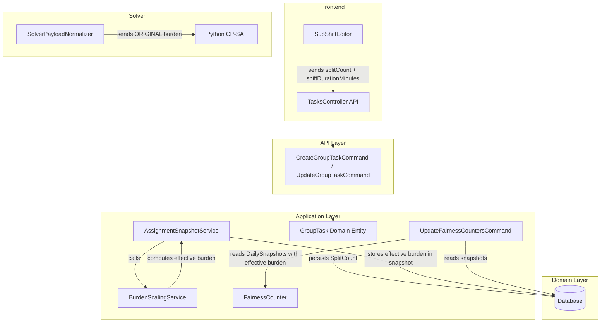
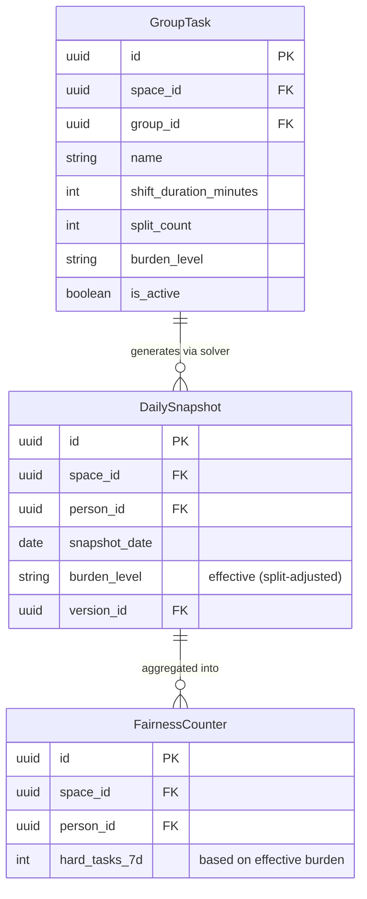

# Design Document: Split-Burden Scaling

## Overview

Split-Burden Scaling introduces a post-solver adjustment that reduces the tracked burden level of task assignments based on how many sub-shifts a task is split into. The core insight: when a 12-hour "Hard" task is split into 4×3-hour segments, each segment is objectively less burdensome per person. The system reflects this by computing an effective burden level that decreases by one tier per split level applied.

The adjustment is purely a **display and tracking concern** — the solver continues to use the original burden level for its fairness balancing algorithm. The effective burden level flows into DailySnapshots, fairness counters, UI displays, and exports.

**Key formula:** `Effective_Burden = max(Easy, Original_BurdenLevel - (Split_Count - 1))`

**Threshold guard:** Only tasks with an original duration ≥ 240 minutes (4 hours) are eligible for burden reduction. Short tasks (e.g., 60-minute shifts split into 2×30) keep their original burden level.

## Architecture

The feature touches four layers of the system but introduces minimal new components:



**Data flow:**
1. Admin splits a task → frontend sends `splitCount` + computed `shiftDurationMinutes` to API
2. `GroupTask` entity persists both `ShiftDurationMinutes` and `SplitCount`
3. Solver payload builder reads `task.BurdenLevel` directly (no reduction applied)
4. After solver run, `AssignmentSnapshotService` calls `BurdenScalingService.ComputeEffectiveBurden()` to get the adjusted level
5. DailySnapshots store the effective burden level
6. Fairness counters and exports read from DailySnapshots (already adjusted)

## Components and Interfaces

### 1. BurdenScalingService (New — Domain Layer)

A pure, stateless service that computes the effective burden level. Lives in `Jobuler.Domain.Tasks` since it operates on domain concepts only.

```csharp
namespace Jobuler.Domain.Tasks;

public static class BurdenScalingService
{
    private const int MinOriginalDurationMinutes = 240; // 4 hours

    /// <summary>
    /// Computes the effective burden level after split-based reduction.
    /// Only applies to tasks whose original duration >= 240 minutes.
    /// Formula: max(Easy, originalBurden - (splitCount - 1))
    /// </summary>
    public static TaskBurdenLevel ComputeEffectiveBurden(
        TaskBurdenLevel originalBurden,
        int splitCount,
        int shiftDurationMinutes)
    {
        if (splitCount <= 1) return originalBurden;

        int originalDuration = shiftDurationMinutes * splitCount;
        if (originalDuration < MinOriginalDurationMinutes) return originalBurden;

        int reduced = (int)originalBurden - (splitCount - 1);
        return (TaskBurdenLevel)Math.Max(0, reduced);
    }
}
```

**Design decision:** Static class rather than an injected service because this is a pure computation with no dependencies. Makes it trivially testable and avoids DI ceremony.

### 2. GroupTask Entity (Modified — Domain Layer)

Add a `SplitCount` property with a default of 1. Update the `Create` and `Update` methods to accept and persist the split count.

```csharp
// New property on GroupTask
public int SplitCount { get; private set; } = 1;

// Updated Create factory method signature
public static GroupTask Create(
    ...,
    int splitCount = 1,
    ...);

// Updated Update method signature
public void Update(
    ...,
    int splitCount = 1,
    ...);
```

**Invariant:** `SplitCount >= 1`. The domain entity validates this in both Create and Update.

### 3. AssignmentSnapshotService (Modified — Infrastructure Layer)

The `ResolveGroupTaskSlot` method currently returns `task.BurdenLevel.ToString().ToLower()`. After this change, it will call `BurdenScalingService.ComputeEffectiveBurden()` and return the effective level.

```csharp
// In ResolveGroupTaskSlot, change:
//   task.BurdenLevel.ToString().ToLower()
// To:
//   BurdenScalingService.ComputeEffectiveBurden(
//       task.BurdenLevel, task.SplitCount, task.ShiftDurationMinutes
//   ).ToString().ToLower()
```

### 4. SolverPayloadNormalizer (Unchanged — Infrastructure Layer)

The normalizer already uses `task.BurdenLevel.ToString().ToLower()` directly. **No changes needed.** This is the correct behavior — the solver must see the original burden level for its fairness balancing.

### 5. UpdateFairnessCountersCommand (Modified — Application Layer)

Currently joins on `TaskTypes.BurdenLevel` to determine hard/easy counts. After this change, it should read from DailySnapshots (which already store the effective burden level) instead of re-deriving from TaskTypes.

**Design decision:** Rather than having the fairness counter re-compute effective burden, it reads from DailySnapshots which already contain the correct effective level. This ensures a single source of truth.

### 6. ExportSchedulePdfCommand (Modified — Application Layer)

Currently joins on `TaskTypes.BurdenLevel`. After this change, it should read burden levels from DailySnapshots for published schedules.

### 7. Frontend Changes

- **SubShiftEditor**: Already sends the computed `shiftDurationMinutes` to the API. Needs to also send `splitCount` in the request body.
- **TasksTab**: Display both original and effective burden when `splitCount > 1`.
- **Schedule grid**: Already reads from DailySnapshot data — no change needed if API returns snapshot burden level.
- **Statistics/leaderboards**: Already computed from DailySnapshot data — no change needed.

### 8. API Request/Response DTOs

```csharp
// Updated request DTOs
public record CreateGroupTaskRequest(
    ...,
    int SplitCount = 1,
    ...);

public record UpdateGroupTaskRequest(
    ...,
    int SplitCount = 1,
    ...);

// Task list response should include effective burden
public record GroupTaskResponseDto(
    ...,
    string BurdenLevel,           // original
    string EffectiveBurdenLevel,  // computed
    int SplitCount,
    ...);
```

## Data Models

### GroupTask Table Migration

```sql
ALTER TABLE group_tasks
ADD COLUMN split_count INTEGER NOT NULL DEFAULT 1
    CONSTRAINT chk_split_count_positive CHECK (split_count >= 1);
```

### Existing Tables (No Schema Changes)

- **daily_snapshots**: Already has a `burden_level` text column. Will now store the effective (reduced) level instead of the raw task level.
- **fairness_counters**: No schema change. The `HardTasks7d` count will naturally reflect effective burden once snapshots store effective levels.
- **task_slots**: No change. Solver payload slots continue to use original burden.

### Entity Relationship



## Correctness Properties

*A property is a characteristic or behavior that should hold true across all valid executions of a system — essentially, a formal statement about what the system should do. Properties serve as the bridge between human-readable specifications and machine-verifiable correctness guarantees.*

### Property 1: Burden scaling formula correctness

*For any* valid `TaskBurdenLevel` and any `splitCount >= 1` and any `shiftDurationMinutes > 0`, the `BurdenScalingService.ComputeEffectiveBurden` function SHALL:
- Return the original burden level when `splitCount == 1`
- Return the original burden level when `shiftDurationMinutes * splitCount < 240`
- Return `max(Easy, originalBurden - (splitCount - 1))` when `shiftDurationMinutes * splitCount >= 240`
- Never return a value below `Easy` (floor invariant)

**Validates: Requirements 2.1, 3.1, 3.5**

### Property 2: Split count persistence round-trip

*For any* valid `splitCount >= 1` and valid `shiftDurationMinutes > 0`, creating or updating a `GroupTask` with those values and then reading back the entity SHALL yield the same `SplitCount` and `ShiftDurationMinutes` values.

**Validates: Requirements 1.1, 1.3**

### Property 3: Solver payload preserves original burden

*For any* `GroupTask` with any `splitCount` and any `BurdenLevel`, the `SolverPayloadNormalizer` SHALL produce a `TaskSlotDto` whose `burden_level` field equals `task.BurdenLevel.ToString().ToLower()` — never the effective (reduced) burden level.

**Validates: Requirements 4.1**

## Error Handling

| Scenario | Handling |
|----------|----------|
| `SplitCount < 1` in API request | FluentValidation rejects with 400 Bad Request |
| `SplitCount` missing from request body | Defaults to 1 (backward compatible) |
| `ShiftDurationMinutes` doesn't divide evenly by `SplitCount` | Frontend prevents this via UI constraints; API accepts any positive integer |
| Database migration fails | Standard EF Core migration rollback; `split_count` has a DEFAULT so existing rows are unaffected |
| `BurdenScalingService` receives invalid enum value | Impossible at compile time (enum type safety); runtime: returns Easy as floor |

## Testing Strategy

### Property-Based Tests (xUnit + FsCheck)

The `BurdenScalingService` is a pure function — ideal for property-based testing.

- **Library**: FsCheck (already available in .NET ecosystem, integrates with xUnit)
- **Minimum iterations**: 100 per property
- **Tag format**: `Feature: split-burden-scaling, Property {N}: {description}`

Each correctness property maps to a single property-based test:

1. **Property 1** → Generate random `(TaskBurdenLevel, splitCount, shiftDurationMinutes)` tuples, verify formula output
2. **Property 2** → Generate random `(splitCount, shiftDurationMinutes)` pairs, create GroupTask, read back, verify equality
3. **Property 3** → Generate GroupTasks with random burden/split combinations, build solver payload, verify original burden in output

### Unit Tests (xUnit)

Specific examples for documentation and regression:
- Hard + split 2 → Normal
- Hard + split 3 → Easy
- Normal + split 2 → Easy
- Easy + split 5 → Easy (floor)
- Hard + split 2 but originalDuration = 120 min → Hard (threshold not met)
- SplitCount = 1 → no change regardless of burden level

### Integration Tests

- `AssignmentSnapshotService` creates snapshots with effective burden level for split tasks
- `UpdateFairnessCountersCommand` counts hard tasks using effective burden from snapshots
- `ExportSchedulePdfCommand` uses effective burden from snapshots in export output
- End-to-end: create split task → run solver → publish → verify snapshot burden levels

### Migration Test

- Verify existing GroupTasks get `split_count = 1` after migration
- Verify no existing DailySnapshot burden levels are affected (immutability preserved)
