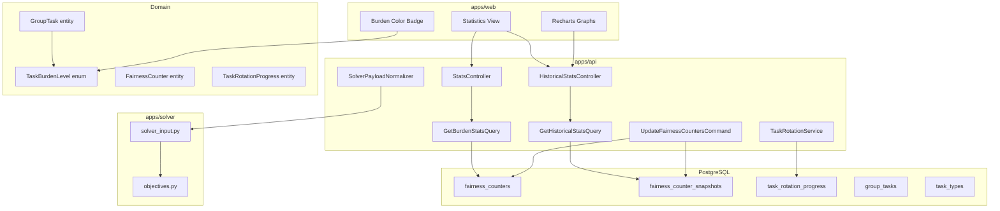

# Design Document: Statistics Overhaul

## Overview

This feature overhauls the statistics system across all layers of the application:

1. **Burden Level Taxonomy Change**: Replace the 4-level enum (`Favorable`, `Neutral`, `Disliked`, `Hated`) with a simpler 3-level model (`Easy`, `Normal`, `Hard`). This affects the domain model, database, solver, and frontend.
2. **Enhanced Per-Person Statistics**: Expand the `FairnessCounter` entity to track hard/easy counts, burden scores, and support configurable time windows (7d, 14d, 30d, all-time).
3. **Color-Coded Missions**: Display assignments with color indicators based on burden level (red=Hard, gray=Normal, green=Easy).
4. **Graphical Visualizations**: Add bar charts, stacked bar charts, line charts, and fairness comparison charts to the stats view using Recharts.
5. **Historical Statistics API**: New time-series endpoint returning daily aggregated stats per person for graph rendering.
6. **Task Rotation Tracking**: New `task_rotation_progress` table and logic for army-template groups to track per-person task type completion cycles.
7. **Solver Fairness Integration**: Update the solver to use the new 3-level burden taxonomy with updated penalty weights and backward-compatible legacy mapping.

### Key Design Decisions

| Decision | Choice | Rationale |
|----------|--------|-----------|
| Migration approach | Rename enum values in-place | Simpler than adding a new column; single migration with clear mapping rules |
| Burden mapping | Hated+Disliked→Hard, Neutral→Normal, Favorable→Easy | Reduces cognitive load; "Hard" captures both old negative levels |
| Solver backward compat | Accept both old and new strings during transition | Allows rolling deployment without downtime |
| Chart library | Recharts | Already React-based, lightweight, good TypeScript support, SSR-friendly |
| Historical data granularity | Daily snapshots | Balances storage cost with graph resolution |
| Rollback strategy | Reverse migration with lossy mapping (Hard→Hated by default) | Acceptable since rollback is emergency-only; admin can manually adjust |

## Architecture



### Layer Responsibilities

- **Domain**: Defines `TaskBurdenLevel` enum (Easy, Normal, Hard), `FairnessCounter` entity (updated fields), new `TaskRotationProgress` entity.
- **Application**: Queries for burden stats and historical stats, command for updating fairness counters, task rotation computation logic.
- **Infrastructure**: EF Core migrations, enum-to-string conversion configuration, `SolverPayloadNormalizer` updates.
- **API**: Controller endpoints for stats and historical data.
- **Solver**: Updated `burden_map` in objectives, backward-compatible input parsing, rotation data in fairness objective.
- **Frontend**: New color scheme, Recharts-based graphs, rotation progress display.

## Components and Interfaces

### 1. Domain Layer Changes

#### TaskBurdenLevel Enum (Modified)

```csharp
// Domain/Tasks/TaskBurdenLevel.cs
public enum TaskBurdenLevel
{
    Easy,    // was: Favorable
    Normal,  // was: Neutral
    Hard     // was: Disliked + Hated (merged)
}
```

#### FairnessCounter Entity (Modified)

Updated to track the new burden taxonomy:

```csharp
public class FairnessCounter : Entity, ITenantScoped
{
    public Guid SpaceId { get; private set; }
    public Guid PersonId { get; private set; }
    public DateOnly AsOfDate { get; private set; }
    
    // Rolling counters per time window
    public int TotalAssignments7d { get; private set; }
    public int TotalAssignments14d { get; private set; }
    public int TotalAssignments30d { get; private set; }
    public int HardTasks7d { get; private set; }
    public int HardTasks14d { get; private set; }
    public int HardTasks30d { get; private set; }
    public int EasyTasks7d { get; private set; }
    public int EasyTasks14d { get; private set; }
    public int EasyTasks30d { get; private set; }
    public int BurdenScore7d { get; private set; }   // (hard×3) - (easy×1)
    public int BurdenScore14d { get; private set; }
    public int BurdenScore30d { get; private set; }
    public int ConsecutiveHardCount { get; private set; }
    public int KitchenCount7d { get; private set; }
    public int NightMissions7d { get; private set; }
    public DateTime UpdatedAt { get; private set; }
}
```

#### TaskRotationProgress Entity (New)

```csharp
public class TaskRotationProgress : Entity, ITenantScoped
{
    public Guid SpaceId { get; private set; }
    public Guid PersonId { get; private set; }
    public Guid GroupId { get; private set; }
    public int CycleNumber { get; private set; }
    public List<Guid> CompletedTaskTypeIds { get; private set; }
    public int TotalQualifiedTaskTypes { get; private set; }
    public double CompletionPercentage { get; private set; }
    public DateTime LastUpdatedAt { get; private set; }
}
```

### 2. Application Layer Changes

#### New Query: GetHistoricalPersonStatsQuery

```csharp
public record GetHistoricalPersonStatsQuery(
    Guid SpaceId,
    DateOnly StartDate,
    DateOnly EndDate,
    Guid? GroupId = null
) : IRequest<HistoricalPersonStatsDto>;

public record HistoricalPersonStatsDto(
    List<PersonDailyStatsDto> DataPoints
);

public record PersonDailyStatsDto(
    Guid PersonId,
    string DisplayName,
    DateOnly Date,
    int TotalAssignments,
    int HardCount,
    int NormalCount,
    int EasyCount,
    int BurdenScore
);
```

#### Modified: UpdateFairnessCountersCommand

Updated to compute metrics using the new 3-level taxonomy and persist daily snapshots for historical queries.

#### New: ComputeTaskRotationCommand

```csharp
public record ComputeTaskRotationCommand(
    Guid SpaceId,
    Guid GroupId
) : IRequest;
```

### 3. Infrastructure Layer Changes

#### Database Migration

```sql
-- Rename burden level values in task_types and group_tasks
UPDATE task_types SET burden_level = 'Hard' WHERE burden_level IN ('Hated', 'Disliked');
UPDATE task_types SET burden_level = 'Normal' WHERE burden_level = 'Neutral';
UPDATE task_types SET burden_level = 'Easy' WHERE burden_level = 'Favorable';

UPDATE group_tasks SET burden_level = 'Hard' WHERE burden_level IN ('Hated', 'Disliked');
UPDATE group_tasks SET burden_level = 'Normal' WHERE burden_level = 'Neutral';
UPDATE group_tasks SET burden_level = 'Easy' WHERE burden_level = 'Favorable';

-- Add new columns to fairness_counters
ALTER TABLE fairness_counters
    RENAME COLUMN hated_tasks_7d TO hard_tasks_7d;
ALTER TABLE fairness_counters
    RENAME COLUMN hated_tasks_14d TO hard_tasks_14d;
ALTER TABLE fairness_counters
    ADD COLUMN hard_tasks_30d INT NOT NULL DEFAULT 0,
    ADD COLUMN easy_tasks_7d INT NOT NULL DEFAULT 0,
    ADD COLUMN easy_tasks_14d INT NOT NULL DEFAULT 0,
    ADD COLUMN easy_tasks_30d INT NOT NULL DEFAULT 0,
    ADD COLUMN burden_score_7d INT NOT NULL DEFAULT 0,
    ADD COLUMN burden_score_14d INT NOT NULL DEFAULT 0,
    ADD COLUMN burden_score_30d INT NOT NULL DEFAULT 0;
ALTER TABLE fairness_counters
    RENAME COLUMN disliked_hated_score_7d TO burden_score_legacy;
ALTER TABLE fairness_counters
    RENAME COLUMN consecutive_burden_count TO consecutive_hard_count;

-- New table: fairness_counter_snapshots (for historical graphs)
CREATE TABLE fairness_counter_snapshots (
    id UUID PRIMARY KEY DEFAULT gen_random_uuid(),
    space_id UUID NOT NULL REFERENCES spaces(id),
    person_id UUID NOT NULL REFERENCES people(id),
    snapshot_date DATE NOT NULL,
    total_assignments INT NOT NULL DEFAULT 0,
    hard_count INT NOT NULL DEFAULT 0,
    normal_count INT NOT NULL DEFAULT 0,
    easy_count INT NOT NULL DEFAULT 0,
    burden_score INT NOT NULL DEFAULT 0,
    created_at TIMESTAMPTZ NOT NULL DEFAULT NOW(),
    UNIQUE(space_id, person_id, snapshot_date)
);
CREATE INDEX idx_fcs_space_date ON fairness_counter_snapshots(space_id, snapshot_date);

-- New table: task_rotation_progress
CREATE TABLE task_rotation_progress (
    id UUID PRIMARY KEY DEFAULT gen_random_uuid(),
    space_id UUID NOT NULL REFERENCES spaces(id),
    person_id UUID NOT NULL REFERENCES people(id),
    group_id UUID NOT NULL REFERENCES groups(id),
    cycle_number INT NOT NULL DEFAULT 1,
    completed_task_type_ids UUID[] NOT NULL DEFAULT '{}',
    total_qualified_task_types INT NOT NULL DEFAULT 0,
    completion_percentage DOUBLE PRECISION NOT NULL DEFAULT 0,
    last_updated_at TIMESTAMPTZ NOT NULL DEFAULT NOW(),
    UNIQUE(space_id, person_id, group_id)
);
CREATE INDEX idx_trp_group ON task_rotation_progress(group_id);
```

#### SolverPayloadNormalizer Changes

The normalizer emits `"hard"`, `"normal"`, `"easy"` strings. During transition, the solver accepts both old and new values.

### 4. Solver Changes

#### Updated burden_map in objectives.py

```python
burden_map = {
    # New taxonomy
    "hard": 4,
    "normal": 0,
    "easy": -1,
    # Legacy (backward compat during transition)
    "hated": 4,
    "disliked": 4,
    "neutral": 0,
    "favorable": -1,
}
```

#### Task Rotation in Fairness Objective

For army-template groups, the solver receives rotation data and adds a penalty for assigning task types the person has already completed in the current cycle, incentivizing uncompleted types.

### 5. Frontend Changes

#### Color Scheme

```typescript
export const burdenLabels: Record<string, string> = {
  hard: "קשה", normal: "רגיל", easy: "קל",
  Hard: "קשה", Normal: "רגיל", Easy: "קל",
};

export const burdenColors: Record<string, string> = {
  hard: "bg-red-50 text-red-700 border-red-200",       // #dc2626
  normal: "bg-slate-100 text-slate-600 border-slate-200", // #6b7280
  easy: "bg-emerald-50 text-emerald-700 border-emerald-200", // #16a34a
  Hard: "bg-red-50 text-red-700 border-red-200",
  Normal: "bg-slate-100 text-slate-600 border-slate-200",
  Easy: "bg-emerald-50 text-emerald-700 border-emerald-200",
};
```

#### Charts (Recharts)

- **Bar chart**: Total assignments per person (time-window selectable)
- **Stacked bar chart**: Hard/Normal/Easy breakdown per person
- **Line chart**: Burden score trend over time per person
- **Fairness comparison**: Deviation from group average burden score

### 6. API Endpoints

| Method | Path | Description |
|--------|------|-------------|
| GET | `/spaces/{spaceId}/stats/burden` | Per-person burden stats (existing, updated) |
| GET | `/spaces/{spaceId}/stats/historical/persons` | Daily time-series per person |
| GET | `/spaces/{spaceId}/stats/rotation?groupId={id}` | Task rotation progress for army-template group |

#### Historical Persons Endpoint

```
GET /spaces/{spaceId}/stats/historical/persons?startDate=2024-01-01&endDate=2024-01-31&groupId={optional}

Response:
{
  "dataPoints": [
    {
      "personId": "...",
      "displayName": "...",
      "date": "2024-01-01",
      "totalAssignments": 3,
      "hardCount": 1,
      "normalCount": 1,
      "easyCount": 1,
      "burdenScore": 2
    }
  ]
}
```

Validation: `endDate - startDate <= 365 days`, otherwise 400.

## Data Models

### Entity Relationship Diagram

```mermaid
erDiagram
    PEOPLE ||--o{ FAIRNESS_COUNTERS : has
    PEOPLE ||--o{ FAIRNESS_COUNTER_SNAPSHOTS : has
    PEOPLE ||--o{ TASK_ROTATION_PROGRESS : has
    GROUPS ||--o{ TASK_ROTATION_PROGRESS : tracks
    GROUPS ||--o{ GROUP_TASKS : contains
    TASK_TYPES ||--o{ TASK_ROTATION_PROGRESS : "qualified for"
    
    FAIRNESS_COUNTERS {
        uuid id PK
        uuid space_id FK
        uuid person_id FK
        date as_of_date
        int total_assignments_7d
        int total_assignments_14d
        int total_assignments_30d
        int hard_tasks_7d
        int hard_tasks_14d
        int hard_tasks_30d
        int easy_tasks_7d
        int easy_tasks_14d
        int easy_tasks_30d
        int burden_score_7d
        int burden_score_14d
        int burden_score_30d
        int consecutive_hard_count
        int kitchen_count_7d
        int night_missions_7d
        timestamptz updated_at
    }

    FAIRNESS_COUNTER_SNAPSHOTS {
        uuid id PK
        uuid space_id FK
        uuid person_id FK
        date snapshot_date
        int total_assignments
        int hard_count
        int normal_count
        int easy_count
        int burden_score
        timestamptz created_at
    }

    TASK_ROTATION_PROGRESS {
        uuid id PK
        uuid space_id FK
        uuid person_id FK
        uuid group_id FK
        int cycle_number
        uuid_array completed_task_type_ids
        int total_qualified_task_types
        float completion_percentage
        timestamptz last_updated_at
    }

    GROUP_TASKS {
        uuid id PK
        uuid space_id FK
        uuid group_id FK
        string name
        string burden_level "Easy|Normal|Hard"
        int shift_duration_minutes
        int required_headcount
    }

    TASK_TYPES {
        uuid id PK
        uuid space_id FK
        string name
        string burden_level "Easy|Normal|Hard"
    }
}
```

### Burden Score Formula

```
burden_score = (hard_task_count × 3) + (normal_task_count × 0) − (easy_task_count × 1)
```

This formula is applied per time window (7d, 14d, 30d, all-time).

### Solver Fairness Penalty Weights

| Burden Level | Penalty Weight |
|-------------|---------------|
| Hard | 4 |
| Normal | 0 |
| Easy | -1 |

The solver multiplies the slot's penalty weight by the person's historical burden score to determine the fairness penalty for that assignment.


## Correctness Properties

*A property is a characteristic or behavior that should hold true across all valid executions of a system — essentially, a formal statement about what the system should do. Properties serve as the bridge between human-readable specifications and machine-verifiable correctness guarantees.*

### Property 1: Legacy Burden Level Mapping

*For any* legacy burden level value in the set {Hated, Disliked, Neutral, Favorable}, the mapping function SHALL produce the correct new taxonomy value: Hated→Hard, Disliked→Hard, Neutral→Normal, Favorable→Easy. The mapping is total (no unmapped values) and deterministic.

**Validates: Requirements 1.2**

### Property 2: Burden Level Serialization

*For any* `TaskBurdenLevel` enum value, serializing it to a string for the API or solver payload SHALL produce exactly one of "hard", "normal", or "easy" — and deserializing that string back SHALL produce the original enum value (round-trip).

**Validates: Requirements 1.5, 8.2**

### Property 3: Solver Penalty Weight Application

*For any* task slot with a burden level, the solver's penalty weight lookup SHALL return: 4 for "hard", 0 for "normal", -1 for "easy". The penalty applied to an assignment equals `weight × person_history_score`.

**Validates: Requirements 1.3, 7.2**

### Property 4: Solver Backward-Compatible Burden Mapping

*For any* burden level string (legacy or new) in the set {"hated", "disliked", "neutral", "favorable", "hard", "normal", "easy"}, the solver's burden_map SHALL return the correct penalty weight: hated→4, disliked→4, neutral→0, favorable→-1, hard→4, normal→0, easy→-1.

**Validates: Requirements 7.3, 8.4**

### Property 5: Time-Window Filtering

*For any* set of assignments with timestamps and a time window boundary (7d, 14d, or 30d from now), the counter computation SHALL include exactly those assignments whose `starts_at` is within the window and exclude all others.

**Validates: Requirements 2.2**

### Property 6: Group Membership Filtering

*For any* space with multiple groups and a group filter parameter, the statistics query SHALL return metrics only for people who are members of the specified group. The result set contains no person IDs that are not in the group's membership list.

**Validates: Requirements 2.5, 5.3**

### Property 7: Burden Score Formula

*For any* non-negative integers (hard_count, normal_count, easy_count), the burden score SHALL equal `(hard_count × 3) + (normal_count × 0) − (easy_count × 1)`. This is a pure function with no side effects.

**Validates: Requirements 2.6**

### Property 8: Color Mapping Completeness

*For any* valid burden level string in {"hard", "normal", "easy"}, the color mapping function SHALL return a non-empty color value. "hard" maps to red (#dc2626), "normal" maps to gray (#6b7280), "easy" maps to green (#16a34a). No valid burden level produces an undefined or fallback color.

**Validates: Requirements 3.4**

### Property 9: Historical Data Completeness

*For any* valid date range of N days and a space with M people who have snapshot data, the historical endpoint SHALL return exactly one data point per day per person (N × M total), each containing all required fields (date, totalAssignments, hardCount, normalCount, easyCount, burdenScore).

**Validates: Requirements 5.2**

### Property 10: Historical Data Sort Order

*For any* valid historical stats response, the data points SHALL be sorted by date in ascending order. For any two consecutive data points in the response, `dataPoints[i].date <= dataPoints[i+1].date`.

**Validates: Requirements 5.5**

### Property 11: Rotation Completion Percentage

*For any* non-negative integers (completed, total) where `completed <= total` and `total > 0`, the rotation completion percentage SHALL equal `(completed / total) × 100`. When total is 0, the percentage SHALL be 0.

**Validates: Requirements 6.2**

### Property 12: Cycle Reset on Full Completion

*For any* task rotation state where `completed_task_type_ids.length == total_qualified_task_types`, recording a new assignment SHALL increment `cycle_number` by 1 and reset `completed_task_type_ids` to contain only the newly completed task type.

**Validates: Requirements 6.3**

### Property 13: Qualification Change Preserves Progress

*For any* task rotation state with N completed task types, changing the person's qualifications (adding or removing qualified task types) SHALL update `total_qualified_task_types` and recalculate `completion_percentage` without removing any entries from `completed_task_type_ids`. The set of completed task types is preserved.

**Validates: Requirements 6.6**

## Error Handling

### API Layer

| Scenario | HTTP Status | Response |
|----------|-------------|----------|
| Date range exceeds 365 days | 400 | `{ "error": "Date range cannot exceed 365 days" }` |
| Invalid date format in query params | 400 | `{ "error": "Invalid date format. Use yyyy-MM-dd" }` |
| Start date after end date | 400 | `{ "error": "Start date must be before end date" }` |
| Group not found or not army-template (rotation endpoint) | 404 | `{ "error": "Group not found" }` |
| Unauthorized (missing/invalid token) | 401 | Standard auth error |
| Insufficient permissions | 403 | Standard permission error |
| No snapshot data for requested range | 200 | Empty `dataPoints` array (not an error) |

### Domain Layer

- `FairnessCounter.Update()` validates that all count values are non-negative; throws `InvalidOperationException` if negative values are passed.
- `TaskRotationProgress` validates that `completed_task_type_ids.length <= total_qualified_task_types`; throws if invariant is violated.
- Burden score computation is a pure function — no exceptions possible given valid inputs.

### Solver Layer

- Unknown burden level strings default to `"normal"` (weight 0) with a warning log.
- Missing `fairness_counters` for a person defaults to all-zero scores (no penalty).
- Missing rotation data for army-template groups means rotation objective is skipped (graceful degradation).

### Migration

- Migration logs record counts before and after transformation.
- If any row has an unrecognized burden level value, the migration logs a warning and maps it to `"Normal"` (safe default).
- Reverse migration maps `Hard → Hated` by default (lossy but safe for emergency rollback).

## Testing Strategy

### Unit Tests (Example-Based)

- **Enum values**: Assert `TaskBurdenLevel` has exactly 3 members.
- **Color mapping**: Assert each burden level maps to the correct hex color.
- **Chart rendering**: Assert chart components render with correct data structure.
- **API validation**: Assert 400 for date range > 365 days, invalid dates, etc.
- **Solver default**: Assert missing burden_level defaults to "normal".
- **Migration SQL**: Assert correct UPDATE statements are generated.

### Property-Based Tests

**Library**: [FsCheck](https://fscheck.github.io/FsCheck/) for .NET domain/application tests, [Hypothesis](https://hypothesis.readthedocs.io/) for Python solver tests, [fast-check](https://fast-check.dev/) for TypeScript frontend logic tests.

**Configuration**: Minimum 100 iterations per property test.

**Tag format**: `Feature: statistics-overhaul, Property {N}: {title}`

| Property | Layer | Library | What it tests |
|----------|-------|---------|---------------|
| 1: Legacy Burden Level Mapping | Domain (.NET) | FsCheck | Mapping function correctness |
| 2: Burden Level Serialization | Infrastructure (.NET) | FsCheck | Enum ↔ string round-trip |
| 3: Solver Penalty Weight Application | Solver (Python) | Hypothesis | Penalty calculation |
| 4: Solver Backward-Compatible Mapping | Solver (Python) | Hypothesis | Legacy + new string handling |
| 5: Time-Window Filtering | Application (.NET) | FsCheck | Assignment date filtering |
| 6: Group Membership Filtering | Application (.NET) | FsCheck | Query result scoping |
| 7: Burden Score Formula | Domain (.NET) | FsCheck | Pure arithmetic |
| 8: Color Mapping Completeness | Frontend (TS) | fast-check | UI color lookup |
| 9: Historical Data Completeness | Application (.NET) | FsCheck | Response shape |
| 10: Historical Data Sort Order | Application (.NET) | FsCheck | Ordering invariant |
| 11: Rotation Completion Percentage | Domain (.NET) | FsCheck | Percentage formula |
| 12: Cycle Reset on Full Completion | Domain (.NET) | FsCheck | State transition |
| 13: Qualification Change Preserves Progress | Domain (.NET) | FsCheck | Invariant preservation |

### Integration Tests

- Migration forward/backward on test database with seeded data.
- Historical endpoint returns correct data after publishing schedules.
- Solver accepts payloads with new burden levels and produces valid output.
- Task rotation updates after schedule publish for army-template groups.
- Fairness counter snapshots are persisted after `UpdateFairnessCountersCommand`.

### Frontend Tests

- Component tests (React Testing Library) for chart rendering, color badges, time range selector.
- Snapshot tests for the stats view layout.
- E2E test (optional): navigate to stats tab, verify graphs render with mock data.
