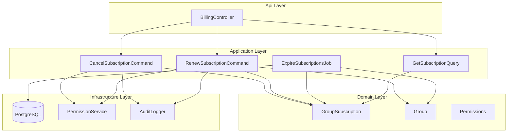
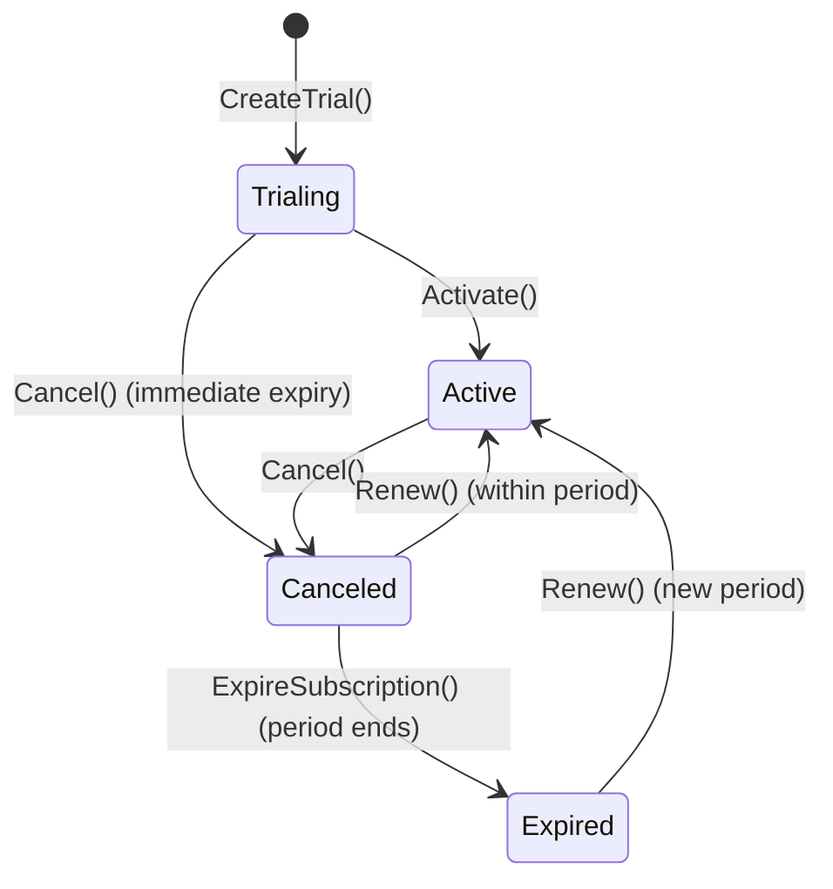

# Design Document: Subscription Cancellation & Renewal

## Overview

This design adds a subscription cancellation and renewal workflow to the existing billing system. It extends the `GroupSubscription` domain entity with lifecycle state transitions (cancel → expire → renew), introduces a background job for automatic expiry, and enforces Limited_Mode on groups whose subscriptions have lapsed.

The design builds on the existing `GroupSubscription` entity, `BillingController`, and MediatR command/query pattern already in place.

### Key Design Decisions

1. **State machine on `GroupSubscription`** — The subscription entity already has a `Status` enum and a `Cancel()` method. We extend this with an `Expired` status and a `Renew()` method, keeping all state transitions encapsulated in the domain.
2. **Group deactivation via existing `Deactivate()` method** — The `Group` entity already has `IsActive` and a `Deactivate()` method. Limited_Mode maps directly to `IsActive = false`.
3. **Background job for expiry** — A recurring Hangfire/hosted-service job checks for canceled subscriptions past their `CurrentPeriodEnd` and transitions them to expired.
4. **No separate "Limited_Mode" entity** — Limited_Mode is derived from `Group.IsActive == false` combined with `GroupSubscription.Status == Expired`. No new table needed.
5. **Permission reuse** — We introduce a `BillingManage` permission key. Space owners implicitly hold all permissions per existing `PermissionService` logic.

## Architecture



### State Machine



## Components and Interfaces

### Domain Layer Changes

#### `SubscriptionStatus` Enum Extension

Add `Expired` to the existing enum:

```csharp
public enum SubscriptionStatus { Trialing, Active, PastDue, Canceled, Expired }
```

#### `GroupSubscription` New Methods

```csharp
public void Expire()
{
    if (Status != SubscriptionStatus.Canceled)
        throw new InvalidOperationException("Only canceled subscriptions can expire.");
    Status = SubscriptionStatus.Expired;
}

public void Renew(DateTime periodStart, DateTime periodEnd)
{
    if (Status == SubscriptionStatus.Active)
        throw new InvalidOperationException("Subscription is already active.");
    Status = SubscriptionStatus.Active;
    CanceledAt = null;
    CurrentPeriodStart = periodStart;
    CurrentPeriodEnd = periodEnd;
}
```

#### `Permissions` Class Extension

```csharp
public const string BillingManage = "billing.manage";
```

### Application Layer

#### Commands

| Command | Purpose |
|---------|---------|
| `CancelSubscriptionCommand` | Marks subscription as canceled, logs audit entry. Refactored from existing implementation to add audit logging and validation. |
| `RenewSubscriptionCommand` | Reverts canceled/expired subscription to active, creates new billing period if expired, restores group, logs audit. |
| `ExpireSubscriptionsCommand` | Batch command invoked by background job to transition all past-due canceled subscriptions to expired and deactivate their groups. |

#### Queries

| Query | Purpose |
|-------|---------|
| `GetSubscriptionQuery` | Extended to return `canceledAt`, `periodEndsAt`, and `expiredAt` fields. |

#### Command Contracts

```csharp
public record CancelSubscriptionCommand(
    Guid SpaceId, Guid GroupId, Guid ActorUserId) : IRequest;

public record RenewSubscriptionCommand(
    Guid SpaceId, Guid GroupId, Guid ActorUserId) : IRequest;

public record ExpireSubscriptionsCommand() : IRequest;
```

#### Validators (FluentValidation)

```csharp
public class CancelSubscriptionValidator : AbstractValidator<CancelSubscriptionCommand>
{
    public CancelSubscriptionValidator()
    {
        RuleFor(x => x.SpaceId).NotEmpty();
        RuleFor(x => x.GroupId).NotEmpty();
        RuleFor(x => x.ActorUserId).NotEmpty();
    }
}

public class RenewSubscriptionValidator : AbstractValidator<RenewSubscriptionCommand>
{
    public RenewSubscriptionValidator()
    {
        RuleFor(x => x.SpaceId).NotEmpty();
        RuleFor(x => x.GroupId).NotEmpty();
        RuleFor(x => x.ActorUserId).NotEmpty();
    }
}
```

### API Layer

#### New Endpoints on `BillingController`

| Method | Route | Description |
|--------|-------|-------------|
| POST | `/spaces/{spaceId}/billing/groups/{groupId}/cancel` | Cancel subscription |
| POST | `/spaces/{spaceId}/billing/groups/{groupId}/renew` | Renew subscription |
| GET | `/spaces/{spaceId}/billing/groups/{groupId}/subscription` | Get subscription status (existing, extended) |

### Infrastructure Layer

#### Background Job: `ExpireSubscriptionsJob`

A recurring hosted service (or Hangfire job) that runs daily:

1. Query all subscriptions where `Status == Canceled` and `CurrentPeriodEnd < DateTime.UtcNow`
2. For each: call `subscription.Expire()`, then `group.Deactivate()`
3. Save changes

For trialing subscriptions that are canceled, expiry is immediate (no grace window).

## Data Models

### `GroupSubscription` Entity (Updated)

| Field | Type | Description |
|-------|------|-------------|
| Id | Guid | PK |
| SpaceId | Guid | Tenant scope (FK) |
| GroupId | Guid | FK to Group |
| TierId | string | Subscription tier |
| Status | SubscriptionStatus | Trialing, Active, PastDue, Canceled, Expired |
| StripeSubscriptionId | string? | External billing reference |
| StripeCustomerId | string? | External billing reference |
| TrialEndsAt | DateTime? | Trial expiry |
| CurrentPeriodStart | DateTime? | Billing period start |
| CurrentPeriodEnd | DateTime? | Billing period end |
| PeakMemberCount | int | Usage tracking |
| CouponCode | string? | Applied coupon |
| DiscountPercent | int | Discount |
| CanceledAt | DateTime? | When cancellation was requested |
| CreatedAt | DateTime | Inherited from Entity |

### `SubscriptionDto` (Extended Response)

```csharp
public record SubscriptionDto(
    string Status,
    string? TierId,
    DateTime? TrialEndsAt,
    int PeakMemberCount,
    int DiscountPercent,
    string? CouponCode,
    bool IsActive,
    DateTime? CanceledAt,
    DateTime? PeriodEndsAt
);
```

### Audit Log Entries

Actions logged:
- `subscription.cancel` — actor_user_id, space_id, group_id, timestamp
- `subscription.renew` — actor_user_id, space_id, group_id, timestamp
- `subscription.expire` — system actor, space_id, group_id, timestamp


## Correctness Properties

*A property is a characteristic or behavior that should hold true across all valid executions of a system — essentially, a formal statement about what the system should do. Properties serve as the bridge between human-readable specifications and machine-verifiable correctness guarantees.*

### Property 1: Cancel transitions subscription to Canceled with timestamp

*For any* `GroupSubscription` in `Active` status, calling `Cancel()` SHALL result in `Status == Canceled` and `CanceledAt` being set to a non-null value equal to the current UTC time.

**Validates: Requirements 1.1**

### Property 2: Already-canceled subscription rejects cancellation

*For any* `GroupSubscription` already in `Canceled` or `Expired` status, attempting to cancel SHALL throw an `InvalidOperationException`.

**Validates: Requirements 1.3**

### Property 3: Trialing subscription cancel causes immediate group deactivation

*For any* `GroupSubscription` in `Trialing` status, canceling SHALL set the subscription to `Canceled` and immediately set the associated group's `IsActive` to `false`.

**Validates: Requirements 1.4**

### Property 4: Canceled subscription within grace window preserves group access

*For any* `GroupSubscription` in `Canceled` status where `CurrentPeriodEnd > DateTime.UtcNow`, the associated group's `IsActive` SHALL remain `true`.

**Validates: Requirements 1.2**

### Property 5: Expired subscription deactivates group

*For any* `GroupSubscription` in `Canceled` status where `CurrentPeriodEnd <= DateTime.UtcNow`, running the expiry logic SHALL transition the subscription to `Expired` status and set the associated group's `IsActive` to `false`.

**Validates: Requirements 2.1, 2.2**

### Property 6: Active subscriptions are not expired by the expiry job

*For any* `GroupSubscription` in `Active` status regardless of `CurrentPeriodEnd`, the expiry job SHALL NOT change the subscription status and the group SHALL remain active.

**Validates: Requirements 2.5**

### Property 7: Limited_Mode blocks write operations

*For any* group where `IsActive == false`, attempts to create new schedules, assignments, or solver runs SHALL be rejected with an error.

**Validates: Requirements 2.4**

### Property 8: Renew canceled subscription within period reverts to active

*For any* `GroupSubscription` in `Canceled` status where `CurrentPeriodEnd > DateTime.UtcNow`, calling `Renew()` SHALL set `Status == Active`, `CanceledAt == null`, and preserve the existing `CurrentPeriodStart` and `CurrentPeriodEnd`.

**Validates: Requirements 3.1**

### Property 9: Renew expired subscription creates new billing period

*For any* `GroupSubscription` in `Expired` status, calling `Renew(periodStart, periodEnd)` SHALL set `Status == Active`, `CanceledAt == null`, and update `CurrentPeriodStart` and `CurrentPeriodEnd` to the provided values.

**Validates: Requirements 3.2**

### Property 10: Renewal reactivates group from Limited_Mode

*For any* group where `IsActive == false` with an associated expired or canceled subscription, processing a renewal SHALL set `group.IsActive` to `true`.

**Validates: Requirements 3.3**

### Property 11: Active subscription rejects renewal

*For any* `GroupSubscription` in `Active` status, attempting to renew SHALL throw an `InvalidOperationException`.

**Validates: Requirements 3.5**

### Property 12: Status query returns correct fields per subscription state

*For any* `GroupSubscription`, the status query SHALL return a DTO where: if `Status == Canceled`, the response includes `canceledAt` (non-null) and `periodEndsAt`; if `Status == Expired`, the response includes `status == "expired"` and `canceledAt`.

**Validates: Requirements 4.1, 4.2**

### Property 13: Unauthorized users are rejected for cancel and renew

*For any* user who does not hold `SpaceOwner` role or `BillingManage` permission for the target space, both cancel and renew operations SHALL throw `UnauthorizedAccessException`.

**Validates: Requirements 5.1, 5.2, 5.3**

## Error Handling

| Scenario | Exception | HTTP Status | Message |
|----------|-----------|-------------|---------|
| Subscription not found | `KeyNotFoundException` | 404 | "Subscription not found for group." |
| Already canceled | `InvalidOperationException` | 400 | "Subscription is already canceled." |
| Already active (renew attempt) | `InvalidOperationException` | 400 | "Subscription is already active and does not need renewal." |
| Unauthorized caller | `UnauthorizedAccessException` | 403 | "You do not have permission to manage billing for this space." |
| Invalid command (empty GUIDs) | FluentValidation | 400 | Validation error details |

All exceptions bubble up to `ExceptionHandlingMiddleware` which maps them to appropriate HTTP responses. No catch-and-swallow in handlers.

## Testing Strategy

### Property-Based Tests (xUnit + FsCheck or Hedgehog for .NET)

The feature is suitable for property-based testing because:
- The domain logic (state transitions on `GroupSubscription` and `Group`) is pure and deterministic
- The input space is meaningful (various subscription states, period dates, user permissions)
- Universal properties hold across all valid inputs

**Configuration:**
- Library: **FsCheck.Xunit** (integrates with existing xUnit test infrastructure)
- Minimum iterations: 100 per property
- Each test tagged with: `Feature: subscription-cancellation, Property {N}: {description}`

**Generators needed:**
- `GroupSubscription` in various states (Trialing, Active, Canceled, Expired) with random period dates
- `Group` with random IsActive state
- Random user IDs with/without permissions

### Unit Tests (xUnit)

- Verify audit log entries contain correct fields (mock `IAuditLogger`)
- Verify FluentValidation rejects empty GUIDs
- Verify `SubscriptionDto` includes all required fields
- Verify `ExpireSubscriptionsJob` processes only canceled subscriptions past period end

### Integration Tests

- End-to-end cancel → expire → renew lifecycle via HTTP endpoints
- Verify RLS prevents cross-tenant subscription access
- Verify background job correctly queries and updates database
- Verify read-only access in Limited_Mode (read endpoints return 200, write endpoints return 403/400)
