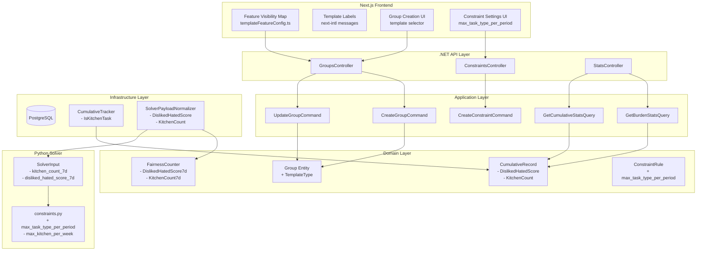

# Design Document: Template System Overhaul

## Overview

This feature transforms the Shifter platform from a system with hardcoded domain assumptions (army kitchen duty, disliked/hated scoring) into a truly generic scheduling platform. The overhaul touches all layers:

1. **Domain**: Add `TemplateType` enum to `Group`, remove dead fields from `CumulativeRecord` and `FairnessCounter`, generalize constraint types
2. **Infrastructure**: DB migrations to add/drop columns, convert constraint data, add task-type counter table
3. **Solver**: Replace `max_kitchen_per_week` with generic `max_task_type_per_period`, remove `kitchen_count_7d` from fairness
4. **Frontend**: Feature visibility map driven by template type, template-aware labels for closed-base/stayover

The design prioritizes backward compatibility (existing groups default to `Custom`), data safety (migration converts existing constraints rather than deleting them), and clean separation (visibility is a frontend-only config, no API call needed).

## Architecture



### Key Design Decisions

| Decision | Rationale |
|----------|-----------|
| `TemplateType` stored as text column (not FK) | Enum values are fixed and small; no need for a lookup table. Text avoids PostgreSQL enum migration pain. |
| Feature visibility is frontend-only config | No API call needed — reduces latency. The map is a static TypeScript object keyed by template type. |
| Existing groups default to `Custom` | Safest migration path — shows all features, no functionality lost. Admins can change later. |
| `max_task_type_per_period` replaces `max_kitchen_per_week` | Generic constraint supports any task type + configurable period. Migration converts existing data. |
| Task-type counters stored as JSONB on `cumulative_records` | Avoids schema changes when new task types are added. Single column, flexible structure. |
| Dead code removal in same migration | Columns are unused — removing them now prevents confusion and reduces payload size. |

## Components and Interfaces

### 1. Domain Layer Changes

#### GroupTemplateType Enum

```csharp
namespace Jobuler.Domain.Groups;

public enum GroupTemplateType
{
    Army,
    Restaurant,
    Hospital,
    Security,
    Custom
}
```

#### Group Entity Extension

```csharp
// Added to Group.cs
public GroupTemplateType TemplateType { get; private set; } = GroupTemplateType.Custom;

public void SetTemplateType(GroupTemplateType templateType)
{
    TemplateType = templateType;
    Touch();
}
```

The `Create` factory method gains an optional `templateType` parameter.

#### CumulativeRecord — Fields Removed

- `DislikedHatedScore7d/14d/30d/90d/Period` — all 5 properties removed
- `KitchenCount7d/14d/30d/90d/Period` — all 5 properties removed
- New: `TaskTypeCountsJson` (string, nullable) — JSONB storing `{ "taskTypeName": { "7d": n, "14d": n, "30d": n, "90d": n, "period": n } }`

#### AssignmentCountsDelta — Fields Removed

```csharp
// Before:
public record AssignmentCountsDelta(
    int TotalAssignments, int HardTasks,
    int DislikedHatedScore, int KitchenCount,
    int NightMissions, decimal TotalHours);

// After:
public record AssignmentCountsDelta(
    int TotalAssignments, int HardTasks,
    int NightMissions, decimal TotalHours,
    Dictionary<string, int>? TaskTypeCounts = null);
```

#### FairnessCounter — Fields Removed

- `DislikedHatedScore7d` — removed
- `KitchenCount7d` — removed

The `Update` method signature drops these parameters.

### 2. Infrastructure Layer Changes

#### CumulativeTracker

- Remove `IsKitchenTask()` method entirely
- Replace kitchen-specific counting with generic task-type counting:
  - For each assignment, record the task type name in a `Dictionary<string, int>` delta
  - Serialize to JSONB on the `CumulativeRecord`

#### SolverPayloadNormalizer

- Remove `DislikedHatedScore7d` and `KitchenCount7d` from `FairnessCountersDto` construction
- The fairness DTO sent to the solver drops these two fields

### 3. Solver Layer Changes

#### Pydantic Model Updates (`models/solver_input.py`)

```python
class FairnessCounters(BaseModel):
    person_id: str
    total_assignments_7d: int = 0
    hated_tasks_7d: int = 0
    # REMOVED: disliked_hated_score_7d
    # REMOVED: kitchen_count_7d
    night_missions_7d: int = 0
    consecutive_burden_count: int = 0
    task_type_counts_7d: dict[str, int] = {}  # NEW: generic per-task-type counts
```

#### Constraint Handler (`solver/constraints.py`)

- Remove `add_kitchen_frequency_constraints` function
- Add `add_max_task_type_per_period_constraints` function:

```python
def add_max_task_type_per_period_constraints(model, assign, slots, people, num_people, hard_constraints, fairness_counters):
    """
    Generic: no person exceeds max assignments for a named task type within period_days.
    rule_type: max_task_type_per_period
    payload: { "task_type_name": "Kitchen", "max": 2, "period_days": 7 }
    """
    rules = [c for c in hard_constraints if c.rule_type == "max_task_type_per_period"]
    for rule in rules:
        task_type_name = str(rule.payload.get("task_type_name", "")).lower()
        max_allowed = int(rule.payload.get("max", 2))
        # period_days used for historical lookup; within a single solver horizon all matching slots count
        matching_slots = [
            s_idx for s_idx, slot in enumerate(slots)
            if slot.task_type_name.lower() == task_type_name
        ]
        if not matching_slots:
            continue
        # Historical count from fairness counters
        history = {
            f.person_id: f.task_type_counts_7d.get(task_type_name, 0)
            for f in fairness_counters
        }
        for p_idx, person in enumerate(people):
            already_done = history.get(person.person_id, 0)
            remaining = max(0, max_allowed - already_done)
            model.add(sum(assign[(s_idx, p_idx)] for s_idx in matching_slots) <= remaining)
```

### 4. Frontend Layer Changes

#### Feature Visibility Map (`lib/utils/templateFeatureConfig.ts`)

```typescript
export type GroupTemplateType = "Army" | "Restaurant" | "Hospital" | "Security" | "Custom";

export interface FeatureVisibility {
  closedBase: boolean;
  homeLeave: boolean;
  minRestBetweenShifts: boolean;
  minPeopleAtBase: boolean;
  qualifications: boolean;
  taskRotation: boolean;
  maxTaskTypePerPeriod: boolean;
  stayoverLabel: { en: string; he: string };
}

export const FEATURE_VISIBILITY_MAP: Record<GroupTemplateType, FeatureVisibility> = {
  Army: {
    closedBase: true,
    homeLeave: true,
    minRestBetweenShifts: true,
    minPeopleAtBase: true,
    qualifications: true,
    taskRotation: true,
    maxTaskTypePerPeriod: true,
    stayoverLabel: { en: "Closed Base", he: "בסיס סגור" },
  },
  Restaurant: {
    closedBase: false,
    homeLeave: false,
    minRestBetweenShifts: true,
    minPeopleAtBase: false,
    qualifications: true,
    taskRotation: false,
    maxTaskTypePerPeriod: true,
    stayoverLabel: { en: "Stayover", he: "לינה במקום" },
  },
  Hospital: {
    closedBase: true, // optional — shown but not required
    homeLeave: false,
    minRestBetweenShifts: true,
    minPeopleAtBase: true,
    qualifications: true,
    taskRotation: false,
    maxTaskTypePerPeriod: true,
    stayoverLabel: { en: "Stayover", he: "לינה במקום" },
  },
  Security: {
    closedBase: true,
    homeLeave: false,
    minRestBetweenShifts: true,
    minPeopleAtBase: true,
    qualifications: true,
    taskRotation: false,
    maxTaskTypePerPeriod: true,
    stayoverLabel: { en: "Closed Base", he: "בסיס סגור" },
  },
  Custom: {
    closedBase: true,
    homeLeave: true,
    minRestBetweenShifts: true,
    minPeopleAtBase: true,
    qualifications: true,
    taskRotation: true,
    maxTaskTypePerPeriod: true,
    stayoverLabel: { en: "Stayover", he: "לינה במקום" },
  },
};
```

#### Template Seed Data Cleanup (`lib/utils/groupTemplates.ts`)

Remove all `min_rest_hours` entries from the `constraints` arrays in every template. The group-level `MinRestBetweenShiftsHours` property already handles this.

### 5. API Layer Changes

#### GroupsController / DTOs

- `GroupResponseDto` gains `templateType: string` field
- `CreateGroupRequest` gains optional `templateType: string` field
- `UpdateGroupRequest` gains optional `templateType: string` field

#### ConstraintsController

- Accept `max_task_type_per_period` as a valid `ruleType` in create/update
- Validate payload contains `task_type_name` (string), `max` (int > 0), `period_days` (int > 0)

## Data Models

### Database Migration (056_template_system_overhaul.sql)

```sql
-- 1. Add template_type column to groups
ALTER TABLE groups ADD COLUMN IF NOT EXISTS template_type TEXT NOT NULL DEFAULT 'Custom';

-- 2. Drop dead columns from cumulative_records
ALTER TABLE cumulative_records
    DROP COLUMN IF EXISTS disliked_hated_score_7d,
    DROP COLUMN IF EXISTS disliked_hated_score_14d,
    DROP COLUMN IF EXISTS disliked_hated_score_30d,
    DROP COLUMN IF EXISTS disliked_hated_score_90d,
    DROP COLUMN IF EXISTS disliked_hated_score_period,
    DROP COLUMN IF EXISTS kitchen_count_7d,
    DROP COLUMN IF EXISTS kitchen_count_14d,
    DROP COLUMN IF EXISTS kitchen_count_30d,
    DROP COLUMN IF EXISTS kitchen_count_90d,
    DROP COLUMN IF EXISTS kitchen_count_period;

-- 3. Add generic task-type counts JSONB column
ALTER TABLE cumulative_records
    ADD COLUMN IF NOT EXISTS task_type_counts JSONB NOT NULL DEFAULT '{}';

-- 4. Drop dead columns from fairness_counters
ALTER TABLE fairness_counters
    DROP COLUMN IF EXISTS disliked_hated_score_7d,
    DROP COLUMN IF EXISTS kitchen_count_7d;

-- 5. Convert existing max_kitchen_per_week constraints to max_task_type_per_period
UPDATE constraint_rules
SET rule_type = 'max_task_type_per_period',
    rule_payload_json = jsonb_build_object(
        'task_type_name', COALESCE(rule_payload_json::jsonb->>'task_type_name', 'kitchen'),
        'max', COALESCE((rule_payload_json::jsonb->>'max')::int, 2),
        'period_days', 7
    )::text
WHERE rule_type = 'max_kitchen_per_week';

-- 6. Add index on template_type for potential filtering
CREATE INDEX IF NOT EXISTS idx_groups_template_type ON groups (template_type);
```

### Entity-to-Table Mapping Changes

| Entity | Column Change | Type |
|--------|--------------|------|
| `Group` | + `template_type` | TEXT DEFAULT 'Custom' |
| `CumulativeRecord` | - `disliked_hated_score_*` (5 cols) | DROP |
| `CumulativeRecord` | - `kitchen_count_*` (5 cols) | DROP |
| `CumulativeRecord` | + `task_type_counts` | JSONB DEFAULT '{}' |
| `FairnessCounter` | - `disliked_hated_score_7d` | DROP |
| `FairnessCounter` | - `kitchen_count_7d` | DROP |
| `ConstraintRule` | `max_kitchen_per_week` → `max_task_type_per_period` | Data migration |

### Task Type Counts JSONB Structure

```json
{
  "kitchen": { "7d": 2, "14d": 5, "30d": 8, "90d": 15, "period": 20 },
  "guard duty": { "7d": 3, "14d": 7, "30d": 12, "90d": 30, "period": 45 }
}
```

This structure allows the system to track any number of task types without schema changes. The CumulativeTracker computes these counts generically by grouping assignments by task name.


## Correctness Properties

*A property is a characteristic or behavior that should hold true across all valid executions of a system — essentially, a formal statement about what the system should do. Properties serve as the bridge between human-readable specifications and machine-verifiable correctness guarantees.*

### Property 1: Feature visibility map completeness and correctness

*For any* valid `GroupTemplateType` value, the `FEATURE_VISIBILITY_MAP` lookup SHALL return a `FeatureVisibility` object where:
- All boolean feature flags match the specification for that template type
- The `stayoverLabel` object contains both `en` and `he` keys with non-empty string values
- The `Custom` template has all boolean feature flags set to `true`
- Army and Security templates have `stayoverLabel.en === "Closed Base"` and `stayoverLabel.he === "בסיס סגור"`
- Restaurant, Hospital, and Custom templates have `stayoverLabel.en === "Stayover"` and `stayoverLabel.he === "לינה במקום"`

**Validates: Requirements 2.1, 2.2, 2.3, 2.4, 2.5, 8.1, 8.2, 8.3, 8.4, 8.6**

### Property 2: Solver max_task_type_per_period enforcement

*For any* valid solver input containing a `max_task_type_per_period` hard constraint with `task_type_name=T`, `max=M`, and `period_days=P`, and *for any* person with historical count `H` for task type `T`, the solver output SHALL assign that person at most `max(0, M - H)` slots where `task_type_name` matches `T` (case-insensitive).

**Validates: Requirements 4.2**

### Property 3: Constraint migration preserves semantics

*For any* `max_kitchen_per_week` constraint rule with payload `{"max": N}` (where N is a positive integer), after the migration conversion the resulting constraint SHALL have:
- `rule_type = "max_task_type_per_period"`
- payload `task_type_name` containing "kitchen"
- payload `max` equal to the original N
- payload `period_days` equal to 7

**Validates: Requirements 4.4**

### Property 4: Generic task-type counting correctness

*For any* set of published assignments where each assignment has a task type name, the CumulativeTracker SHALL produce a `task_type_counts` dictionary where each key is a task type name and each value equals the exact count of assignments with that task type name. The sum of all values in the dictionary SHALL equal the total number of assignments processed.

**Validates: Requirements 5.3, 5.5**

### Property 5: Template seeding correctness

*For any* template type (Army, Restaurant, Hospital, Security), when a group is created with that template, the resulting group SHALL contain exactly the tasks, qualifications, unavailability reasons, and solver horizon defined in the corresponding template definition. For the Custom template, the group SHALL contain zero tasks, zero constraints, zero qualifications, and zero unavailability reasons.

**Validates: Requirements 7.2, 7.3**

## Error Handling

| Scenario | Handling | HTTP Status |
|----------|----------|-------------|
| Invalid `templateType` value in create/update request | FluentValidation rejects with "Invalid template type" | 400 |
| `max_task_type_per_period` payload missing `task_type_name` | FluentValidation rejects with "task_type_name is required" | 400 |
| `max_task_type_per_period` payload with `max <= 0` | FluentValidation rejects with "max must be positive" | 400 |
| `max_task_type_per_period` payload with `period_days <= 0` | FluentValidation rejects with "period_days must be positive" | 400 |
| `task_type_name` doesn't match any task in the group | Constraint is stored but has no effect (solver finds no matching slots) | N/A (silent) |
| Migration encounters `max_kitchen_per_week` with malformed payload | Default to `max=2`, `task_type_name="kitchen"`, `period_days=7` | N/A (migration) |
| JSONB `task_type_counts` is null or malformed on read | Default to empty dictionary `{}` | N/A (graceful fallback) |
| Group created without specifying template type | Defaults to `Custom` — no error | 200/201 |

### Migration Safety

The migration is designed to be **non-destructive** and **idempotent**:
- `DROP COLUMN IF EXISTS` prevents failures on re-run
- `ADD COLUMN IF NOT EXISTS` prevents duplicate column errors
- The `UPDATE` for constraint conversion uses `WHERE rule_type = 'max_kitchen_per_week'` — safe to re-run (no-op if already converted)
- Existing data in dropped columns is lost intentionally (dead code — values are all 0 or unused)

### Rollback Strategy

If the migration needs to be rolled back:
1. Re-add dropped columns with `DEFAULT 0` (data loss is acceptable — these were dead/unused)
2. Convert `max_task_type_per_period` back to `max_kitchen_per_week` where `task_type_name = 'kitchen'`
3. Drop `template_type` column and `task_type_counts` column

## Testing Strategy

### Unit Tests (Example-Based)

- **Group entity**: Create with each template type, verify persistence and defaults
- **Constraint validation**: Verify `max_task_type_per_period` payload validation (valid/invalid cases)
- **Template seeding**: Verify each template seeds the correct data
- **API response shape**: Verify `templateType` field is present in group responses
- **Dead code removal**: Compile-time verification (if it builds, the dead code is gone)

### Property-Based Tests

Property-based testing is appropriate for this feature because:
- The feature visibility map is a pure function (template type → feature flags) with a well-defined input space
- The solver constraint logic is a pure function with clear input/output behavior
- The task-type counting logic is a pure data transformation
- The migration conversion is a deterministic transformation

**Library**: fast-check (TypeScript frontend tests), Hypothesis (Python solver tests), FsCheck or custom generators (C# backend tests)

**Configuration**: Minimum 100 iterations per property test.

**Tag format**: `Feature: template-system-overhaul, Property {number}: {property_text}`

| Property | Layer | Library | Focus |
|----------|-------|---------|-------|
| 1: Feature visibility map | Frontend (TS) | fast-check | Generate random template types, verify map correctness |
| 2: Solver constraint enforcement | Solver (Python) | Hypothesis | Generate random assignments + constraints, verify no violations |
| 3: Constraint migration | Backend (SQL/C#) | FsCheck | Generate random max_kitchen payloads, verify conversion |
| 4: Task-type counting | Backend (C#) | FsCheck | Generate random assignment sets, verify counts match |
| 5: Template seeding | Backend (C#) | FsCheck | Generate random template selections, verify seed data |

### Integration Tests

- **Migration**: Run migration against test PostgreSQL, verify schema changes
- **End-to-end constraint flow**: Create group → add `max_task_type_per_period` constraint → run solver → verify enforcement
- **Template creation flow**: Select template → create group → verify seeded data via API

### Smoke Tests

- **Dead code grep**: CI step that greps for `DislikedHatedScore`, `KitchenCount`, `IsKitchenTask`, `max_kitchen_per_week` — should find zero matches in source code (excluding migration files and docs)
- **Template seed data**: Verify no template contains `min_rest_hours` in its constraints array
