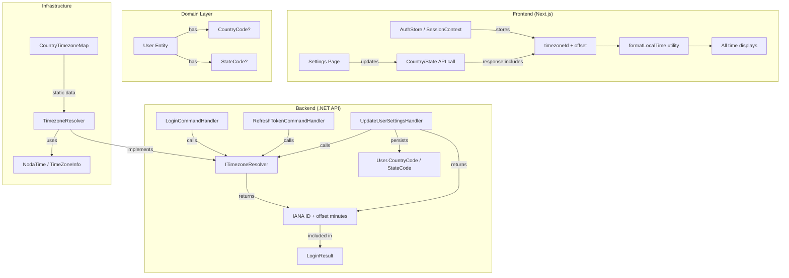

# Design Document: User Timezone Settings

## Overview

This feature adds timezone-aware time display to the Rolduler scheduling application. The system stores all time data as UTC in the database and derives the user's timezone from a Country/State geographic selection stored in user settings. The timezone offset is computed once per session at login time and included in the login response. The frontend applies this offset to all displayed times using the IANA timezone identifier for correct DST handling.

A new User Settings tab (`/settings`) is introduced, consolidating preferences currently scattered across the profile page (time format, notifications, push notifications) and adding a new Location section for Country/State selection. The profile page is slimmed down to personal identity information only.

### Key Design Decisions

1. **IANA timezone identifier over numeric offset** — Storing the IANA ID (e.g., `Asia/Jerusalem`) rather than a fixed numeric offset allows the frontend to correctly handle DST transitions within displayed date ranges.
2. **Geography-based resolution** — Users select Country/State rather than picking from a timezone list. This is more intuitive and reduces error.
3. **Session-scoped offset** — The offset is computed at login and token refresh, not on every request. This keeps rendering fast and consistent within a session.
4. **Default to Asia/Jerusalem** — The application's primary user base is in Israel, so this is the sensible fallback when no country is set.

---

## Architecture



### Data Flow — Login

1. User submits credentials → `LoginCommandHandler` authenticates
2. Handler calls `ITimezoneResolver.Resolve(user.CountryCode, user.StateCode)`
3. Resolver returns `(string ianaTimezoneId, int offsetMinutes)`
4. Handler includes both values in `LoginResult`
5. Frontend stores `timezoneId` and `offsetMinutes` in `authStore`
6. All time rendering uses `timezoneId` via the centralized formatting utility

### Data Flow — Settings Update

1. User selects Country/State on Settings page → `PUT /api/user-settings/location`
2. `UpdateUserLocationHandler` validates codes, persists to User entity
3. Handler calls `ITimezoneResolver.Resolve(newCountry, newState)`
4. Returns new `timezoneId` + `offsetMinutes` in response
5. Frontend updates `authStore` immediately (no re-login required)

---

## Components and Interfaces

### Backend Components

#### `ITimezoneResolver` (Application layer interface)

```csharp
public interface ITimezoneResolver
{
    TimezoneResolution Resolve(string? countryCode, string? stateCode);
}

public record TimezoneResolution(string IanaTimezoneId, int OffsetMinutes);
```

#### `TimezoneResolver` (Infrastructure implementation)

- Maps `(countryCode, stateCode?)` → IANA timezone ID using a static lookup table
- Computes current UTC offset in minutes using `TimeZoneInfo` or NodaTime
- Fallback chain: State → Country (most populous TZ) → `Asia/Jerusalem`

#### `UpdateUserLocationCommand` (Application layer)

```csharp
public record UpdateUserLocationCommand(
    Guid UserId,
    string CountryCode,
    string? StateCode
) : IRequest<TimezoneResolution>;
```

#### `UpdateUserLocationValidator` (FluentValidation)

- Validates `CountryCode` against ISO 3166-1 alpha-2 list
- Validates `StateCode` (if provided) belongs to the given country (ISO 3166-2)

#### `GetUserSettingsQuery` (Application layer)

```csharp
public record GetUserSettingsQuery(Guid UserId) : IRequest<UserSettingsDto>;

public record UserSettingsDto(
    string? CountryCode,
    string? StateCode,
    string TimezoneId,
    int TimezoneOffsetMinutes,
    string TimeFormat
);
```

#### Modified `LoginResult`

```csharp
public record LoginResult(
    string AccessToken,
    string RefreshToken,
    DateTime AccessTokenExpiresAt,
    Guid UserId,
    string DisplayName,
    string PreferredLocale,
    bool IsPlatformAdmin,
    string TimezoneId,        // NEW: IANA timezone identifier
    int TimezoneOffsetMinutes // NEW: current UTC offset in minutes
);
```

### Frontend Components

#### `authStore` additions

```typescript
interface AuthState {
  // ... existing fields ...
  timezoneId: string | null;       // e.g., "Asia/Jerusalem"
  timezoneOffsetMinutes: number;   // e.g., 120 for UTC+2
}
```

#### `formatLocalTime` utility (`lib/utils/formatTime.ts`)

```typescript
export function formatLocalTime(
  utcIsoString: string,
  timezoneId: string,
  format: "24h" | "12h"
): string;
```

- Uses `Intl.DateTimeFormat` with the IANA `timeZone` option
- Handles DST correctly because it uses the IANA ID, not a fixed offset
- All time rendering in the app calls this single utility

#### Settings Page (`app/settings/page.tsx`)

- New route `/settings`
- Sections: Location (Country/State), Time Format, Notification Preferences, Push Notifications
- Country dropdown: searchable, shows localized country names
- State dropdown: conditional, shown only for multi-timezone countries
- Displays resolved timezone as read-only confirmation

---

## Data Models

### User Entity Changes (Domain)

```csharp
public class User : AuditableEntity
{
    // ... existing fields ...
    public string? CountryCode { get; private set; }  // ISO 3166-1 alpha-2
    public string? StateCode { get; private set; }    // ISO 3166-2 subdivision

    public void UpdateLocation(string? countryCode, string? stateCode)
    {
        CountryCode = countryCode?.ToUpperInvariant().Trim();
        StateCode = stateCode?.ToUpperInvariant().Trim();
        Touch();
    }
}
```

### Database Migration

```sql
ALTER TABLE users ADD COLUMN country_code VARCHAR(2) NULL;
ALTER TABLE users ADD COLUMN state_code VARCHAR(6) NULL;
```

### Country-Timezone Mapping (Static Data)

A static dictionary in the `TimezoneResolver` implementation:

```csharp
// Key: (CountryCode, StateCode?) → Value: IANA timezone ID
// For single-timezone countries, only the country key is needed
// For multi-timezone countries, state-level mappings are provided
// Fallback for multi-timezone countries without state: most populous timezone
```

Source: IANA Time Zone Database (tzdata) — well-established, maintained by ICANN.

---

## Correctness Properties

*A property is a characteristic or behavior that should hold true across all valid executions of a system — essentially, a formal statement about what the system should do. Properties serve as the bridge between human-readable specifications and machine-verifiable correctness guarantees.*

### Property 1: DateTime Storage Round-Trip

*For any* datetime value with any timezone offset, when written to the database and read back via the API layer, the returned value SHALL be the equivalent UTC representation of the original input, with no additional transformation applied on read.

**Validates: Requirements 1.2, 1.3**

### Property 2: User Settings Persistence Round-Trip

*For any* valid ISO 3166-1 alpha-2 country code and valid ISO 3166-2 subdivision code belonging to that country, persisting the pair via the Settings_Service and reading it back SHALL return the identical country and state codes.

**Validates: Requirements 2.1, 2.2**

### Property 3: Geographic Code Validation

*For any* string that is NOT a valid ISO 3166-1 alpha-2 code, the Settings_Service SHALL reject it; and *for any* valid country code paired with a state code that does NOT belong to that country, the Settings_Service SHALL reject the pair with a validation error.

**Validates: Requirements 2.3, 2.4, 2.5**

### Property 4: Timezone Resolver Output Validity

*For any* valid country code and optional valid state code, the Timezone_Resolver SHALL return a string that is a valid IANA timezone identifier (present in the IANA tzdata set).

**Validates: Requirements 3.1**

### Property 5: Single-Timezone Country Invariant

*For any* country that has exactly one timezone, and *for any* state/region value (including null), the Timezone_Resolver SHALL return the same IANA timezone identifier regardless of the state input.

**Validates: Requirements 3.3**

### Property 6: Offset Computation Correctness

*For any* valid IANA timezone identifier and *for any* point in time, the computed offset in minutes SHALL equal the actual UTC offset defined by that timezone's rules (including DST) at that moment.

**Validates: Requirements 4.1**

### Property 7: DST-Aware Time Display

*For any* UTC datetime and *for any* IANA timezone identifier, formatting the datetime using the timezone identifier SHALL produce a display string whose local time equals the UTC time adjusted by the timezone's offset at that specific moment (correctly reflecting DST state).

**Validates: Requirements 5.1, 5.3**

### Property 8: Outgoing Requests Preserve UTC

*For any* datetime value displayed in local time on the frontend, when that value is sent back to the API, it SHALL be transmitted as the original UTC value without any client-side offset applied.

**Validates: Requirements 5.4**

---

## Error Handling

| Scenario | HTTP Status | Error Response |
|----------|-------------|----------------|
| Invalid country code | 400 | `{ "errors": { "countryCode": ["Invalid ISO 3166-1 alpha-2 code"] } }` |
| State code doesn't belong to country | 400 | `{ "errors": { "stateCode": ["Subdivision code does not belong to the selected country"] } }` |
| User not found during settings update | 404 | `{ "error": "User not found" }` |
| Timezone resolution fails (corrupted data) | 200 | Falls back to `Asia/Jerusalem` — never fails the request |
| Unauthenticated access to /settings | 401 | Standard JWT rejection |

### Fallback Strategy

The timezone resolver uses a defensive fallback chain and never throws:
1. If state resolves → use that timezone
2. Else if country resolves → use most populous timezone for that country
3. Else → `Asia/Jerusalem`

This ensures the login flow and settings page never break due to missing geographic data.

---

## Testing Strategy

### Unit Tests (Example-Based)

- **Timezone resolver defaults**: Verify `null` country → `Asia/Jerusalem`
- **Multi-timezone country defaults**: Verify US without state → `America/New_York`, RU → `Europe/Moscow`
- **Login response structure**: Verify `timezoneId` and `timezoneOffsetMinutes` fields are present
- **Token refresh includes timezone**: Verify refresh response includes recalculated offset
- **Settings page sections**: Verify correct sections moved from profile to settings
- **Conditional state dropdown**: Verify state dropdown appears/hides based on country selection
- **Country change clears state**: Verify state resets when country changes

### Property-Based Tests

**Library**: `fast-check` (already in project dependencies — `apps/web/node_modules/fast-check/`)

**Configuration**: Minimum 100 iterations per property test.

Each property test references its design document property:

- **Feature: user-timezone-settings, Property 2: User Settings Persistence Round-Trip** — Generate random valid ISO country/state pairs, persist and read back, verify equality.
- **Feature: user-timezone-settings, Property 3: Geographic Code Validation** — Generate random strings, verify only valid ISO codes pass validation.
- **Feature: user-timezone-settings, Property 4: Timezone Resolver Output Validity** — Generate random valid country/state inputs, verify output is always a valid IANA timezone.
- **Feature: user-timezone-settings, Property 5: Single-Timezone Country Invariant** — For single-TZ countries, generate random state values, verify timezone output is constant.
- **Feature: user-timezone-settings, Property 6: Offset Computation Correctness** — Generate random IANA timezone IDs and random timestamps, verify computed offset matches `Intl.DateTimeFormat` resolved offset.
- **Feature: user-timezone-settings, Property 7: DST-Aware Time Display** — Generate random UTC datetimes and timezone IDs, verify formatted output reflects correct local time.

### Integration Tests

- End-to-end login flow returns timezone data
- Settings update persists and returns new timezone
- Token refresh recalculates offset after DST change simulation

### E2E Tests (Playwright)

- Navigate to `/settings`, verify page renders with all sections
- Select country, verify timezone confirmation text appears
- Change country, verify state clears
- Verify profile page no longer shows notification/time format sections
