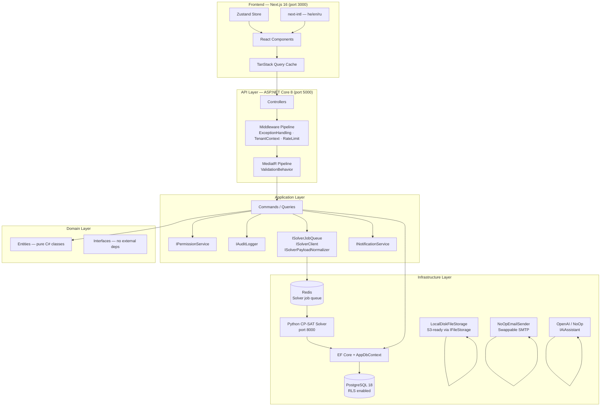
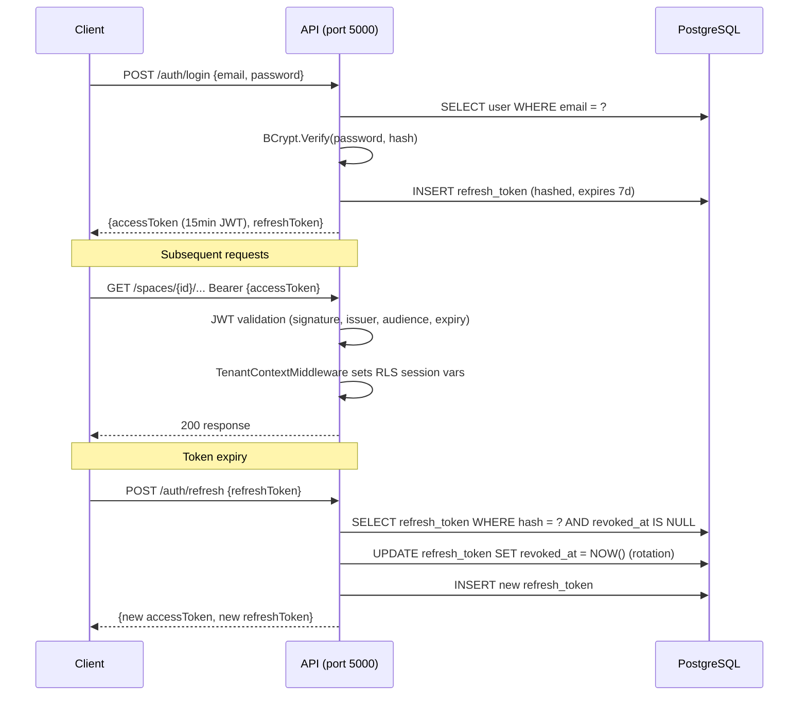
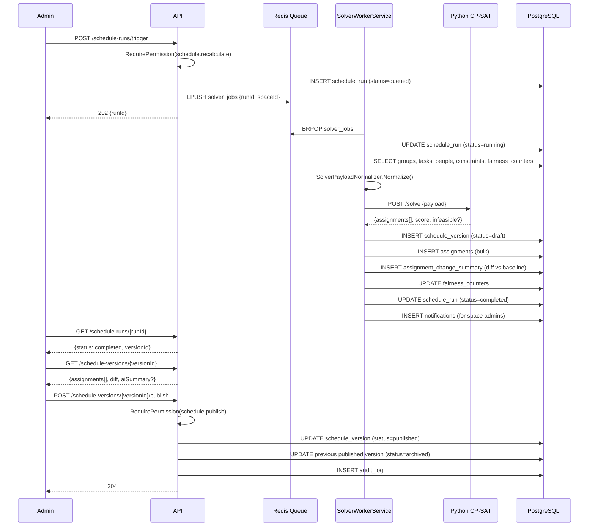

# Shifter — Architecture

## System Overview

Shifter is a multi-tenant shift scheduling platform built for organizations that manage rotating duty rosters — military units, security teams, operations centers, and similar structured groups. The core problem it solves is the combinatorial complexity of assigning people to tasks fairly, respecting constraints (rest hours, qualifications, restrictions, availability), and producing a publishable schedule that members can view in real time.

The system has three classes of users: **Admins** who configure spaces, manage people, and publish schedules; **Group Members** who view their assigned missions and group communications; and **Viewers** who have read-only access to published schedules. All three operate within a **Space** — the top-level multi-tenant boundary.

---

## Architecture Diagram



---

## Technology Stack

| Layer | Technology | Version | Notes |
|---|---|---|---|
| Frontend framework | Next.js | 16.x | App Router, standalone output |
| Frontend language | TypeScript | 5.x | Strict mode, no `any` |
| UI styling | Tailwind CSS | 3.4 | Utility-first, RTL-aware |
| Data fetching | TanStack Query | 5.x | Cache, optimistic updates, background refetch |
| Client state | Zustand | 4.x | Auth token, space context |
| i18n | next-intl | 4.x | he (default, RTL), en, ru; cookie-based locale |
| API client | NSwag-generated | — | Auto-generated from OpenAPI spec |
| Backend framework | ASP.NET Core | 8.0 | Minimal hosting model |
| Backend language | C# | 12 | File-scoped namespaces, records |
| CQRS / Mediator | MediatR | — | Commands + Queries, ValidationBehavior pipeline |
| Validation | FluentValidation | — | Application layer, wired via pipeline behavior |
| ORM | Entity Framework Core | — | Code-first configs in Infrastructure |
| Database | PostgreSQL | 18 | RLS, uuid-ossp, pg_trgm |
| Auth | JWT Bearer | — | 15-min access tokens, 7-day refresh rotation |
| Password hashing | BCrypt | work factor 12 | Never MD5/SHA1 |
| Job queue | Redis + StackExchange.Redis | — | Solver job queue; falls back to NoOp |
| Solver | Python CP-SAT (OR-Tools) | — | Stateless HTTP service on port 8000 |
| File storage | Local disk / IFileStorage | — | S3-ready abstraction |
| PDF export | QuestPDF | — | Schedule version export |
| AI assistant | OpenAI GPT-4o / NoOp | — | Optional; constraint parsing, diff summaries |
| Logging | Serilog + JSON formatter | — | Structured JSON, compatible with ELK/Seq |
| E2E testing | Playwright | 1.44 | Locale-agnostic selectors |
| Frontend testing | Vitest + Testing Library | — | Unit + property tests |
| Backend testing | xUnit + property tests | — | GroupAlertPropertyTests, PasswordResetPropertyTests |
| Pre-commit | Husky + lint-staged | — | ESLint auto-fix on staged TS/TSX |
| Container | Docker + Docker Compose | — | All services containerized |

---

## Layer Responsibilities

### Domain
Zero external dependencies. Contains pure C# entity classes and interface contracts. No EF Core, no MediatR, no HTTP. Entities use no data annotations — all mapping is done via Fluent API in Infrastructure. This layer defines what the system *is*.

Key namespaces: `Jobuler.Domain.Identity`, `Jobuler.Domain.Spaces`, `Jobuler.Domain.People`, `Jobuler.Domain.Groups`, `Jobuler.Domain.Tasks`, `Jobuler.Domain.Constraints`, `Jobuler.Domain.Scheduling`, `Jobuler.Domain.Notifications`, `Jobuler.Domain.Logs`.

### Application
Depends only on Domain and interface contracts. Contains all MediatR Commands and Queries, FluentValidation validators, and interface definitions (`IPermissionService`, `IAuditLogger`, `IFileStorage`, `ISolverJobQueue`, `ISolverClient`, `INotificationService`, `IEmailSender`, `IInvitationSender`, `IPdfRenderer`, `IAiAssistant`). `AppDbContext` is defined here (not in Infrastructure) to avoid circular project references — EF configurations are applied from the Infrastructure assembly at startup via `AppDbContext.ConfigurationAssembly`.

Permission checks happen here via `IPermissionService.RequirePermissionAsync` — never in controllers or the DB layer.

### Infrastructure
Implements all interfaces defined in Application. Contains EF Core Fluent API configurations, `JwtService`, `PermissionService`, `AuditLogger`, `SystemLogger`, `NotificationService`, `LocalDiskFileStorage`, `SolverHttpClient`, `RedisSolverJobQueue`, `SolverWorkerService`, `AutoSchedulerService`, `QuestPdfRenderer`, `OpenAiAssistant`, and email/invitation senders.

### API
Wires everything together via DI. Controllers dispatch commands/queries via MediatR — no direct repository calls. Contains two middleware components: `ExceptionHandlingMiddleware` (global error → JSON response mapping) and `TenantContextMiddleware` (sets PostgreSQL session variables for RLS).

Middleware pipeline order (critical):
```
ExceptionHandlingMiddleware
→ SerilogRequestLogging
→ Swagger (dev only)
→ StaticFiles
→ CORS
→ RateLimiter
→ Authentication
→ Authorization
→ TenantContextMiddleware
→ Controllers
```

### Frontend
Next.js App Router with server components for layout and locale resolution. Client components use TanStack Query for all API data. Zustand holds auth state (access token, current space ID). The NSwag-generated API client (`lib/api/`) is the single source of truth for request/response types — never manually defined.

---

## Multi-Tenancy Model

The top-level isolation boundary is the **Space**. Every tenant-scoped table has a `space_id` column and a corresponding PostgreSQL RLS policy.

```
Space
├── SpaceMemberships (users who belong to this space)
├── SpacePermissionGrants (fine-grained per-user permissions)
├── SpaceRoles (dynamic operational roles: Soldier, Medic, etc.)
├── People (operational records, optionally linked to users)
│   ├── GroupMemberships
│   ├── PersonQualifications
│   ├── AvailabilityWindows
│   ├── PresenceWindows
│   └── PersonRestrictions
├── Groups
│   ├── GroupMemberships
│   ├── GroupTasks (flat task model)
│   ├── GroupMessages
│   └── GroupAlerts
├── ConstraintRules
├── ScheduleRuns → ScheduleVersions → Assignments
└── Notifications
```

**Tenant isolation is enforced at two levels:**
1. Application layer: every command/query filters by `space_id` explicitly.
2. Database layer: PostgreSQL RLS policies on every tenant-scoped table use `current_setting('app.current_space_id', TRUE)::UUID`. The `TenantContextMiddleware` sets this session variable before any query runs.

A user may belong to multiple spaces. The frontend stores the active `spaceId` in Zustand and includes it in every API request path (`/spaces/{spaceId}/...`).

---

## Authentication Flow



Key properties:
- Access tokens: 15-minute expiry, `ClockSkew = TimeSpan.Zero` (no tolerance)
- Refresh tokens: 7-day expiry, rotate on every use (old token revoked, new token issued)
- Revoked tokens are retained in the DB for audit — never deleted
- The frontend implements a 401 interceptor that transparently refreshes and retries the original request
- `POST /auth/forgot-password` always returns 200 to prevent user enumeration

---

## Real-Time / Async Patterns

Shifter does not use WebSockets. Real-time-like behavior is achieved through two patterns:

**Solver job queue (async):**
1. Admin triggers `POST /spaces/{id}/schedule-runs/trigger` → returns `runId` immediately (202 Accepted)
2. `TriggerSolverCommand` enqueues a job to Redis (`RedisSolverJobQueue`)
3. `SolverWorkerService` (hosted service) dequeues and calls the Python solver via `SolverHttpClient`
4. On completion, the solver result is stored as a draft `ScheduleVersion`
5. `NotificationService` creates in-app notifications for space admins
6. Admin polls `GET /spaces/{id}/schedule-runs/{runId}` to check status
7. If Redis is unavailable, `NoOpSolverJobQueue` accepts the trigger silently (logged as warning)

**Auto-scheduler:**
`AutoSchedulerService` (hosted service) periodically checks whether schedule coverage is insufficient and triggers solver runs automatically.

**Notification polling:**
The frontend polls `GET /spaces/{id}/notifications?unreadOnly=true` on a short interval. The notification bell in the sidebar shows unread count. No push or WebSocket — REST polling is the current pattern.

---

## Security Model

**Authentication:** JWT Bearer, all endpoints require `[Authorize]` except `/auth/register`, `/auth/login`, `/auth/refresh`, `/auth/forgot-password`, `/auth/reset-password`, `/health`, `/group-opt-out/{token}`, and `/groups/confirm-transfer`.

**Authorization:** Permission checks in the Application layer via `IPermissionService.RequirePermissionAsync`. Space owners implicitly hold all permissions. Fine-grained grants are stored in `space_permission_grants`. Key permission keys: `space.view`, `space.admin_mode`, `people.manage`, `tasks.manage`, `constraints.manage`, `schedule.recalculate`, `schedule.publish`, `schedule.rollback`, `restrictions.manage_sensitive`, `logs.view_sensitive`.

**Tenant isolation:** Double-enforced — application-layer `space_id` filters + PostgreSQL RLS. `TenantContextMiddleware` sets `app.current_space_id` and `app.current_user_id` session variables before any query.

**Rate limiting:**
- `"auth"` policy: 10 req/min in production, 100 in development (applied to all `/auth/*` endpoints)
- `"api"` policy: 200 req/min general limit

**Security headers (Next.js):**
- `Content-Security-Policy` with `frame-ancestors 'none'`
- `X-Frame-Options: DENY`
- `X-Content-Type-Options: nosniff`
- `Referrer-Policy: no-referrer`
- `Permissions-Policy: camera=(), microphone=(), geolocation=()`
- `Strict-Transport-Security: max-age=63072000; includeSubDomains; preload`

**Error handling:** `ExceptionHandlingMiddleware` maps exceptions to HTTP status codes. DB errors never expose internal messages to clients. Stack traces never returned.

**File uploads:** Magic-byte validation (not just content-type header), 10 MB limit, JPEG/PNG/WebP/GIF only.

**Sensitive data:** `PersonRestriction.SensitiveReason` requires `restrictions.manage_sensitive` permission to read or write. System logs with `is_sensitive = true` require `logs.view_sensitive`.

---

## Data Flow: Scheduling Workflow



**Rollback:** `POST /schedule-versions/{versionId}/rollback` creates a new draft version copying the target's assignments. The original version is never mutated. `rollback_source_version_id` is set on the new version for traceability.

---

## Deployment Topology

| Service | Port | Technology | Notes |
|---|---|---|---|
| Frontend | 3000 | Next.js (standalone) | Served via Node.js or Docker |
| API | 5000 | ASP.NET Core 8 | Kestrel; Swagger at `/swagger` in dev |
| PostgreSQL | 5432 | PostgreSQL 18 | RLS enabled; `jobuler` user for app |
| Redis | 6379 | Redis | Solver job queue; app starts without it (NoOp fallback) |
| Solver | 8000 | Python + OR-Tools | Stateless HTTP; called by SolverWorkerService |
| Static files | 5000/uploads | wwwroot/uploads | Served by ASP.NET Core static files middleware |

All services are containerized. Docker Compose definitions live in `infra/compose/`. The frontend uses `output: "standalone"` for minimal Docker image size. In production, all traffic uses TLS; HTTP is only acceptable in local Docker dev.
