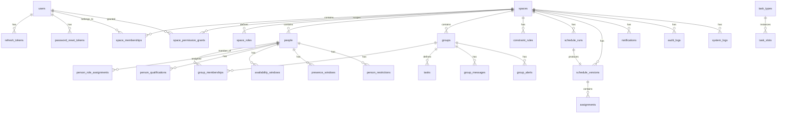

# Shifter — Data Model

## Entity Relationship Overview

---

## Full Table Reference

### users

Authentication identity. Separate from the operational `people` record.

| Column | Type | Constraints | Notes |
|---|---|---|---|
| id | UUID | PK, default uuid_generate_v4() | |
| email | TEXT | NOT NULL, UNIQUE | Login identifier |
| display_name | TEXT | NOT NULL | Shown in UI |
| password_hash | TEXT | NOT NULL | BCrypt, work factor 12 |
| is_active | BOOLEAN | NOT NULL, default TRUE | Soft disable |
| preferred_locale | TEXT | NOT NULL, default 'he' | he, en, ru |
| profile_image_url | TEXT | nullable | Uploaded via /uploads/image |
| last_login_at | TIMESTAMPTZ | nullable | Updated on successful login |
| created_at | TIMESTAMPTZ | NOT NULL, default NOW() | |
| updated_at | TIMESTAMPTZ | NOT NULL, default NOW() | Auto-updated via trigger |

Indexes: `idx_users_email` on `(email)`.

---

### refresh_tokens

JWT refresh token store. Tokens are hashed before storage. Revoked tokens are retained for audit.

| Column | Type | Constraints | Notes |
|---|---|---|---|
| id | UUID | PK | |
| user_id | UUID | NOT NULL, FK users(id) CASCADE | |
| token_hash | TEXT | NOT NULL, UNIQUE | SHA-256 of raw token |
| expires_at | TIMESTAMPTZ | NOT NULL | 7 days from issue |
| revoked_at | TIMESTAMPTZ | nullable | Set on rotation or logout |
| created_at | TIMESTAMPTZ | NOT NULL | |

Indexes: `idx_refresh_tokens_user_id`, `idx_refresh_tokens_token_hash`.

---

### password_reset_tokens

Short-lived tokens for the forgot-password flow.

| Column | Type | Constraints | Notes |
|---|---|---|---|
| id | UUID | PK | |
| user_id | UUID | NOT NULL, FK users(id) CASCADE | |
| token_hash | TEXT | NOT NULL, UNIQUE | |
| created_at | TIMESTAMPTZ | NOT NULL | |
| expires_at | TIMESTAMPTZ | NOT NULL | Short TTL (minutes) |
| used_at | TIMESTAMPTZ | nullable | Set when consumed |

Indexes: `idx_prt_user_id`, `idx_prt_token_hash`.

---

### spaces

Top-level multi-tenant boundary. Every tenant-scoped table references this.

| Column | Type | Constraints | Notes |
|---|---|---|---|
| id | UUID | PK | |
| name | TEXT | NOT NULL | Display name |
| description | TEXT | nullable | |
| owner_user_id | UUID | NOT NULL, FK users(id) | Space owner holds all permissions implicitly |
| is_active | BOOLEAN | NOT NULL, default TRUE | |
| locale | TEXT | NOT NULL, default 'he' | Space default locale |
| created_at | TIMESTAMPTZ | NOT NULL | |
| updated_at | TIMESTAMPTZ | NOT NULL | |

RLS: `spaces_isolation` — user sees space if `id = app.current_space_id` OR `owner_user_id = app.current_user_id`.

---

### space_memberships

Links users to spaces. A user may belong to multiple spaces.

| Column | Type | Constraints | Notes |
|---|---|---|---|
| id | UUID | PK | |
| space_id | UUID | NOT NULL, FK spaces(id) CASCADE | |
| user_id | UUID | NOT NULL, FK users(id) CASCADE | |
| joined_at | TIMESTAMPTZ | NOT NULL | |
| is_active | BOOLEAN | NOT NULL, default TRUE | |
| — | — | UNIQUE (space_id, user_id) | |

RLS: `memberships_isolation` on `space_id`.

---

### space_permission_grants

Fine-grained permission grants per user per space. Permission keys are strings, not enums.

| Column | Type | Constraints | Notes |
|---|---|---|---|
| id | UUID | PK | |
| space_id | UUID | NOT NULL, FK spaces(id) CASCADE | |
| user_id | UUID | NOT NULL, FK users(id) CASCADE | |
| permission_key | TEXT | NOT NULL | e.g. `space.view`, `schedule.publish` |
| granted_by_user_id | UUID | nullable, FK users(id) | |
| granted_at | TIMESTAMPTZ | NOT NULL | |
| revoked_at | TIMESTAMPTZ | nullable | Soft revoke |
| — | — | UNIQUE (space_id, user_id, permission_key) | |

Known permission keys: `space.view`, `space.admin_mode`, `people.manage`, `tasks.manage`, `constraints.manage`, `schedule.recalculate`, `schedule.publish`, `schedule.rollback`, `restrictions.manage_sensitive`, `logs.view_sensitive`.

---

### space_roles

Dynamic operational roles defined per space (Soldier, Medic, Squad Commander, etc.). Not hardcoded enums.

| Column | Type | Constraints | Notes |
|---|---|---|---|
| id | UUID | PK | |
| space_id | UUID | NOT NULL, FK spaces(id) CASCADE | |
| name | TEXT | NOT NULL | UNIQUE per space |
| description | TEXT | nullable | |
| is_active | BOOLEAN | NOT NULL, default TRUE | |
| created_by_user_id | UUID | nullable, FK users(id) | |
| created_at / updated_at | TIMESTAMPTZ | NOT NULL | |

---

### ownership_transfer_history

Append-only log of every space ownership change.

| Column | Type | Notes |
|---|---|---|
| id | UUID | PK |
| space_id | UUID | FK spaces(id) CASCADE |
| previous_owner_id | UUID | FK users(id) |
| new_owner_id | UUID | FK users(id) |
| transferred_by_user_id | UUID | FK users(id) |
| reason | TEXT | nullable |
| transferred_at | TIMESTAMPTZ | |

---

### people

Operational records within a space. Separate from auth users. A person may optionally be linked to a user account via `linked_user_id`.

| Column | Type | Constraints | Notes |
|---|---|---|---|
| id | UUID | PK | |
| space_id | UUID | NOT NULL, FK spaces(id) CASCADE | |
| linked_user_id | UUID | nullable, FK users(id) | Set when person accepts invitation |
| full_name | TEXT | NOT NULL | Used for scheduling display |
| display_name | TEXT | nullable | Short name for UI |
| profile_image_url | TEXT | nullable | |
| invitation_status | VARCHAR(20) | NOT NULL, default 'accepted' | Added in migration 015 |
| phone_number | TEXT | nullable | Added in migration 010 |
| birthday | DATE | nullable | Added in migration 017 |
| is_active | BOOLEAN | NOT NULL, default TRUE | |
| created_at / updated_at | TIMESTAMPTZ | NOT NULL | |

Indexes: `idx_people_space`, `idx_people_name` (GIN trigram for full-text search).

---

### pending_invitations

Tracks outstanding invitations sent to people not yet linked to a user account.

| Column | Type | Notes |
|---|---|---|
| id | UUID | PK |
| space_id | UUID | FK spaces(id) CASCADE |
| person_id | UUID | FK people(id) CASCADE |
| contact | TEXT | Email or phone number |
| channel | VARCHAR(20) | CHECK IN ('email', 'whatsapp') |
| token_hash | VARCHAR(64) | UNIQUE — SHA-256 of invite token |
| is_accepted | BOOLEAN | default FALSE |
| expires_at | TIMESTAMPTZ | |
| invited_by_user_id | UUID | nullable, FK users(id) |
| created_at | TIMESTAMPTZ | |

---

### group_types

Dynamic group type definitions per space (squad, platoon, company, etc.).

| Column | Type | Notes |
|---|---|---|
| id | UUID | PK |
| space_id | UUID | FK spaces(id) CASCADE |
| name | TEXT | UNIQUE per space |
| description | TEXT | nullable |
| is_active | BOOLEAN | default TRUE |
| created_at | TIMESTAMPTZ | |

---

### groups

Organizational units within a space. Each group has tasks, members, messages, and alerts.

| Column | Type | Constraints | Notes |
|---|---|---|---|
| id | UUID | PK | |
| space_id | UUID | NOT NULL, FK spaces(id) CASCADE | |
| group_type_id | UUID | NOT NULL, FK group_types(id) | Made optional in migration 007 |
| name | TEXT | NOT NULL, UNIQUE per space | |
| description | TEXT | nullable | |
| solver_horizon_days | INT | NOT NULL, default 7 | Max days solver plans ahead |
| is_active | BOOLEAN | NOT NULL, default TRUE | Soft delete |
| created_at / updated_at | TIMESTAMPTZ | NOT NULL | |

---

### group_memberships

Junction table linking people to groups.

| Column | Type | Notes |
|---|---|---|
| id | UUID | PK |
| space_id | UUID | FK spaces(id) CASCADE |
| group_id | UUID | FK groups(id) CASCADE |
| person_id | UUID | FK people(id) CASCADE |
| joined_at | TIMESTAMPTZ | |
| — | — | UNIQUE (group_id, person_id) |

---

### tasks (group_tasks)

Flat task model introduced in migration 014. Replaces the legacy `task_types` + `task_slots` two-table model for new functionality. The legacy tables are retained for backward compatibility.

| Column | Type | Constraints | Notes |
|---|---|---|---|
| id | UUID | PK | |
| space_id | UUID | NOT NULL, FK spaces(id) CASCADE | |
| group_id | UUID | NOT NULL, FK groups(id) CASCADE | |
| name | TEXT | NOT NULL | UNIQUE per (space, group) where is_active |
| starts_at | TIMESTAMPTZ | NOT NULL | |
| ends_at | TIMESTAMPTZ | NOT NULL | CHECK ends_at > starts_at |
| shift_duration_minutes | INT | NOT NULL, CHECK >= 1 | Renamed from duration_hours in migration 023 |
| required_headcount | INT | NOT NULL, default 1, CHECK >= 1 | |
| burden_level | VARCHAR(20) | NOT NULL, default 'neutral' | CHECK IN ('favorable','neutral','disliked','hated') |
| allows_double_shift | BOOLEAN | NOT NULL, default FALSE | |
| allows_overlap | BOOLEAN | NOT NULL, default FALSE | |
| is_active | BOOLEAN | NOT NULL, default TRUE | |
| created_by_user_id | UUID | nullable, FK users(id) | |
| updated_by_user_id | UUID | nullable, FK users(id) | |
| created_at / updated_at | TIMESTAMPTZ | NOT NULL | |

Indexes: `uq_tasks_space_group_name` (partial unique on active tasks), `idx_tasks_group` (space, group, starts_at).

---

### task_types (legacy)

Legacy task type definitions. Still used by the solver payload normalizer alongside `tasks`.

| Column | Type | Notes |
|---|---|---|
| id | UUID | PK |
| space_id | UUID | FK spaces(id) CASCADE |
| name | TEXT | UNIQUE per space |
| description | TEXT | nullable |
| burden_level | task_burden_level | ENUM: favorable, neutral, disliked, hated |
| default_priority | INT | default 5 |
| allows_overlap | BOOLEAN | default FALSE |
| is_active | BOOLEAN | default TRUE |
| created_by_user_id | UUID | nullable |
| created_at / updated_at | TIMESTAMPTZ | |

---

### task_slots (legacy)

Legacy scheduled instances of task types. Retained alongside `tasks`.

| Column | Type | Notes |
|---|---|---|
| id | UUID | PK |
| space_id | UUID | FK spaces(id) CASCADE |
| task_type_id | UUID | FK task_types(id) |
| starts_at / ends_at | TIMESTAMPTZ | CHECK ends_at > starts_at |
| required_headcount | INT | default 1 |
| priority | INT | default 5 |
| required_role_ids_json | JSONB | default '[]' |
| required_qualification_ids_json | JSONB | default '[]' |
| status | TEXT | active, cancelled, completed (converted from enum in migration 019) |
| location | TEXT | nullable |
| created_by_user_id | UUID | nullable |
| created_at / updated_at | TIMESTAMPTZ | |

---

### constraint_rules

Flexible constraint model. Supports all scope levels (person, role, group, task_type, space) and severities (hard, soft). Rule logic is stored as JSON payload interpreted by the solver.

| Column | Type | Notes |
|---|---|---|
| id | UUID | PK |
| space_id | UUID | FK spaces(id) CASCADE |
| scope_type | TEXT | person, role, group, task_type, space (converted from enum in migration 021) |
| scope_id | UUID | nullable — NULL when scope_type = 'space' |
| severity | TEXT | hard, soft |
| rule_type | TEXT | e.g. 'min_rest_hours', 'no_overlap', 'max_kitchen_per_week' |
| rule_payload_json | JSONB | default '{}' — rule parameters |
| is_active | BOOLEAN | default TRUE |
| effective_from / effective_until | DATE | nullable date range |
| created_by_user_id / updated_by_user_id | UUID | nullable |
| created_at / updated_at | TIMESTAMPTZ | |

Indexes: `idx_constraints_space`, `idx_constraints_scope` on `(scope_type, scope_id)`, `idx_constraints_rule_type`.

---

### schedule_runs

Tracks each solver invocation. Status transitions: queued → running → completed | failed | timed_out.

| Column | Type | Notes |
|---|---|---|
| id | UUID | PK |
| space_id | UUID | FK spaces(id) CASCADE |
| trigger_type | TEXT | standard, emergency, manual, rollback (converted from enum in migration 020) |
| baseline_version_id | UUID | nullable, FK schedule_versions(id) |
| requested_by_user_id | UUID | nullable, FK users(id) |
| status | TEXT | queued, running, completed, failed, timed_out (converted from enum in migration 020) |
| solver_input_hash | TEXT | SHA-256 of normalized input for deduplication |
| started_at / finished_at | TIMESTAMPTZ | nullable |
| duration_ms | INT | nullable |
| result_summary_json | JSONB | nullable |
| error_summary | TEXT | nullable |
| created_at | TIMESTAMPTZ | |

---

### schedule_versions

Immutable snapshots of a schedule. Published versions are never updated in place. Status: draft → published | discarded | archived | rolled_back.

| Column | Type | Notes |
|---|---|---|
| id | UUID | PK |
| space_id | UUID | FK spaces(id) CASCADE |
| version_number | INT | UNIQUE per space — auto-incremented |
| status | TEXT | draft, published, rolled_back, archived, discarded (migration 016 added discarded) |
| baseline_version_id | UUID | nullable, FK schedule_versions(id) |
| source_run_id | UUID | nullable, FK schedule_runs(id) |
| rollback_source_version_id | UUID | nullable — set when this version is a rollback copy |
| created_by_user_id | UUID | nullable |
| published_by_user_id | UUID | nullable |
| created_at | TIMESTAMPTZ | |
| published_at | TIMESTAMPTZ | nullable |
| summary_json | JSONB | nullable — AI-generated or computed summary |

Indexes: `idx_schedule_versions_space`, `idx_schedule_versions_status` on `(space_id, status)`.

---

### assignments

Assignment rows owned by a schedule version. Immutable once the version is published.

| Column | Type | Notes |
|---|---|---|
| id | UUID | PK |
| schedule_version_id | UUID | FK schedule_versions(id) CASCADE |
| space_id | UUID | FK spaces(id) CASCADE |
| task_slot_id | UUID | FK task_slots(id) — FK dropped in migration 022 for group_tasks compatibility |
| person_id | UUID | FK people(id) |
| assignment_source | TEXT | solver, override |
| change_reason_summary | TEXT | nullable |
| created_at | TIMESTAMPTZ | |
| — | — | UNIQUE (schedule_version_id, task_slot_id, person_id) |

---

### assignment_change_summaries

Pre-computed diff between a version and its baseline. Stored for fast UI rendering.

| Column | Type | Notes |
|---|---|---|
| id | UUID | PK |
| space_id | UUID | FK spaces(id) CASCADE |
| version_id | UUID | FK schedule_versions(id) CASCADE |
| baseline_version_id | UUID | nullable |
| added_count / removed_count / changed_count | INT | |
| stability_score | NUMERIC(5,2) | nullable |
| diff_json | JSONB | Full diff payload for UI |
| computed_at | TIMESTAMPTZ | |

---

### fairness_counters

Rolling fairness ledger per person per space. Updated after each solver run. Used as stability weights in the next solver payload.

| Column | Type | Notes |
|---|---|---|
| id | UUID | PK |
| space_id | UUID | FK spaces(id) CASCADE |
| person_id | UUID | FK people(id) CASCADE |
| as_of_date | DATE | UNIQUE per (space, person, date) |
| total_assignments_7d / 14d / 30d | INT | Rolling assignment counts |
| hated_tasks_7d / 14d | INT | |
| disliked_hated_score_7d | INT | Weighted burden score |
| kitchen_count_7d | INT | |
| night_missions_7d | INT | |
| consecutive_burden_count | INT | |
| updated_at | TIMESTAMPTZ | |

---

### group_messages

Admin-authored messages per group. Supports pinning.

| Column | Type | Notes |
|---|---|---|
| id | UUID | PK |
| space_id | UUID | FK spaces(id) CASCADE |
| group_id | UUID | FK groups(id) CASCADE |
| author_user_id | UUID | FK users(id) |
| content | TEXT | NOT NULL |
| is_pinned | BOOLEAN | default FALSE |
| created_at / updated_at | TIMESTAMPTZ | |

Index: `idx_group_messages_group` on `(group_id, created_at DESC)`.

---

### group_alerts

Broadcast alerts per group with severity levels (info, warning, critical, etc.).

| Column | Type | Notes |
|---|---|---|
| id | UUID | PK |
| space_id | UUID | FK spaces(id) CASCADE |
| group_id | UUID | FK groups(id) CASCADE |
| title | VARCHAR(200) | NOT NULL |
| body | TEXT | NOT NULL |
| severity | VARCHAR(20) | NOT NULL |
| created_at | TIMESTAMPTZ | |
| created_by_person_id | UUID | FK people(id) |

Index: `idx_group_alerts_group` on `(space_id, group_id, created_at DESC)`.

---

### notifications

In-app notifications per user per space. Triggered by solver events.

| Column | Type | Notes |
|---|---|---|
| id | UUID | PK |
| space_id | UUID | FK spaces(id) CASCADE |
| user_id | UUID | FK users(id) CASCADE |
| event_type | TEXT | e.g. 'solver_completed', 'solver_failed' |
| title / body | TEXT | NOT NULL |
| metadata_json | JSONB | nullable — run_id, version_id, etc. |
| is_read | BOOLEAN | default FALSE |
| created_at | TIMESTAMPTZ | |
| read_at | TIMESTAMPTZ | nullable |

Indexes: `idx_notifications_user_space`, `idx_notifications_unread` (partial, WHERE is_read = FALSE).

---

### audit_logs

Append-only audit trail. Never updated or deleted.

| Column | Type | Notes |
|---|---|---|
| id | UUID | PK |
| space_id | UUID | nullable, FK spaces(id) SET NULL |
| actor_user_id | UUID | nullable, FK users(id) SET NULL |
| action | TEXT | e.g. 'publish_schedule', 'grant_permission' |
| entity_type | TEXT | nullable — e.g. 'schedule_version' |
| entity_id | UUID | nullable |
| before_json / after_json | JSONB | nullable — state snapshots |
| ip_address | TEXT | nullable |
| correlation_id | UUID | nullable |
| created_at | TIMESTAMPTZ | |

Indexes: `idx_audit_logs_space`, `idx_audit_logs_actor`, `idx_audit_logs_action`, `idx_audit_logs_entity`, `idx_audit_logs_created_at DESC`.

---

### system_logs

Technical/operational event log. Severity: info, warning, error, critical.

| Column | Type | Notes |
|---|---|---|
| id | UUID | PK |
| space_id | UUID | nullable, FK spaces(id) SET NULL |
| severity | TEXT | info, warning, error, critical |
| event_type | TEXT | e.g. 'solver_completed', 'publish_failed' |
| message | TEXT | NOT NULL |
| details_json | JSONB | nullable |
| actor_user_id | UUID | nullable |
| correlation_id | UUID | nullable |
| is_sensitive | BOOLEAN | default FALSE — requires logs.view_sensitive to read |
| created_at | TIMESTAMPTZ | |

---

### person_qualifications

Certifications and qualifications per person. Used by solver for role-gated task slots.

| Column | Type | Notes |
|---|---|---|
| id | UUID | PK |
| space_id | UUID | FK spaces(id) CASCADE |
| person_id | UUID | FK people(id) CASCADE |
| qualification | TEXT | NOT NULL |
| issued_at / expires_at | DATE | nullable |
| is_active | BOOLEAN | default TRUE |
| created_at | TIMESTAMPTZ | |

---

### availability_windows

Explicit time windows when a person is available to be scheduled.

| Column | Type | Notes |
|---|---|---|
| id | UUID | PK |
| space_id | UUID | FK spaces(id) CASCADE |
| person_id | UUID | FK people(id) CASCADE |
| starts_at / ends_at | TIMESTAMPTZ | CHECK ends_at > starts_at |
| note | TEXT | nullable |
| created_at | TIMESTAMPTZ | |

---

### presence_windows

Manually-set presence state for a person. States: free_in_base, at_home, on_mission. `is_derived = TRUE` rows are auto-created from assignments.

| Column | Type | Notes |
|---|---|---|
| id | UUID | PK |
| space_id | UUID | FK spaces(id) CASCADE |
| person_id | UUID | FK people(id) CASCADE |
| state | TEXT | free_in_base, at_home, on_mission |
| starts_at / ends_at | TIMESTAMPTZ | CHECK ends_at > starts_at |
| note | TEXT | nullable |
| is_derived | BOOLEAN | default FALSE |
| created_at | TIMESTAMPTZ | |

---

### person_restrictions

Operational restrictions visible to admins with `people.manage`. Sensitive reasons are stored separately.

| Column | Type | Notes |
|---|---|---|
| id | UUID | PK |
| space_id | UUID | FK spaces(id) CASCADE |
| person_id | UUID | FK people(id) CASCADE |
| restriction_type | TEXT | e.g. 'no_kitchen', 'no_night', 'no_task_type' |
| task_type_id | UUID | nullable — restrict to specific task type |
| effective_from | DATE | NOT NULL |
| effective_until | DATE | nullable |
| operational_note | TEXT | nullable — visible to normal admins |
| created_by_user_id | UUID | nullable |
| created_at / updated_at | TIMESTAMPTZ | |

---

### sensitive_restriction_reasons

Separated from `person_restrictions` by design. Requires `restrictions.manage_sensitive` permission to read or write.

| Column | Type | Notes |
|---|---|---|
| id | UUID | PK |
| space_id | UUID | FK spaces(id) CASCADE |
| restriction_id | UUID | FK person_restrictions(id) CASCADE |
| reason | TEXT | NOT NULL |
| created_by_user_id | UUID | nullable |
| created_at / updated_at | TIMESTAMPTZ | |

---

## Key Design Decisions

### Soft Deletes
Groups use `is_active = FALSE` for soft deletion. Deleted groups can be restored. People, task types, task slots, qualifications, and space roles also use `is_active`. Hard deletes are not used for any operational entity — only token cleanup is permanent.

### Immutable Schedule Versions
`schedule_versions` rows are never updated after publishing. Rollback creates a new draft version with `rollback_source_version_id` pointing to the source. This means the full history of every published schedule is always available. `assignments` rows are immutable once their version is published.

### Dual Task Model
The legacy `task_types` + `task_slots` two-table model is retained for backward compatibility. The newer flat `tasks` (group_tasks) model was introduced in migration 014 and is the primary model used by the UI and solver. The `SolverPayloadNormalizer` merges both sources.

### Enum-to-Text Migrations
Several columns were originally PostgreSQL ENUM types. Migrations 018–021 converted them to TEXT with CHECK constraints. This was required because EF Core sends text values for C# enums, causing type mismatches with PostgreSQL native enums. All enum-like columns are now TEXT with explicit CHECK constraints.

### Sensitive Data Separation
`sensitive_restriction_reasons` is a separate table from `person_restrictions` by design. This allows the application layer to join the sensitive table only when the caller has `restrictions.manage_sensitive` permission, without any risk of accidentally including sensitive data in normal queries.

### Tenant Isolation (Double Enforcement)
Every tenant-scoped table has both an application-layer `space_id` filter (in every command/query) and a PostgreSQL RLS policy. The RLS policy reads `current_setting('app.current_space_id', TRUE)::UUID` set by `TenantContextMiddleware`. This is defense-in-depth: a bug in the application layer cannot leak cross-tenant data because RLS will block it at the DB level.

### Fairness Counters as Solver Input
`fairness_counters` are not just reporting data — they are fed back into the solver as stability weights on every run. This ensures the solver distributes burden fairly over time, not just within a single scheduling horizon.

---

## Index Strategy

| Table | Index | Purpose |
|---|---|---|
| users | email | Login lookup |
| refresh_tokens | token_hash | Token validation on every refresh |
| people | full_name (GIN trigram) | Full-text search via `SearchPeopleQuery` |
| notifications | (user_id, space_id) WHERE is_read=FALSE | Unread count polling |
| audit_logs | created_at DESC | Chronological log browsing |
| schedule_versions | (space_id, status) | Fast current-published lookup |
| assignments | (schedule_version_id), (person_id), (space_id) | Version detail, personal missions |
| tasks | (space_id, group_id, starts_at) WHERE is_active | Group task listing |
| constraint_rules | (scope_type, scope_id) | Solver payload normalization |
| fairness_counters | (space_id, person_id) | Per-person fairness lookup |

---

## Migration History Summary

| Migration | Description |
|---|---|
| 000 | PostgreSQL extensions: uuid-ossp, pg_trgm |
| 001 | Core identity: users, refresh_tokens, spaces, space_memberships, space_permission_grants, space_roles, ownership_transfer_history. RLS enabled. |
| 002 | Operational data: group_types, groups, group_memberships, people, person_role_assignments, person_qualifications, availability_windows, presence_windows, person_restrictions, sensitive_restriction_reasons |
| 003 | Tasks and constraints: task_types, task_type_overlap_rules, task_slots, constraint_rules |
| 004 | Scheduling domain: schedule_runs, schedule_versions, assignments, assignment_change_summaries, fairness_counters |
| 005 | Logs and exports: audit_logs, system_logs, exports |
| 006 | In-app notifications table |
| 007 | group_type_id made optional on groups |
| 008 | Group settings (solver_horizon_days) and group invitations |
| 009 | Group ownership transfer (pending_ownership_transfers) |
| 010 | phone_number column added to people |
| 011 | group_messages table |
| 012 | group_alerts table |
| 013 | password_reset_tokens table |
| 014 | tasks (group_tasks) flat model |
| 015 | pending_invitations table; invitation_status on people |
| 016 | schedule_version status: added 'discarded' value |
| 017 | birthday and profile_image_url on people |
| 018 | schedule_version.status converted from ENUM to TEXT |
| 019 | All remaining enum columns converted to TEXT with CHECK constraints |
| 020 | schedule_runs.status and trigger_type converted to TEXT (EF Core compatibility fix) |
| 021 | All remaining enum columns converted (constraint_rules scope_type, severity) |
| 022 | assignments.task_slot_id FK dropped to support group_tasks model |
| 023 | tasks.duration_hours renamed to shift_duration_minutes (INT); data migrated |
